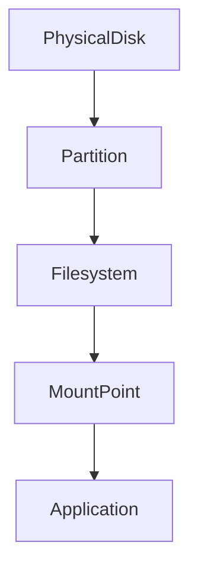
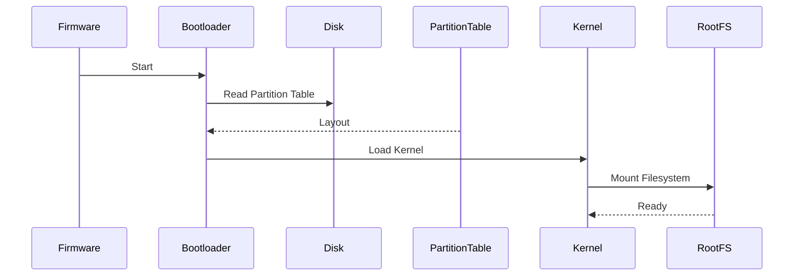

# Lab 02 — Partitioning: Designing Storage Boundaries Like a Systems Engineer

> Linux Fundamentals Mastery
>
> Storage Management Labs Series
>
> Track:
>
> Storage Fundamentals → Linux Administration → Infrastructure Engineering → Cloud & Platform Engineering
>
> Lab Goal:
>
> Understand why partitions exist, how Linux represents them internally, how modern partition tables work, and how storage architects design partition layouts for production systems.

---

# Why This Lab Exists

Most beginners think partitioning means:

```text
Divide disk into C:, D:, E:
```

This mindset comes from desktop operating systems.

Linux engineers think differently.

Partitioning is actually about:

```text
Isolation

Risk Management

Recovery

Booting

Performance

Operational Flexibility
```

Partitioning is one of the earliest forms of infrastructure design.

A poorly designed partition layout can:

* Prevent system boot
* Cause database outages
* Fill root filesystems
* Break Kubernetes nodes
* Prevent upgrades
* Increase recovery complexity

A well-designed layout can prevent entire classes of failures.

---

# The Fundamental Question

Imagine a disk:

```text
1 TB SSD
```

Linux asks:

```text
Should all storage be one giant block?

Or should we divide it?
```

Partitioning exists to answer that question.

---

# Mental Model

Think of a disk as a large office building.

Without partitioning:

```text
One Giant Room
```

Everything goes inside.

Documents.

Furniture.

Servers.

People.

Equipment.

Eventually:

```text
Chaos
```

Partitioning creates separate rooms.

```text
Office Building

├── Reception
├── Meeting Rooms
├── Storage Room
├── Server Room
└── Security Room
```

Organization creates safety.

Storage works similarly.

---

# What Is A Partition?

A partition is:

```text
A Logical Region
Inside A Physical Disk
```

A disk may contain:

```text
Disk

├── Partition 1
├── Partition 2
├── Partition 3
└── Partition 4
```

Each partition can contain:

* Filesystem
* Swap
* Database Storage
* LVM
* RAID Member
* Raw Data

---

# Storage Hierarchy

One of the most important diagrams in Linux.



Never confuse these layers.

They solve different problems.

---

# Understanding The Layers

### Disk

Physical storage device.

Example:

```text
/dev/sda
/dev/nvme0n1
```

---

### Partition

Logical subdivision.

Example:

```text
/dev/sda1
/dev/sda2
```

---

### Filesystem

Data organization structure.

Example:

```text
ext4
xfs
btrfs
```

---

### Mount Point

Location where filesystem becomes accessible.

Example:

```text
/
/home
/var
```

---

# Visual Example

```text
Disk
│
├── sda1
│     └── ext4
│           └── /boot
│
├── sda2
│     └── ext4
│           └── /
│
└── sda3
      └── xfs
            └── /data
```

---

# Why Partitions Exist

Most people answer:

```text
Organization
```

That's only partially correct.

Real reasons:

---

## Boot Requirements

Bootloaders historically required dedicated partitions.

Example:

```text
/boot
```

---

## Failure Isolation

Suppose:

```text
Application Logs
```

grow uncontrollably.

Without partitions:

```text
Root Filesystem Full

↓

System Failure
```

With separate partition:

```text
/var Full

↓

System Still Boots
```

---

## Security Isolation

Separate partitions may have:

```text
noexec

nosuid

nodev
```

security options.

---

## Operational Control

Database storage separated from OS storage.

Example:

```text
/
/var/lib/postgresql
```

This simplifies maintenance.

---

# What Happens During Boot?

Kernel must locate partitions.

Process:



Partitioning directly affects booting.

---

# Partition Tables

A disk needs metadata describing partition layout.

This metadata is called:

```text
Partition Table
```

Without it:

```text
Kernel Cannot Locate Partitions
```

---

# Two Major Partition Schemes

Modern engineers must understand both.

---

# MBR (Master Boot Record)

Historical partitioning system.

Architecture:

```text
Disk

├── Bootloader
├── Partition Table
└── Data
```

---

## Limitations

Maximum:

```text
2 TB Disk
```

Maximum:

```text
4 Primary Partitions
```

These limits became problematic.

---

# GPT (GUID Partition Table)

Modern standard.

Used by:

* Cloud Providers
* Modern Linux
* Modern Servers
* Modern SSDs

---

# GPT Architecture


---

## GPT Advantages

Supports:

```text
Huge Disks

Many Partitions

Better Reliability

Redundant Metadata
```

Modern production systems should prefer GPT.

---

# Investigating Partition Tables

Display partition layout:

```bash
sudo fdisk -l
```

Observe:

```text
Disklabel type: gpt
```

or

```text
Disklabel type: dos
```

(DOS means MBR)

---

# Visualizing Real GPT Layout

```text
nvme0n1

├── nvme0n1p1   EFI
├── nvme0n1p2   /boot
├── nvme0n1p3   /
└── nvme0n1p4   /data
```

---

# Discover Existing Partitions

```bash
lsblk
```

Example:

```text
NAME
nvme0n1
├─nvme0n1p1
├─nvme0n1p2
└─nvme0n1p3
```

Notice:

```text
Disk

↓

Partitions

↓

Filesystems
```

---

# Understanding Partition Alignment

One of the most overlooked storage topics.

Modern SSDs internally organize data into:

```text
Pages

Blocks

Erase Units
```

Misaligned partitions cause:

```text
Extra Reads

Extra Writes

Lower Performance
```

---

# Why SSDs Care

Imagine writing:

```text
4 KB
```

But SSD must rewrite:

```text
4 MB
```

because alignment is poor.

Performance suffers dramatically.

---

# Production Database Example

Bad alignment:

```text
Higher Latency

Lower Throughput

More Wear
```

Large-scale databases care deeply about this.

---

# Swap Partitions

Historically:

```text
Swap Partition
```

was common.

Example:

```text
/dev/sda3

↓

swap
```

Purpose:

```text
Memory Extension
```

---

# Modern Reality

Today many systems use:

```text
Swap Files
```

instead.

More flexible.

Still important to understand.

---

# Cloud Perspective

Cloud engineers rarely create partitions manually.

Yet every cloud volume still uses:

```text
Disk

↓

Partition Table

↓

Partitions

↓

Filesystem
```

The abstraction exists even if hidden.

---

# AWS Example

Attach:

```text
100 GB EBS Volume
```

Linux sees:

```text
/dev/nvme1n1
```

Engineer must:

```text
Partition

↓

Format

↓

Mount
```

before use.

---

# Kubernetes Connection

Persistent Volumes ultimately rely on:

```text
Block Devices

↓

Partitions

↓

Filesystems
```

Kubernetes abstracts storage.

It does not eliminate storage fundamentals.

---

# Production Scenario 1

## Root Filesystem Full

Symptoms:

```text
Cannot Login

Cannot Install Packages

Services Crash
```

Investigation:

```bash
df -h
```

Root partition:

```text
100% Full
```

---

# Root Cause

Poor partition planning.

Logs and application data shared root storage.

---

# Lesson

Partition design is operational design.

---

# Production Scenario 2

## Database Consumes Entire Disk

Layout:

```text
/

Database

Logs

Everything Together
```

Result:

```text
System Outage
```

Better design:

```text
/

/var

/database
```

Separate storage boundaries.

---

# Production Scenario 3

## Boot Failure

Accidental deletion:

```text
/boot
```

partition.

System cannot start.

Partition layout directly affects availability.

---

# Modern Recommended Layouts

## Small Server

```text
EFI
/boot
/
```

Simple.

---

## Production Application Server

```text
EFI
/boot
/
/var
```

Better isolation.

---

## Database Server

```text
EFI
/boot
/
/var/log
/data
```

Designed for growth.

---

# Observability

Inspect devices:

```bash
lsblk
```

Inspect partition tables:

```bash
fdisk -l
```

Inspect mounted filesystems:

```bash
findmnt
```

Inspect UUIDs:

```bash
blkid
```

Storage topology:

```bash
lsblk -f
```

---

# What The Kernel Is Thinking

When Linux discovers a disk:

```text
Disk Found
```

Kernel asks:

```text
Does Partition Table Exist?
```

If yes:

```text
Read Partition Metadata
```

Then:

```text
Create Device Nodes
```

Example:

```text
/dev/sda1
/dev/sda2
```

Only then can filesystems mount.

---

# Common Mistakes

## Mistake 1

Confusing partitions with filesystems.

Partition:

```text
Storage Boundary
```

Filesystem:

```text
Data Structure
```

Different concepts.

---

## Mistake 2

Using one giant partition for everything.

Works initially.

Causes operational problems later.

---

## Mistake 3

Ignoring GPT.

Modern systems should prefer GPT.

---

## Mistake 4

Designing partitions without growth planning.

Production systems always grow.

---

## Mistake 5

Assuming cloud storage removes partitioning.

Cloud storage still becomes Linux block devices.

---

# Engineering Mindset

Junior Engineer:

```text
Partitioning is setup work.
```

Senior Engineer:

```text
Partitioning is risk management.
```

Infrastructure Engineer:

```text
Partitioning is capacity planning.
```

System Architect:

```text
Partitioning is failure-domain design.
```

The best storage layouts are designed around:

```text
Future Growth

Operational Safety

Recovery

Performance

Isolation
```

not convenience.

---

# Interview Questions

### Beginner

What is a partition?

### Beginner

Difference between disk and partition?

### Intermediate

What is GPT?

### Intermediate

What is MBR?

### Intermediate

Why do partitions exist?

### Advanced

How does Linux discover partitions?

### Advanced

Why is GPT preferred over MBR?

### Advanced

How would you partition a production database server?

### Advanced

What problems can poor partition design cause?

### Advanced

How does partitioning relate to cloud storage?

---

# Cheat Sheet

Discover devices:

```bash
lsblk
```

Show filesystems:

```bash
lsblk -f
```

Show partition tables:

```bash
sudo fdisk -l
```

Show UUIDs:

```bash
blkid
```

Show mounted filesystems:

```bash
findmnt
```

Storage usage:

```bash
df -h
```

---

# Lab Success Criteria

You should now be able to:

* Explain why partitioning exists
* Understand storage hierarchy
* Understand GPT and MBR
* Interpret partition layouts
* Understand partition discovery
* Explain partition alignment
* Design basic production partition schemes
* Connect partitioning to cloud storage
* Connect partitioning to Kubernetes storage
* Think like a storage engineer instead of a desktop user

At this point, you should stop seeing partitions as:

```text
Drive Letters
```

and start seeing them as:

```text
Storage Boundaries

Used To Control

Risk
Growth
Recovery
Performance
And Operational Safety
```

Because that is how production infrastructure views storage.
