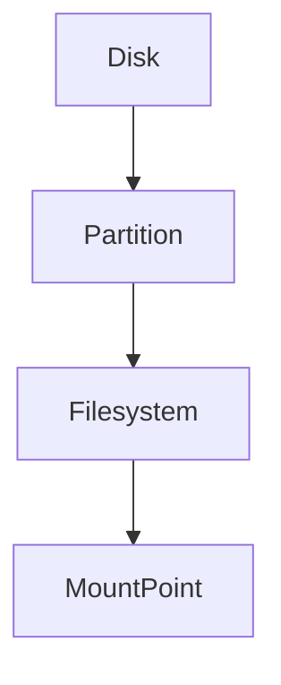
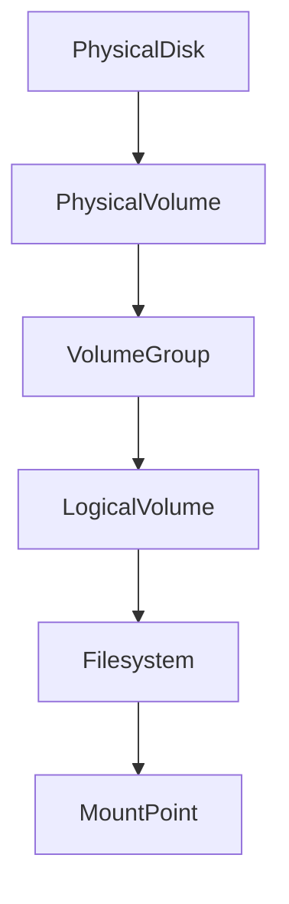
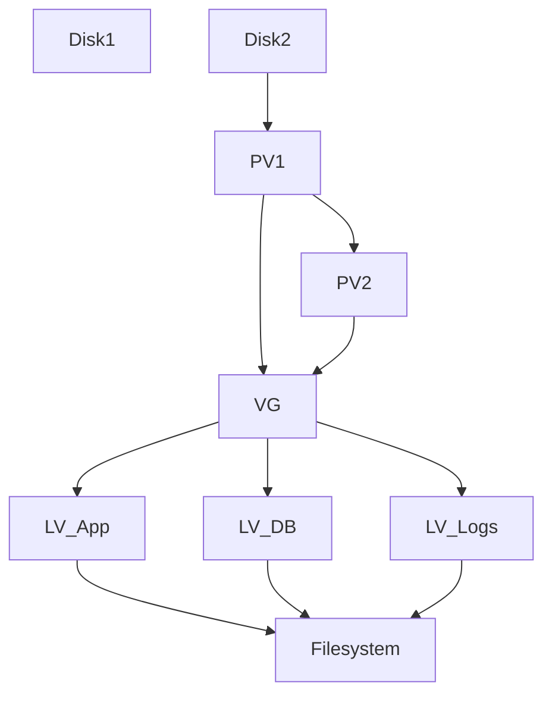
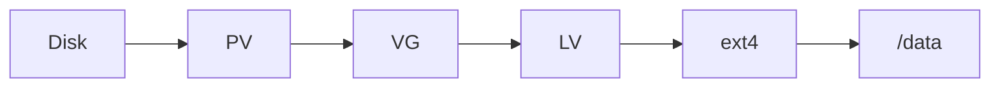
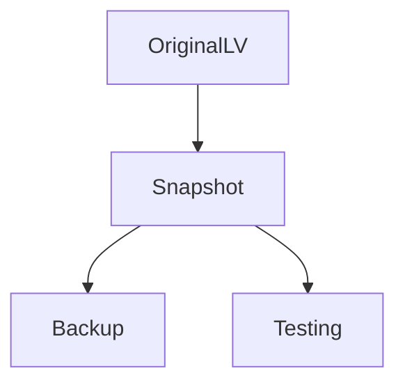
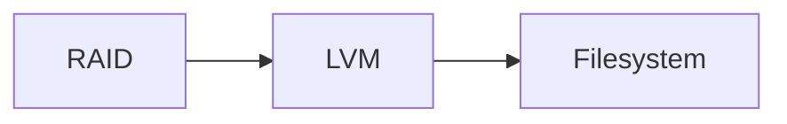

# Lab 03 — LVM Labs: Flexible Storage Architecture for Production Systems

> Linux Fundamentals Mastery
>
> Storage Management Labs Series
>
> Track:
>
> Linux Storage → Infrastructure Engineering → Cloud Storage → Platform Engineering
>
> Lab Goal:
>
> Understand why LVM exists, how Linux implements logical storage abstraction, how modern infrastructure engineers manage storage growth without downtime, and how LVM powers flexible storage architectures in enterprise environments.

---

# Why This Lab Exists

Imagine you deployed a production database server.

Initial design:

```text
500 GB Disk
```

Six months later:

```text
Disk Full
```

Now what?

Traditional partitioning says:

```text
Buy New Disk

Backup Data

Repartition

Restore Data

Pray
```

This is operationally painful.

Large infrastructures cannot operate like this.

They need:

```text
Flexible Storage

Expandable Storage

Movable Storage

Resizable Storage
```

This is why LVM was created.

---

# The Problem Traditional Partitioning Cannot Solve

Traditional storage:

```text
Disk
 │
 ├── Partition 1
 ├── Partition 2
 └── Partition 3
```

Problem:

Once partitions are created:

```text
Their size becomes difficult to change.
```

Storage requirements change constantly.

Infrastructure must adapt.

---

# The Fundamental Question

Imagine:

```text
Disk A = 100 GB

Disk B = 100 GB
```

Can Linux present them as:

```text
One Logical Disk = 200 GB ?
```

LVM answers:

```text
Yes.
```

---

# Mental Model

Think of physical disks as water tanks.

Without LVM:

```text
Tank A = 100 L
Tank B = 100 L

Cannot easily share capacity.
```

With LVM:

```text
Pool = 200 L

Applications draw from pool.
```

This is the key insight.

LVM creates:

```text
Storage Pooling
```

---

# Why Production Engineers Love LVM

Without LVM:

```text
Storage Planning Must Be Perfect
```

With LVM:

```text
Storage Can Evolve
```

This dramatically reduces operational risk.

---

# Traditional Storage Architecture



Rigid.

Limited.

Difficult to grow.

---

# LVM Storage Architecture



Notice:

A completely new abstraction layer appears.

---

# The Most Important LVM Concept

LVM separates:

```text
Physical Storage

FROM

Logical Storage
```

Applications no longer care about:

```text
Which Disk?
```

Applications use:

```text
Logical Volumes
```

---

# Understanding The Components

---

# Physical Volume (PV)

Lowest LVM layer.

A disk or partition prepared for LVM.

Example:

```text
/dev/sdb
```

becomes:

```text
PV
```

---

# Volume Group (VG)

Pool of storage.

Example:

```text
Disk1 = 100 GB

Disk2 = 100 GB
```

Volume Group:

```text
VG = 200 GB
```

---

# Logical Volume (LV)

Virtual partition created from pool.

Example:

```text
VG = 200 GB

LV-App = 50 GB

LV-Logs = 50 GB

LV-DB = 100 GB
```

Applications use LVs.

---

# Visualizing The Entire Stack



This diagram is the heart of LVM.

---

# Why This Matters

Traditional Partitioning:

```text
Application tied to disk.
```

LVM:

```text
Application tied to storage pool.
```

Massive operational improvement.

---

# Discover Existing LVM Configuration

Show physical volumes:

```bash
sudo pvs
```

---

Show volume groups:

```bash
sudo vgs
```

---

Show logical volumes:

```bash
sudo lvs
```

---

Full view:

```bash
sudo lvdisplay
```

---

# Observe Storage Hierarchy

```bash
lsblk
```

Example:

```text
sdb
 └─vg_data-lv_db
```

Notice:

Logical volume appears like a disk.

Linux abstracts complexity beautifully.

---

# LVM Creation Workflow

Production engineers should understand the flow conceptually.

```text
Disk

↓

Physical Volume

↓

Volume Group

↓

Logical Volume

↓

Filesystem

↓

Mount Point
```

Never memorize commands before understanding this flow.

---

# Visual Lifecycle



---

# The Real Power Of LVM

Traditional storage:

```text
Database Volume

100 GB
```

Disk becomes full.

Problem.

---

LVM:

Add another disk.

```text
Disk A = 100 GB

Disk B = 100 GB
```

VG becomes:

```text
200 GB
```

Extend LV.

No migration.

No reinstall.

No downtime (often).

---

# Production Scenario

## Database Growth

Month 1:

```text
DB = 50 GB
```

Month 6:

```text
DB = 400 GB
```

Traditional partitions:

```text
Pain
```

LVM:

```text
Extend Volume
```

Much easier.

---

# Why Cloud Engineers Use Similar Concepts

AWS EBS

Azure Managed Disk

GCP Persistent Disk

all provide:

```text
Elastic Storage
```

Conceptually similar to LVM philosophy.

Storage should grow with demand.

---

# Extents: The Hidden Secret

LVM does not allocate storage byte-by-byte.

Instead it uses:

```text
Physical Extents (PE)

Logical Extents (LE)
```

Think of them as storage blocks.

---

# Visualization

```text
VG

[PE][PE][PE][PE][PE][PE]

LV-App
[PE][PE]

LV-DB
[PE][PE][PE]
```

This is how storage is allocated.

---

# Why Extents Exist

Benefits:

```text
Fast Allocation

Efficient Growth

Easy Management
```

Enterprise storage systems use similar ideas.

---

# Growing Storage

One of the biggest reasons LVM exists.

Example:

```text
LV = 100 GB
```

Need:

```text
150 GB
```

LVM can extend.

Filesystem can grow.

Applications continue running.

This is powerful.

---

# Shrinking Storage

Much more dangerous.

Growing:

```text
Usually Safe
```

Shrinking:

```text
Risky
```

Reason:

```text
Data May Exist
Near Filesystem End
```

Production engineers treat shrinking carefully.

---

# LVM Snapshots

One of the most important enterprise features.

Snapshot:

```text
Point-In-Time Copy
```

Useful for:

* Backups
* Testing
* Recovery
* Upgrades

---

# Snapshot Visualization



---

# Why Snapshots Matter

Imagine:

```text
2 TB Database
```

Copying:

```text
Hours
```

Snapshot:

```text
Seconds
```

Huge operational advantage.

---

# Production Backup Architecture

```mermaid
flowchart TD

Database

--> LVM Snapshot

--> Backup Process

--> Storage
```

Very common design.

---

# LVM and Virtualization

Many virtualization platforms use concepts similar to LVM.

Examples:

* VMware
* Proxmox
* KVM
* OpenStack

Reason:

```text
Flexible Storage Management
```

---

# LVM and Containers

Docker volumes:

```text
Abstract Storage
```

Kubernetes Persistent Volumes:

```text
Abstract Storage
```

Conceptually:

```text
Very Similar Philosophy
```

Applications should not depend on physical disks.

---

# LVM Failure Domains

Understanding risks is important.

---

# Single Disk VG

```text
Disk Failure

↓

VG Failure

↓

All LVs Lost
```

---

# Multi-Disk VG

More flexible.

But:

```text
Disk Failure

↓

Potential VG Corruption
```

unless redundancy exists.

---

# Important Lesson

LVM is:

```text
Storage Management
```

NOT:

```text
Storage Protection
```

People confuse this constantly.

---

# LVM vs RAID

LVM:

```text
Flexibility
```

RAID:

```text
Redundancy
```

Different problems.

Different solutions.

---

# Architecture Comparison



Very common enterprise stack.

---

# Production Scenario 1

## Root Filesystem Full

Investigation:

```bash
df -h
```

Root:

```text
100%
```

Check:

```bash
vgs
```

Free VG space exists.

Solution:

```text
Extend Logical Volume
```

Outage avoided.

---

# Production Scenario 2

## New Storage Added

Cloud engineer attaches:

```text
1 TB Volume
```

Requirement:

```text
Expand Database
```

LVM:

```text
Add PV

Extend VG

Extend LV
```

No migration.

---

# Production Scenario 3

## Failed Upgrade

Before upgrade:

```text
Create Snapshot
```

Upgrade fails.

Rollback.

System restored quickly.

---

# Observability

Physical Volumes:

```bash
pvs
```

Volume Groups:

```bash
vgs
```

Logical Volumes:

```bash
lvs
```

Detailed Information:

```bash
pvdisplay
vgdisplay
lvdisplay
```

Storage Layout:

```bash
lsblk
```

Filesystem Usage:

```bash
df -h
```

---

# What The Kernel Sees

Applications think:

```text
Filesystem
```

Filesystem thinks:

```text
Logical Volume
```

LVM thinks:

```text
Volume Group
```

VG thinks:

```text
Physical Volumes
```

Kernel eventually reaches:

```text
Real Disks
```

Multiple abstraction layers exist.

---

# Common Mistakes

## Mistake 1

Thinking LVM is RAID.

It is not.

---

## Mistake 2

Assuming LVM protects data.

It does not.

---

## Mistake 3

Ignoring snapshots.

One of LVM's best features.

---

## Mistake 4

Designing without future growth.

Growth is inevitable.

---

## Mistake 5

Creating huge logical volumes without monitoring.

Flexibility does not replace observability.

---

# Engineering Mindset

Junior Engineer:

```text
How much disk space do I have?
```

Senior Engineer:

```text
How easily can storage grow?
```

Platform Engineer:

```text
What is the storage abstraction strategy?
```

Infrastructure Architect:

```text
How can storage evolve without downtime?
```

That question is why LVM exists.

---

# Interview Questions

### Beginner

What problem does LVM solve?

### Beginner

What is a Physical Volume?

### Intermediate

What is a Volume Group?

### Intermediate

What is a Logical Volume?

### Intermediate

How does LVM differ from partitions?

### Advanced

Explain the LVM architecture.

### Advanced

How would you expand a database volume?

### Advanced

What are LVM snapshots?

### Advanced

Why is LVM commonly combined with RAID?

### Advanced

How does LVM relate to cloud storage concepts?

---

# Cheat Sheet

Physical Volumes:

```bash
pvs
```

Volume Groups:

```bash
vgs
```

Logical Volumes:

```bash
lvs
```

Detailed Info:

```bash
pvdisplay
vgdisplay
lvdisplay
```

Filesystem Usage:

```bash
df -h
```

Storage Layout:

```bash
lsblk
```

---

# Lab Success Criteria

You should now be able to:

* Explain why LVM exists
* Understand PV, VG, and LV architecture
* Visualize storage pooling
* Understand storage abstraction
* Explain extents
* Understand volume growth
* Understand snapshots
* Compare LVM with traditional partitions
* Compare LVM with RAID
* Connect LVM concepts to cloud and container storage
* Think like a storage engineer designing future-proof systems

At this point, you should stop thinking:

```text
Disk = Storage
```

and start thinking:

```text
Physical Storage

↓

Storage Pool

↓

Logical Storage

↓

Applications
```

That shift in thinking is what separates system users from infrastructure engineers.
