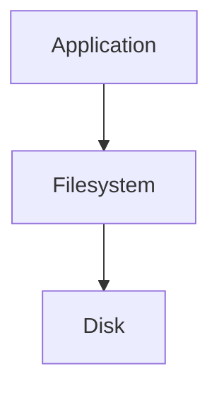
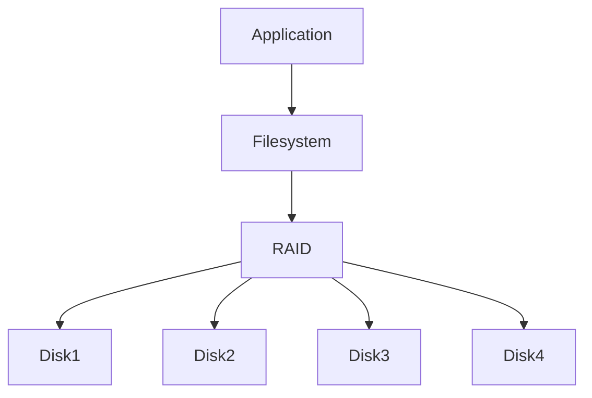
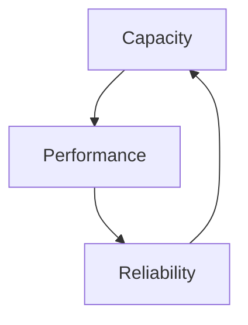
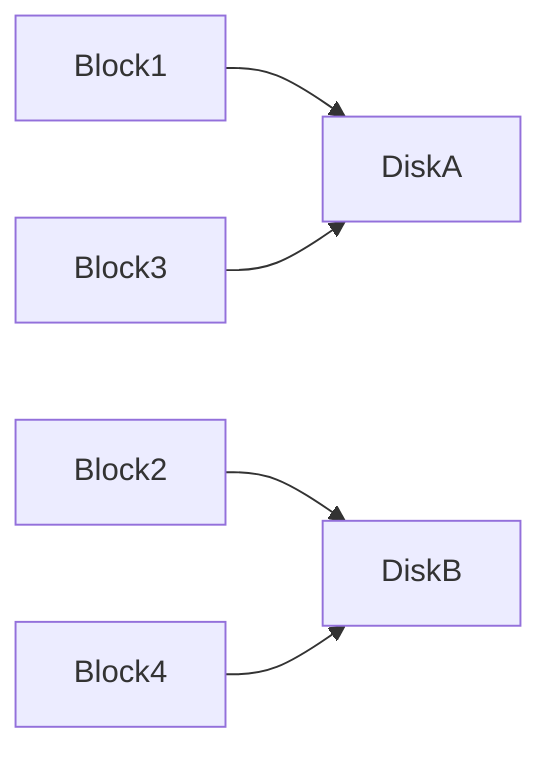
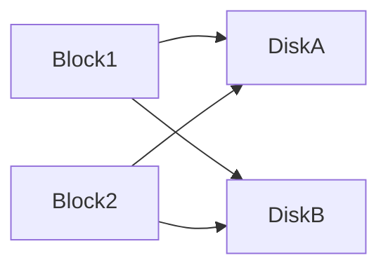
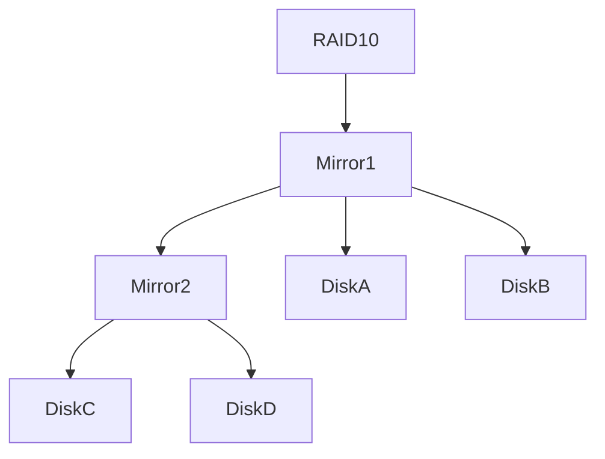
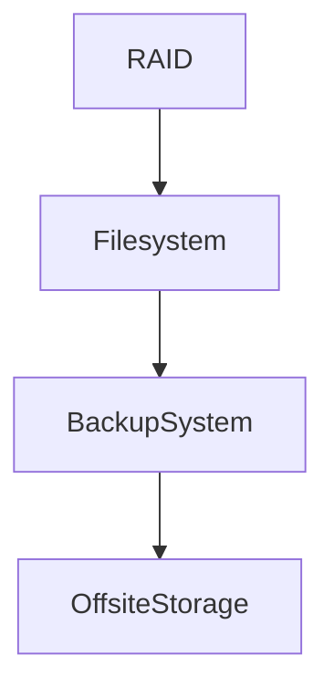
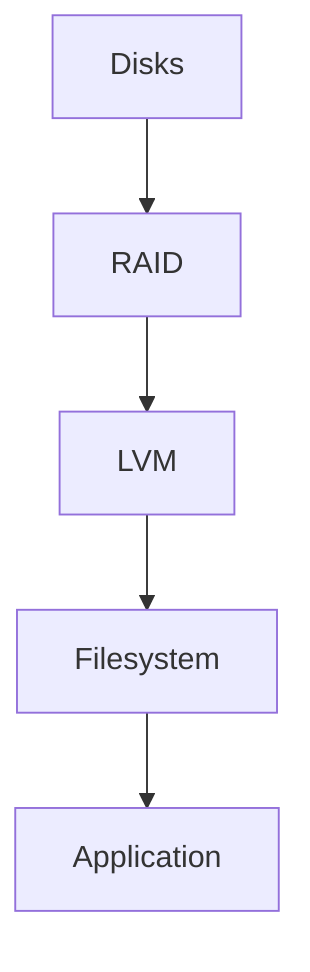

# Lab 04 — RAID Labs: Engineering Storage Reliability, Performance, and Survivability

> Linux Fundamentals Mastery
>
> Storage Management Labs Series
>
> Track:
>
> Linux Storage → Infrastructure Engineering → High Availability → Distributed Systems
>
> Lab Goal:
>
> Understand why RAID exists, how Linux implements RAID, how storage redundancy works, how performance and reliability trade-offs are made, and how production engineers design storage systems that survive hardware failures.

---

# Why This Lab Exists

One of the biggest mistakes beginners make is assuming:

```text
Disk = Storage
```

Experienced engineers know:

```text
Disk = Failure Waiting To Happen
```

Every disk eventually fails.

Not some disks.

Not bad disks.

All disks.

The only uncertainty is:

```text
When?
```

RAID exists because storage systems must survive disk failures.

---

# The Most Important Storage Lesson

Imagine:

```text
10 TB Database

Running For 3 Years
```

One morning:

```text
Disk Failure
```

Question:

```text
Does The Business Continue Operating?
```

If:

```text
YES
```

Infrastructure was designed correctly.

If:

```text
NO
```

Storage architecture failed.

---

# The Fundamental Problem

Single disk architecture:

```text
Application

↓

Disk
```

Failure:

```text
Disk Dies

↓

Everything Dies
```

This is unacceptable for production systems.

---

# Mental Model

Imagine a company stores critical documents.

Bad design:

```text
One Filing Cabinet
```

Cabinet destroyed:

```text
All Data Lost
```

Better design:

```text
Multiple Cabinets

Copies

Recovery Plans
```

RAID applies this idea to storage.

---

# What RAID Actually Means

RAID:

```text
Redundant Array of Independent Disks
```

Key word:

```text
Redundant
```

RAID combines multiple disks into one logical storage device.

---

# Why RAID Exists

RAID solves three major problems:

```text
Reliability

Performance

Capacity
```

Different RAID levels optimize different goals.

---

# RAID Architecture

Without RAID:



---

With RAID:



Applications see:

```text
One Device
```

RAID manages multiple disks underneath.

---

# Linux RAID Stack

Modern Linux commonly uses:

```text
mdadm
```

Architecture:

```mermaid
flowchart TD

Application

--> Filesystem

--> RAID Device

--> Physical Disks
```

Example:

```text
/dev/md0
```

RAID device appears like a normal disk.

---

# The Storage Engineering Triangle

Every RAID design is a tradeoff.

```text
Capacity

Performance

Reliability
```

You cannot maximize all three simultaneously.

---

# Visualizing Tradeoffs



Storage engineering is tradeoff engineering.

---

# RAID 0 — Performance First

Architecture:

```text
Disk A

Disk B
```

Data split across both disks.

---

# Visualization

```text
File

Block1 -> DiskA

Block2 -> DiskB

Block3 -> DiskA

Block4 -> DiskB
```

This is called:

```text
Striping
```

---

# RAID 0 Diagram



---

# Benefits

```text
Very Fast

Full Capacity
```

---

# Catastrophic Problem

Lose:

```text
One Disk
```

Lose:

```text
Everything
```

---

# Reliability

```text
RAID 0 = 0 Redundancy
```

Important interview question.

---

# Real-World Usage

Temporary data.

Scratch storage.

High-performance workloads.

Never critical databases.

---

# RAID 1 — Mirroring

Architecture:

```text
Disk A

Disk B
```

Both contain identical data.

---

# Visualization

```text
Block1 -> DiskA
Block1 -> DiskB

Block2 -> DiskA
Block2 -> DiskB
```

---

# RAID 1 Diagram



---

# Benefits

Disk failure survives.

---

# Example

```text
Disk A Dies
```

Disk B continues serving data.

No outage.

---

# Cost

Capacity:

```text
2 x 1TB

=

1TB Usable
```

50% efficiency.

---

# Why Enterprises Use RAID 1

Boot disks.

Operating system disks.

Critical low-capacity systems.

---

# RAID 5 — Distributed Parity

One of the most important RAID levels.

---

# Idea

Instead of duplicating all data:

```text
Store Recovery Information
```

called:

```text
Parity
```

---

# Example

Three disks:

```text
DiskA

DiskB

DiskC
```

Data:

```text
A

B

Parity
```

Next block rotates parity location.

---

# RAID 5 Visualization

```text
Disk1   Disk2   Disk3

A       B       P

C       P       D

P       E       F
```

---

# Benefits

Good:

```text
Capacity

Performance

Reliability
```

Balanced design.

---

# Failure Tolerance

Can survive:

```text
1 Disk Failure
```

---

# Problem

During rebuild:

```text
Performance Drops
```

Large arrays become risky.

---

# RAID 6 — Double Parity

RAID 5 evolved.

Problem:

Large disks increased rebuild times.

Risk increased.

---

# Solution

Store:

```text
Two Parity Blocks
```

instead of one.

---

# Benefit

Can survive:

```text
2 Disk Failures
```

---

# RAID 6 Visualization

```text
Disk1 Disk2 Disk3 Disk4

A     B     P     Q

C     P     Q     D
```

---

# Enterprise Usage

Large storage arrays.

Backup systems.

Archive systems.

Enterprise NAS platforms.

---

# RAID 10 — The Production Favorite

Combination:

```text
RAID 1

+

RAID 0
```

Mirroring plus striping.

---

# Architecture



---

# Why Engineers Love RAID 10

Provides:

```text
High Performance

High Reliability
```

Excellent balance.

---

# Common Database Choice

Many production databases use:

```text
RAID 10
```

because:

```text
Fast Reads

Fast Writes

Redundancy
```

---

# Comparing RAID Levels

| RAID    | Performance | Reliability | Capacity |
| ------- | ----------- | ----------- | -------- |
| RAID 0  | Excellent   | Terrible    | 100%     |
| RAID 1  | Good        | Excellent   | 50%      |
| RAID 5  | Good        | Good        | High     |
| RAID 6  | Moderate    | Excellent   | Moderate |
| RAID 10 | Excellent   | Excellent   | 50%      |

---

# Linux Software RAID

Linux commonly uses:

```bash
mdadm
```

View arrays:

```bash
cat /proc/mdstat
```

Example:

```text
md0
```

represents RAID device.

---

# RAID Discovery

Display storage hierarchy:

```bash
lsblk
```

Example:

```text
sdb
sdc

↓

md0

↓

ext4

↓

/data
```

Notice:

Applications never see raw disks.

---

# RAID Monitoring

Critical production responsibility.

Check:

```bash
cat /proc/mdstat
```

Observe:

```text
Active

Degraded

Rebuilding
```

states.

---

# Degraded RAID

One disk fails.

RAID remains operational.

State:

```text
Degraded
```

This is not normal.

This is emergency mode.

---

# Common Mistake

Engineers see:

```text
Everything Working
```

and ignore degraded RAID.

Weeks later:

Second disk fails.

Data lost.

---

# RAID Rebuild

Failed disk replaced.

RAID reconstructs missing data.

---

# Rebuild Visualization


---

# Why Rebuilds Matter

During rebuild:

```text
High I/O

High CPU

Higher Risk
```

Production performance may drop significantly.

---

# Production Scenario 1

## Database Server

Architecture:

```text
RAID 10

NVMe SSDs
```

Benefits:

```text
Fast Queries

Disk Failure Tolerance
```

---

# Production Scenario 2

## Backup Storage

Architecture:

```text
RAID 6
```

Benefits:

```text
Large Capacity

Multiple Disk Failures Tolerated
```

---

# Production Scenario 3

## Boot Volume

Architecture:

```text
RAID 1
```

Benefits:

```text
OS Survives Disk Failure
```

---

# RAID Is NOT Backup

One of the most important lessons.

Many beginners believe:

```text
RAID = Backup
```

Wrong.

---

# Why?

Delete file:

```text
Disk A Deletes

Disk B Deletes
```

RAID mirrors mistakes.

---

# Disaster Example

```text
rm -rf /data
```

RAID faithfully destroys data on all disks.

---

# Correct Architecture



RAID and backup solve different problems.

---

# RAID vs LVM

Many engineers confuse them.

---

# RAID

Solves:

```text
Redundancy

Performance
```

---

# LVM

Solves:

```text
Flexibility

Growth
```

---

# Common Enterprise Stack



Very common architecture.

---

# Cloud Perspective

Cloud providers rarely expose RAID directly.

Instead:

```text
Replication

Distributed Storage

Redundant Hardware
```

provide similar guarantees.

Conceptually:

```text
Same Goal

Different Implementation
```

---

# Kubernetes Connection

Persistent Volumes ultimately depend on storage systems that use concepts similar to RAID:

```text
Replication

Parity

Redundancy
```

Storage reliability remains essential.

---

# Observability

View RAID state:

```bash
cat /proc/mdstat
```

---

Detailed information:

```bash
sudo mdadm --detail /dev/md0
```

---

Storage hierarchy:

```bash
lsblk
```

---

Filesystem usage:

```bash
df -h
```

---

Disk health:

```bash
smartctl -a /dev/sda
```

---

# What The Kernel Sees

Application writes:

```text
File
```

Filesystem writes:

```text
Blocks
```

RAID writes:

```text
Multiple Disks
```

Storage controller executes:

```text
Physical I/O
```

Multiple layers collaborate.

---

# Common Mistakes

## Mistake 1

Believing RAID is backup.

---

## Mistake 2

Ignoring degraded arrays.

---

## Mistake 3

Choosing RAID level without workload analysis.

---

## Mistake 4

Optimizing only capacity.

---

## Mistake 5

Ignoring rebuild risk.

---

# Engineering Mindset

Junior Engineer:

```text
How much storage do we have?
```

Senior Engineer:

```text
What happens when a disk fails?
```

Infrastructure Engineer:

```text
How many failures can we survive?
```

Storage Architect:

```text
What is our recovery strategy?
```

Those questions drive storage design.

---

# Interview Questions

### Beginner

What is RAID?

### Beginner

What problem does RAID solve?

### Intermediate

Difference between RAID 0 and RAID 1?

### Intermediate

What is parity?

### Intermediate

Why is RAID 5 popular?

### Advanced

Why is RAID 10 preferred for databases?

### Advanced

Why is RAID not backup?

### Advanced

Explain RAID rebuild risks.

### Advanced

Compare RAID and LVM.

### Advanced

Design storage for a high-traffic PostgreSQL cluster.

---

# Cheat Sheet

RAID status:

```bash
cat /proc/mdstat
```

Detailed RAID info:

```bash
sudo mdadm --detail /dev/md0
```

Storage topology:

```bash
lsblk
```

Filesystem usage:

```bash
df -h
```

Disk health:

```bash
smartctl -a /dev/sda
```

---

# Lab Success Criteria

You should now be able to:

* Explain why RAID exists
* Understand RAID 0, 1, 5, 6, and 10
* Understand striping, mirroring, and parity
* Explain rebuild processes
* Monitor Linux RAID arrays
* Distinguish RAID from backup
* Distinguish RAID from LVM
* Design storage for reliability
* Connect RAID concepts to cloud and distributed storage
* Think like a storage architect

At this point, you should stop asking:

```text
How many disks do we have?
```

and start asking:

```text
What happens when one fails?
```

Because that is the question production infrastructure must answer every day.
