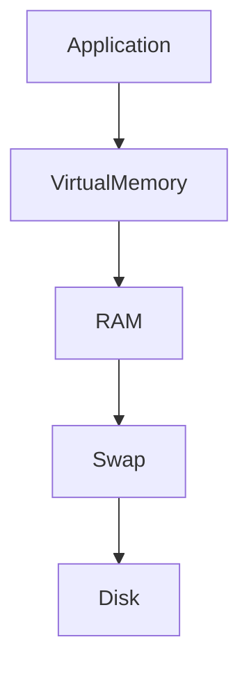
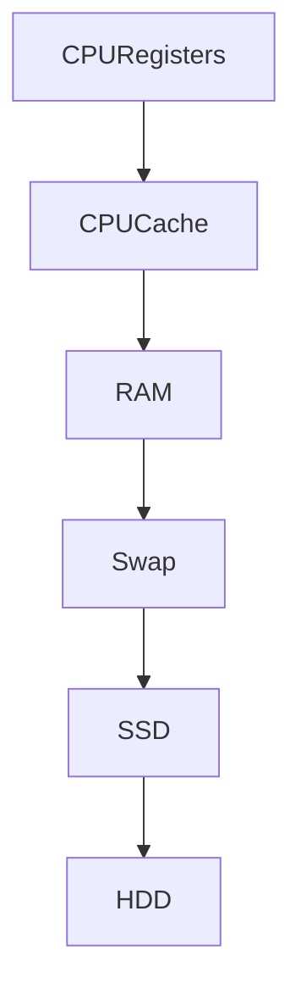
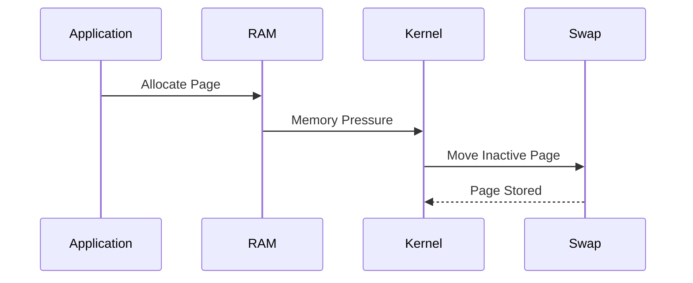
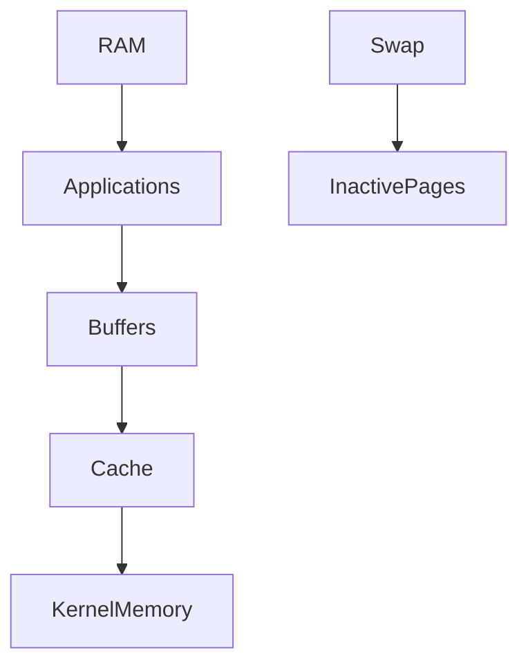
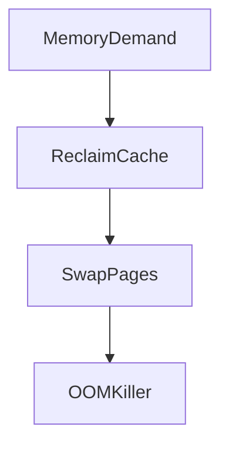

# Lab 05 — Swap Analysis: Understanding Linux Memory Pressure, Virtual Memory, and System Survival

> Linux Fundamentals Mastery
>
> Storage Management Labs Series
>
> Track:
>
> Linux Memory Management → Virtual Memory → Performance Engineering → SRE
>
> Lab Goal:
>
> Understand why swap exists, how Linux memory management actually works, how swap interacts with RAM, why swap usage is often misunderstood, and how production engineers investigate memory pressure before systems fail.

---

# Why This Lab Exists

Ask a beginner:

```text
What is swap?
```

Common answer:

```text
Extra RAM on disk.
```

While technically close, this explanation creates dangerous misunderstandings.

Many engineers believe:

```text
More Swap
=
More Memory
```

This is wrong.

Swap is not additional RAM.

Swap is:

```text
An Emergency Pressure Relief System
For Linux Memory Management
```

Understanding this distinction separates Linux users from Linux engineers.

---

# The Most Important Lesson

Imagine:

```text
Server RAM

64 GB
```

Applications consume:

```text
63 GB
```

Everything works.

Then:

```text
Applications Need 70 GB
```

Question:

```text
What Should Linux Do?
```

Possible answers:

```text
Kill Applications

Crash

Move Data To Disk

Refuse Allocation
```

Linux chooses intelligently.

Swap is part of that decision.

---

# The Fundamental Problem

RAM is:

```text
Fast

Expensive

Limited
```

Storage is:

```text
Slow

Cheap

Large
```

Linux must balance both.

---

# Mental Model

Imagine a desk.

RAM:

```text
Desk Surface
```

Everything immediately accessible.

Fast.

---

Swap:

```text
Storage Cabinet
```

Farther away.

Slower.

Still accessible.

---

Visualized:

```text
Desk (RAM)

↓

Cabinet (Swap)

↓

Warehouse (Disk Storage)
```

Linux constantly decides where information should live.

---

# First Principles

Applications think:

```text
I Have Memory
```

Reality:

Linux provides:

```text
Virtual Memory
```

Applications rarely know where data physically resides.

---

# Virtual Memory Architecture



This abstraction is one of Linux's greatest engineering achievements.

---

# What Is Virtual Memory?

Every process believes:

```text
I Own Memory
```

Example:

```text
Process A = 4 GB

Process B = 4 GB

Process C = 4 GB
```

On a system with:

```text
8 GB RAM
```

This appears impossible.

Linux solves this using:

```text
Virtual Memory
```

---

# Why Virtual Memory Exists

Without virtual memory:

```text
Programs Would Need To Know
Physical RAM Layout
```

This would be chaos.

Virtual memory provides:

```text
Isolation

Security

Flexibility

Efficiency
```

---

# Memory Hierarchy

Understanding this diagram is critical.



Notice:

As we move downward:

```text
Capacity Increases

Latency Increases
```

Performance decreases dramatically.

---

# Understanding Memory Pages

Linux manages memory using:

```text
Pages
```

Typically:

```text
4 KB
```

Each page can live in:

```text
RAM

or

Swap
```

---

# Page Lifecycle



This process is called:

```text
Paging
```

---

# What Actually Gets Swapped?

Many engineers imagine:

```text
Entire Process
```

Wrong.

Linux usually swaps:

```text
Individual Pages
```

Example:

```text
Process

├── Active Pages
├── Active Pages
├── Inactive Pages
└── Inactive Pages
```

Only inactive pages move.

---

# Why This Is Smart

Suppose:

```text
Database

20 GB Memory
```

Actively using:

```text
4 GB
```

Inactive:

```text
16 GB
```

Linux can move inactive pages to swap.

RAM becomes available for more important work.

---

# Swap Is Not Failure

One of the most common misconceptions.

Many junior engineers see:

```bash
free -h
```

Output:

```text
Swap Used
```

and panic.

Wrong.

---

# Senior Engineer Thinking

Question:

```text
Why Is Swap Being Used?
```

Not:

```text
Swap Exists
```

---

# Linux Memory Strategy

Linux prefers:

```text
Unused RAM = Waste
```

Therefore Linux aggressively uses memory for:

* Caching
* Buffers
* Page Cache
* Filesystem Cache

This often confuses beginners.

---

# Memory Layout Visualization



---

# Understanding Page Cache

Suppose:

```bash
cat large-file.txt
```

Linux caches file data.

Future reads become faster.

Cache consumes RAM.

This is good.

---

# Memory Pressure

Critical concept.

Memory pressure occurs when:

```text
Memory Demand

>

Available RAM
```

Linux must react.

---

# Possible Responses

Linux may:

```text
Reclaim Cache

Swap Pages

Invoke OOM Killer
```

in that order.

---

# Memory Pressure Flow



This flow explains many production incidents.

---

# The OOM Killer

OOM:

```text
Out Of Memory
```

When Linux cannot reclaim enough memory:

```text
Processes Must Die
```

Kernel selects victims.

---

# OOM Example

Kernel logs:

```text
Out of memory:

Killed process 1234
```

Application disappears.

System survives.

---

# Why Swap Helps

Swap delays OOM situations.

Without swap:

```text
RAM Full

↓

OOM
```

With swap:

```text
RAM Full

↓

Swap

↓

More Time
```

Swap acts as a safety buffer.

---

# Swap Partition vs Swap File

Historically:

```text
Dedicated Swap Partition
```

Example:

```text
/dev/sda3
```

---

Modern Linux often uses:

```text
Swap File
```

Example:

```text
/swapfile
```

More flexible.

Much easier to manage.

---

# Visual Comparison

```text
Traditional

Disk
 └── Swap Partition

Modern

Filesystem
 └── Swap File
```

---

# Investigating Swap Usage

Check memory:

```bash
free -h
```

Example:

```text
Mem: 32G

Swap: 8G
```

---

Detailed view:

```bash
vmstat
```

---

Kernel memory:

```bash
cat /proc/meminfo
```

---

# Understanding vmstat

Observe:

```text
si

so
```

Fields.

Meaning:

```text
Swap In

Swap Out
```

---

# Critical Insight

Used swap:

```text
Not Always Bad
```

Constant swapping:

```text
Very Bad
```

---

# Healthy System

```text
Swap Used

Stable

No Swap Activity
```

Often normal.

---

# Unhealthy System

```text
Swap In

Swap Out

Continuously
```

Known as:

```text
Thrashing
```

---

# What Is Thrashing?

System spends more time:

```text
Moving Pages
```

than:

```text
Running Applications
```

Performance collapses.

---

# Thrashing Visualization


CPU wastes time moving memory.

---

# Production Scenario 1

## Database Latency Spike

Symptoms:

```text
Queries Slow
```

CPU:

```text
Low
```

Investigation:

```bash
vmstat 1
```

Shows:

```text
High Swap Activity
```

Root cause:

```text
Memory Pressure
```

Not database code.

---

# Production Scenario 2

## Kubernetes Node Slow

Symptoms:

```text
Pods Healthy

Node Slow
```

Investigation:

```bash
free -h
```

Shows:

```text
Heavy Swap Usage
```

Memory overcommit causing latency.

---

# Production Scenario 3

## Java Application Freeze

Heap:

```text
24 GB
```

RAM:

```text
32 GB
```

Additional processes consume memory.

Kernel swaps JVM pages.

Application pauses dramatically.

---

# Why Databases Hate Swap

Databases assume:

```text
Memory = Fast
```

Swap violates this assumption.

Example:

* PostgreSQL
* MySQL
* MongoDB
* Elasticsearch

often perform poorly when swapped.

---

# Cloud Connection

Cloud VMs commonly have:

```text
RAM

Swap File
```

configured automatically.

Engineers must understand:

```text
Swap Usage

Memory Pressure

OOM Events
```

to manage infrastructure effectively.

---

# Kubernetes Connection

Historically Kubernetes discouraged swap.

Reason:

```text
Predictable Scheduling
```

Containers should fail predictably.

Not survive unpredictably through swapping.

---

# Performance Implications

Approximate latency:

```text
CPU Cache

Nanoseconds
```

RAM:

```text
~100 Nanoseconds
```

SSD:

```text
~100 Microseconds
```

Swap on SSD:

```text
Thousands of Times Slower Than RAM
```

This is why excessive swapping hurts performance.

---

# Observability Toolkit

Memory Summary:

```bash
free -h
```

---

Memory Statistics:

```bash
vmstat 1
```

---

Detailed Memory:

```bash
cat /proc/meminfo
```

---

Top Memory Consumers:

```bash
top
```

or

```bash
htop
```

---

OOM Events:

```bash
dmesg | grep -i oom
```

---

# Linux Swappiness

Kernel parameter:

```text
vm.swappiness
```

Controls swap aggressiveness.

View:

```bash
sysctl vm.swappiness
```

---

General Guidance

```text
10-20

Database Servers
```

```text
60

General Purpose Systems
```

```text
Higher Values

More Aggressive Swapping
```

---

# What The Kernel Is Thinking

Application requests:

```text
More Memory
```

Kernel asks:

```text
Free RAM?
```

If no:

```text
Can Cache Be Reclaimed?
```

If no:

```text
Can Pages Be Swapped?
```

If no:

```text
Invoke OOM Killer
```

This decision tree runs constantly.

---

# Failure Investigation Workflow

Step 1

Check memory:

```bash
free -h
```

---

Step 2

Check swap activity:

```bash
vmstat 1
```

---

Step 3

Identify top consumers:

```bash
top
```

---

Step 4

Check OOM events:

```bash
dmesg | grep -i oom
```

---

Step 5

Determine:

```text
Capacity Problem?

Memory Leak?

Workload Spike?
```

---

# Common Mistakes

## Mistake 1

Assuming swap usage means failure.

---

## Mistake 2

Disabling swap without understanding consequences.

---

## Mistake 3

Ignoring memory pressure.

---

## Mistake 4

Confusing cache with used memory.

---

## Mistake 5

Investigating CPU before memory.

Many latency issues are memory-related.

---

# Engineering Mindset

Junior Engineer:

```text
Swap Used = Bad
```

Senior Engineer:

```text
Why Is Swap Being Used?
```

Performance Engineer:

```text
How Much Paging Is Occurring?
```

Infrastructure Engineer:

```text
What Happens When Memory Pressure Increases Further?
```

The best engineers investigate:

```text
Memory Behavior

Not Memory Numbers
```

---

# Interview Questions

### Beginner

What is swap?

### Beginner

Why does Linux use virtual memory?

### Intermediate

What is paging?

### Intermediate

What is the OOM Killer?

### Intermediate

Difference between swap partition and swap file?

### Advanced

Explain memory pressure.

### Advanced

What is thrashing?

### Advanced

How would you investigate a slow system caused by swapping?

### Advanced

Why do databases often perform poorly when swapped?

### Advanced

Explain Linux memory management decisions during RAM exhaustion.

---

# Cheat Sheet

Memory Summary:

```bash
free -h
```

Swap Activity:

```bash
vmstat 1
```

Detailed Memory:

```bash
cat /proc/meminfo
```

OOM Events:

```bash
dmesg | grep -i oom
```

Top Memory Users:

```bash
top
```

Swappiness:

```bash
sysctl vm.swappiness
```

---

# Lab Success Criteria

You should now be able to:

* Explain why swap exists
* Understand virtual memory
* Understand paging
* Explain memory pressure
* Understand OOM events
* Diagnose swap-related performance issues
* Understand page cache behavior
* Investigate thrashing
* Connect swap to cloud and Kubernetes environments
* Think like a performance engineer during memory incidents

At this point, you should stop thinking:

```text
Swap = Extra RAM
```

and start thinking:

```text
Swap = Emergency Memory Pressure Management

Inside Linux's Virtual Memory System
```

Because that is how the Linux kernel actually sees it.
