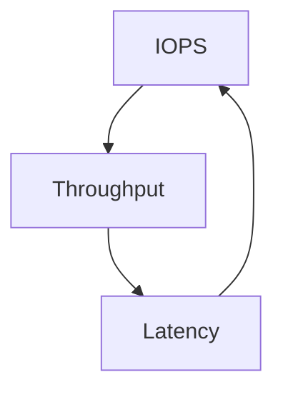
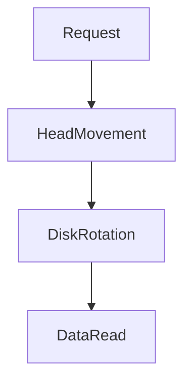
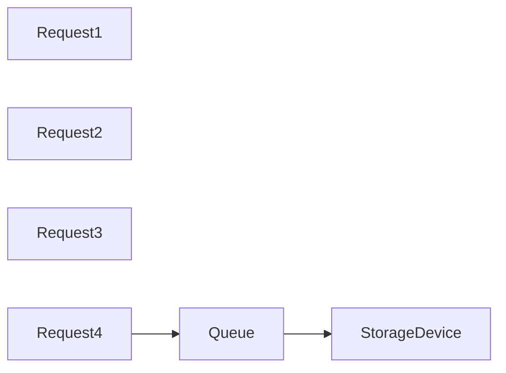
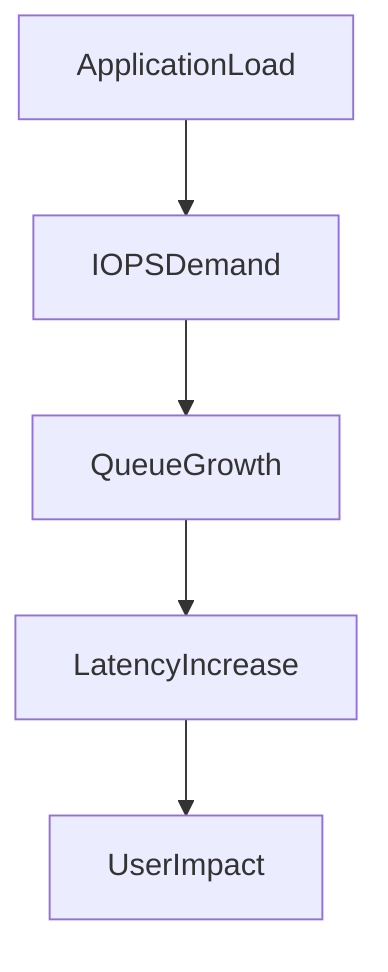

# Lab 06 — IOPS Investigation: Understanding Storage Performance from First Principles

> Linux Fundamentals Mastery
>
> Storage Management Labs Series
>
> Track:
>
> Linux Storage → Performance Engineering → Database Infrastructure → SRE
>
> Lab Goal:
>
> Understand what IOPS actually means, why storage performance often becomes the hidden bottleneck in production systems, how Linux handles I/O internally, and how engineers investigate real-world storage latency incidents.

---

# Why This Lab Exists

Most engineers think performance means:

```text
CPU Usage

Memory Usage
```

They monitor:

```bash
top
htop
```

and conclude:

```text
CPU = 20%

Memory = 40%

Server Looks Healthy
```

Yet applications remain slow.

Databases timeout.

APIs become sluggish.

Users complain.

Why?

Because the real bottleneck is often:

```text
Storage
```

And storage bottlenecks are much harder to see.

---

# The Most Expensive Production Mistake

Imagine:

```text
CPU = 15%

RAM = 40%

Network = Healthy
```

Yet:

```text
Database Queries = 5 Seconds
```

Most engineers investigate:

```text
CPU
```

Experienced engineers investigate:

```text
Disk Latency
```

Many large-scale outages originate from storage performance.

---

# The Fundamental Question

When an application requests data:

```text
Where Is Time Spent?
```

Example:

```text
Application

↓

Filesystem

↓

Kernel

↓

Storage Device

↓

Data Returned
```

Which step is slow?

IOPS investigation answers this question.

---

# Mental Model

Imagine a library.

You request books.

A librarian retrieves them.

Question:

```text
How Many Books Can Be Retrieved Per Second?
```

This is conceptually similar to:

```text
IOPS
```

---

# What Is IOPS?

IOPS means:

```text
Input/Output Operations Per Second
```

It measures:

```text
How Many Storage Operations

Can Be Completed

Per Second
```

---

# Examples

Storage Device A:

```text
100 IOPS
```

Storage Device B:

```text
50,000 IOPS
```

Device B can handle dramatically more requests.

---

# Why IOPS Matters

Applications don't read:

```text
Gigabytes
```

at a time.

Most applications perform:

```text
Many Small Reads

Many Small Writes
```

Databases especially.

---

# Database Example

Query:

```sql
SELECT * FROM users
WHERE id = 100;
```

May require:

```text
Multiple Small Reads
```

Performance depends heavily on IOPS.

---

# Throughput vs IOPS

One of the most misunderstood concepts.

---

# Throughput

Measures:

```text
Data Volume

Per Second
```

Example:

```text
500 MB/s
```

---

# IOPS

Measures:

```text
Operations

Per Second
```

Example:

```text
50,000 IOPS
```

---

# Visual Example

Scenario A:

```text
100 Operations

1 MB Each
```

High throughput.

Low IOPS.

---

Scenario B:

```text
100,000 Operations

4 KB Each
```

High IOPS.

Low throughput.

---

# Why Databases Care About IOPS

Databases rarely read:

```text
1 GB File
```

Instead:

```text
Read Record

Read Index

Read Page

Write Log

Read Metadata
```

Thousands of small operations.

IOPS becomes critical.

---

# Storage Performance Triangle



All three matter.

---

# The Three Most Important Storage Metrics

Every storage engineer watches:

```text
IOPS

Latency

Throughput
```

Not just one.

---

# Understanding Latency

Question:

```text
How Long Does One Operation Take?
```

Example:

```text
Read Request

↓

2 ms

↓

Data Returned
```

Latency:

```text
2 ms
```

---

# Why Latency Matters More Than IOPS

A database may perform:

```text
10,000 Reads
```

If each read takes:

```text
10 ms
```

Performance collapses.

---

# Performance Relationship

```text
High Latency

↓

Lower Effective IOPS

↓

Slower Applications
```

---

# Storage Evolution

---

# HDD Era

Mechanical disks.

```text
100-200 IOPS
```

Typical.

---

# SATA SSD Era

Solid-state storage.

```text
10,000-100,000 IOPS
```

Typical.

---

# NVMe Era

PCIe attached storage.

```text
Hundreds Of Thousands

To Millions Of IOPS
```

Possible.

---

# Storage Comparison

| Device   | Approx IOPS |
| -------- | ----------- |
| HDD      | 100–200     |
| SATA SSD | 10k–100k    |
| NVMe SSD | 100k–1M+    |
| RAM      | Millions+   |

---

# Why HDDs Are Slow

Mechanical movement.

Visualized:

```text
Read Request

↓

Move Head

↓

Rotate Platter

↓

Read Data
```

Physical movement causes delay.

---

# HDD Architecture



---

# Why SSDs Are Fast

No moving parts.

```text
Request

↓

Flash Controller

↓

Flash Cell

↓

Data
```

Much lower latency.

---

# Linux Storage Path

When an application reads data:

```mermaid
flowchart TD

Application

--> Filesystem

--> VFS

--> Block Layer

--> I/O Scheduler

--> Device Driver

--> Storage Device
```

Understanding this path is essential.

---

# Linux Block Layer

Most engineers never learn this.

Applications do NOT directly access disks.

Everything passes through:

```text
Linux Block Layer
```

Responsible for:

* Request Queuing
* Scheduling
* Merging
* Optimization

---

# Why Queues Exist

Imagine:

```text
10,000 Processes

Reading Simultaneously
```

Without queues:

```text
Chaos
```

Linux organizes requests.

---

# Visualizing Queue Behavior



---

# The Hidden Bottleneck

Storage devices have limits.

Example:

```text
Disk Capability

5,000 IOPS
```

Application Demand:

```text
20,000 IOPS
```

Result:

```text
Queue Growth
```

---

# Queue Depth

Critical storage metric.

Question:

```text
How Many Requests Are Waiting?
```

Queue Depth:

```text
0 = Excellent

100 = Concern

1000+ = Severe Pressure
```

Depends on workload.

---

# Latency Explosion

When queue grows:

```text
Request

↓

Wait In Queue

↓

Disk Service

↓

Response
```

Users experience delay.

---

# Production Scenario

Database server:

```text
CPU = 10%

Memory = 60%

Disk Queue = Massive
```

Symptoms:

```text
Slow Queries

Timeouts

API Delays
```

Root cause:

```text
Storage Saturation
```

---

# Investigating IOPS

Install tools:

```bash
sudo apt install sysstat
```

---

# View Device Statistics

```bash
iostat -x 1
```

Most important command in storage investigations.

---

# Key Fields

Observe:

```text
r/s

w/s
```

Read operations per second.

Write operations per second.

---

Also:

```text
await
```

Request latency.

---

And:

```text
%util
```

Disk utilization.

---

# Interpreting %util

```text
10%

Healthy
```

---

```text
50%

Moderate Load
```

---

```text
100%

Potential Saturation
```

---

# Interpreting await

```text
1-5 ms

Excellent
```

---

```text
10-20 ms

Acceptable
```

---

```text
50+ ms

Potential Problem
```

---

```text
100+ ms

Severe Bottleneck
```

---

# Visualizing Storage Pressure



---

# Investigating Active Processes

Which process generates I/O?

Use:

```bash
iotop
```

Example:

```text
postgres

mongodb

backup

rsync
```

Immediate visibility.

---

# Production Scenario 1

## Slow PostgreSQL

Symptoms:

```text
Queries Slow
```

Investigation:

```bash
iostat -x 1
```

Shows:

```text
await = 250ms
```

Root cause:

```text
Storage Saturation
```

Not PostgreSQL itself.

---

# Production Scenario 2

## Kubernetes Node Slow

Pods healthy.

CPU healthy.

Investigation:

```bash
iostat
```

Result:

```text
Disk Queue Huge
```

Container image pulls saturating storage.

---

# Production Scenario 3

## Backup Job Destroys Performance

Nightly backup starts.

Users report:

```text
Application Slow
```

Cause:

```text
Backup Consumes Available IOPS
```

Common enterprise issue.

---

# Cloud Storage Reality

Cloud disks often have:

```text
IOPS Limits
```

Examples:

* AWS EBS
* Azure Managed Disk
* GCP Persistent Disk

---

# Example

Volume:

```text
3000 IOPS
```

Application requires:

```text
10,000 IOPS
```

Performance collapses.

Even though:

```text
CPU Healthy

Memory Healthy
```

---

# AWS Mental Model

Think:

```text
Volume Size

+

Provisioned IOPS

=

Performance Envelope
```

Not all cloud disks are equal.

---

# Kubernetes Connection

Persistent Volumes depend on:

```text
Underlying Storage
```

Kubernetes cannot magically create:

```text
More IOPS
```

Storage fundamentals still apply.

---

# Caching and IOPS

Linux Page Cache can hide storage problems.

Example:

```text
First Read

↓

Disk

↓

Slow
```

Second Read:

```text
RAM Cache

↓

Fast
```

Engineers must distinguish:

```text
Cache Performance

vs

Disk Performance
```

---

# Benchmarking Storage

Use:

```bash
fio
```

Industry-standard storage benchmark tool.

Example workloads:

```text
Random Reads

Random Writes

Sequential Reads

Sequential Writes
```

---

# Random vs Sequential

Random:

```text
Database Workload
```

IOPS critical.

---

Sequential:

```text
Video Streaming

Backups
```

Throughput critical.

---

# Failure Investigation Workflow

Step 1

Check:

```bash
iostat -x 1
```

---

Step 2

Identify high latency.

---

Step 3

Check utilization.

---

Step 4

Find heavy processes:

```bash
iotop
```

---

Step 5

Determine:

```text
Workload Issue?

Capacity Issue?

Hardware Issue?

Cloud Limit?
```

---

# What The Kernel Is Thinking

Application says:

```text
Read Data
```

Kernel asks:

```text
In Page Cache?
```

If yes:

```text
Return Immediately
```

If no:

```text
Queue Storage Request
```

Then:

```text
Wait For Device
```

Storage latency begins here.

---

# Common Mistakes

## Mistake 1

Only monitoring CPU.

---

## Mistake 2

Ignoring storage latency.

---

## Mistake 3

Confusing throughput and IOPS.

---

## Mistake 4

Assuming SSD means unlimited performance.

---

## Mistake 5

Ignoring queue depth.

---

# Engineering Mindset

Junior Engineer:

```text
Application Is Slow
```

Senior Engineer:

```text
Which Resource Is Saturated?
```

Performance Engineer:

```text
Show Me:

IOPS

Latency

Queue Depth
```

Storage Engineer:

```text
How Many Operations Can This Device Sustain?
```

That question often explains the entire incident.

---

# Interview Questions

### Beginner

What is IOPS?

### Beginner

Difference between throughput and IOPS?

### Intermediate

Why do databases care about IOPS?

### Intermediate

What is queue depth?

### Intermediate

What does iostat show?

### Advanced

How does Linux process storage requests?

### Advanced

Why can CPU be idle while applications are slow?

### Advanced

How would you diagnose storage saturation?

### Advanced

Explain random I/O vs sequential I/O.

### Advanced

How do cloud IOPS limits affect applications?

---

# Cheat Sheet

Storage Statistics:

```bash
iostat -x 1
```

Process I/O Usage:

```bash
iotop
```

Storage Topology:

```bash
lsblk
```

Filesystem Usage:

```bash
df -h
```

Memory Cache Analysis:

```bash
free -h
```

Storage Benchmarking:

```bash
fio
```

Kernel Block Devices:

```bash
cat /proc/diskstats
```

---

# Lab Success Criteria

You should now be able to:

* Explain what IOPS means
* Distinguish IOPS, latency, and throughput
* Understand Linux storage request flow
* Analyze queue depth
* Diagnose storage bottlenecks
* Investigate database performance issues caused by storage
* Understand cloud storage limits
* Use iostat and iotop effectively
* Connect storage performance to application performance
* Think like a performance engineer during incidents

At this point, you should stop asking:

```text
How Fast Is The Disk?
```

and start asking:

```text
How Many Operations

At What Latency

Can The Storage System Sustain

Under Real Production Load?
```

Because that is the question that determines whether large-scale systems succeed or fail.
