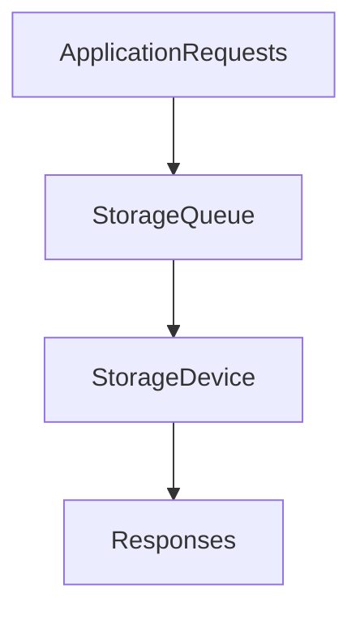
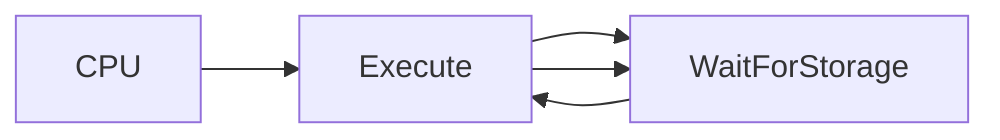
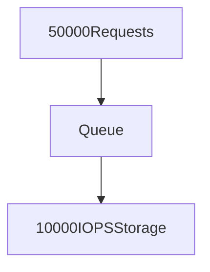
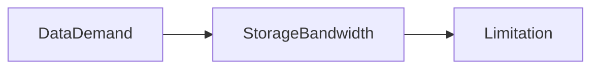
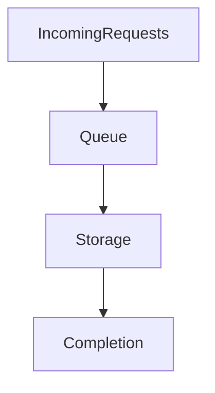
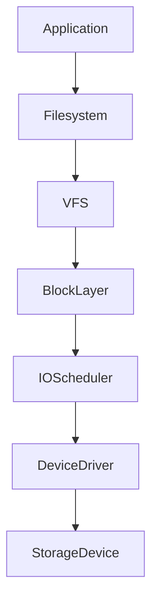
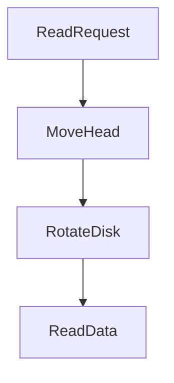
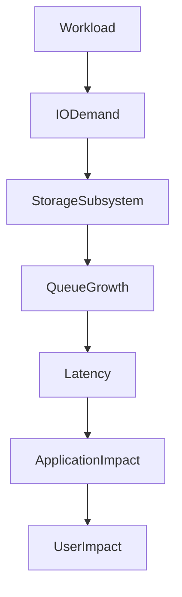

# Lab 07 — Storage Bottlenecks: Finding the Real Performance Killer in Linux Systems

> Linux Fundamentals Mastery
>
> Storage Management Labs Series
>
> Track:
>
> Linux Storage → Performance Engineering → SRE → Infrastructure Engineering
>
> Lab Goal:
>
> Learn how storage bottlenecks actually occur, why they are among the hardest production problems to diagnose, how Linux behaves under storage pressure, and how elite engineers systematically identify the true root cause of slow systems.

---

# Why This Lab Exists

One of the most expensive mistakes in infrastructure engineering is assuming:

```text
Slow Application

=

CPU Problem
```

In reality, many production incidents originate from:

```text
Storage Bottlenecks
```

Storage bottlenecks are dangerous because they create symptoms everywhere:

* High latency
* Slow APIs
* Slow databases
* Kubernetes instability
* Timeout errors
* Queue buildup
* Application freezes

The storage subsystem becomes the hidden choke point.

---

# The Most Important Lesson

Imagine:

```text
CPU Usage = 10%

RAM Usage = 50%

Network Healthy

Applications Timing Out
```

Most engineers investigate:

```text
CPU
```

Experienced engineers investigate:

```text
Storage Wait Time
```

Because systems often spend more time:

```text
Waiting For Storage
```

than:

```text
Executing Instructions
```

---

# The Fundamental Question

Whenever performance degrades:

```text
What Resource Is Saturated?
```

Possible answers:

```text
CPU

Memory

Storage

Network
```

This lab focuses on identifying:

```text
Storage Saturation
```

---

# Mental Model

Imagine a supermarket.

Customers:

```text
Applications
```

Cashiers:

```text
Storage Devices
```

Requests:

```text
Read/Write Operations
```

If:

```text
10 Customers

2 Cashiers
```

Everything works.

If:

```text
10,000 Customers

2 Cashiers
```

Queues grow.

Customers wait.

Performance collapses.

Storage bottlenecks behave exactly the same way.

---

# What Is A Storage Bottleneck?

A storage bottleneck occurs when:

```text
I/O Demand

>

Storage Capacity
```

Result:

```text
Queue Growth

Latency Increase

Application Slowdown
```

---

# Visualizing The Problem



When requests arrive faster than the device can process them:

```text
Queue Length Increases
```

---

# Why Storage Bottlenecks Are Dangerous

CPU bottlenecks are obvious.

Example:

```text
CPU = 100%
```

Easy to see.

Storage bottlenecks often appear as:

```text
CPU = Low

Memory = Fine

System = Slow
```

This confuses engineers.

---

# Linux Wait States

One of Linux's most important concepts.

Processes may be:

```text
Running

Sleeping

Waiting
```

Storage bottlenecks create:

```text
I/O Wait
```

---

# Understanding iowait

CPU may appear idle.

Reality:

```text
CPU Waiting For Disk
```

Metric:

```text
%iowait
```

---

# Visual Example

```text
Application

↓

Read Database Page

↓

Wait 50 ms

↓

Continue
```

CPU spends most of its time waiting.

---

# CPU vs I/O Wait



Many slow systems are actually storage-bound.

---

# The Storage Performance Triangle

Every storage bottleneck involves:

```text
IOPS

Latency

Throughput
```

Understanding all three is essential.

---

# Bottleneck Type 1 — IOPS Saturation

Storage can only process:

```text
10,000 IOPS
```

Application demands:

```text
50,000 IOPS
```

Result:

```text
Queue Growth
```

---

# Visualization



Requests accumulate faster than they are processed.

---

# Typical Symptoms

```text
Database Slow

API Slow

Latency Growing

Timeouts
```

---

# Bottleneck Type 2 — High Latency

Device processes requests.

But slowly.

Example:

```text
Storage Latency

150 ms
```

Every request waits.

---

# Why Latency Matters

A query requiring:

```text
100 Reads
```

with:

```text
150 ms Each
```

becomes extremely slow.

---

# Latency Visualization

```text
Request

↓

Wait

↓

Wait

↓

Wait

↓

Data Returned
```

Most time is spent waiting.

---

# Bottleneck Type 3 — Throughput Saturation

Example:

```text
Backup Job

Video Processing

Large File Transfers
```

Workload demands:

```text
2 GB/s
```

Storage provides:

```text
500 MB/s
```

System becomes bandwidth constrained.

---

# Throughput Bottleneck Visualization



---

# Bottleneck Type 4 — Queue Saturation

Storage itself may be healthy.

Problem:

```text
Too Many Simultaneous Requests
```

---

# Example

```text
1000 Processes

↓

Storage Queue
```

Queue becomes bottleneck.

---

# Understanding Queue Depth

Queue Depth means:

```text
How Many Requests Are Waiting?
```

Example:

```text
Queue Depth = 1

Excellent
```

---

```text
Queue Depth = 1000

Dangerous
```

---

# Queue Growth Visualization



If queue grows continuously:

```text
System Under Pressure
```

---

# Linux Storage Internals

Applications never access disks directly.

Path:



Bottlenecks may occur at multiple layers.

---

# Understanding The Block Layer

The Linux block layer:

```text
Queues Requests

Merges Requests

Schedules Requests
```

Poor storage behavior often begins here.

---

# Understanding I/O Schedulers

Linux uses schedulers to optimize disk access.

Examples:

```text
mq-deadline

bfq

none

kyber
```

---

# Why Schedulers Exist

Without scheduling:

```text
Random Requests

Everywhere
```

Result:

```text
Poor Efficiency
```

Schedulers organize work.

---

# SSD vs HDD Bottlenecks

Understanding this distinction is critical.

---

# HDD Bottlenecks

Physical movement.

```text
Seek Time

Rotational Delay
```

dominate latency.

---

# HDD Visualization



---

# SSD Bottlenecks

No moving parts.

Primary limitations:

```text
Controller

Flash Channels

Queue Capacity
```

---

# NVMe Bottlenecks

Modern NVMe devices are extremely fast.

Bottlenecks often shift to:

```text
CPU

PCIe

Filesystem

Application Design
```

---

# Production Scenario 1

## Slow PostgreSQL

Symptoms:

```text
Queries Slow
```

CPU:

```text
15%
```

Memory:

```text
60%
```

Investigation:

```bash
iostat -x 1
```

Shows:

```text
await = 200 ms
```

Root Cause:

```text
Storage Latency
```

---

# Production Scenario 2

## Elasticsearch Cluster Slow

Symptoms:

```text
Search Requests Timing Out
```

Investigation:

```bash
iotop
```

Heavy indexing workload.

Storage saturated.

---

# Production Scenario 3

## Kubernetes Node Unstable

Symptoms:

```text
Pods Restarting

Readiness Failures
```

Cause:

```text
Container Logs

Image Pulls

Storage Saturation
```

Node appears unhealthy.

---

# Production Scenario 4

## Backup Job Causes Outage

Nightly backup begins.

Symptoms:

```text
Applications Slow

Database Latency Spikes
```

Root cause:

```text
Backup Consumes Available IOPS
```

Classic enterprise incident.

---

# Storage Bottlenecks In Databases

Databases are storage-intensive systems.

Common bottlenecks:

```text
Index Reads

Transaction Logs

Checkpoint Writes

Compaction Operations
```

Storage performance directly affects query performance.

---

# PostgreSQL Example

```text
User Query

↓

Buffer Cache Miss

↓

Disk Read

↓

Storage Latency

↓

Response
```

Storage latency becomes user latency.

---

# Cloud Storage Bottlenecks

Cloud volumes often have limits.

Examples:

```text
AWS EBS

Azure Managed Disk

GCP Persistent Disk
```

---

# Common Cloud Problem

Volume provides:

```text
3000 IOPS
```

Application requires:

```text
10000 IOPS
```

Result:

```text
Queue Growth

Latency Increase
```

---

# Kubernetes Connection

Persistent Volumes depend on underlying storage.

Example:

```text
Pod

↓

Persistent Volume

↓

Cloud Disk

↓

Storage Limits
```

Kubernetes cannot create IOPS from nothing.

---

# Observability Toolkit

Storage investigations require data.

---

# Device Statistics

```bash
iostat -x 1
```

---

# Process I/O Usage

```bash
iotop
```

---

# Storage Layout

```bash
lsblk
```

---

# Filesystem Usage

```bash
df -h
```

---

# Block Devices

```bash
cat /proc/diskstats
```

---

# VM Statistics

```bash
vmstat 1
```

---

# Critical Metrics

Always monitor:

```text
IOPS

Latency

Queue Depth

Utilization

I/O Wait
```

Together.

Never individually.

---

# Failure Investigation Workflow

## Step 1

Check:

```bash
top
```

Observe:

```text
%iowait
```

---

## Step 2

Inspect storage:

```bash
iostat -x 1
```

---

## Step 3

Identify heavy processes:

```bash
iotop
```

---

## Step 4

Determine:

```text
Read Heavy?

Write Heavy?

Random?

Sequential?
```

---

## Step 5

Correlate:

```text
Application Latency

↓

Storage Metrics
```

---

## Step 6

Find root cause.

---

# The Universal Storage Bottleneck Model



Every storage bottleneck follows this pattern.

---

# What The Kernel Is Thinking

Application says:

```text
Read Data
```

Kernel asks:

```text
Page Cache Hit?
```

If yes:

```text
Return Immediately
```

If no:

```text
Queue Request
```

Then:

```text
Wait For Device
```

Storage latency begins.

---

# Common Mistakes

## Mistake 1

Monitoring CPU only.

---

## Mistake 2

Ignoring iowait.

---

## Mistake 3

Assuming SSD means infinite performance.

---

## Mistake 4

Ignoring queue depth.

---

## Mistake 5

Treating symptoms instead of bottlenecks.

---

# Engineering Mindset

Junior Engineer:

```text
Application Is Slow
```

Senior Engineer:

```text
Which Resource Is Saturated?
```

Performance Engineer:

```text
Show Me:

Latency

IOPS

Queue Depth
```

Storage Engineer:

```text
What Is Limiting Throughput?
```

Infrastructure Architect:

```text
How Will This System Behave At 10x Load?
```

That is the real question.

---

# Interview Questions

### Beginner

What is a storage bottleneck?

### Intermediate

What is iowait?

### Intermediate

Why can CPU be idle while applications are slow?

### Intermediate

What is queue depth?

### Advanced

How would you diagnose storage saturation?

### Advanced

Explain storage bottlenecks in databases.

### Advanced

Explain storage bottlenecks in Kubernetes.

### Advanced

How do cloud IOPS limits affect applications?

### Advanced

Design an observability strategy for storage performance.

---

# Cheat Sheet

CPU & I/O Wait:

```bash
top
```

Storage Statistics:

```bash
iostat -x 1
```

Process I/O:

```bash
iotop
```

Memory & Cache:

```bash
free -h
```

Block Devices:

```bash
lsblk
```

VM Statistics:

```bash
vmstat 1
```

Disk Statistics:

```bash
cat /proc/diskstats
```

---

# Lab Success Criteria

You should now be able to:

* Explain what storage bottlenecks are
* Understand IOPS saturation
* Understand latency bottlenecks
* Understand throughput bottlenecks
* Understand queue saturation
* Diagnose storage-related outages
* Investigate database performance problems
* Analyze cloud storage limits
* Understand Kubernetes storage bottlenecks
* Think like a storage performance engineer

At this point, you should stop asking:

```text
Is The Server Slow?
```

and start asking:

```text
Which Resource

Is Preventing Work

From Moving Forward?
```

Because performance engineering is ultimately the science of identifying bottlenecks and eliminating them.
