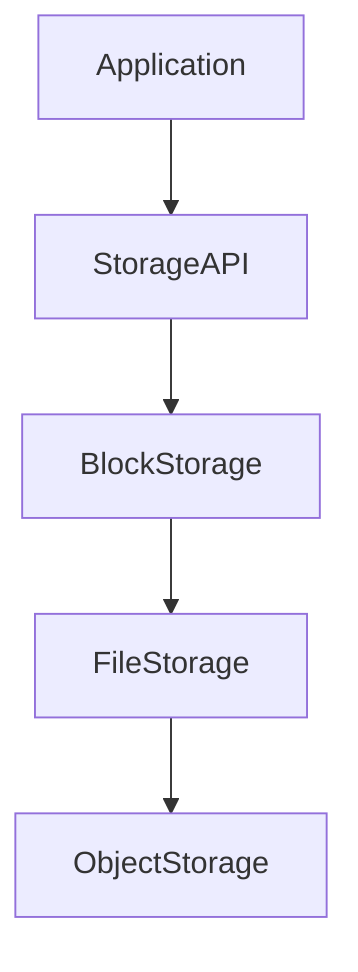
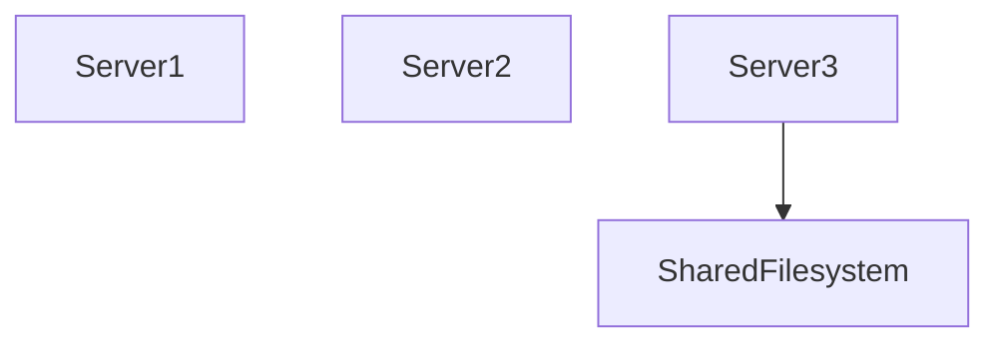
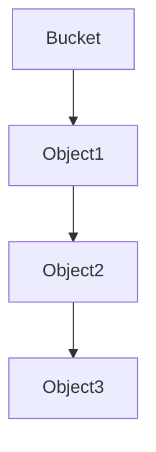
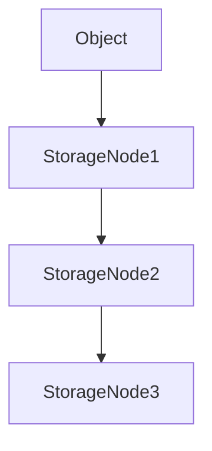
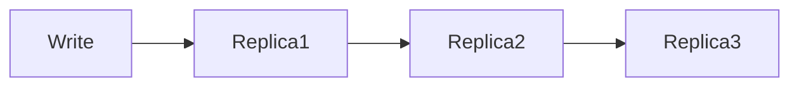
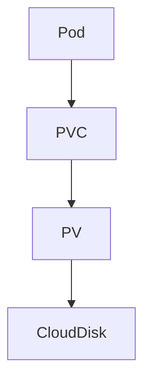
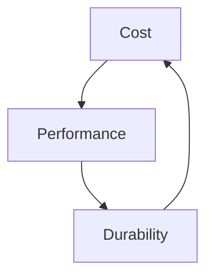
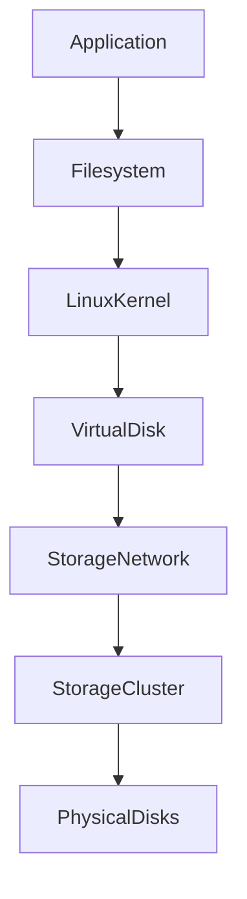
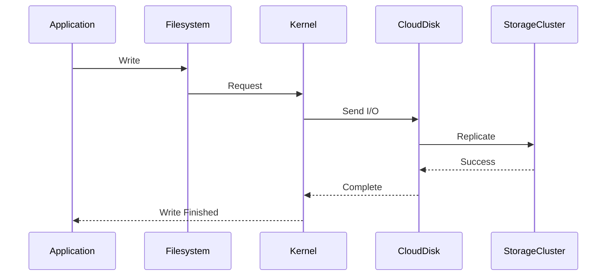

# Lab 08 — Cloud Storage Labs: Understanding Storage at Internet Scale

> Linux Fundamentals Mastery
>
> Storage Management Labs Series
>
> Track:
>
> Linux Storage → Cloud Infrastructure → Distributed Systems → Platform Engineering
>
> Lab Goal:
>
> Understand how cloud storage actually works beneath the marketing terms, how Linux interacts with cloud storage, how modern platforms provide seemingly infinite storage, and how infrastructure engineers design reliable, scalable, and cost-efficient storage architectures.

---

# Why This Lab Exists

Most people think cloud storage means:

```text
Files Stored Somewhere On The Internet
```

This is wrong.

Cloud storage is one of the most sophisticated engineering systems ever built.

When you store:

```text
1 Photo

1 Database

1 Kubernetes Volume

1 Backup
```

you're interacting with:

```text
Thousands Of Servers

Distributed Networks

Replication Systems

Storage Clusters

Failure Recovery Systems
```

The cloud simply hides the complexity.

---

# The Most Important Lesson

Cloud storage is not magic.

Every cloud storage service eventually becomes:

```text
Physical Disks

↓

Linux Servers

↓

Distributed Storage Systems

↓

Storage APIs
```

The cloud changes:

```text
How Storage Is Managed
```

not:

```text
The Laws Of Physics
```

---

# The Fundamental Question

Imagine AWS, Azure, or Google Cloud.

Question:

```text
How Can A User Create

100 TB Storage

In Seconds?
```

No engineer manually installs disks.

No human configures RAID.

No one creates partitions.

Yet storage appears instantly.

How?

Cloud storage exists to answer this question.

---

# Mental Model

Think of electricity.

You don't buy:

```text
Power Plant

Turbines

Generators
```

You consume:

```text
Electricity
```

Similarly:

Cloud users consume:

```text
Storage
```

without managing:

```text
Disks

Controllers

RAID

Networking

Replication
```

---

# Evolution Of Storage

Traditional:

```text
Application

↓

Server

↓

Disk
```

Cloud:

```text
Application

↓

API

↓

Distributed Storage Platform

↓

Thousands Of Disks
```

---

# The Cloud Storage Abstraction

Cloud providers transform:

```text
Complex Infrastructure
```

into:

```text
Simple APIs
```

This abstraction is the foundation of cloud computing.

---

# The Three Cloud Storage Models

Every cloud storage service belongs to one of three categories:

```text
Block Storage

File Storage

Object Storage
```

Understanding these three models is mandatory.

---

# Cloud Storage Architecture



Different workloads require different storage models.

---

# Block Storage

Most similar to traditional disks.

Cloud provides:

```text
Virtual Disk
```

Linux sees:

```text
/dev/nvme0n1
```

or:

```text
/dev/xvdf
```

depending on provider.

---

# Examples

AWS:

```text
EBS
```

Azure:

```text
Managed Disks
```

Google Cloud:

```text
Persistent Disk
```

---

# Mental Model

Cloud block storage is:

```text
A Remote Hard Drive
```

presented locally.

---

# Architecture


Linux believes it owns a disk.

Reality is more complex.

---

# File Storage

Traditional shared filesystem.

Examples:

```text
NFS

EFS

Azure Files

Filestore
```

Provides:

```text
Shared Access
```

to multiple machines.

---

# Example



All systems access the same files.

---

# Object Storage

The most important cloud storage innovation.

Examples:

```text
Amazon S3

Azure Blob

Google Cloud Storage
```

---

# Object Storage Changes Everything

Traditional storage:

```text
Filesystem

↓

Directories

↓

Files
```

Object storage:

```text
Bucket

↓

Object
```

No traditional filesystem hierarchy.

---

# Object Storage Visualization



Objects are accessed through APIs.

---

# Why Object Storage Won

Object storage provides:

```text
Massive Scale

Low Cost

High Durability

Global Access
```

Perfect for modern applications.

---

# Understanding Durability

Cloud providers advertise:

```text
11 Nines Durability
```

Example:

```text
99.999999999%
```

This sounds magical.

It isn't.

---

# How Durability Is Achieved

Replication.

Example:



Multiple copies exist.

Disk failure becomes irrelevant.

---

# Failure Is Assumed

Traditional thinking:

```text
Avoid Failure
```

Cloud thinking:

```text
Failure Is Guaranteed
```

Systems are designed accordingly.

---

# Cloud Storage Internals

Cloud storage systems assume:

```text
Disks Fail

Servers Fail

Racks Fail

Networks Fail

Datacenters Fail
```

Storage survives anyway.

---

# Data Replication

Most distributed storage systems use:

```text
Replication
```

Architecture:



Data exists in multiple places.

---

# Erasure Coding

Modern cloud systems often use:

```text
Erasure Coding
```

instead of simple replication.

---

# Mental Model

Instead of:

```text
3 Full Copies
```

store:

```text
Data Fragments

+

Recovery Fragments
```

Much more storage efficient.

---

# Erasure Coding Visualization

```text
Data

A B C D

↓

Fragments

A B C D P Q
```

Missing pieces can be reconstructed.

---

# Why Cloud Storage Is Cheap

Because:

```text
Erasure Coding

Automation

Scale

Commodity Hardware
```

reduce costs dramatically.

---

# Linux And Cloud Storage

Linux remains central.

Example:

Attach cloud volume.

Linux sees:

```text
/dev/nvme1n1
```

Engineer still performs:

```text
Partition

Filesystem

Mount
```

The fundamentals never disappear.

---

# Example Investigation

Discover cloud disk:

```bash
lsblk
```

Example:

```text
nvme0n1

nvme1n1
```

Cloud volume appears as a Linux block device.

---

# Kubernetes Connection

Kubernetes relies heavily on cloud storage.

Example:



Persistent storage ultimately becomes cloud storage.

---

# Why Kubernetes Needs Storage

Containers are ephemeral.

Storage is persistent.

Without persistent volumes:

```text
Pod Dies

↓

Data Lost
```

---

# Cloud Storage Performance

Many engineers assume:

```text
Cloud Storage

=

Infinite Performance
```

False.

Every storage system has limits.

---

# Important Metrics

Monitor:

```text
IOPS

Latency

Throughput

Queue Depth
```

Exactly as with local storage.

---

# Example Cloud Failure

Volume provides:

```text
3000 IOPS
```

Database requires:

```text
10000 IOPS
```

Symptoms:

```text
Slow Queries

Timeouts

High Latency
```

Root cause:

```text
Storage Limit Reached
```

---

# Storage Tiers

Cloud providers offer multiple performance levels.

Example:

```text
Standard

SSD

Premium SSD

Provisioned IOPS
```

More performance usually means:

```text
Higher Cost
```

---

# The Storage Cost Triangle



Cloud storage design is a tradeoff exercise.

---

# Production Scenario 1

## Database Storage

Bad Design:

```text
Cheap HDD Volume
```

Result:

```text
Slow Queries
```

Good Design:

```text
Provisioned IOPS SSD
```

---

# Production Scenario 2

## Static Website Assets

Store:

```text
Images

Videos

Downloads
```

in:

```text
Object Storage
```

Not block storage.

Much cheaper.

---

# Production Scenario 3

## Shared Enterprise Files

Requirement:

```text
Multiple Servers

Same Files
```

Use:

```text
Managed File Storage
```

instead of local disks.

---

# Production Scenario 4

## Kubernetes Cluster

Requirement:

```text
Persistent Database
```

Solution:

```text
Persistent Volume

Cloud Block Storage
```

---

# Cloud Storage Failure Modes

Even cloud storage can fail.

Common issues:

```text
IOPS Limits

Misconfiguration

Network Problems

Permission Errors

Volume Detachment
```

---

# Storage Observability

Linux Tools:

```bash
lsblk
```

```bash
df -h
```

```bash
iostat -x 1
```

```bash
mount
```

---

Cloud Metrics:

```text
Volume IOPS

Latency

Read Throughput

Write Throughput

Burst Credits
```

---

# Cloud Storage Architecture



Many layers exist between application and hardware.

---

# The Hidden Reality

When cloud providers say:

```text
Create 10 TB Volume
```

They are actually:

```text
Allocating Capacity

Updating Metadata

Reserving Resources

Configuring Distributed Storage
```

in massive backend systems.

---

# What Happens During A Cloud Write?



This path may involve dozens of servers.

---

# Storage Design Mindset

Beginner:

```text
Where Do I Store Files?
```

---

Linux Administrator:

```text
Which Filesystem?
```

---

Cloud Engineer:

```text
Which Storage Service?
```

---

Platform Engineer:

```text
Which Storage Architecture?
```

---

System Architect:

```text
How Does Data Survive Failure?
```

That final question drives cloud storage design.

---

# Common Mistakes

## Mistake 1

Treating cloud storage as unlimited.

---

## Mistake 2

Ignoring IOPS limits.

---

## Mistake 3

Using block storage for object workloads.

---

## Mistake 4

Ignoring storage costs.

---

## Mistake 5

Assuming cloud storage eliminates Linux fundamentals.

---

# Interview Questions

### Beginner

What are the three cloud storage models?

### Intermediate

Difference between block, file, and object storage?

### Intermediate

Why is object storage popular?

### Intermediate

How does cloud block storage appear in Linux?

### Advanced

Explain replication.

### Advanced

Explain erasure coding.

### Advanced

Why can cloud storage still become a bottleneck?

### Advanced

Design storage for a Kubernetes database.

### Advanced

Design storage for a video streaming platform.

### Advanced

How do cloud providers achieve high durability?

---

# Cheat Sheet

Discover devices:

```bash
lsblk
```

Filesystem usage:

```bash
df -h
```

Storage performance:

```bash
iostat -x 1
```

Mounted filesystems:

```bash
findmnt
```

Device details:

```bash
blkid
```

Cloud Storage Types:

```text
Block → Databases, OS

File → Shared Access

Object → Images, Videos, Backups
```

---

# Lab Success Criteria

You should now be able to:

* Explain cloud storage fundamentals
* Distinguish block, file, and object storage
* Understand replication and durability
* Explain erasure coding
* Understand Linux interactions with cloud volumes
* Analyze cloud storage performance
* Design storage for applications
* Design storage for Kubernetes
* Think about storage at datacenter scale
* Connect Linux storage concepts to distributed systems

At this point, you should stop seeing cloud storage as:

```text
A Disk Somewhere On The Internet
```

and start seeing it as:

```text
A Massive Distributed Storage System

Built From Linux

Networks

Replication

Automation

And Failure-Tolerant Engineering
```

Because that is what cloud storage truly is.
