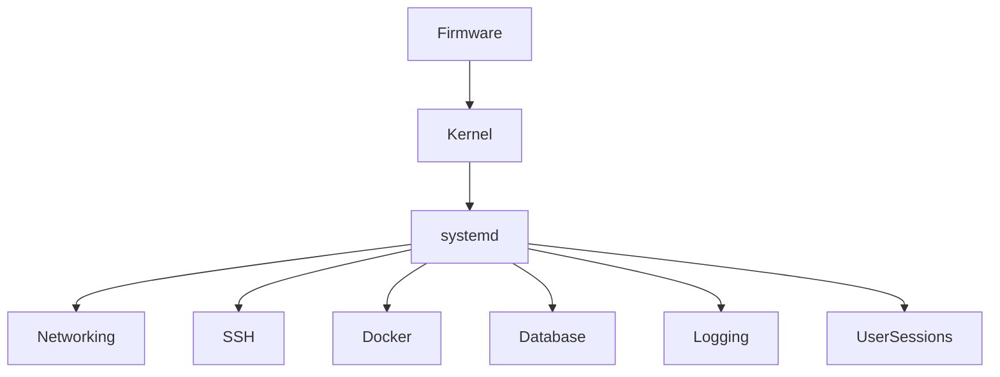
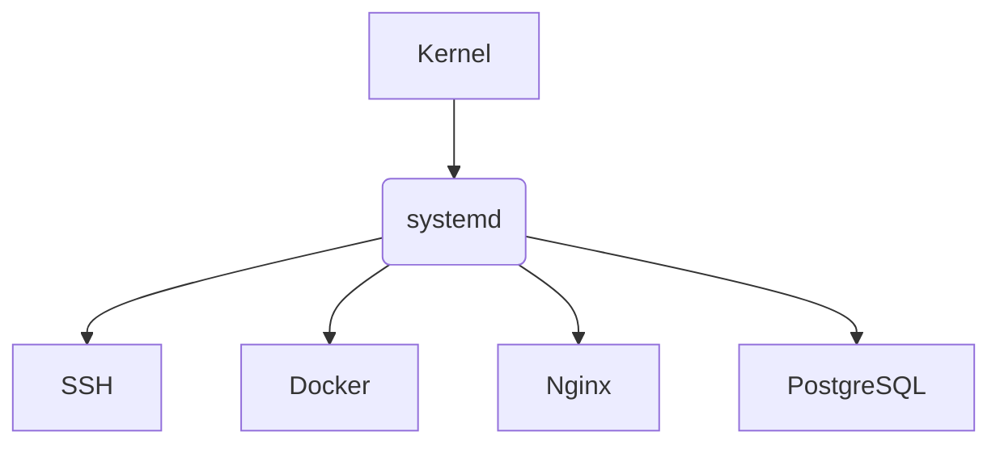
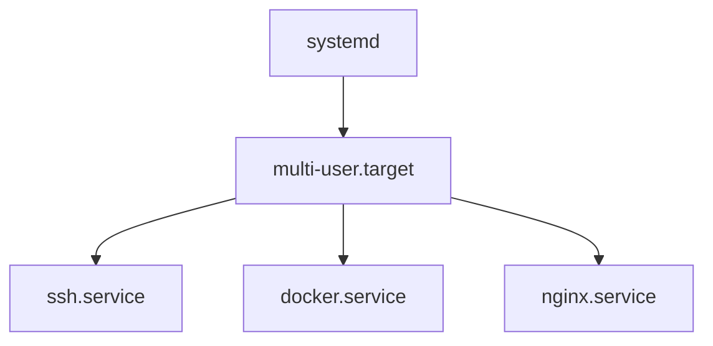
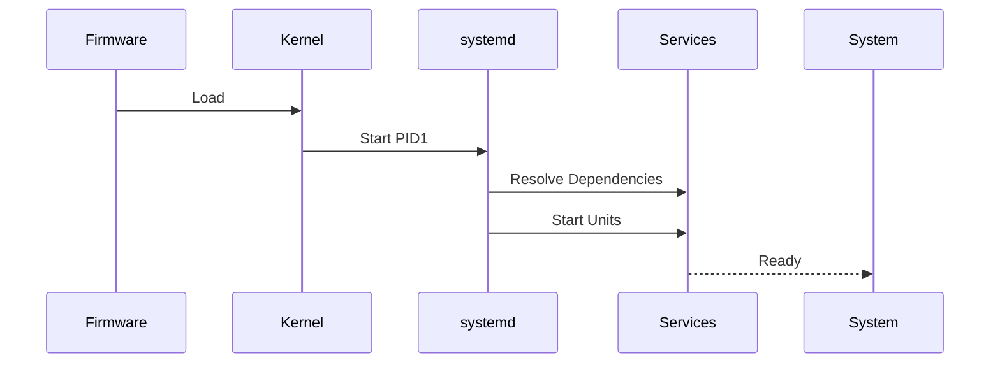
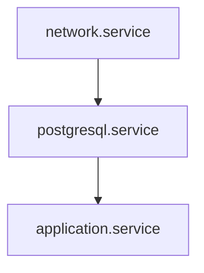
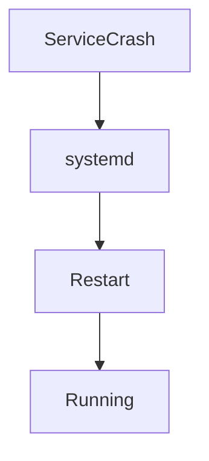
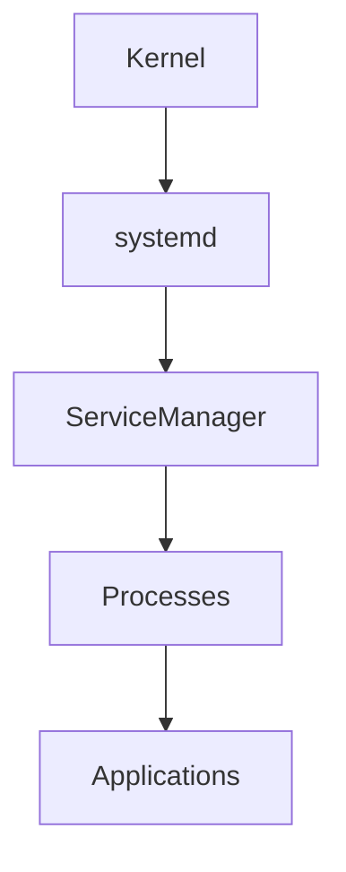

# Lab 01 — systemd Basics: Understanding the Brain of Modern Linux

> Linux Fundamentals Mastery
>
> Service Management Labs Series
>
> Track:
>
> Linux Fundamentals → Process Management → Service Management → Infrastructure Engineering
>
> Lab Goal:
>
> Understand why systemd exists, how modern Linux boots, how services are managed, and how systemd became the control plane of modern Linux systems.

---

# Why This Lab Exists

Ask most Linux users:

```text
What is systemd?
```

Typical answer:

```text
A service manager.
```

This answer is technically correct.

But it misses the most important point.

systemd is not simply a service manager.

systemd is:

```text
The Operating System Control Plane
```

Modern Linux systems depend on systemd for:

* Booting
* Service Management
* Logging
* Scheduling
* Networking Integration
* Device Management
* User Sessions
* Resource Control

Without understanding systemd, you cannot truly understand modern Linux.

---

# The Most Important Lesson

When a Linux server powers on:

```text
Hardware

↓

Firmware

↓

Kernel

↓

systemd

↓

Everything Else
```

Almost everything you interact with after boot exists because systemd started it.

---

# The Fundamental Question

Imagine Linux boots.

Question:

```text
Who Starts Everything?
```

Who starts:

* SSH
* Nginx
* PostgreSQL
* Docker
* Kubernetes
* Logging
* Networking

Answer:

```text
systemd
```

This is why it matters.

---

# Mental Model

Think of a large airport.

Without coordination:

```text
Planes

Passengers

Fuel

Baggage

Crew

Security
```

Chaos.

An airport needs:

```text
Air Traffic Control
```

Linux needs:

```text
systemd
```

systemd coordinates the entire operating system.

---

# What Is systemd?

Officially:

```text
Init System

+

Service Manager
```

Practically:

```text
Linux Control Center
```

---

# Before systemd

Historically Linux used:

```text
SysV Init
```

Architecture:

```text
Kernel

↓

Init

↓

Shell Scripts

↓

Services
```

---

# Problems With Older Systems

Boot process:

```text
Service A

↓

Service B

↓

Service C

↓

Service D
```

Everything started sequentially.

Slow.

Difficult to manage.

Hard to troubleshoot.

---

# Modern systemd Architecture



systemd orchestrates the system.

---

# Why systemd Was Created

The Linux ecosystem needed:

```text
Faster Boot

Dependency Management

Service Monitoring

Automatic Recovery

Unified Management
```

systemd solved these problems.

---

# Understanding PID 1

One of the most important Linux concepts.

Check:

```bash
ps -p 1
```

Example:

```text
PID 1 systemd
```

---

# Why PID 1 Matters

The kernel starts:

```text
PID 1
```

first.

Everything else ultimately descends from it.

Visualized:



systemd becomes the parent of the system.

---

# Investigating PID 1

Observe:

```bash
pstree -p
```

You'll see:

```text
systemd

├── sshd
├── nginx
├── docker
└── postgres
```

This reveals Linux process hierarchy.

---

# Understanding Units

systemd manages:

```text
Units
```

A unit is:

```text
Anything systemd Can Manage
```

---

# Common Unit Types

| Unit Type | Purpose           |
| --------- | ----------------- |
| .service  | Services          |
| .socket   | Network sockets   |
| .target   | Group of units    |
| .mount    | Filesystem mounts |
| .timer    | Scheduled tasks   |
| .path     | File monitoring   |
| .slice    | Resource control  |

---

# Most Important Unit Type

```text
.service
```

Examples:

```text
nginx.service

sshd.service

docker.service
```

These are services managed by systemd.

---

# Viewing Services

Display services:

```bash
systemctl list-units --type=service
```

Example output:

```text
sshd.service

docker.service

cron.service
```

---

# Understanding Service States

Every service has a state.

Common states:

```text
active

inactive

failed

activating

deactivating
```

---

# Service Lifecycle


This lifecycle is fundamental.

---

# Investigating Service Status

Example:

```bash
systemctl status ssh
```

Output shows:

* Current state
* Process ID
* Logs
* Startup time
* Errors

This is one of the most used commands in production.

---

# Starting Services

Start:

```bash
sudo systemctl start nginx
```

---

# Stopping Services

Stop:

```bash
sudo systemctl stop nginx
```

---

# Restarting Services

Restart:

```bash
sudo systemctl restart nginx
```

---

# Reloading Services

Reload configuration:

```bash
sudo systemctl reload nginx
```

Notice:

```text
Reload

≠

Restart
```

---

# Visual Comparison

Restart:

```text
Stop Process

↓

Start New Process
```

---

Reload:

```text
Keep Running

↓

Reload Config
```

Much safer.

---

# Enabling Services

Start at boot:

```bash
sudo systemctl enable nginx
```

---

# Disabling Services

Prevent startup:

```bash
sudo systemctl disable nginx
```

---

# Why Enable Exists

Two different concepts:

```text
Running Now

vs

Run At Boot
```

Engineers often confuse them.

---

# Example

```bash
systemctl start nginx
```

means:

```text
Run Now
```

---

```bash
systemctl enable nginx
```

means:

```text
Run During Future Boots
```

---

# Understanding Targets

Targets replace old runlevels.

Think:

```text
System States
```

---

# Common Targets

| Target            | Purpose       |
| ----------------- | ------------- |
| rescue.target     | Recovery mode |
| multi-user.target | Server mode   |
| graphical.target  | Desktop mode  |

---

# Visualizing Targets



Targets group services.

---

# Boot Sequence Deep Dive

When Linux boots:



This process happens in seconds.

---

# Dependency Management

One of systemd's biggest strengths.

Example:

```text
Database Requires Network
```

systemd understands:

```text
Network First

Database Second
```

---

# Dependency Visualization



Order matters.

---

# Why Dependency Management Matters

Without dependencies:

```text
Database Starts

Before Network Exists
```

Failure.

systemd prevents this.

---

# Automatic Service Recovery

Production systems fail.

systemd can restart services automatically.

Example:

```text
Application Crashes
```

systemd:

```text
Detect Failure

↓

Restart Service
```

---

# Recovery Flow



This dramatically improves reliability.

---

# Viewing Boot Performance

One of the coolest features.

Check:

```bash
systemd-analyze
```

Example:

```text
Startup Finished In

4.3 Seconds
```

---

# Investigating Slow Boot

Display timing:

```bash
systemd-analyze blame
```

Example:

```text
5s docker.service

3s nginx.service
```

Find boot bottlenecks quickly.

---

# Linux Internals

Kernel does not know:

```text
Nginx

Docker

PostgreSQL
```

Kernel only knows:

```text
Processes
```

systemd bridges the gap.

---

# Architecture Deep Dive



systemd converts process management into service management.

---

# Production Scenario 1

## SSH Not Working

Investigation:

```bash
systemctl status ssh
```

Output:

```text
failed
```

Root cause immediately visible.

---

# Production Scenario 2

## Nginx Down

Check:

```bash
systemctl status nginx
```

Observe:

```text
Configuration Error
```

Logs included directly.

---

# Production Scenario 3

## Server Boots Slowly

Investigation:

```bash
systemd-analyze blame
```

Find:

```text
Database Service

20 Seconds
```

Root cause identified.

---

# Docker Connection

Docker daemon:

```text
dockerd
```

runs as:

```text
docker.service
```

managed by systemd.

Check:

```bash
systemctl status docker
```

---

# Kubernetes Connection

Kubernetes components often run as:

```text
kubelet.service

containerd.service
```

managed by systemd.

No systemd.

No Kubernetes node.

---

# Cloud Connection

Cloud VMs:

* AWS EC2
* Azure VM
* GCP Compute Engine

all typically use:

```text
systemd
```

for service orchestration.

Cloud infrastructure depends heavily on it.

---

# Observability

View services:

```bash
systemctl list-units
```

Service status:

```bash
systemctl status SERVICE
```

Boot timing:

```bash
systemd-analyze
```

Slow services:

```bash
systemd-analyze blame
```

Process tree:

```bash
pstree -p
```

PID 1:

```bash
ps -p 1
```

---

# What The Kernel Is Thinking

Kernel boots.

Kernel asks:

```text
Who Runs The System?
```

Answer:

```text
PID 1
```

systemd becomes:

```text
Parent

Coordinator

Supervisor

Recovery Engine
```

for the entire operating system.

---

# Common Mistakes

## Mistake 1

Thinking systemd only starts services.

It manages far more.

---

## Mistake 2

Confusing:

```text
start

enable
```

Different concepts.

---

## Mistake 3

Ignoring dependency chains.

---

## Mistake 4

Restarting services before checking status.

---

## Mistake 5

Not understanding PID 1.

Everything begins there.

---

# Engineering Mindset

Beginner:

```text
How Do I Start Nginx?
```

Linux Administrator:

```text
Why Did Nginx Stop?
```

Infrastructure Engineer:

```text
What Dependencies Does Nginx Require?
```

Platform Engineer:

```text
How Does Service Management Affect System Reliability?
```

System Architect:

```text
What Coordinates The Entire Operating System?
```

Answer:

```text
systemd
```

---

# Interview Questions

### Beginner

What is systemd?

### Beginner

What is PID 1?

### Intermediate

What is a unit?

### Intermediate

Difference between start and enable?

### Intermediate

What are targets?

### Advanced

How does systemd manage dependencies?

### Advanced

How does systemd improve boot performance?

### Advanced

How does automatic service recovery work?

### Advanced

How does systemd relate to Docker and Kubernetes?

### Advanced

Explain the Linux boot process involving systemd.

---

# Cheat Sheet

Check PID 1:

```bash
ps -p 1
```

List services:

```bash
systemctl list-units --type=service
```

Service status:

```bash
systemctl status SERVICE
```

Start:

```bash
systemctl start SERVICE
```

Stop:

```bash
systemctl stop SERVICE
```

Restart:

```bash
systemctl restart SERVICE
```

Enable:

```bash
systemctl enable SERVICE
```

Disable:

```bash
systemctl disable SERVICE
```

Boot analysis:

```bash
systemd-analyze
```

Boot bottlenecks:

```bash
systemd-analyze blame
```

---

# Lab Success Criteria

You should now be able to:

* Explain why systemd exists
* Understand PID 1
* Understand Linux boot flow
* Manage services with systemctl
* Distinguish start vs enable
* Understand unit types
* Understand targets
* Investigate service failures
* Analyze boot performance
* Connect systemd to Docker, Kubernetes, and cloud systems
* Think like an infrastructure engineer managing production Linux systems

At this point, you should stop thinking of systemd as:

```text
A Service Manager
```

and start thinking of it as:

```text
The Operating System Control Plane

That Boots

Coordinates

Monitors

And Recovers

The Entire Linux System
```

Because that is what systemd really is.
