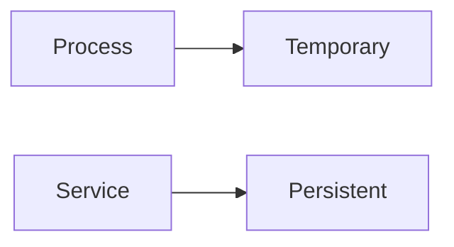
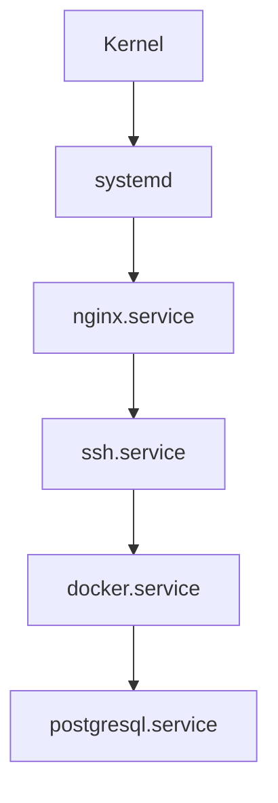
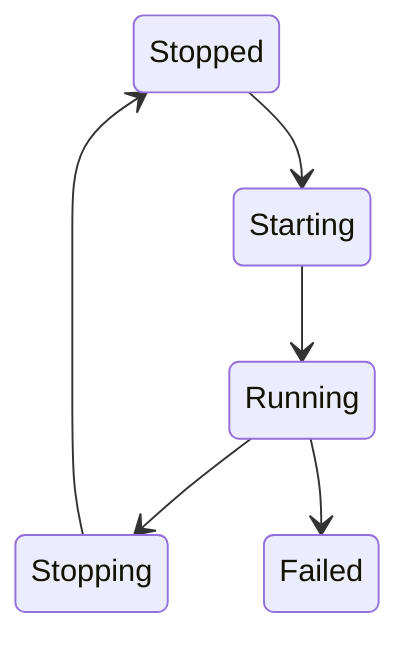
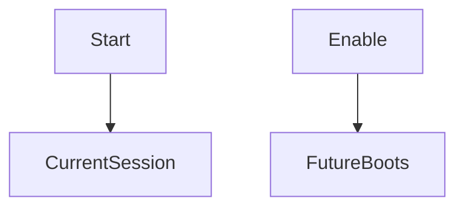
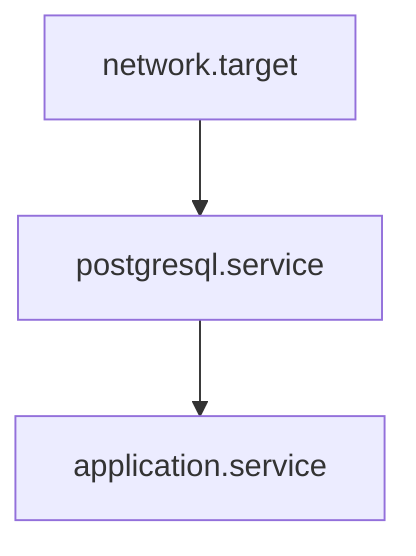
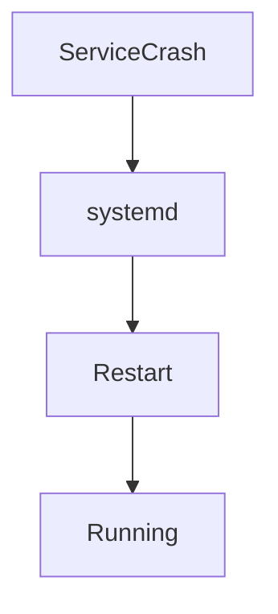
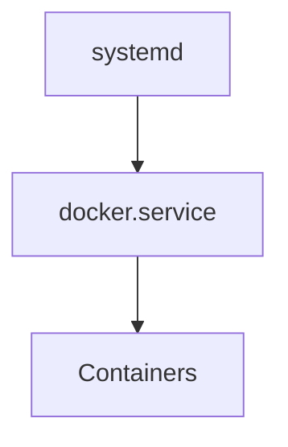
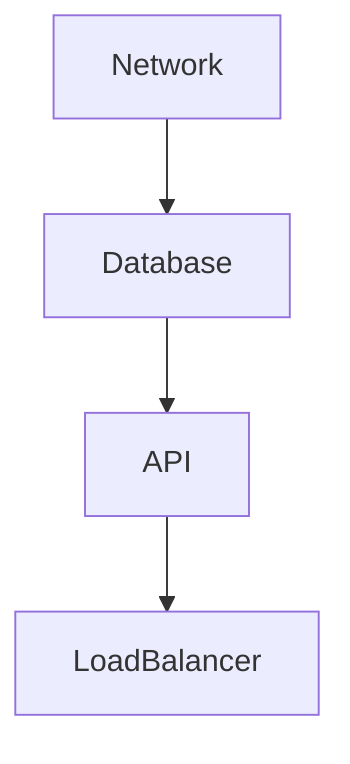

# Lab 02 — Service Management: Operating Linux Systems Like a Production Engineer

> Linux Fundamentals Mastery
>
> Service Management Labs Series
>
> Track:
>
> Linux Operations → systemd → Infrastructure Engineering → SRE
>
> Lab Goal:
>
> Learn how Linux services actually work, how production systems keep applications running, how systemd manages service lifecycles, and how engineers investigate, recover, and automate services at scale.

---

# Why This Lab Exists

Most Linux users think:

```text
Application

↓

Run Command

↓

Done
```

Production systems do not work this way.

Real infrastructure must answer:

```text
What Happens If The Application Crashes?

What Happens During Reboot?

What Happens During Upgrades?

What Happens During Traffic Spikes?

What Happens During Dependency Failures?
```

Service management exists to solve these problems.

---

# The Most Important Lesson

Starting a process is easy.

Keeping a service healthy for:

```text
Days

Weeks

Months

Years
```

is hard.

The difference between:

```text
Developer
```

and

```text
Infrastructure Engineer
```

is often service management.

---

# The Fundamental Problem

Imagine:

```text
sudo ./my-api
```

Application starts.

Looks good.

Now:

```text
Terminal Closed
```

Application dies.

Or:

```text
Server Rebooted
```

Application disappears.

Or:

```text
Application Crashed
```

Nobody restarts it.

Production systems need something better.

---

# Mental Model

Think about a hospital.

Patients:

```text
Applications
```

Doctors:

```text
Engineers
```

Monitoring Systems:

```text
systemd
```

If a patient becomes unhealthy:

```text
Monitoring Detects Problem

↓

Intervention Occurs

↓

Recovery Happens
```

Service management works similarly.

---

# What Is A Service?

A service is:

```text
A Long-Running Process

Managed By The Operating System
```

Examples:

```text
sshd

nginx

docker

postgresql

redis

kubelet
```

These continuously provide functionality.

---

# Process vs Service

One of the most important distinctions.

---

# Process

Example:

```bash
python app.py
```

Characteristics:

```text
Temporary

User Controlled

Interactive
```

---

# Service

Example:

```text
nginx.service
```

Characteristics:

```text
Persistent

Automatically Managed

Production Oriented
```

---

# Visualization



---

# Why Services Exist

Applications need:

```text
Automatic Startup

Monitoring

Recovery

Dependency Management

Logging

Security Controls
```

Services provide these capabilities.

---

# Linux Service Architecture



systemd orchestrates all services.

---

# Understanding Service Lifecycle

Every service moves through states.


Production engineers constantly investigate these transitions.

---

# Viewing Services

Display active services:

```bash
systemctl list-units --type=service
```

Example:

```text
sshd.service

docker.service

cron.service

systemd-journald.service
```

---

# What Is systemctl?

systemctl is:

```text
The Primary Interface

For Service Management
```

Think of it as:

```text
Control Panel For Linux Services
```

---

# Service Investigation

Most important command:

```bash
systemctl status nginx
```

Example output:

```text
Loaded

Active

PID

Logs

Errors
```

This single command solves many incidents.

---

# Reading Service Status

Example:

```text
● nginx.service

Active: active (running)

Main PID: 1234
```

Questions answered immediately:

```text
Running?

Healthy?

When Started?

Which Process?
```

---

# Understanding Service States

---

## Active

```text
Service Running Normally
```

---

## Inactive

```text
Service Stopped
```

---

## Failed

```text
Service Crashed

Or Startup Failed
```

---

## Activating

```text
Service Starting
```

---

## Deactivating

```text
Service Stopping
```

---

# Visualizing State Transitions



---

# Starting Services

Start immediately:

```bash
sudo systemctl start nginx
```

This means:

```text
Run Now
```

Nothing more.

---

# Stopping Services

Stop:

```bash
sudo systemctl stop nginx
```

Common during:

* Maintenance
* Upgrades
* Troubleshooting

---

# Restarting Services

Restart completely:

```bash
sudo systemctl restart nginx
```

Process:

```text
Stop

↓

Start
```

---

# Reloading Services

Reload configuration:

```bash
sudo systemctl reload nginx
```

Process:

```text
Keep Running

↓

Load New Configuration
```

Much safer than restarting.

---

# Restart vs Reload

One of the most important operational concepts.

Restart:

```text
Connection Interruptions Possible
```

Reload:

```text
Minimal Impact
```

Production systems prefer reload whenever possible.

---

# Enable vs Start

Engineers confuse this constantly.

---

## Start

```bash
systemctl start nginx
```

Meaning:

```text
Run Now
```

---

## Enable

```bash
systemctl enable nginx
```

Meaning:

```text
Run At Future Boots
```

---

# Visual Comparison



Completely different operations.

---

# Service Dependencies

Real services depend on other services.

Example:

```text
Application

↓

Database

↓

Network
```

Dependencies matter.

---

# Dependency Visualization



---

# Why Dependencies Matter

Without dependency management:

```text
Application Starts

↓

Database Missing

↓

Failure
```

systemd solves this automatically.

---

# Automatic Recovery

One of systemd's most powerful capabilities.

Application crashes:

```text
Service Dies
```

systemd detects:

```text
Failure
```

Then:

```text
Restart Service
```

---

# Recovery Architecture



Modern infrastructure relies heavily on this behavior.

---

# Understanding Service Logs

Every service produces logs.

Example:

```bash
journalctl -u nginx
```

Observe:

```text
Startup Events

Errors

Warnings

Failures
```

Logs are often the fastest path to root cause.

---

# Real Production Workflow

Problem:

```text
Website Down
```

Engineer:

```bash
systemctl status nginx
```

If failed:

```bash
journalctl -u nginx
```

Root cause often appears immediately.

---

# Viewing Recent Logs

```bash
journalctl -u nginx -n 50
```

Shows:

```text
Last 50 Entries
```

Very useful during incidents.

---

# Live Log Monitoring

Similar to:

```bash
tail -f
```

Use:

```bash
journalctl -fu nginx
```

Observe logs in real time.

---

# Linux Internals

systemd tracks:

```text
PID

State

Dependencies

Exit Codes

Restart Policies
```

for every service.

---

# Exit Codes Matter

Successful exit:

```text
0
```

Failure:

```text
Non-Zero
```

Example:

```text
1

2

255
```

systemd uses these to determine health.

---

# What Happens During Failure?

Application crashes.

Kernel notifies:

```text
systemd
```

systemd checks:

```text
Restart Policy
```

Possible actions:

```text
Restart

Ignore

Mark Failed
```

---

# Service Resource Control

Modern services can be limited.

Example:

```text
CPU

Memory

I/O
```

per service.

This is the foundation for:

```text
Containers

Kubernetes

Platform Engineering
```

---

# Visualization

```mermaid
flowchart TD

systemd

--> CPU Limits

--> Memory Limits

--> I/O Limits
```

systemd was doing resource control before containers became popular.

---

# Production Scenario 1

## SSH Failure

Symptoms:

```text
Cannot Login
```

Investigation:

```bash
systemctl status ssh
```

Output:

```text
Failed
```

Problem isolated immediately.

---

# Production Scenario 2

## Nginx Won't Start

Investigation:

```bash
systemctl status nginx
```

Shows:

```text
Configuration Error
```

No guesswork required.

---

# Production Scenario 3

## PostgreSQL Keeps Restarting

Symptoms:

```text
Database Unstable
```

Investigation:

```bash
journalctl -u postgresql
```

Observe:

```text
Out Of Memory

Configuration Error

Disk Full
```

Root cause becomes visible.

---

# Production Scenario 4

## Kubernetes Node Failure

Investigate:

```bash
systemctl status kubelet
```

Many Kubernetes incidents begin here.

---

# Docker Connection

Docker itself is a service.

Check:

```bash
systemctl status docker
```

Architecture:



---

# Kubernetes Connection

Critical Kubernetes services:

```text
kubelet.service

containerd.service
```

managed by systemd.

No service management:

```text
No Kubernetes Node
```

---

# Cloud Infrastructure Connection

Cloud VMs rely heavily on services:

```text
SSH

Monitoring

Logging

Agents

Applications
```

All managed by systemd.

Cloud operations are service operations.

---

# Service Failure Analysis Workflow

Step 1:

```bash
systemctl status SERVICE
```

---

Step 2:

Check logs.

```bash
journalctl -u SERVICE
```

---

Step 3:

Inspect dependencies.

---

Step 4:

Inspect resources.

---

Step 5:

Determine root cause.

---

# Service Dependency Tree



Failures propagate downward.

Understanding dependency chains is essential.

---

# What The Kernel Is Thinking

Kernel knows:

```text
Processes
```

systemd knows:

```text
Services
```

Engineers think:

```text
Applications
```

Each layer provides more abstraction.

---

# Common Mistakes

## Mistake 1

Restarting before investigating.

---

## Mistake 2

Ignoring logs.

---

## Mistake 3

Confusing start and enable.

---

## Mistake 4

Ignoring dependencies.

---

## Mistake 5

Treating symptoms instead of causes.

---

# Engineering Mindset

Beginner:

```text
How Do I Start Nginx?
```

Linux Administrator:

```text
Why Did Nginx Stop?
```

Infrastructure Engineer:

```text
What Dependency Failed?
```

SRE:

```text
How Can Recovery Be Automated?
```

Platform Engineer:

```text
How Can Thousands Of Services Be Managed Consistently?
```

That evolution of thinking is service management.

---

# Interview Questions

### Beginner

What is a Linux service?

### Beginner

Difference between process and service?

### Intermediate

What does systemctl do?

### Intermediate

Difference between restart and reload?

### Intermediate

Difference between start and enable?

### Advanced

How does systemd recover failed services?

### Advanced

How would you investigate a failed service?

### Advanced

How do service dependencies work?

### Advanced

How does service management relate to containers?

### Advanced

Design a service recovery strategy for a production API.

---

# Cheat Sheet

List services:

```bash
systemctl list-units --type=service
```

Status:

```bash
systemctl status SERVICE
```

Start:

```bash
systemctl start SERVICE
```

Stop:

```bash
systemctl stop SERVICE
```

Restart:

```bash
systemctl restart SERVICE
```

Reload:

```bash
systemctl reload SERVICE
```

Enable:

```bash
systemctl enable SERVICE
```

Disable:

```bash
systemctl disable SERVICE
```

View logs:

```bash
journalctl -u SERVICE
```

Live logs:

```bash
journalctl -fu SERVICE
```

---

# Lab Success Criteria

You should now be able to:

* Explain what services are
* Understand service lifecycles
* Use systemctl effectively
* Investigate service failures
* Understand dependencies
* Analyze service logs
* Understand automatic recovery
* Connect services to Docker and Kubernetes
* Troubleshoot production outages
* Think like an infrastructure engineer managing long-running systems

At this point, you should stop thinking:

```text
Applications Simply Run
```

and start thinking:

```text
Applications Must Be

Started

Monitored

Recovered

Logged

Updated

And Managed

Throughout Their Entire Lifecycle
```

Because that lifecycle is the heart of production service management.
