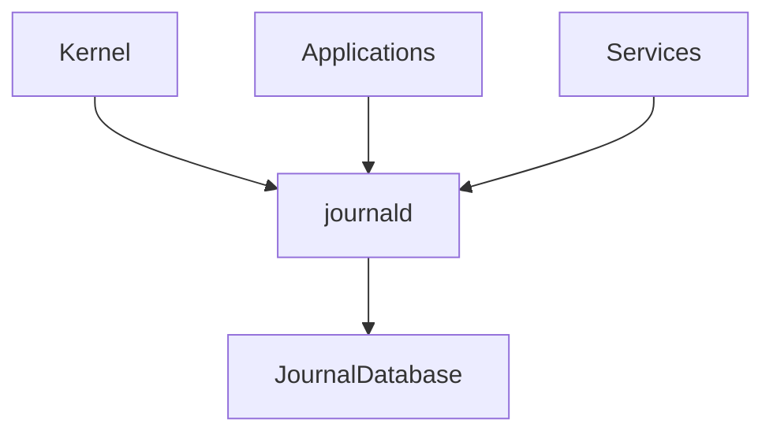
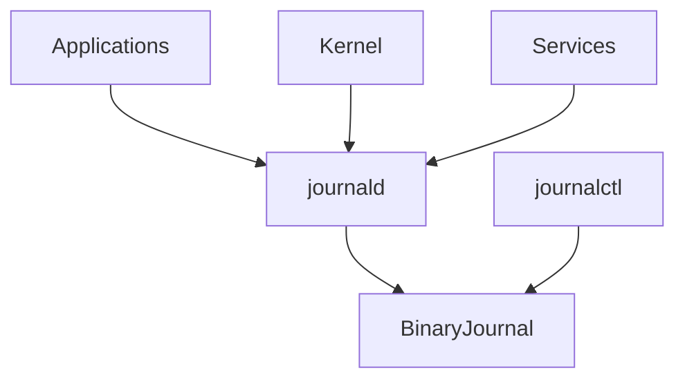
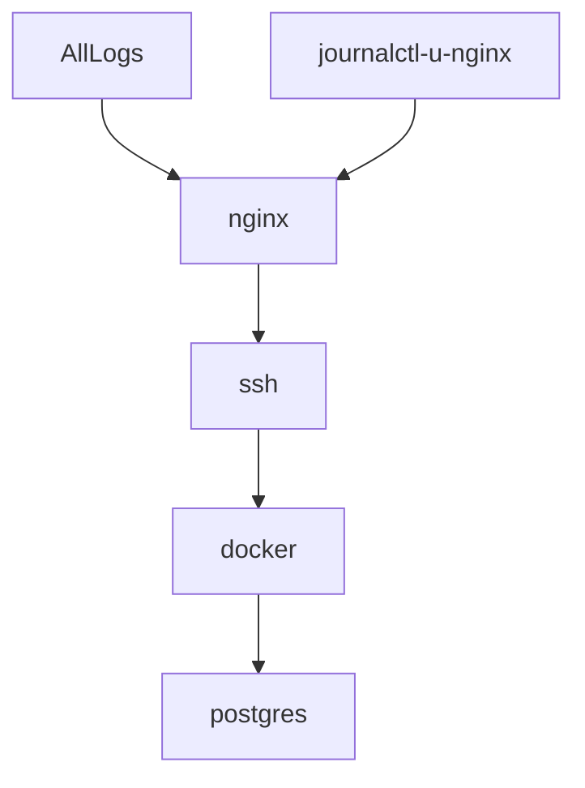
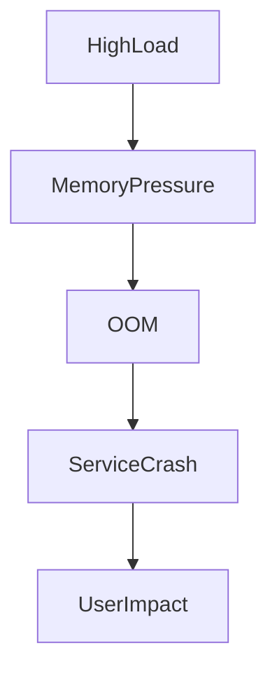
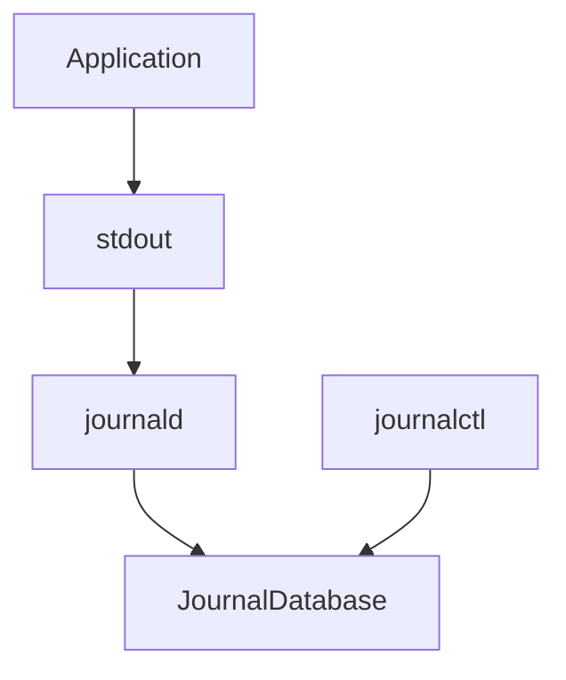

# Lab 03 — journalctl Analysis: Learning to Think Like a Linux Incident Investigator

> Linux Fundamentals Mastery
>
> Service Management Labs Series
>
> Track:
>
> Linux Operations → Logging → Troubleshooting → SRE Engineering
>
> Lab Goal:
>
> Understand how Linux logging works, how systemd's journal operates internally, how production engineers investigate incidents using logs, and how to build a systematic methodology for debugging Linux systems.

---

# Why This Lab Exists

When production systems fail, engineers rarely begin with:

```text
CPU

Memory

Network

Storage
```

Instead they ask:

```text
What Happened?
```

And the answer is usually hidden inside:

```text
Logs
```

Logs are the closest thing Linux has to:

```text
A Black Box Flight Recorder
```

Without logs:

```text
Troubleshooting Becomes Guesswork
```

With logs:

```text
Failures Become Investigations
```

---

# The Most Important Lesson

Junior engineers restart services.

Senior engineers read logs.

SREs read logs before touching anything.

Why?

Because restarting destroys evidence.

---

Imagine:

```text
Database Failed

↓

Engineer Restarts Service

↓

Error Disappears
```

The root cause may be gone forever.

Always investigate first.

---

# The Fundamental Question

Suppose:

```text
Website Down
```

How do you answer:

```text
Why?
```

Possibilities:

```text
Application Crash

Disk Full

Memory Exhaustion

Network Failure

Permission Problem

Configuration Error
```

Logs reveal which one occurred.

---

# Mental Model

Imagine a security camera system.

Every event is recorded:

```text
Door Opened

Door Closed

Alarm Triggered

Person Entered
```

Later investigators review footage.

Linux logging works the same way.

```text
System Event

↓

Recorded

↓

Investigated Later
```

---

# Before systemd

Historically Linux used:

```text
syslog
```

Architecture:

```text
Applications

↓

Text Files

↓

/var/log
```

Common logs:

```text
/var/log/messages

/var/log/syslog

/var/log/auth.log
```

---

# Problems With Traditional Logs

Difficult to:

```text
Search

Filter

Correlate

Analyze
```

Logs scattered everywhere.

Troubleshooting was painful.

---

# systemd Journal

Modern Linux introduced:

```text
systemd-journald
```

which collects logs centrally.

Architecture:



Everything flows into one system.

---

# What Is journalctl?

journalctl is:

```text
The Query Engine

For Linux System Logs
```

Think of it as:

```text
Google Search

For Linux Events
```

---

# Why journalctl Matters

Almost every production investigation begins with:

```bash
journalctl
```

Examples:

```text
Service Crashed

System Rebooted

Disk Failed

Authentication Error

OOM Event

Network Problem
```

Logs reveal the story.

---

# Understanding The Journal

Unlike traditional text files:

```text
journalctl

↓

Structured Logging
```

Each entry contains metadata.

Example:

```text
Timestamp

Service

PID

Priority

Message
```

This makes searching far easier.

---

# Architecture Overview



---

# Viewing Logs

Display all logs:

```bash
journalctl
```

Output can be massive.

Thousands or millions of entries.

---

# Why Filtering Matters

Nobody investigates:

```text
Entire System History
```

Instead:

```text
Relevant Events
```

must be isolated.

---

# Viewing Recent Logs

Show latest entries:

```bash
journalctl -n 50
```

Meaning:

```text
Last 50 Log Entries
```

Useful during incidents.

---

# Live Log Monitoring

Equivalent to:

```bash
tail -f
```

Use:

```bash
journalctl -f
```

Observe events in real time.

---

# Service-Specific Investigation

Most common workflow.

Investigate nginx:

```bash
journalctl -u nginx
```

Meaning:

```text
Show Logs

For nginx.service
```

---

# Why This Is Powerful

Instead of:

```text
Entire System
```

you see:

```text
Only Relevant Service
```

Massive noise reduction.

---

# Visual Example



---

# Recent Service Logs

Show latest events:

```bash
journalctl -u nginx -n 20
```

Useful during:

```text
Startup Failure

Unexpected Restart

Configuration Problems
```

---

# Following Service Logs

Live monitoring:

```bash
journalctl -fu nginx
```

Equivalent to:

```text
Real-Time Service Monitoring
```

---

# Time-Based Analysis

One of journalctl's greatest strengths.

---

# Logs Since Today

```bash
journalctl --since today
```

---

# Logs Since Yesterday

```bash
journalctl --since yesterday
```

---

# Specific Time Range

```bash
journalctl --since "2026-06-01 10:00:00"
```

---

# Example Investigation

User reports:

```text
Website Failed

At 2 PM
```

Engineer:

```bash
journalctl --since "1:55 PM"
```

Searches around failure time.

---

# Timeline Analysis

```mermaid
timeline

title Incident Timeline

1:55 PM : Healthy

1:58 PM : Warning

2:00 PM : Failure

2:01 PM : Restart

2:02 PM : Recovery
```

Logs reveal the timeline.

---

# Priority Levels

Every log entry has severity.

Levels:

| Priority | Meaning          |
| -------- | ---------------- |
| emerg    | System unusable  |
| alert    | Immediate action |
| crit     | Critical         |
| err      | Error            |
| warning  | Warning          |
| notice   | Significant      |
| info     | Informational    |
| debug    | Debugging        |

---

# Viewing Errors Only

```bash
journalctl -p err
```

Shows:

```text
Error-Level Events
```

Very useful.

---

# Viewing Warnings And Above

```bash
journalctl -p warning
```

Often reveals issues quickly.

---

# Boot Analysis

One of the most powerful features.

Linux records logs per boot.

Display boot history:

```bash
journalctl --list-boots
```

Example:

```text
Boot -2

Boot -1

Boot 0
```

---

# Investigating Previous Boot

```bash
journalctl -b -1
```

Meaning:

```text
Logs From Previous Boot
```

Critical after crashes.

---

# Why Boot Logs Matter

Suppose:

```text
Server Rebooted Overnight
```

Question:

```text
Why?
```

Investigate:

```bash
journalctl -b -1
```

Often reveals the answer.

---

# Kernel Logs

Display kernel events:

```bash
journalctl -k
```

Equivalent to:

```text
Modern dmesg
```

---

# Typical Kernel Events

```text
Hardware Detection

Disk Errors

Driver Failures

Memory Events

Network Problems
```

Kernel logs are extremely valuable.

---

# Example

Disk begins failing:

```text
I/O Error

Sector Failure

Read Failure
```

Kernel logs reveal it first.

---

# Authentication Investigation

Security engineers constantly use:

```bash
journalctl -u ssh
```

or

```bash
journalctl _COMM=sshd
```

to investigate:

```text
Failed Logins

Brute Force Attempts

Authentication Errors
```

---

# OOM Investigation

One of the most important production scenarios.

System becomes unstable.

Investigate:

```bash
journalctl -k | grep -i oom
```

Example:

```text
Out Of Memory

Killed Process
```

Root cause identified.

---

# Production Scenario 1

## Nginx Refuses To Start

Symptoms:

```text
Website Down
```

Investigation:

```bash
systemctl status nginx
```

Shows:

```text
Failed
```

Next:

```bash
journalctl -u nginx
```

Output:

```text
Configuration Error
```

Problem solved.

---

# Production Scenario 2

## Docker Failure

Investigation:

```bash
journalctl -u docker
```

Observe:

```text
Storage Driver Error

Permission Issue

Container Runtime Failure
```

Logs explain the failure.

---

# Production Scenario 3

## Unexpected Reboot

Investigation:

```bash
journalctl -b -1
```

Find:

```text
Kernel Panic

OOM Event

Power Failure
```

---

# Production Scenario 4

## Kubernetes Node Not Ready

Investigate:

```bash
journalctl -u kubelet
```

Observe:

```text
Certificate Errors

Network Failures

Container Runtime Problems
```

Common troubleshooting workflow.

---

# Understanding Correlation

Elite engineers correlate:

```text
Time

Logs

Metrics

Events
```

not individual messages.

---

# Example

```text
14:00 CPU Spike

14:01 Memory Pressure

14:02 OOM Kill

14:03 Application Crash
```

Logs reveal causal chains.

---

# Visualization



A single log line rarely tells the whole story.

---

# Linux Internals

Applications write:

```text
stdout

stderr
```

systemd captures them.

---

# Logging Flow



This is how logs reach the journal.

---

# Storage Considerations

Logs consume storage.

Check usage:

```bash
journalctl --disk-usage
```

Example:

```text
1.2G Journal Usage
```

---

# Cleaning Old Logs

Vacuum old entries:

```bash
sudo journalctl --vacuum-time=7d
```

Keep:

```text
Last 7 Days
```

---

# Observability Connection

Logs are one pillar of observability.

The three pillars:

```text
Metrics

Logs

Traces
```

Modern SRE practices combine all three.

---

# Logs vs Metrics

Metrics answer:

```text
What Happened?
```

Example:

```text
CPU = 95%
```

Logs answer:

```text
Why?
```

Example:

```text
Process Started Infinite Loop
```

---

# What The Kernel Is Thinking

System event occurs.

Kernel or application says:

```text
Something Happened
```

journald asks:

```text
Record It?
```

Answer:

```text
Yes
```

Event stored.

Future investigators can analyze it.

---

# Universal Investigation Workflow

Step 1

Check service:

```bash
systemctl status SERVICE
```

---

Step 2

Read logs:

```bash
journalctl -u SERVICE
```

---

Step 3

Identify failure time.

---

Step 4

Analyze events before failure.

---

Step 5

Correlate related logs.

---

Step 6

Determine root cause.

---

# Common Mistakes

## Mistake 1

Restarting before reading logs.

---

## Mistake 2

Reading entire journal.

Filter aggressively.

---

## Mistake 3

Ignoring timestamps.

---

## Mistake 4

Looking for one magic error.

Failures are often chains of events.

---

## Mistake 5

Ignoring kernel logs.

Many incidents originate there.

---

# Engineering Mindset

Junior Engineer:

```text
Application Failed
```

---

Linux Administrator:

```text
What Error Appears?
```

---

Infrastructure Engineer:

```text
What Happened Before The Error?
```

---

SRE:

```text
What Sequence Of Events Produced The Failure?
```

---

System Architect:

```text
How Can Similar Failures Be Prevented Automatically?
```

Logs are evidence.

Engineering is investigation.

---

# Interview Questions

### Beginner

What is journalctl?

### Beginner

What problem does journald solve?

### Intermediate

How do you view logs for a service?

### Intermediate

How do you investigate a previous boot?

### Intermediate

How do you filter logs by time?

### Advanced

How would you investigate a service crash?

### Advanced

How would you investigate an unexpected reboot?

### Advanced

Explain journald architecture.

### Advanced

How does journalctl relate to observability?

### Advanced

Design a production troubleshooting workflow using logs.

---

# Cheat Sheet

All logs:

```bash
journalctl
```

Recent logs:

```bash
journalctl -n 50
```

Follow logs:

```bash
journalctl -f
```

Service logs:

```bash
journalctl -u nginx
```

Live service logs:

```bash
journalctl -fu nginx
```

Errors only:

```bash
journalctl -p err
```

Current boot:

```bash
journalctl -b
```

Previous boot:

```bash
journalctl -b -1
```

Kernel logs:

```bash
journalctl -k
```

Disk usage:

```bash
journalctl --disk-usage
```

---

# Lab Success Criteria

You should now be able to:

* Understand journald architecture
* Use journalctl effectively
* Investigate service failures
* Investigate system crashes
* Analyze previous boots
* Filter logs by time and severity
* Investigate kernel events
* Build incident timelines
* Connect logs to observability
* Think like an SRE during outages

At this point, you should stop viewing logs as:

```text
Random Text Messages
```

and start viewing them as:

```text
A Historical Record

Of Every Important Event

That Happened Inside The System
```

Because for production engineers:

```text
Logs Are Evidence

And Troubleshooting Is Investigation
```
