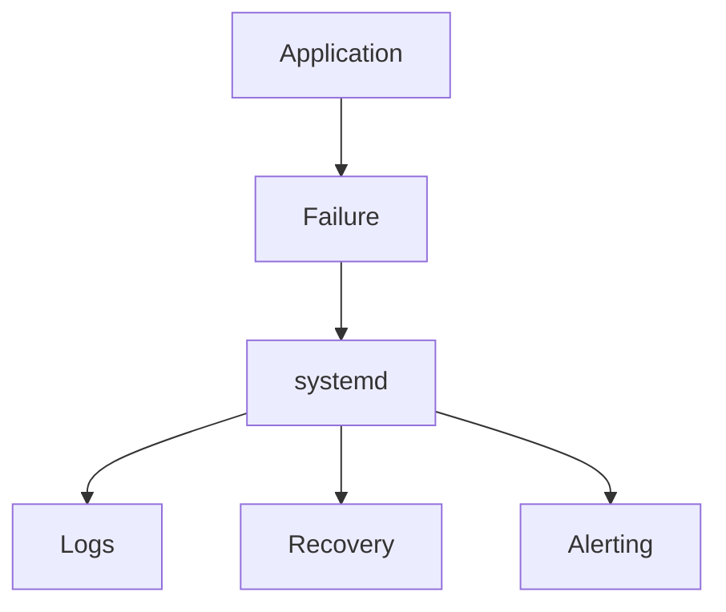
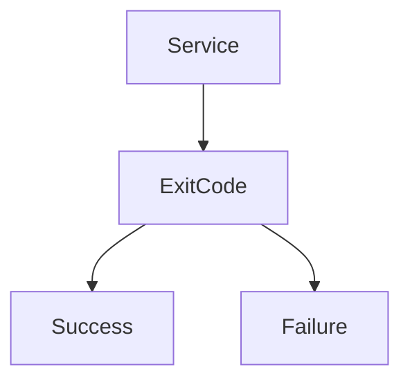
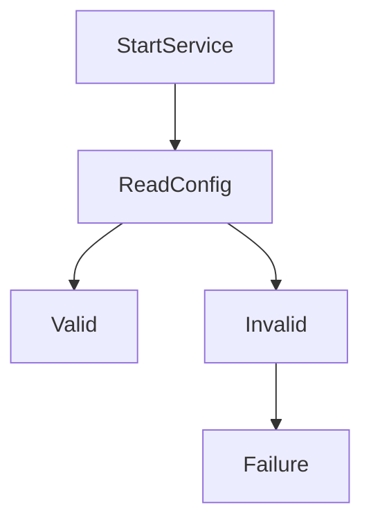
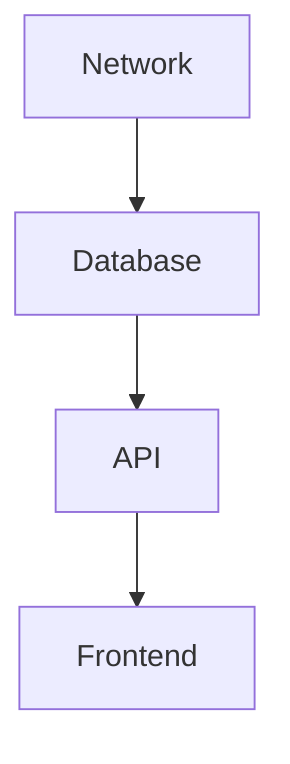
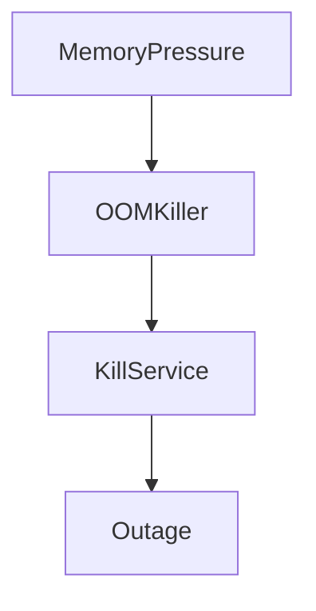
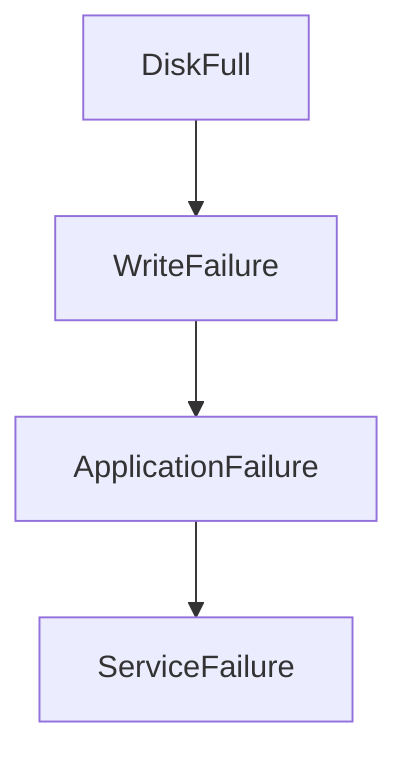
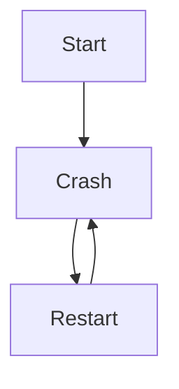
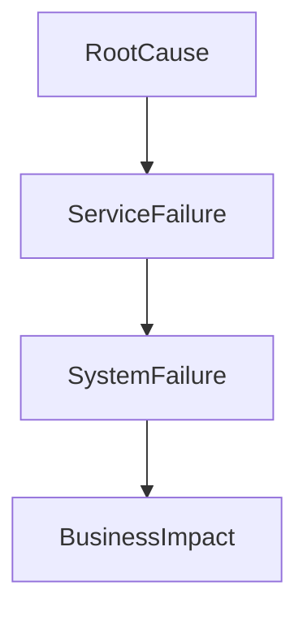
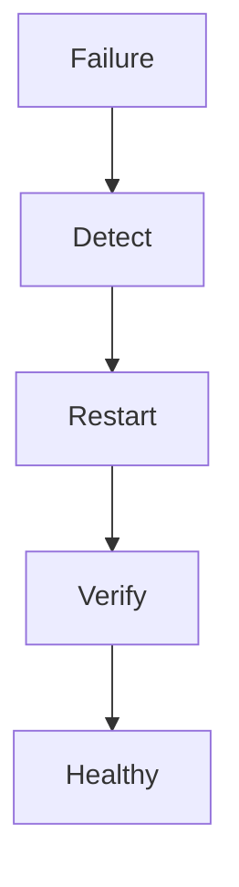

# Lab 04 — Service Failures: Learning How Production Systems Actually Break

> Linux Fundamentals Mastery
>
> Service Management Labs Series
>
> Track:
>
> Linux Operations → Service Reliability → Incident Response → SRE Engineering
>
> Lab Goal:
>
> Understand why services fail, how Linux detects failures, how systemd responds to failures, how engineers perform root-cause analysis, and how to systematically troubleshoot production outages.

---

# Why This Lab Exists

Most Linux tutorials teach:

```text
How To Start A Service
```

Production engineering is about:

```text
What Happens When The Service Fails?
```

Real systems fail constantly.

Examples:

```text
Configuration Errors

Memory Exhaustion

Disk Full

Permission Problems

Network Failures

Dependency Failures

Application Bugs
```

A production engineer's job is not:

```text
Running Services
```

It is:

```text
Recovering Services
```

---

# The Most Important Lesson

Every service eventually fails.

Not some services.

Not badly written services.

All services.

The question is:

```text
How Quickly

Can You Determine

Why It Failed?
```

This skill separates:

```text
System Users

From

Infrastructure Engineers
```

---

# The Universal Rule

Never begin with:

```bash
systemctl restart SERVICE
```

Begin with:

```bash
systemctl status SERVICE
```

Why?

Because restarting destroys evidence.

---

# The Fundamental Problem

Imagine:

```text
Website Down
```

Users report:

```text
502 Bad Gateway
```

Question:

```text
What Failed?
```

Possibilities:

```text
Application

Database

Load Balancer

Network

Storage

Authentication
```

Finding the answer is the purpose of incident investigation.

---

# Mental Model

Imagine a plane crash.

Investigators do not immediately:

```text
Build Another Plane
```

They first ask:

```text
Why Did It Crash?
```

Production incidents follow the same principle.

Failure without investigation guarantees future failures.

---

# Understanding Failure

A service failure means:

```text
Expected Behavior

≠

Actual Behavior
```

Examples:

```text
Service Stopped

Service Crashed

Service Hung

Service Restarting

Service Returning Errors
```

All are failure modes.

---

# Service Failure Architecture



Understanding this flow is critical.

---

# How Linux Detects Failure

Applications exit with:

```text
Exit Codes
```

Success:

```text
0
```

Failure:

```text
Non-Zero
```

Examples:

```text
1

2

127

255
```

systemd uses these codes to determine service health.

---

# Visualizing Exit Status



---

# First Investigation Rule

Always start with:

```bash
systemctl status SERVICE
```

Example:

```bash
systemctl status nginx
```

This immediately reveals:

```text
Running?

Failed?

PID?

Exit Code?

Recent Errors?
```

---

# Anatomy of systemctl Status

Example:

```text
● nginx.service

Loaded: loaded

Active: failed

Main PID: 1234

Exit Code: 1
```

This single output often identifies the problem.

---

# Understanding Service States

| State        | Meaning          |
| ------------ | ---------------- |
| active       | Running normally |
| inactive     | Not running      |
| failed       | Failure detected |
| activating   | Starting         |
| deactivating | Stopping         |

---

# The Five Most Common Failure Categories

Nearly every production incident belongs to one of these categories:

```text
Configuration

Dependencies

Resources

Permissions

Application Bugs
```

Master these categories.

Master troubleshooting.

---

# Failure Category 1 — Configuration Errors

Most common failure.

Example:

```text
Nginx Configuration Error
```

Service startup:

```text
Configuration Parsed

↓

Syntax Error

↓

Startup Aborted
```

---

# Visualization



---

# Investigation

Check:

```bash
systemctl status nginx
```

Then:

```bash
journalctl -u nginx
```

Common output:

```text
Syntax Error

Invalid Directive

Unknown Option
```

---

# Real Example

Broken nginx config:

```nginx
server {
listen 80
}
```

Missing semicolon.

Result:

```text
Service Fails
```

Simple issue.

Large outage.

---

# Failure Category 2 — Dependency Failures

Services rarely operate alone.

Example:

```text
Application

↓

Database

↓

Network
```

If database fails:

```text
Application Fails
```

---

# Dependency Visualization



Failure propagates.

---

# Example

Database unavailable.

Application startup:

```text
Connection Refused
```

systemd reports:

```text
Failed
```

Root cause:

```text
Dependency Failure
```

---

# Failure Category 3 — Memory Exhaustion

One of the most dangerous production issues.

Symptoms:

```text
Service Randomly Dies
```

Investigation:

```bash
journalctl -k
```

Output:

```text
Out Of Memory

Killed Process
```

---

# OOM Architecture



---

# Why OOM Is Dangerous

Service appears:

```text
Healthy
```

Then suddenly:

```text
Killed By Kernel
```

No application bug required.

---

# Failure Category 4 — Disk Full

Common enterprise outage.

Symptoms:

```text
Application Cannot Write
```

Check:

```bash
df -h
```

Output:

```text
100% Used
```

---

# Failure Flow



---

# Common Victims

```text
Databases

Logging Systems

Containers

Message Queues
```

Storage failures cascade quickly.

---

# Failure Category 5 — Permission Errors

Service lacks required access.

Examples:

```text
File Access Denied

Port Binding Denied

Certificate Access Denied
```

---

# Investigation

Logs often show:

```text
Permission Denied
```

Immediate clue.

---

# Linux Internals

Remember:

```text
Service

=

Process
```

The kernel only knows:

```text
Processes
```

systemd adds:

```text
Monitoring

Recovery

State Tracking
```

---

# Understanding Crash Loops

One of the most common production patterns.

```text
Start

↓

Crash

↓

Restart

↓

Crash

↓

Restart
```

Repeated indefinitely.

---

# Crash Loop Visualization



---

# Symptoms

Check:

```bash
systemctl status SERVICE
```

Observe:

```text
Restarting

Restarting

Restarting
```

Classic crash loop.

---

# Why Crash Loops Happen

Common causes:

```text
Bad Configuration

Missing Dependency

Application Bug

Port Conflict
```

---

# Understanding Port Conflicts

Example:

```text
Nginx Wants Port 80
```

Another process already owns it.

Result:

```text
Address Already In Use
```

Service startup fails.

---

# Investigation

Check:

```bash
ss -tulpn
```

Find:

```text
Who Owns Port?
```

Common interview topic.

---

# Service Startup Timeout

Another failure mode.

Example:

```text
Database Takes 5 Minutes

Service Timeout = 1 Minute
```

Result:

```text
systemd Marks Failure
```

Even though startup might eventually succeed.

---

# Service Hangs

Different from crashing.

Example:

```text
Process Exists

But Does Nothing
```

Users see:

```text
Timeouts
```

Service appears:

```text
Running
```

Dangerous scenario.

---

# Crash vs Hang

Crash:

```text
Process Gone
```

Hang:

```text
Process Alive

No Progress
```

Different investigations required.

---

# Production Scenario 1

## Nginx Failure

Symptoms:

```text
Website Down
```

Investigation:

```bash
systemctl status nginx
```

Output:

```text
Configuration Error
```

Root cause identified within seconds.

---

# Production Scenario 2

## PostgreSQL Won't Start

Status:

```text
Failed
```

Logs:

```text
Disk Full
```

Root cause:

```text
Storage Exhaustion
```

Not database corruption.

---

# Production Scenario 3

## Kubernetes Node Not Ready

Check:

```bash
systemctl status kubelet
```

Logs:

```text
Container Runtime Unavailable
```

Root cause:

```text
containerd Failure
```

Dependency issue.

---

# Production Scenario 4

## Docker Service Dead

Investigation:

```bash
journalctl -u docker
```

Shows:

```text
Storage Driver Error
```

Root cause isolated quickly.

---

# Universal Service Failure Workflow

This workflow should become muscle memory.

---

## Step 1

Check status.

```bash
systemctl status SERVICE
```

---

## Step 2

Read logs.

```bash
journalctl -u SERVICE
```

---

## Step 3

Check dependencies.

```bash
systemctl list-dependencies SERVICE
```

---

## Step 4

Check resources.

```bash
free -h
df -h
```

---

## Step 5

Check ports.

```bash
ss -tulpn
```

---

## Step 6

Check kernel events.

```bash
journalctl -k
```

---

## Step 7

Identify root cause.

Never stop at symptoms.

---

# Root Cause Thinking

Bad engineer:

```text
Restart Service

Move On
```

Good engineer:

```text
Find Cause

Prevent Recurrence
```

---

# Failure Chain Analysis

Most outages are chains.

Example:

```text
Disk Full

↓

Logging Failure

↓

Application Failure

↓

API Failure

↓

Customer Impact
```

Understanding chains is critical.

---

# Visualization



---

# Service Recovery Architecture

Modern systems use:

```text
Detection

Recovery

Alerting
```

---

# Recovery Flow



This is the foundation of reliability engineering.

---

# Docker Connection

Docker daemon:

```text
docker.service
```

Service failure means:

```text
Containers Unavailable
```

Infrastructure depends on service health.

---

# Kubernetes Connection

Critical services:

```text
kubelet

containerd

etcd
```

Failures propagate across clusters.

Understanding service failures is mandatory for Kubernetes engineers.

---

# Cloud Connection

Most cloud outages ultimately involve:

```text
Failed Services

Failed Dependencies

Resource Exhaustion
```

Cloud platforms are collections of services.

---

# What The Kernel Is Thinking

Application exits.

Kernel records:

```text
Process Ended
```

systemd asks:

```text
Expected?

Unexpected?
```

If unexpected:

```text
Mark Failed

Collect Logs

Attempt Recovery
```

---

# Common Mistakes

## Mistake 1

Restarting before investigation.

---

## Mistake 2

Ignoring logs.

---

## Mistake 3

Treating symptoms.

---

## Mistake 4

Ignoring dependencies.

---

## Mistake 5

Assuming service failure equals application bug.

Many failures originate elsewhere.

---

# Engineering Mindset

Beginner:

```text
Service Failed
```

Linux Administrator:

```text
What Error Appears?
```

Infrastructure Engineer:

```text
What Dependency Failed?
```

SRE:

```text
What Was The Root Cause?
```

System Architect:

```text
How Can This Failure Become Impossible?
```

That progression is engineering maturity.

---

# Interview Questions

### Beginner

What does a failed service mean?

### Beginner

How do you investigate a failed service?

### Intermediate

What is a crash loop?

### Intermediate

Difference between crash and hang?

### Intermediate

What causes dependency failures?

### Advanced

How does systemd detect failures?

### Advanced

How would you diagnose a service repeatedly restarting?

### Advanced

How would you investigate an OOM-related outage?

### Advanced

Design a production incident workflow.

### Advanced

Explain root cause analysis for service failures.

---

# Cheat Sheet

Service status:

```bash
systemctl status SERVICE
```

Logs:

```bash
journalctl -u SERVICE
```

Kernel events:

```bash
journalctl -k
```

Memory:

```bash
free -h
```

Storage:

```bash
df -h
```

Ports:

```bash
ss -tulpn
```

Dependencies:

```bash
systemctl list-dependencies SERVICE
```

Processes:

```bash
ps aux
```

---

# Lab Success Criteria

You should now be able to:

* Understand why services fail
* Categorize failure types
* Investigate service crashes
* Diagnose dependency issues
* Investigate OOM events
* Investigate disk-full incidents
* Analyze crash loops
* Perform root-cause analysis
* Build incident investigation workflows
* Think like an SRE during outages

At this point, you should stop asking:

```text
How Do I Restart The Service?
```

and start asking:

```text
Why Did The Service Fail

What Evidence Exists

What Was The Root Cause

And How Do We Ensure

It Never Happens Again?
```

Because reliability engineering begins where restarting ends.
