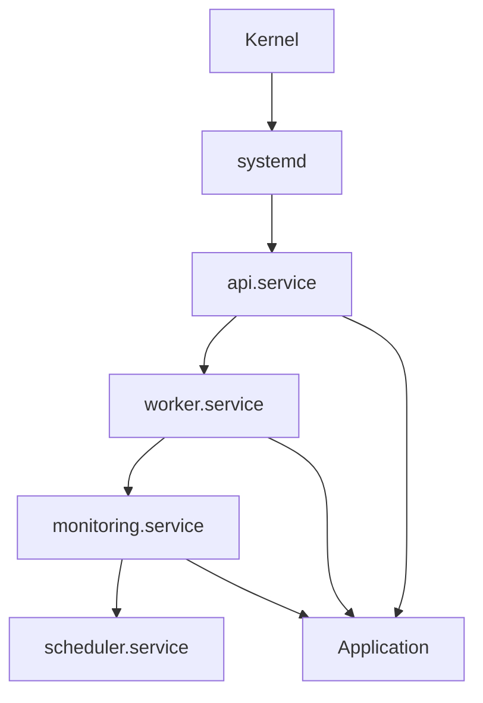
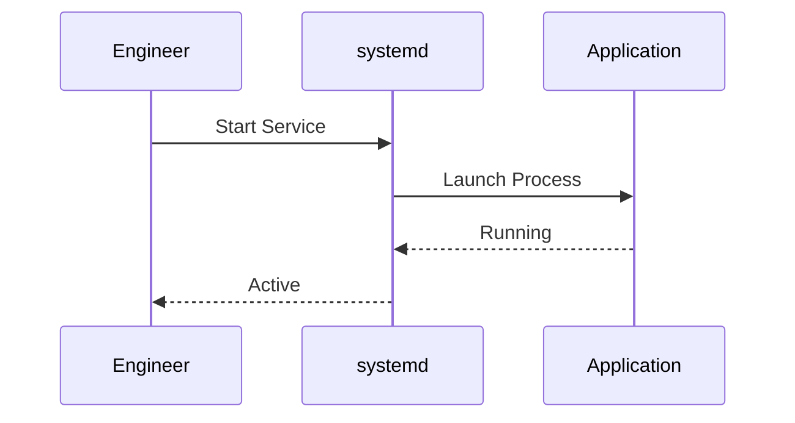
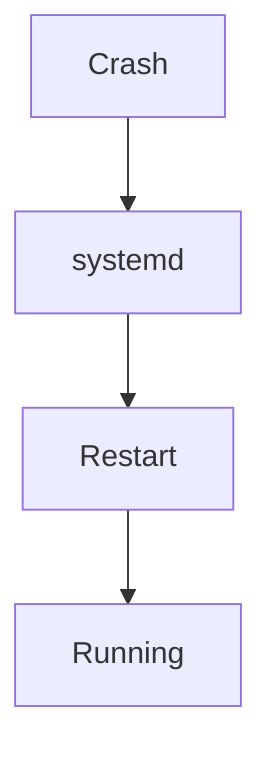
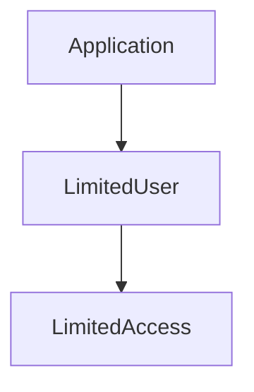
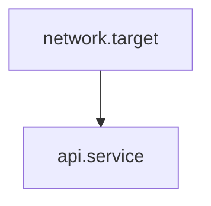
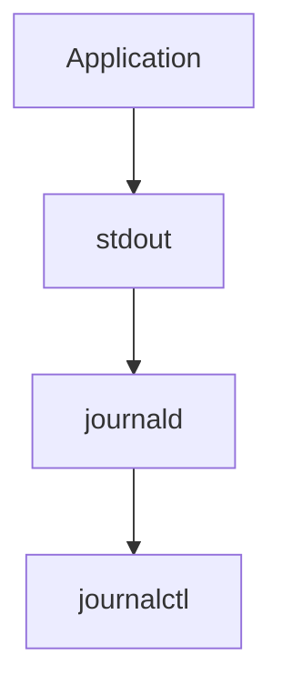
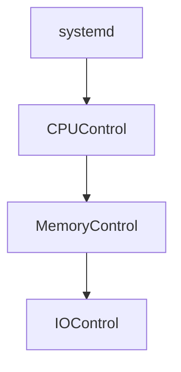
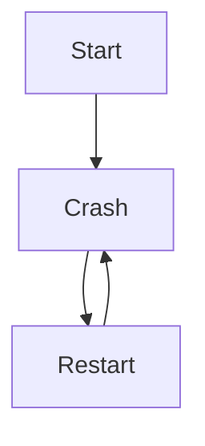

# Lab 05 — Custom Services: Building Production-Grade systemd Services

> Linux Fundamentals Mastery
>
> Service Management Labs Series
>
> Track:
>
> Linux Operations → Service Engineering → Platform Engineering → Infrastructure Architecture
>
> Lab Goal:
>
> Learn how to create custom systemd services, understand how service units work internally, build production-grade services, implement automatic recovery, manage dependencies, apply security hardening, and think like a platform engineer designing reliable Linux applications.

---

# Why This Lab Exists

Most engineers know how to:

```bash
node app.js
```

or

```bash
python app.py
```

But production systems don't run applications this way.

Real infrastructure requires:

```text
Automatic Startup

Automatic Recovery

Dependency Management

Logging

Resource Limits

Security Controls

Observability
```

This is why custom services exist.

---

# The Most Important Lesson

A process is:

```text
Something Running
```

A service is:

```text
Something Managed
```

That difference is the foundation of modern infrastructure engineering.

---

# The Fundamental Problem

Imagine:

```bash
python api.py
```

The API starts.

Looks healthy.

Then:

```text
SSH Session Closed
```

Application dies.

Or:

```text
Server Reboots
```

Application disappears.

Or:

```text
Application Crashes
```

Nobody notices.

This is not production engineering.

---

# Mental Model

Think of a restaurant.

Without management:

```text
Employees Arrive Randomly

No Monitoring

No Scheduling

No Recovery
```

Chaos.

With management:

```text
Scheduled Start

Defined Responsibilities

Monitoring

Recovery Procedures
```

A systemd service is management for processes.

---

# What Is A Custom Service?

A custom service is:

```text
A User-Defined systemd Unit

That Manages An Application
```

Examples:

```text
Internal API

Microservice

Worker Process

Data Pipeline

Monitoring Agent

Automation Tool
```

---

# Why Custom Services Matter

Every modern platform runs:

```text
Custom Services
```

Examples:

```text
Netflix

Uber

Spotify

OpenAI

Cloud Providers
```

Thousands of services managed by orchestration systems.

systemd is Linux's local orchestrator.

---

# Architecture Overview



---

# Understanding Service Units

systemd manages:

```text
Units
```

The most common unit:

```text
.service
```

Example:

```text
my-api.service
```

Unit files define:

```text
How To Start

How To Stop

How To Recover

Dependencies

Security Settings
```

---

# Unit File Mental Model

Think of a service file as:

```text
A Contract

Between

systemd

And

Your Application
```

It tells systemd everything it needs to know.

---

# Service File Location

Most custom services live in:

```bash
/etc/systemd/system/
```

Example:

```bash
/etc/systemd/system/my-api.service
```

---

# Visualizing Service Storage

```text
/etc/systemd/system

├── nginx.service
├── docker.service
├── my-api.service
└── worker.service
```

---

# Anatomy Of A Service File

Basic example:

```ini
[Unit]
Description=My API Service

[Service]
ExecStart=/usr/bin/python3 /opt/api/app.py

[Install]
WantedBy=multi-user.target
```

Three sections.

Simple.

Powerful.

---

# Understanding [Unit]

Defines metadata.

Example:

```ini
[Unit]
Description=Inventory API
Documentation=https://internal-docs
```

Purpose:

```text
Identity

Relationships

Dependencies
```

---

# Understanding [Service]

The heart of the service.

Defines:

```text
Startup Command

User

Restart Policy

Resource Limits

Security Controls
```

---

# Understanding [Install]

Defines:

```text
When Service Starts
```

Example:

```ini
WantedBy=multi-user.target
```

Meaning:

```text
Start During Normal Boot
```

---

# Service Lifecycle


Understanding lifecycle is critical.

---

# Lab 1 — Create Your First Service

Create application:

```bash
mkdir ~/lab-service
cd ~/lab-service
```

Create file:

```python
# app.py

import time

while True:
    print("Linux Fundamentals Mastery")
    time.sleep(10)
```

---

# Create Service File

```bash
sudo nano /etc/systemd/system/lab.service
```

---

Content:

```ini
[Unit]
Description=Linux Lab Service

[Service]
ExecStart=/usr/bin/python3 /home/user/lab-service/app.py

[Install]
WantedBy=multi-user.target
```

---

# Reload systemd

Whenever service files change:

```bash
sudo systemctl daemon-reload
```

Think:

```text
Reload Service Definitions
```

---

# Start Service

```bash
sudo systemctl start lab
```

Verify:

```bash
systemctl status lab
```

---

# Service Startup Flow



---

# Lab 2 — Enable Boot Startup

Enable:

```bash
sudo systemctl enable lab
```

Verify:

```bash
systemctl is-enabled lab
```

Output:

```text
enabled
```

---

# Why Enable Matters

Without enable:

```text
Service Runs

Until Reboot
```

After reboot:

```text
Gone
```

Enable creates persistence.

---

# Lab 3 — Automatic Restart

One of the most important production features.

Modify service:

```ini
[Service]
ExecStart=/usr/bin/python3 /home/user/lab-service/app.py

Restart=always
RestartSec=5
```

---

# What Happens?

Application crashes:

```text
Process Dies
```

systemd:

```text
Wait 5 Seconds

↓

Restart
```

---

# Recovery Visualization



This is the foundation of self-healing infrastructure.

---

# Restart Policies

| Option      | Behavior              |
| ----------- | --------------------- |
| no          | Never restart         |
| always      | Always restart        |
| on-failure  | Restart on failure    |
| on-abnormal | Restart on crash      |
| on-success  | Restart after success |

---

# Production Recommendation

Most backend services:

```ini
Restart=on-failure
```

Safer than:

```ini
Restart=always
```

---

# Lab 4 — Run As Dedicated User

Never run production applications as root.

Create user:

```bash
sudo useradd -r myapp
```

Service:

```ini
[Service]
User=myapp
Group=myapp
```

---

# Why This Matters

If application compromised:

```text
Attacker

↓

Limited Permissions
```

Instead of:

```text
Full Root Access
```

Huge security improvement.

---

# Security Visualization



---

# Lab 5 — Environment Variables

Production applications require configuration.

Example:

```ini
Environment=PORT=8080
Environment=ENV=production
```

Application reads:

```bash
PORT=8080
```

without hardcoding values.

---

# Better Approach

Use:

```ini
EnvironmentFile=/etc/myapp.env
```

Example:

```bash
PORT=8080
DATABASE_URL=postgres://...
```

Cleaner management.

---

# Lab 6 — Service Dependencies

Real services require dependencies.

Example:

```ini
[Unit]
After=network.target

Requires=network.target
```

Meaning:

```text
Network First

Application Second
```

---

# Dependency Visualization



---

# Why Dependencies Matter

Without dependency control:

```text
API Starts

↓

Network Missing

↓

Failure
```

Common production issue.

---

# Lab 7 — Logging

Applications automatically write:

```text
stdout

stderr
```

systemd captures them.

View:

```bash
journalctl -u lab
```

---

# Logging Flow



No log files required.

---

# Lab 8 — Resource Limits

Prevent runaway applications.

Example:

```ini
MemoryMax=512M

CPUQuota=50%
```

---

# Why Resource Limits Exist

Buggy application:

```text
Consumes Entire Server
```

Resource limits prevent this.

---

# Resource Isolation



This technology later evolved into containers.

---

# Lab 9 — Working Directory

Applications often require:

```text
Config Files

Templates

Assets
```

Specify:

```ini
WorkingDirectory=/opt/myapp
```

---

# Lab 10 — Health Validation

Example:

```ini
Restart=on-failure

StartLimitBurst=5

StartLimitIntervalSec=60
```

Prevents:

```text
Infinite Restart Loops
```

---

# Crash Loop Problem

Without protection:

```text
Start

Crash

Restart

Crash

Restart
```

Forever.

---

# Crash Loop Visualization



---

# Linux Internals

When service starts:

```text
systemd

↓

fork()

↓

exec()

↓

Application
```

Kernel creates process.

systemd tracks lifecycle.

---

# Production Service Example

Node.js API:

```ini
[Unit]
Description=Inventory API
After=network.target

[Service]
User=inventory
WorkingDirectory=/opt/inventory

ExecStart=/usr/bin/node server.js

Restart=on-failure
RestartSec=5

Environment=NODE_ENV=production

MemoryMax=1G

[Install]
WantedBy=multi-user.target
```

This resembles real infrastructure.

---

# Production Scenario 1

## Internal API

Requirements:

```text
Auto Start

Auto Recovery

Logging

Security
```

Custom service provides all.

---

# Production Scenario 2

## Background Worker

Tasks:

```text
Process Jobs

Send Emails

Generate Reports
```

Run as service.

---

# Production Scenario 3

## Monitoring Agent

Collect:

```text
Metrics

Logs

Events
```

Run continuously.

Perfect service candidate.

---

# Docker Connection

Docker daemon itself is:

```text
docker.service
```

A custom service.

Your services use the same architecture.

---

# Kubernetes Connection

Kubernetes node agents:

```text
kubelet.service

containerd.service
```

are simply advanced systemd services.

---

# Containers vs Services

Many engineers miss this connection.

Container:

```text
Isolated Process
```

Service:

```text
Managed Process
```

Both depend on:

```text
Linux Processes
```

---

# Service Architecture Evolution

```text
Process

↓

Service

↓

Container

↓

Pod

↓

Cluster
```

Understanding services helps understand Kubernetes.

---

# Common Mistakes

## Mistake 1

Running applications as root.

---

## Mistake 2

No restart policy.

---

## Mistake 3

Ignoring logs.

---

## Mistake 4

No resource limits.

---

## Mistake 5

Hardcoding configuration.

---

## Mistake 6

Ignoring dependencies.

---

# Universal Service Design Checklist

Before production deployment ask:

```text
Can It Auto Start?

Can It Auto Recover?

Can It Log?

Can It Be Monitored?

Can It Run Without Root?

Can It Be Updated Safely?

Can It Survive Reboots?
```

If not:

```text
Not Production Ready
```

---

# Engineering Mindset

Beginner:

```text
How Do I Run My Application?
```

Linux User:

```text
How Do I Keep It Running?
```

Administrator:

```text
How Do I Manage It?
```

Infrastructure Engineer:

```text
How Do I Recover It Automatically?
```

Platform Engineer:

```text
How Do I Manage Thousands Of Services Consistently?
```

That progression leads directly to cloud-native engineering.

---

# Interview Questions

### Beginner

What is a custom service?

### Beginner

Where are service files stored?

### Intermediate

What does daemon-reload do?

### Intermediate

Difference between start and enable?

### Intermediate

What is Restart=on-failure?

### Advanced

Why should services avoid running as root?

### Advanced

How do service dependencies work?

### Advanced

How does systemd logging work?

### Advanced

How do resource limits improve reliability?

### Advanced

Design a production-ready systemd service for a Node.js API.

---

# Cheat Sheet

Reload units:

```bash
sudo systemctl daemon-reload
```

Start:

```bash
sudo systemctl start SERVICE
```

Stop:

```bash
sudo systemctl stop SERVICE
```

Restart:

```bash
sudo systemctl restart SERVICE
```

Enable:

```bash
sudo systemctl enable SERVICE
```

Status:

```bash
systemctl status SERVICE
```

Logs:

```bash
journalctl -u SERVICE
```

List services:

```bash
systemctl list-units --type=service
```

---

# Lab Success Criteria

You should now be able to:

* Create custom systemd services
* Understand service unit architecture
* Build production-ready service files
* Configure automatic recovery
* Configure dependencies
* Configure logging
* Configure security controls
* Configure resource limits
* Connect services to Docker and Kubernetes
* Think like a platform engineer

At this point, you should stop thinking:

```text
How Do I Run My Application?
```

and start thinking:

```text
How Do I Build

A Self-Healing

Observable

Secure

Recoverable

Production Service

That Can Run Reliably

For Years?
```

Because that is the mindset of modern infrastructure engineering.
