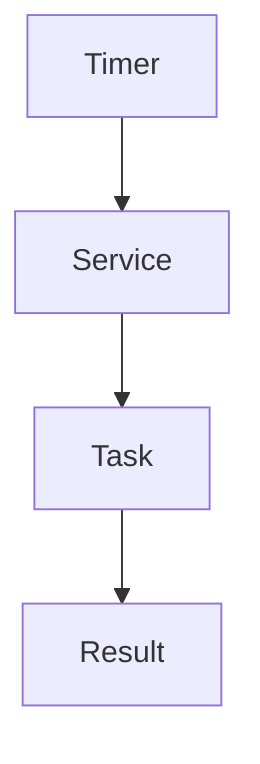
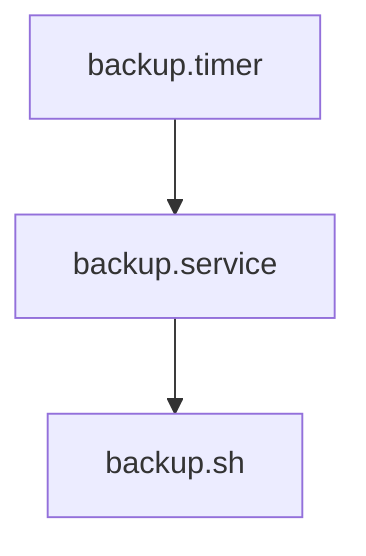
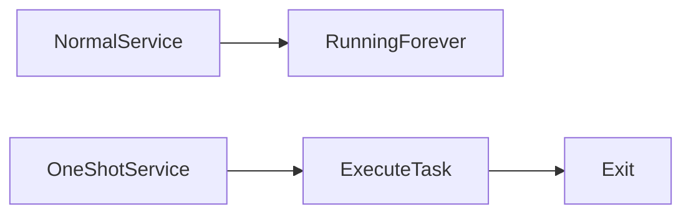
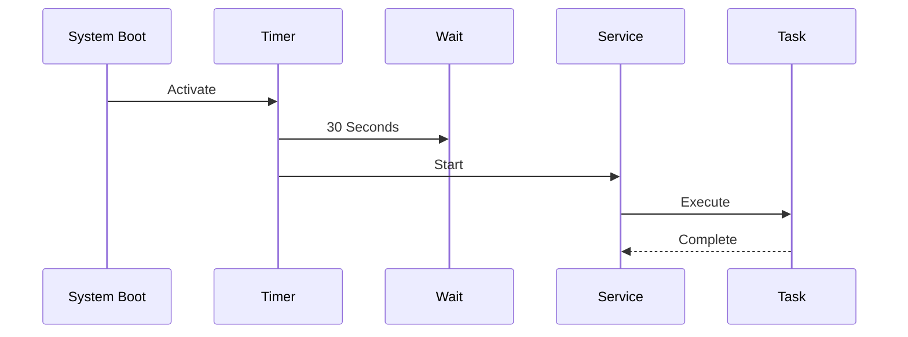
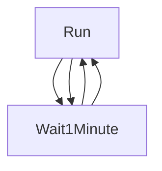
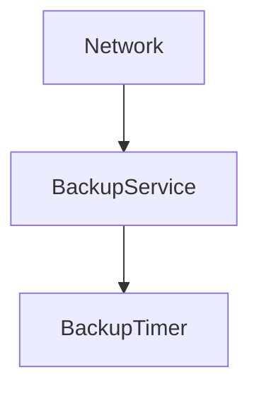
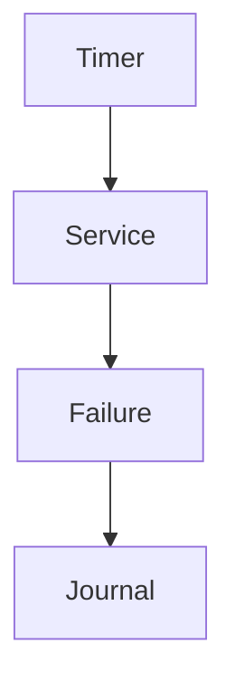

# Lab 06 — systemd Timers: Modern Scheduling Beyond Cron

> Linux Fundamentals Mastery
>
> Service Management Labs Series
>
> Track:
>
> Linux Automation → Service Management → Platform Engineering → SRE
>
> Lab Goal:
>
> Understand why systemd timers exist, how modern Linux schedules automated tasks, how timers differ from cron, how large-scale infrastructure automates maintenance operations, and how platform engineers build reliable scheduling systems.

---

# Why This Lab Exists

Most Linux users learn automation through:

```text
Cron Jobs
```

Example:

```bash
0 2 * * * backup.sh
```

For decades, cron was the standard scheduling mechanism.

However, modern Linux systems increasingly use:

```text
systemd Timers
```

because they provide:

* Better observability
* Better logging
* Better dependency management
* Better security
* Better reliability
* Better integration with system services

Understanding systemd timers is understanding how modern Linux automates work.

---

# The Most Important Lesson

A timer does not execute commands.

A timer:

```text
Schedules Services
```

This is the key mental shift.

Cron thinks:

```text
Run Command
```

systemd thinks:

```text
Start A Service
```

This design is significantly more powerful.

---

# The Fundamental Problem

Imagine:

```text
Daily Backups

Log Cleanup

Database Maintenance

Health Checks

Certificate Renewal
```

Question:

```text
Who Executes These Tasks?
```

Humans cannot manually perform thousands of recurring operations.

Automation is required.

---

# Mental Model

Think of a hospital.

Doctors:

```text
Services
```

Appointments:

```text
Timers
```

The appointment doesn't perform surgery.

It schedules:

```text
The Doctor
```

Similarly:

```text
Timer

↓

Starts Service

↓

Service Performs Work
```

---

# Evolution Of Scheduling

Traditional:

```text
Cron

↓

Command

↓

Execution
```

Modern:

```text
Timer

↓

Service

↓

Execution
```

---

# Architecture Overview



This architecture is central to modern Linux automation.

---

# Why Cron Was Not Enough

Cron has limitations:

```text
Poor Logging

Limited Monitoring

Weak Dependency Handling

No Service Integration

Minimal Security Controls
```

Large infrastructures needed better tools.

---

# Why systemd Timers Exist

systemd already manages:

```text
Services

Dependencies

Logging

Recovery
```

Instead of creating another scheduler:

```text
Schedule Services Directly
```

Elegant design.

---

# Comparing Cron And Timers

| Feature             | Cron    | systemd Timer |
| ------------------- | ------- | ------------- |
| Logging             | Limited | Excellent     |
| Service Integration | No      | Native        |
| Dependency Handling | Weak    | Strong        |
| Security Controls   | Limited | Extensive     |
| Monitoring          | Minimal | Excellent     |
| Resource Control    | No      | Yes           |

---

# Core Architecture

A timer always works with:

```text
Two Files
```

Example:

```text
backup.service

backup.timer
```

---

# Relationship Visualization



Timer triggers service.

Service performs work.

---

# Understanding Timer Files

Timer:

```text
When To Run
```

Service:

```text
What To Run
```

Simple but powerful separation.

---

# Lab 1 — Create First Scheduled Task

Create script:

```bash
mkdir ~/timer-lab
cd ~/timer-lab
```

---

Create:

```bash
nano hello.sh
```

Content:

```bash
#!/bin/bash

echo "Timer executed at $(date)"
```

---

Make executable:

```bash
chmod +x hello.sh
```

---

# Create Service

```bash
sudo nano /etc/systemd/system/hello.service
```

Content:

```ini
[Unit]
Description=Hello Timer Service

[Service]
Type=oneshot

ExecStart=/home/user/timer-lab/hello.sh
```

---

# Understanding Type=oneshot

Normal services:

```text
Start

↓

Run Forever
```

Timer services:

```text
Start

↓

Perform Task

↓

Exit
```

---

# Visual Comparison



---

# Create Timer

```bash
sudo nano /etc/systemd/system/hello.timer
```

Content:

```ini
[Unit]
Description=Hello Timer

[Timer]
OnBootSec=30

[Install]
WantedBy=timers.target
```

---

# Understanding OnBootSec

Meaning:

```text
Run 30 Seconds

After Boot
```

---

# Timer Startup Flow



---

# Reload Configuration

```bash
sudo systemctl daemon-reload
```

Required whenever timer files change.

---

# Enable Timer

```bash
sudo systemctl enable --now hello.timer
```

This:

```text
Enables

+

Starts
```

the timer.

---

# Verify Timer

```bash
systemctl list-timers
```

Example:

```text
NEXT

LEFT

LAST

PASSED

UNIT
```

This command is essential.

---

# Understanding list-timers

Think:

```text
Upcoming Scheduled Events
```

for Linux.

---

# Lab 2 — Run Every Minute

Timer:

```ini
[Timer]
OnUnitActiveSec=1min
```

Meaning:

```text
Run

1 Minute

After Last Execution
```

---

# Repeating Execution



---

# Timer Types

systemd supports multiple scheduling strategies.

---

# OnBootSec

Run after boot.

Example:

```ini
OnBootSec=5min
```

---

# OnStartupSec

Run after systemd startup.

Example:

```ini
OnStartupSec=2min
```

---

# OnActiveSec

Run relative to timer activation.

---

# OnUnitActiveSec

Run relative to last successful execution.

---

# OnUnitInactiveSec

Run after service finishes.

---

# Real-World Mental Model

```text
Boot-Based

Startup-Based

Interval-Based

Calendar-Based
```

Timers support all four.

---

# Calendar Timers

Most powerful scheduling mechanism.

Example:

```ini
OnCalendar=daily
```

Meaning:

```text
Run Once Per Day
```

---

# Common Calendar Values

```ini
OnCalendar=hourly
```

---

```ini
OnCalendar=daily
```

---

```ini
OnCalendar=weekly
```

---

```ini
OnCalendar=monthly
```

---

```ini
OnCalendar=yearly
```

---

# Specific Time Scheduling

Example:

```ini
OnCalendar=*-*-* 02:00:00
```

Meaning:

```text
Every Day

At 2 AM
```

---

# Visualizing Calendar Scheduling

```mermaid
timeline

title Daily Backup

02:00 Backup

02:00 Backup

02:00 Backup

02:00 Backup
```

---

# Lab 3 — Daily Backup Timer

Service:

```ini
[Unit]
Description=Database Backup

[Service]
Type=oneshot

ExecStart=/opt/scripts/backup.sh
```

---

Timer:

```ini
[Timer]
OnCalendar=daily
Persistent=true
```

---

# Understanding Persistent=true

Critical feature.

Suppose:

```text
Server Offline

At Scheduled Time
```

Question:

```text
Should Backup Be Skipped?
```

Cron:

```text
Usually Yes
```

Timer:

```text
Can Run Later
```

using:

```ini
Persistent=true
```

---

# Why Persistence Matters

Without persistence:

```text
Missed Job

↓

Never Runs
```

With persistence:

```text
Missed Job

↓

Run When Server Returns
```

Much safer.

---

# Production Scenario

Nightly backup:

```text
2 AM
```

Server rebooting:

```text
1:59 AM
```

Cron:

```text
Backup Missed
```

Timer:

```text
Execute After Recovery
```

---

# Timer Dependency Management

Timers integrate naturally with systemd.

Example:

```ini
[Unit]
After=network.target
```

Meaning:

```text
Wait For Network
```

before task execution.

---

# Timer Dependency Visualization



---

# Logging

One of the biggest advantages.

View logs:

```bash
journalctl -u hello.service
```

Observe:

```text
Every Execution

Every Failure

Every Output
```

---

# Why Logging Matters

Cron often hides failures.

Timers provide:

```text
Centralized Logging
```

through journald.

---

# Lab 4 — Monitor Timer Execution

Check timer:

```bash
systemctl status hello.timer
```

Observe:

```text
Next Run

Last Run

State
```

---

# View Service Logs

```bash
journalctl -u hello.service
```

Investigate execution history.

---

# Understanding Timer Failures

Timers usually fail because:

```text
Service Failed
```

Not because timer failed.

---

# Failure Flow



Investigate service first.

---

# Lab 5 — Automatic Cleanup Job

Service:

```ini
ExecStart=/usr/bin/find /tmp -type f -mtime +7 -delete
```

Timer:

```ini
OnCalendar=daily
```

Real production maintenance task.

---

# Common Enterprise Timer Use Cases

---

## Log Cleanup

```text
Daily
```

---

## Database Backup

```text
Nightly
```

---

## Certificate Renewal

```text
Every 12 Hours
```

---

## Security Scanning

```text
Weekly
```

---

## Health Reporting

```text
Every 5 Minutes
```

---

# Linux Internals

Timer triggers:

```text
systemd

↓

Service Start

↓

fork()

↓

exec()

↓

Task Execution
```

Same service architecture as normal applications.

---

# Timers And Cloud Infrastructure

Cloud systems rely heavily on automation.

Examples:

```text
Backup Jobs

Monitoring Jobs

Cleanup Jobs

Cost Reports
```

Often implemented through timers.

---

# Timers And Kubernetes

Kubernetes CronJobs solve a similar problem.

Comparison:

```text
systemd Timer

↓

Single Server Scheduling
```

---

```text
Kubernetes CronJob

↓

Cluster Scheduling
```

---

# Evolution Of Scheduling

```text
Cron

↓

systemd Timers

↓

Kubernetes CronJobs

↓

Distributed Workflow Engines
```

Understanding timers builds cloud-native intuition.

---

# Production Scenario 1

## Nightly Backups

Requirement:

```text
Run Daily

Record Logs

Recover From Reboots
```

Timers ideal.

---

# Production Scenario 2

## SSL Certificate Renewal

Requirement:

```text
Run Every 12 Hours
```

Timer launches renewal service.

---

# Production Scenario 3

## Metrics Collection

Requirement:

```text
Every 5 Minutes
```

Timer launches monitoring script.

---

# Production Scenario 4

## Automated Cleanup

Requirement:

```text
Delete Old Files
```

Timer schedules maintenance task.

---

# Resource Management

Since timers launch services:

```text
Memory Limits

CPU Limits

Security Controls
```

can be applied.

Cron cannot do this easily.

---

# Security Advantages

Example:

```ini
User=backupuser
```

Timer service runs:

```text
Without Root
```

Huge security improvement.

---

# Common Mistakes

## Mistake 1

Forgetting daemon-reload.

---

## Mistake 2

Creating timer without service.

---

## Mistake 3

Investigating timer instead of service.

---

## Mistake 4

Ignoring logs.

---

## Mistake 5

Using cron when timer integration is needed.

---

# Engineering Mindset

Beginner:

```text
How Do I Run A Script Daily?
```

Administrator:

```text
How Do I Schedule It?
```

Infrastructure Engineer:

```text
How Do I Monitor It?
```

Platform Engineer:

```text
How Do I Manage Thousands Of Scheduled Tasks?
```

SRE:

```text
How Do I Guarantee Critical Jobs Execute Even After Failures?
```

Timers answer these questions.

---

# Interview Questions

### Beginner

What is a systemd timer?

### Beginner

How is it different from cron?

### Intermediate

What is a oneshot service?

### Intermediate

What does OnCalendar do?

### Intermediate

What does Persistent=true do?

### Advanced

How do timers integrate with journald?

### Advanced

How would you design a reliable backup schedule?

### Advanced

Why are timers preferred in modern Linux systems?

### Advanced

How do timers relate to Kubernetes CronJobs?

### Advanced

Design an enterprise maintenance automation system using timers.

---

# Cheat Sheet

Reload:

```bash
sudo systemctl daemon-reload
```

Enable timer:

```bash
sudo systemctl enable --now my.timer
```

List timers:

```bash
systemctl list-timers
```

Timer status:

```bash
systemctl status my.timer
```

Service status:

```bash
systemctl status my.service
```

Timer logs:

```bash
journalctl -u my.service
```

Disable:

```bash
sudo systemctl disable --now my.timer
```

---

# Lab Success Criteria

You should now be able to:

* Explain why systemd timers exist
* Understand timer-service architecture
* Create timer units
* Create oneshot services
* Schedule recurring jobs
* Use calendar expressions
* Understand persistence
* Investigate timer failures
* Connect timers to cloud automation
* Connect timers to Kubernetes CronJobs
* Think like a platform engineer designing automated infrastructure

At this point, you should stop thinking:

```text
Run This Script Every Day
```

and start thinking:

```text
Build A Reliable

Observable

Recoverable

Managed Automation System

That Executes Work

Safely And Consistently
```

Because modern infrastructure is built on automation, and automation is built on scheduling.
