# Lab 07 — Dependency Debugging: Learning to Trace Failure Chains in Linux Systems

> Linux Fundamentals Mastery
>
> Service Management Labs Series
>
> Track:
>
> Linux Operations → systemd Internals → Production Troubleshooting → SRE Engineering
>
> Lab Goal:
>
> Learn how service dependencies work, how systemd builds dependency graphs, how failures propagate across Linux systems, and how production engineers debug complex dependency-related outages.

---

# Why This Lab Exists

Most Linux failures are not:

```text
Application Failures
```

They are:

```text
Dependency Failures
```

Example:

```text
Website Down
```

Most engineers investigate:

```text
Nginx
```

Actual problem:

```text
Database Down
```

Or:

```text
Network Failure
```

Or:

```text
DNS Failure
```

Or:

```text
Storage Failure
```

The service that fails is often not the service causing the problem.

This lab teaches one of the most valuable production skills:

```text
Tracing Failure Chains
```

---

# The Most Important Lesson

Services rarely exist alone.

Modern systems are:

```text
Networks Of Dependencies
```

When one component fails:

```text
Failure Propagates
```

through the dependency graph.

Elite engineers debug:

```text
Dependency Chains
```

not:

```text
Individual Services
```

---

# The Fundamental Question

Imagine:

```text
API Service Failed
```

Question:

```text
Did The API Fail?

Or

Did Something The API Depends On Fail?
```

That distinction changes everything.

---

# Mental Model

Think of a power grid.

A city loses electricity.

The city isn't the root cause.

Possible causes:

```text
Power Plant Failure

Transmission Failure

Substation Failure
```

The visible failure:

```text
No Electricity
```

is often far from the actual failure.

Linux systems behave the same way.

---

# Understanding Dependencies

A dependency means:

```text
Service A

Requires

Service B
```

Before:

```text
A Can Function
```

---

# Example

```text
Web API

↓

Database

↓

Storage
```

If storage fails:

```text
Database Fails

↓

API Fails
```

---

# Dependency Visualization

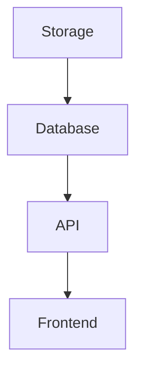

Every arrow is a dependency.

---

# Why Dependencies Exist

Applications need resources:

```text
Network

Storage

Authentication

Databases

Caches

Message Queues
```

Dependencies express these requirements.

---

# systemd Dependency Engine

One of systemd's most powerful capabilities.

systemd automatically understands:

```text
Startup Order

Shutdown Order

Failure Relationships
```

between services.

---

# Architecture

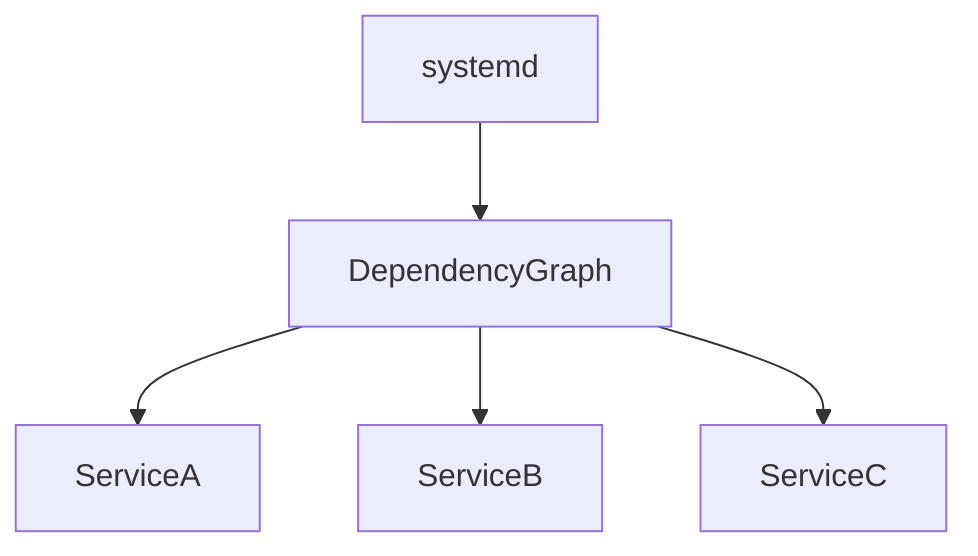

systemd continuously manages this graph.

---

# Understanding Dependency Types

The most important dependency directives:

```text
Requires

Wants

After

Before
```

Master these and you master systemd dependency debugging.

---

# Requires=

Strong dependency.

Example:

```ini
Requires=postgresql.service
```

Meaning:

```text
If PostgreSQL Fails

Application Fails
```

---

# Visualization

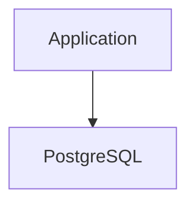

Application cannot exist without PostgreSQL.

---

# Wants=

Soft dependency.

Example:

```ini
Wants=redis.service
```

Meaning:

```text
Try To Start Redis

But Continue If Unavailable
```

Less strict.

---

# Requires vs Wants

Requires:

```text
Dependency Mandatory
```

Wants:

```text
Dependency Preferred
```

Critical distinction.

---

# After=

Controls startup order.

Example:

```ini
After=network.target
```

Meaning:

```text
Start After Network
```

---

# Important Clarification

Many engineers misunderstand this.

```ini
After=network.target
```

does NOT mean:

```text
Require Network
```

It only means:

```text
Start Later
```

---

# Before=

Reverse ordering.

Example:

```ini
Before=nginx.service
```

Meaning:

```text
Start First
```

---

# Dependency Relationship Diagram

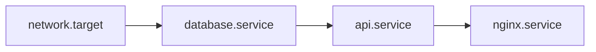

Startup follows dependency order.

---

# Lab 1 — Inspect Service Dependencies

Choose service:

```bash
systemctl list-dependencies nginx
```

Example output:

```text
nginx.service

├── system.slice
├── network.target
└── basic.target
```

This reveals dependency relationships.

---

# Why This Matters

Dependencies explain:

```text
Why Service Started

Why Service Failed

Why Service Waited
```

---

# Lab 2 — Reverse Dependencies

Investigate:

```bash
systemctl list-dependencies --reverse network.target
```

Meaning:

```text
Who Depends On Network?
```

Extremely useful during outages.

---

# Visualization

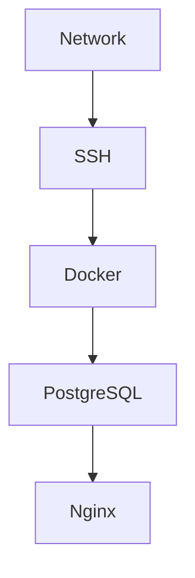

If network fails:

```text
Many Services Impacted
```

---

# Dependency Investigation Workflow

Always ask:

```text
What Does This Service Need?
```

before:

```text
Why Did It Fail?
```

---

# Lab 3 — Build Dependency Graph

Create service:

```ini
[Unit]
Description=Database

[Service]
ExecStart=/bin/sleep infinity
```

---

Create API service:

```ini
[Unit]
Description=API

Requires=database.service
After=database.service
```

Observe startup behavior.

---

# Startup Flow

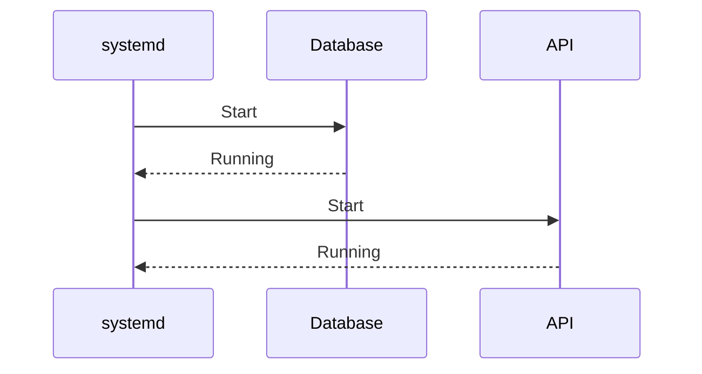

Dependency chain respected.

---

# Lab 4 — Simulate Dependency Failure

Stop database:

```bash
sudo systemctl stop database
```

Observe:

```bash
systemctl status api
```

Questions:

```text
Did API Stop?

Did API Continue?

Why?
```

Analyze dependency behavior.

---

# Understanding Cascading Failures

One failed service can create:

```text
System-Wide Impact
```

---

# Example

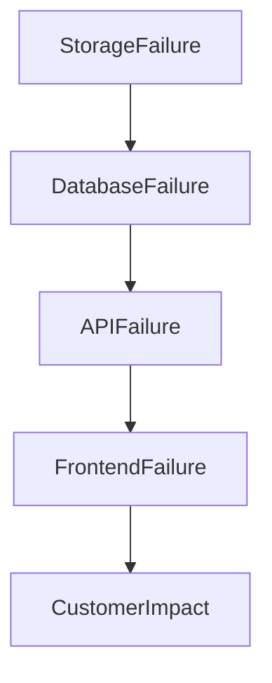

Classic production incident.

---

# The Dependency Pyramid

Most systems follow:

```text
Infrastructure

↓

Platform

↓

Applications

↓

Users
```

---

# Visual Model

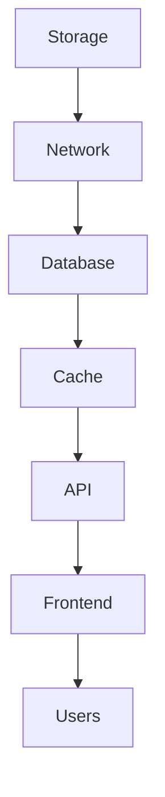

Lower layers affect everything above.

---

# Real Production Example

User reports:

```text
Website Down
```

Junior engineer:

```text
Restart Nginx
```

No effect.

Investigation reveals:

```text
Database Failure
```

Root cause:

```text
Storage Exhaustion
```

Actual dependency chain:

```text
Storage

↓

Database

↓

API

↓

Nginx

↓

User
```

---

# Dependency Trees And Boot

Linux boot is dependency resolution.

---

# Boot Architecture

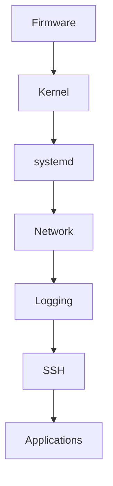

Everything starts through dependency relationships.

---

# Why Boot Sometimes Hangs

Common reason:

```text
Dependency Waiting
```

Example:

```text
Database Waiting

For Network
```

or

```text
Application Waiting

For Database
```

---

# Investigating Boot Dependencies

Check:

```bash
systemd-analyze critical-chain
```

Output:

```text
Longest Dependency Path
```

One of the most valuable troubleshooting commands.

---

# Example Output

```text
multi-user.target

↓

nginx.service

↓

api.service

↓

postgresql.service

↓

network.target
```

Immediately reveals startup dependencies.

---

# Lab 5 — Analyze Critical Chain

Run:

```bash
systemd-analyze critical-chain
```

Questions:

```text
What Delayed Boot?

Which Dependency Took Longest?
```

---

# Dependency Loops

One of the nastiest failures.

Example:

```text
Service A Needs B

Service B Needs A
```

Impossible.

---

# Visualization

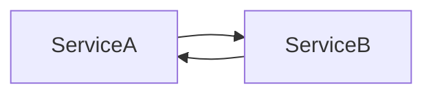

Circular dependency.

---

# Symptoms

```text
Startup Failure

Boot Delay

Unexpected Behavior
```

---

# How systemd Handles Loops

systemd detects:

```text
Dependency Cycles
```

and reports errors.

Check logs:

```bash
journalctl -b
```

---

# Network Dependency Problems

One of the most common enterprise issues.

Example:

```ini
After=network.target
```

Many engineers assume:

```text
Network Ready
```

Not necessarily true.

---

# Understanding network.target

network.target means:

```text
Networking Stack Started
```

NOT:

```text
Internet Available
```

Critical distinction.

---

# Better Alternative

Use:

```ini
After=network-online.target

Wants=network-online.target
```

for services requiring real connectivity.

---

# Visual Comparison

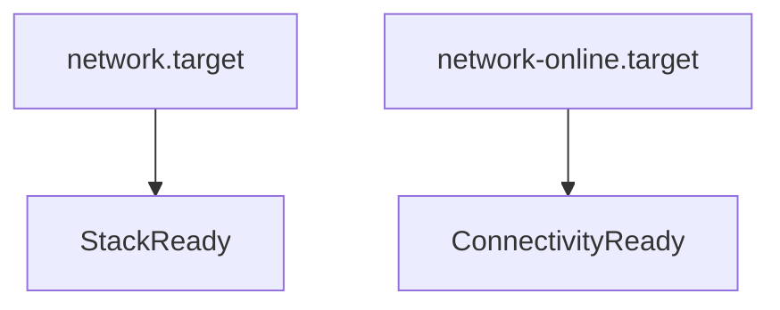

---

# Production Scenario 1

## API Won't Start

Status:

```text
Failed
```

Logs:

```text
Database Connection Refused
```

Root cause:

```text
PostgreSQL Not Running
```

Dependency failure.

---

# Production Scenario 2

## Docker Failure

Status:

```text
Docker Failed
```

Root cause:

```text
Container Runtime Dependency Missing
```

---

# Production Scenario 3

## Kubernetes Node Not Ready

Investigation:

```bash
systemctl status kubelet
```

Logs show:

```text
containerd Unavailable
```

Root cause:

```text
Runtime Dependency Failure
```

---

# Production Scenario 4

## Boot Takes Five Minutes

Analysis:

```bash
systemd-analyze critical-chain
```

Result:

```text
Database Waiting For Storage
```

Dependency bottleneck identified.

---

# Linux Internals

systemd builds:

```text
Directed Dependency Graph
```

internally.

---

# Visualization

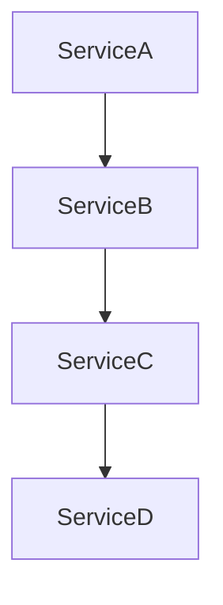

Every service becomes a node.

Dependencies become edges.

---

# How systemd Thinks

Before starting service:

```text
Are Dependencies Satisfied?
```

If:

```text
No
```

Wait.

If:

```text
Yes
```

Start service.

---

# Dependency Resolution Flow

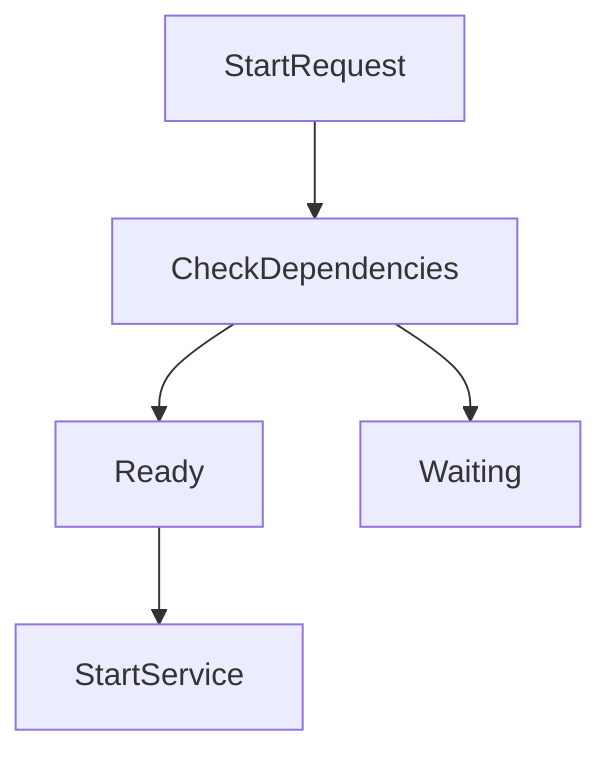

This logic powers Linux boot and service management.

---

# Universal Dependency Debugging Workflow

Step 1:

Check status.

```bash
systemctl status SERVICE
```

---

Step 2:

Read logs.

```bash
journalctl -u SERVICE
```

---

Step 3:

List dependencies.

```bash
systemctl list-dependencies SERVICE
```

---

Step 4:

Check reverse dependencies.

```bash
systemctl list-dependencies --reverse SERVICE
```

---

Step 5:

Inspect critical chain.

```bash
systemd-analyze critical-chain
```

---

Step 6:

Identify root dependency.

---

Step 7:

Fix root cause.

Not symptoms.

---

# Dependency Debugging Mindset

Bad Engineer:

```text
Service Failed

Restart It
```

Good Engineer:

```text
What Dependency Failed?
```

Expert Engineer:

```text
What Dependency Chain

Created This Failure?
```

---

# Common Mistakes

## Mistake 1

Ignoring dependencies.

---

## Mistake 2

Confusing After with Requires.

---

## Mistake 3

Investigating symptoms only.

---

## Mistake 4

Ignoring reverse dependencies.

---

## Mistake 5

Assuming network.target means internet access.

---

# Engineering Mindset

Beginner:

```text
Service Failed
```

Linux Administrator:

```text
Why Did It Fail?
```

Infrastructure Engineer:

```text
Which Dependency Failed?
```

SRE:

```text
Which Dependency Chain Produced User Impact?
```

System Architect:

```text
How Can Dependency Failures Be Isolated?
```

That progression is production engineering.

---

# Interview Questions

### Beginner

What is a service dependency?

### Beginner

What is Requires=?

### Intermediate

Difference between Requires and Wants?

### Intermediate

Difference between After and Requires?

### Intermediate

What is a reverse dependency?

### Advanced

How does systemd resolve dependencies?

### Advanced

How would you investigate cascading failures?

### Advanced

What is a dependency cycle?

### Advanced

Explain systemd-analyze critical-chain.

### Advanced

Design a resilient service dependency architecture.

---

# Cheat Sheet

Service status:

```bash
systemctl status SERVICE
```

Logs:

```bash
journalctl -u SERVICE
```

Dependencies:

```bash
systemctl list-dependencies SERVICE
```

Reverse dependencies:

```bash
systemctl list-dependencies --reverse SERVICE
```

Critical chain:

```bash
systemd-analyze critical-chain
```

Boot analysis:

```bash
systemd-analyze blame
```

Current boot logs:

```bash
journalctl -b
```

---

# Lab Success Criteria

You should now be able to:

* Understand service dependencies
* Distinguish Requires, Wants, After, and Before
* Investigate dependency failures
* Analyze dependency chains
* Understand cascading failures
* Debug boot dependency issues
* Analyze reverse dependencies
* Understand critical chains
* Connect Linux dependencies to Kubernetes and distributed systems
* Think like a production incident investigator

At this point, you should stop asking:

```text
Why Did This Service Fail?
```

and start asking:

```text
What Dependency Chain

Produced This Failure

And Where Is

The Actual Root Cause?
```

Because in modern systems:

```text
The Visible Failure

Is Rarely

The Original Failure.
```
