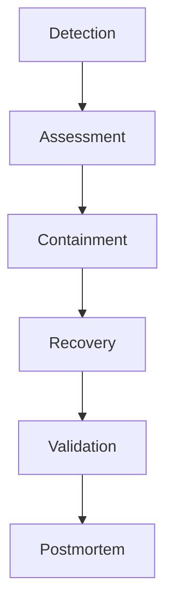
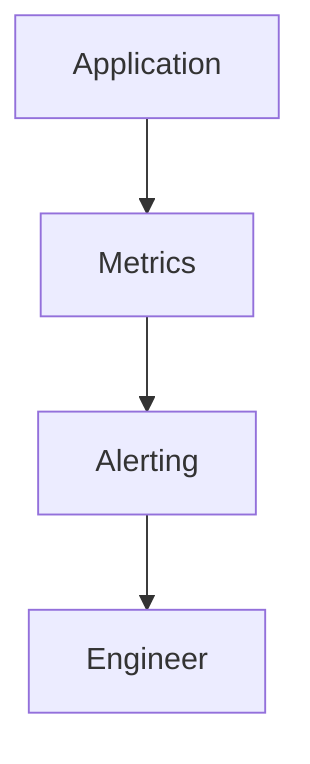
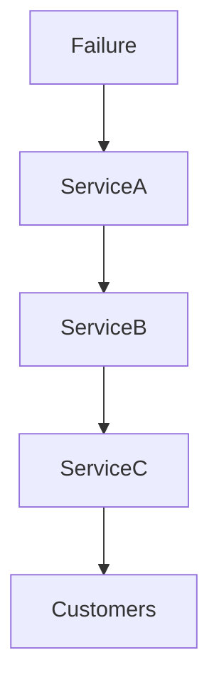
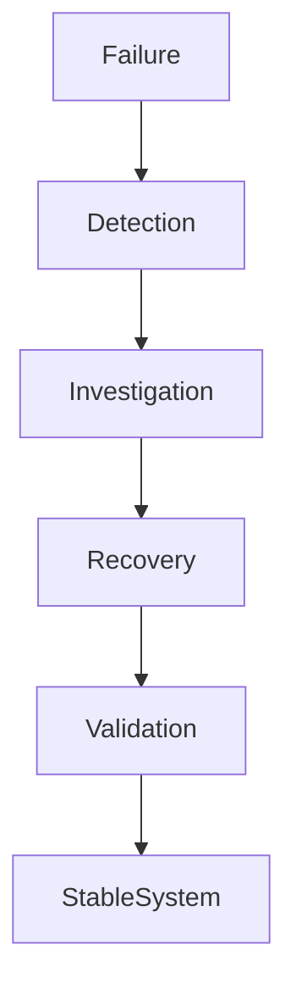
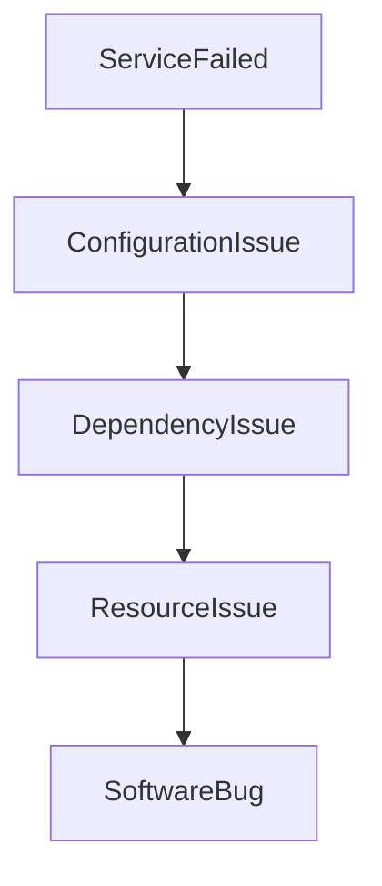
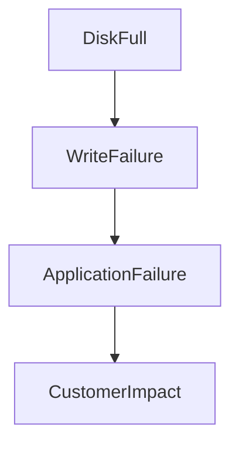
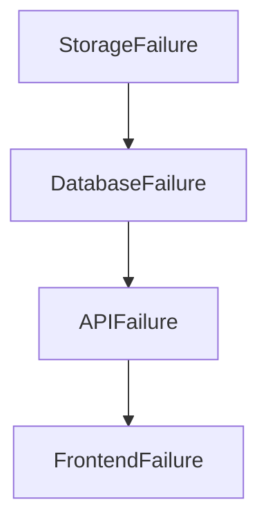
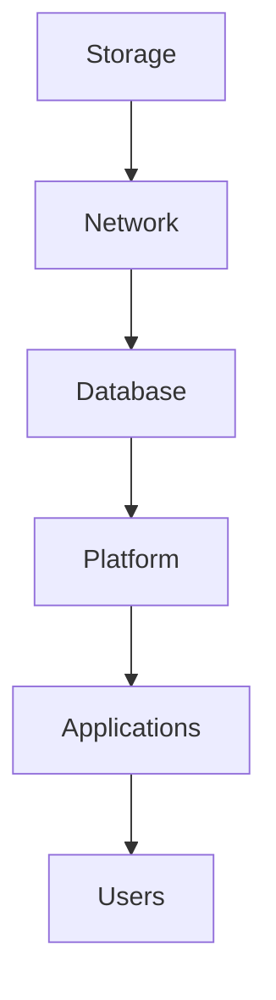
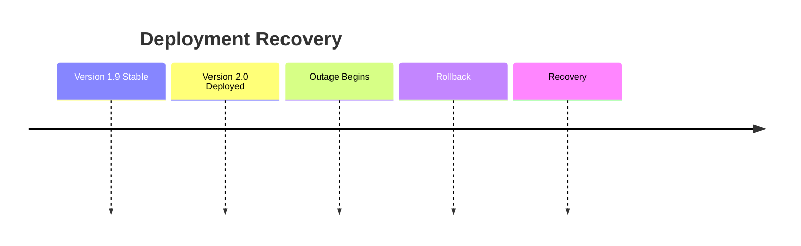
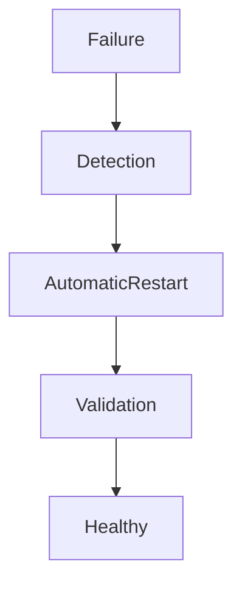

# Lab 08 — Production Recovery: Surviving and Recovering Real Linux Outages

> Linux Fundamentals Mastery
>
> Service Management Labs Series
>
> Track:
>
> Linux Operations → Incident Response → Disaster Recovery → SRE Engineering
>
> Lab Goal:
>
> Learn how production systems fail, how engineers respond during incidents, how Linux recovery actually works, and how to restore services safely without creating larger outages.

---

# Why This Lab Exists

Most Linux tutorials teach:

```text
How Systems Work
```

Production engineering is about:

```text
How Systems Fail
```

and more importantly:

```text
How Systems Recover
```

Real-world engineers are paid because:

```text
Failures Are Inevitable
```

Examples:

```text
Application Crashes

Disk Full

Database Corruption

Memory Exhaustion

Network Failure

Cloud Outage

Accidental Deletion

Bad Deployments
```

The engineer's job is not preventing every failure.

The engineer's job is:

```text
Reducing Recovery Time
```

---

# The Most Important Lesson

Production engineering is not:

```text
Building Systems
```

It is:

```text
Recovering Systems
```

The best engineers are not the ones who never experience outages.

They are the ones who recover quickly.

---

# The Fundamental Question

Imagine:

```text
Revenue = $50,000/hour
```

Your production platform fails.

Question:

```text
How Long Until Recovery?
```

Every minute matters.

Recovery engineering directly affects:

```text
Customers

Revenue

Reputation

Business Survival
```

---

# Mental Model

Think about a hospital emergency room.

The goal is not:

```text
Understand Human Biology
```

during an emergency.

The goal is:

```text
Stabilize Patient

Identify Cause

Restore Function

Prevent Recurrence
```

Production recovery follows the same model.

---

# Understanding Incidents

An incident is:

```text
Any Event

That Reduces

System Reliability
```

Examples:

```text
Service Failure

Performance Degradation

Security Event

Infrastructure Failure
```

---

# Incident Severity Levels

Most organizations classify incidents.

---

## SEV-1

```text
Complete Outage

Revenue Impact

Major Customer Impact
```

Example:

```text
Entire Platform Offline
```

---

## SEV-2

```text
Major Feature Broken
```

Example:

```text
Payments Unavailable
```

---

## SEV-3

```text
Partial Degradation
```

Example:

```text
Slow API Responses
```

---

## SEV-4

```text
Minor Operational Issue
```

Example:

```text
Monitoring Alert
```

---

# The Universal Recovery Workflow

Every successful incident response follows:

```text
Detect

↓

Assess

↓

Contain

↓

Recover

↓

Validate

↓

Learn
```

---

# Visual Model



This workflow is used across:

* Linux
* Kubernetes
* AWS
* Google
* Netflix
* Meta

---

# Phase 1 — Detection

Before recovery:

```text
Failure Must Be Detected
```

Sources:

```text
Monitoring

Alerts

Logs

Users

Engineers
```

---

# Example

Monitoring system alerts:

```text
HTTP 500 Errors Increasing
```

Recovery begins.

---

# Detection Architecture



---

# Phase 2 — Assessment

Never start fixing immediately.

First determine:

```text
What Failed?

Who Is Impacted?

How Severe Is It?
```

---

# Example Questions

```text
Single Service?

Entire Datacenter?

Database?

Storage?

Network?
```

Assessment prevents panic.

---

# Phase 3 — Containment

Goal:

```text
Stop The Blast Radius
```

---

# Example

Bad deployment causing failures.

Containment:

```text
Rollback Deployment
```

before investigating further.

---

# Blast Radius Visualization



Containment limits propagation.

---

# Phase 4 — Recovery

Now restore service.

Methods:

```text
Restart

Rollback

Restore Backup

Failover

Scale Resources

Repair Configuration
```

Recovery strategy depends on root cause.

---

# Phase 5 — Validation

Many engineers stop too early.

Service appears healthy.

Question:

```text
Is It Actually Healthy?
```

Validate:

```text
Metrics

Logs

Traffic

Dependencies

User Experience
```

---

# Phase 6 — Learning

Every outage provides data.

Questions:

```text
Why Did It Happen?

Why Wasn't It Prevented?

How Can Recovery Improve?
```

This becomes the postmortem.

---

# Understanding MTTR

One of the most important production metrics.

MTTR:

```text
Mean Time To Recovery
```

Formula:

```text
Incident Duration

÷

Number Of Incidents
```

Goal:

```text
Reduce MTTR
```

not:

```text
Pretend Failures Never Occur
```

---

# Recovery Architecture



---

# Production Recovery Lab 1

## Service Crash Recovery

Create:

```bash
sudo systemctl stop nginx
```

Verify:

```bash
systemctl status nginx
```

Recovery:

```bash
sudo systemctl start nginx
```

Validation:

```bash
curl localhost
```

---

# Lesson

Recovery requires:

```text
Verification
```

not merely:

```text
Restart
```

---

# Production Recovery Lab 2

## Failed Service Investigation

Simulate failure.

Investigate:

```bash
systemctl status SERVICE
```

Then:

```bash
journalctl -u SERVICE
```

Recovery starts with evidence.

---

# Universal Rule

Never do:

```bash
systemctl restart SERVICE
```

before:

```bash
systemctl status SERVICE
```

and:

```bash
journalctl -u SERVICE
```

---

# Recovery Decision Tree



Different failures require different recoveries.

---

# Scenario 1 — Configuration Failure

Symptoms:

```text
Service Refuses To Start
```

Investigation:

```bash
journalctl -u nginx
```

Output:

```text
Configuration Error
```

Recovery:

```text
Fix Config

Reload Service
```

---

# Scenario 2 — Disk Full

Symptoms:

```text
Applications Failing
```

Check:

```bash
df -h
```

Result:

```text
100% Full
```

Recovery:

```text
Delete Unnecessary Files

Expand Storage

Restart Affected Services
```

---

# Disk Failure Flow



---

# Scenario 3 — Memory Exhaustion

Check:

```bash
free -h
```

Kernel logs:

```bash
journalctl -k
```

Observe:

```text
OOM Killer
```

Recovery:

```text
Reduce Load

Increase Memory

Fix Leak
```

---

# Scenario 4 — Dependency Failure

Example:

```text
API Fails
```

Logs:

```text
Cannot Reach Database
```

Recovery:

```text
Restore Database
```

not:

```text
Restart API Forever
```

---

# Cascading Failure Recovery

Most outages are chains.

Example:



Correct recovery:

```text
Fix Storage First
```

not:

```text
Restart Frontend
```

---

# Lab 3 — Boot Recovery

Investigate previous boot:

```bash
journalctl -b -1
```

Questions:

```text
Why Did System Reboot?

Kernel Panic?

Power Failure?

OOM Event?
```

---

# Boot Failure Recovery

Use:

```bash
systemd-analyze critical-chain
```

Identify:

```text
Slow Dependencies

Failed Services

Startup Bottlenecks
```

---

# Lab 4 — Dependency Recovery

Check:

```bash
systemctl list-dependencies SERVICE
```

Determine:

```text
Required Components
```

before attempting recovery.

---

# Lab 5 — Network Failure Recovery

Check:

```bash
ip addr
```

```bash
ip route
```

```bash
ping 8.8.8.8
```

Recovery process:

```text
Interface

↓

Routing

↓

DNS

↓

Application
```

Always troubleshoot bottom-up.

---

# Infrastructure Recovery Pyramid



Recover lower layers first.

---

# Service Recovery Playbook

Step 1:

```bash
systemctl status SERVICE
```

---

Step 2:

```bash
journalctl -u SERVICE
```

---

Step 3:

Check dependencies.

```bash
systemctl list-dependencies SERVICE
```

---

Step 4:

Check resources.

```bash
free -h
df -h
```

---

Step 5:

Recover root cause.

---

Step 6:

Validate.

---

# Understanding Rollbacks

One of the safest recovery strategies.

Example:

```text
Version 2.0 Deployed

↓

Outage Begins

↓

Rollback To 1.9
```

Recovery often faster than debugging.

---

# Rollback Visualization



---

# High Availability And Recovery

Recovery can be:

```text
Reactive

or

Automatic
```

---

# Manual Recovery

Engineer intervenes.

```text
Failure

↓

Engineer

↓

Recovery
```

---

# Automatic Recovery

```text
Failure

↓

systemd

↓

Restart

↓

Recovered
```

---

# Self-Healing Architecture



Modern infrastructure increasingly uses self-healing.

---

# Disaster Recovery

Not every incident is small.

Examples:

```text
Datacenter Loss

Database Corruption

Ransomware

Region Failure
```

Recovery requires:

```text
Backups

Replication

Failover
```

---

# Understanding RTO

Recovery Time Objective:

```text
Maximum Acceptable Downtime
```

Example:

```text
15 Minutes
```

Recovery must occur within that window.

---

# Understanding RPO

Recovery Point Objective:

```text
Maximum Acceptable Data Loss
```

Example:

```text
5 Minutes
```

Backups and replication determine RPO.

---

# Recovery vs Availability

Availability:

```text
Prevent Outage
```

Recovery:

```text
Minimize Damage
```

Both matter.

---

# Linux Internals During Recovery

Failure occurs.

Kernel detects:

```text
Process Exit

Resource Exhaustion

Hardware Error
```

systemd detects:

```text
Service Failure
```

Logs capture:

```text
Evidence
```

Engineers investigate:

```text
Root Cause
```

Recovery begins.

---

# Production Scenario 1

## Nginx Outage

Symptoms:

```text
502 Errors
```

Root cause:

```text
Backend API Dead
```

Recovery:

```text
Restore API
```

---

# Production Scenario 2

## PostgreSQL Failure

Symptoms:

```text
Application Errors
```

Root cause:

```text
Disk Full
```

Recovery:

```text
Free Storage

Restart Database
```

---

# Production Scenario 3

## Kubernetes Node Failure

Symptoms:

```text
Pods Unavailable
```

Root cause:

```text
containerd Failure
```

Recovery:

```text
Restore Runtime
```

---

# Production Scenario 4

## Cloud Instance Failure

Symptoms:

```text
VM Offline
```

Recovery:

```text
Failover

Restore From Snapshot
```

---

# What The Kernel Is Thinking

When an outage occurs:

```text
Kernel

↓

Records Facts

Not Explanations
```

Logs contain evidence.

Recovery requires interpretation.

---

# Common Mistakes

## Mistake 1

Restarting immediately.

---

## Mistake 2

Ignoring logs.

---

## Mistake 3

Treating symptoms.

---

## Mistake 4

Skipping validation.

---

## Mistake 5

Never performing postmortems.

---

## Mistake 6

Recovering upper layers first.

---

# Engineering Mindset

Beginner:

```text
Service Failed
```

---

Linux Administrator:

```text
How Do I Restart It?
```

---

Infrastructure Engineer:

```text
Why Did It Fail?
```

---

SRE:

```text
How Do I Reduce MTTR?
```

---

Platform Engineer:

```text
How Do I Automate Recovery?
```

---

System Architect:

```text
How Do I Design Systems

That Continue Working

Even During Failure?
```

That is the ultimate recovery mindset.

---

# Interview Questions

### Beginner

What is incident recovery?

### Beginner

What is MTTR?

### Intermediate

Difference between recovery and prevention?

### Intermediate

What is a rollback?

### Intermediate

Why should you investigate before restarting?

### Advanced

How would you recover from a cascading failure?

### Advanced

Explain RTO and RPO.

### Advanced

Design a production recovery playbook.

### Advanced

How do self-healing systems work?

### Advanced

How would you reduce MTTR across an organization?

---

# Cheat Sheet

Service status:

```bash
systemctl status SERVICE
```

Service logs:

```bash
journalctl -u SERVICE
```

Previous boot:

```bash
journalctl -b -1
```

Dependencies:

```bash
systemctl list-dependencies SERVICE
```

Memory:

```bash
free -h
```

Storage:

```bash
df -h
```

Boot analysis:

```bash
systemd-analyze critical-chain
```

Networking:

```bash
ip addr
ip route
```

---

# Lab Success Criteria

You should now be able to:

* Understand incident response workflows
* Perform production recovery safely
* Investigate failures before restarting
* Diagnose service outages
* Handle dependency failures
* Recover from storage and memory issues
* Understand MTTR, RTO, and RPO
* Build recovery playbooks
* Connect Linux recovery to SRE practices
* Think like a production engineer during outages

At this point, you should stop asking:

```text
How Do I Restart The Service?
```

and start asking:

```text
What Failed?

Why Did It Fail?

What Is The Fastest Safe Recovery?

How Do We Prevent Recurrence?

And How Can Recovery Become Automatic?
```

Because production engineering is ultimately the discipline of restoring reliability when everything goes wrong.
