# Linux Internals Mind Map
## Understanding What Happens Under the Hood

> Most Linux users learn commands.
>
> Engineers learn systems.
>
> Great engineers learn internals.
>
> This file explains Linux as an interconnected machine.
>
> Goal:
>
> - Understand how Linux actually works
> - Build deep engineering intuition
> - Learn kernel-level thinking
> - Connect Linux to Docker, Kubernetes, Databases, Cloud, and Distributed Systems
> - Become a better troubleshooter

---

# The Linux Internals Universe

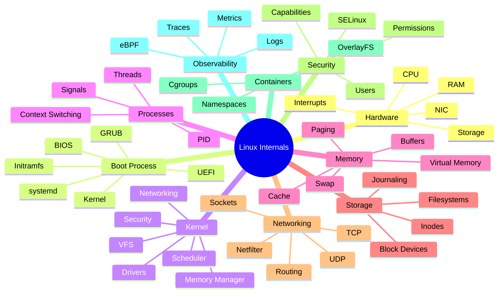

---

# Linux Architecture Overview

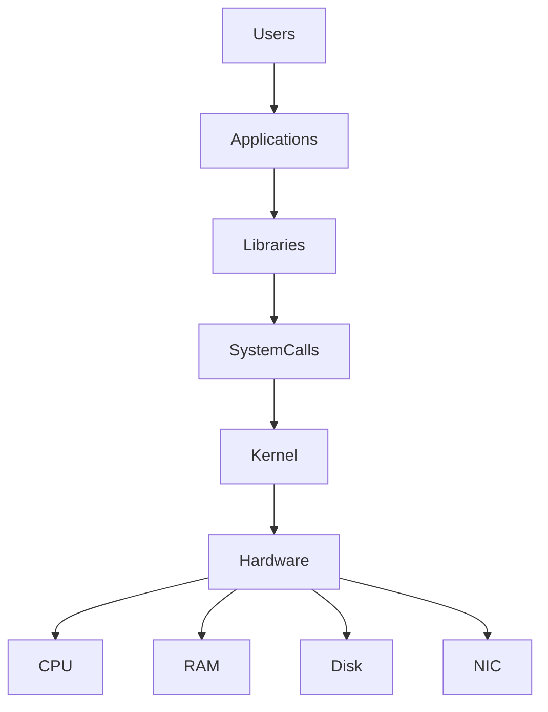

---

# Complete Linux Internal Stack

```text
+------------------------------------------------+
|                 User Applications              |
+------------------------------------------------+
|                Shared Libraries                |
+------------------------------------------------+
|                System Call Layer               |
+------------------------------------------------+
|                     Kernel                     |
|------------------------------------------------|
| Scheduler | Memory | Network | VFS | Security |
+------------------------------------------------+
|                Device Drivers                  |
+------------------------------------------------+
|          CPU | RAM | SSD | NIC | GPU           |
+------------------------------------------------+
```

---

# Linux Boot Process Deep Dive

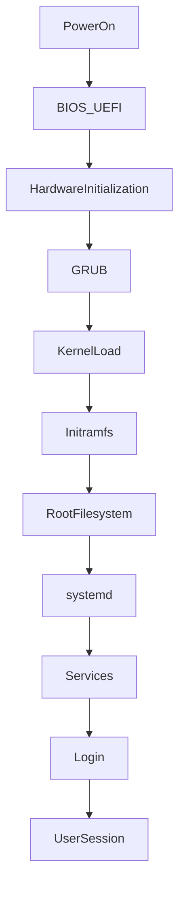

---

# Linux Startup Timeline

```text
Power Button Pressed
        │
        ▼
BIOS / UEFI
        │
        ▼
Hardware Detection
        │
        ▼
Bootloader (GRUB)
        │
        ▼
Kernel Loaded
        │
        ▼
Initramfs
        │
        ▼
Root Filesystem Mounted
        │
        ▼
PID 1 (systemd)
        │
        ▼
Services Start
        │
        ▼
Login Available
```

---

# Kernel Internal Architecture

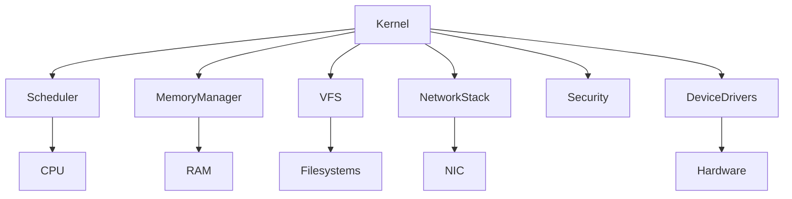

---

# Kernel Subsystem Map

```text
KERNEL
│
├── Process Scheduler
│   ├── CFS
│   ├── Priorities
│   ├── CPU Affinity
│   └── Context Switching
│
├── Memory Manager
│   ├── Virtual Memory
│   ├── Paging
│   ├── Swap
│   ├── Slab Allocator
│   └── OOM Killer
│
├── VFS
│   ├── Inodes
│   ├── Dentries
│   ├── File Handles
│   └── Mounts
│
├── Network Stack
│   ├── TCP
│   ├── UDP
│   ├── Routing
│   ├── Firewall
│   └── Sockets
│
├── Security
│   ├── Permissions
│   ├── Capabilities
│   ├── SELinux
│   └── Audit
│
└── Device Drivers
    ├── Disk
    ├── Network
    ├── USB
    ├── GPU
    └── Input Devices
```

---

# Process Internals

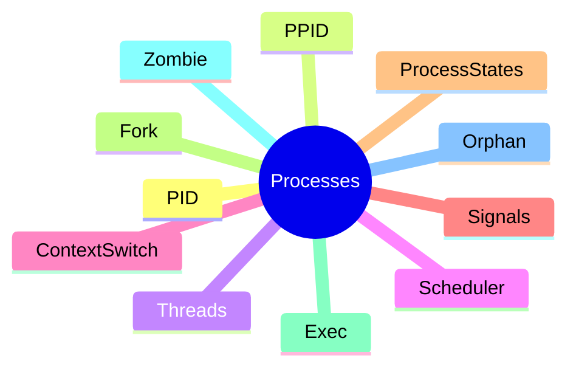

---

# Process Life Cycle

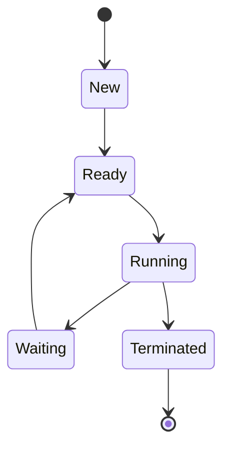

---

# What Happens When You Run a Program?

Example:

```bash
nginx
```

```mermaid
flowchart TD

User

--> Shell

Shell

--> fork()

fork()

--> ChildProcess

ChildProcess

--> exec()

exec()

--> ProgramLoaded

ProgramLoaded

--> Scheduler

Scheduler

--> CPUExecution
```

---

# Process Memory Layout

```text
High Memory
+--------------------+
| Kernel Space       |
+--------------------+

| Stack              |
+--------------------+

| Heap               |
+--------------------+

| BSS                |
+--------------------+

| Data Segment       |
+--------------------+

| Text Segment       |
+--------------------+

Low Memory
```

---

# Context Switching

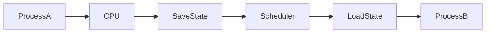

---

# Linux Memory Architecture

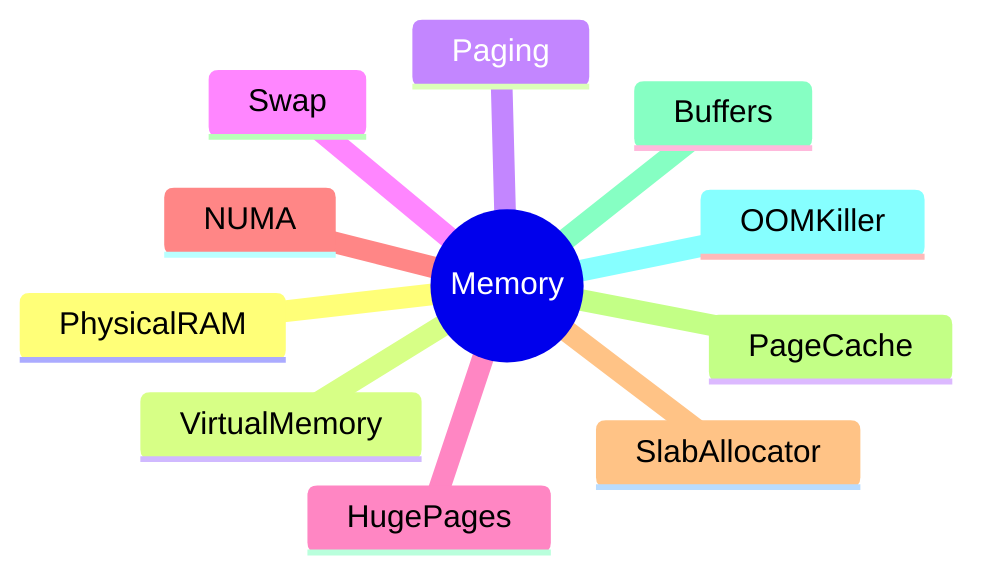

---

# Virtual Memory Flow

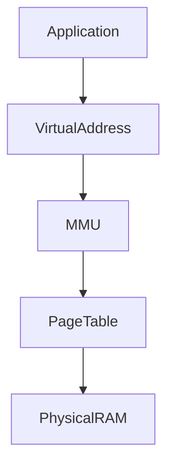

---

# Memory Request Journey

```mermaid
flowchart TD

Application

--> malloc()

--> VirtualMemory

--> PageTable

--> RAM

RAM

--> CPU
```

---

# OOM Killer Decision Flow

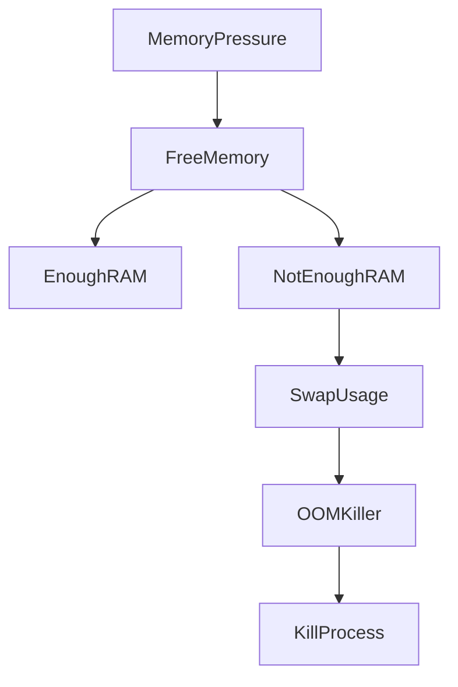

---

# Filesystem Internals

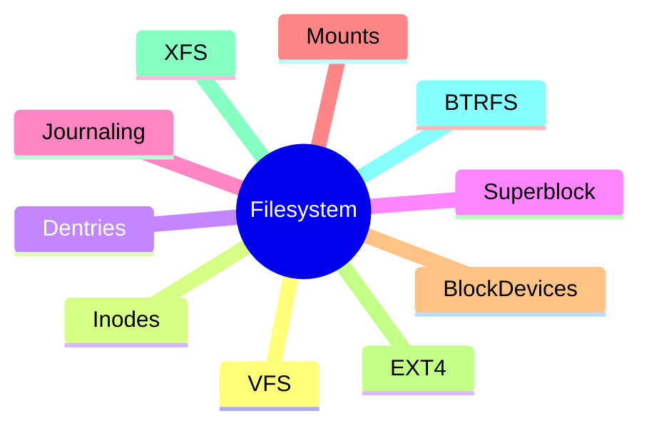

---

# File Read Journey

```mermaid
flowchart LR

Application

--> read()

--> VFS

--> Filesystem

--> BlockLayer

--> Disk

--> PageCache

--> Application
```

---

# Inode Architecture

```text
File Name
    │
    ▼
Directory Entry
    │
    ▼
Inode
    │
    ├── Permissions
    ├── Owner
    ├── Size
    ├── Timestamps
    └── Block Pointers
              │
              ▼
        Data Blocks
```

---

# Linux Storage Stack

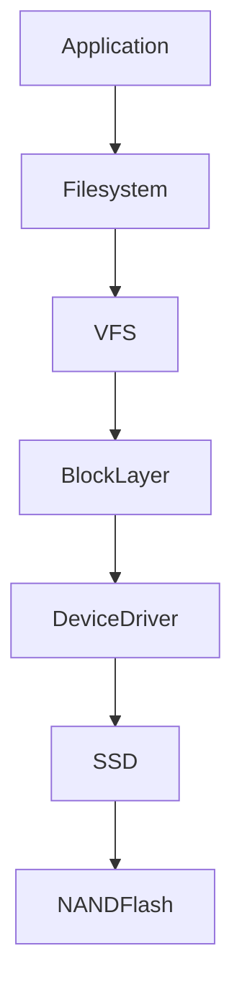

---

# Linux Networking Internals

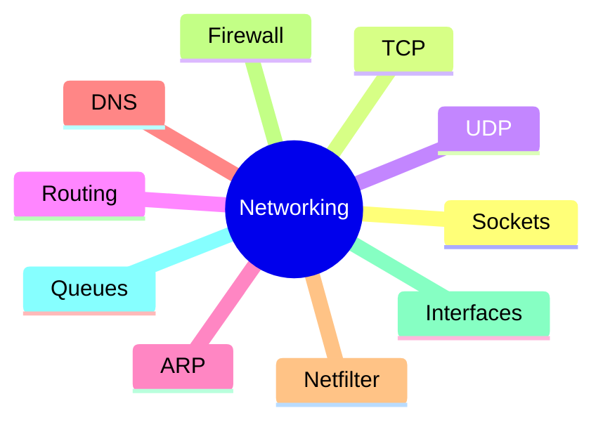

---

# Network Packet Journey


---

# TCP Stack Internals

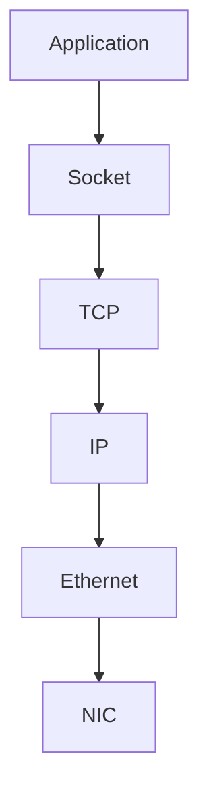

---

# TCP Three-Way Handshake

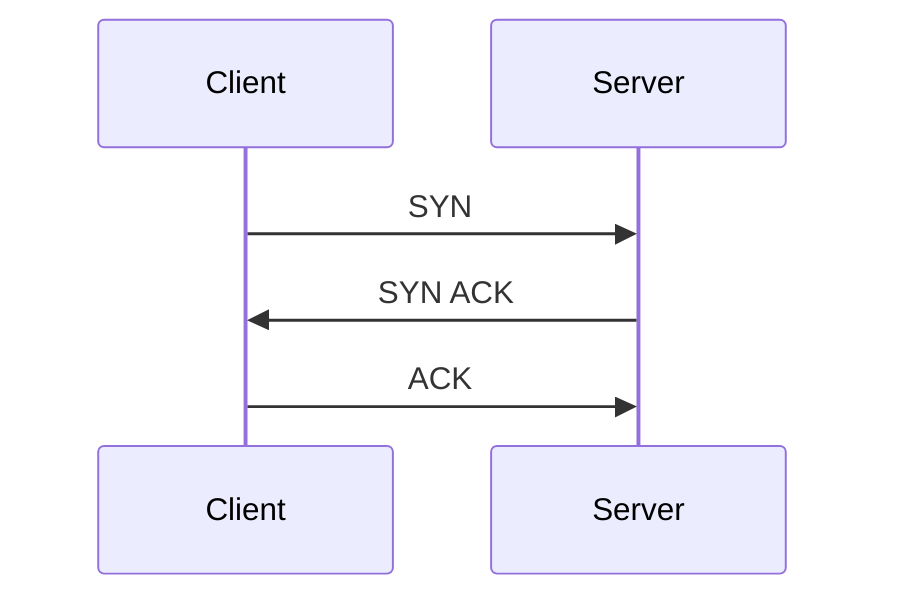

---

# Linux Interrupt Architecture

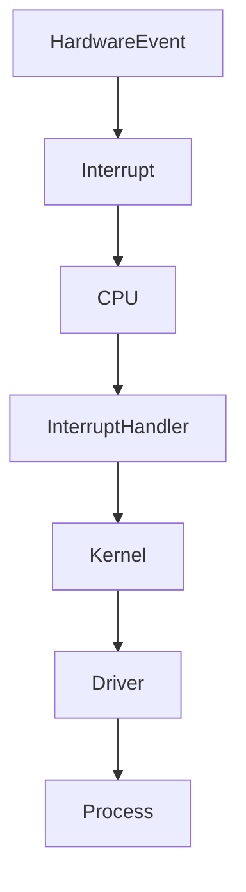

---

# Device Driver Architecture

```mermaid
flowchart TD

Application

--> SystemCall

--> Kernel

--> Driver

--> Hardware
```

---

# Linux Security Internals

```mermaid
mindmap
root((Security))

    UID

    GID

    Permissions

    ACL

    Capabilities

    PAM

    SELinux

    AppArmor

    Audit
```

---

# Permission Check Flow

```mermaid
flowchart TD

User

--> FileAccess

FileAccess

--> UIDCheck

UIDCheck

--> PermissionCheck

PermissionCheck

--> Allow

PermissionCheck

--> Deny
```

---

# System Call Journey

Example:

```bash
cat file.txt
```

```mermaid
flowchart TD

User

--> Shell

Shell

--> read()

read()

--> SystemCall

SystemCall

--> Kernel

Kernel

--> VFS

VFS

--> Filesystem

Filesystem

--> Disk

Disk

--> DataReturned
```

---

# Namespace Architecture (Containers)

```mermaid
mindmap
root((Namespaces))

    PID

    Network

    Mount

    User

    IPC

    UTS

    Cgroup
```

---

# Cgroup Architecture

```mermaid
flowchart TD

Container

--> CPUQuota

Container

--> MemoryLimit

Container

--> DiskLimit

Container

--> NetworkLimit
```

---

# Docker Exists Because Of Linux

```mermaid
flowchart TD

LinuxKernel

--> Namespaces

LinuxKernel

--> Cgroups

LinuxKernel

--> OverlayFS

Namespaces

--> Isolation

Cgroups

--> ResourceControl

OverlayFS

--> LayeredFilesystems

Isolation

--> Containers
```

---

# eBPF Architecture

```mermaid
flowchart TD

Application

--> eBPFProgram

eBPFProgram

--> KernelHooks

KernelHooks

--> Network

KernelHooks

--> Processes

KernelHooks

--> Filesystem

KernelHooks

--> Security
```

---

# Linux Internals Dependency Graph

```mermaid
graph TD

CPU --> Scheduler

RAM --> MemoryManager

Disk --> Filesystem

NIC --> NetworkStack

Scheduler --> Processes

MemoryManager --> Applications

Filesystem --> Databases

NetworkStack --> WebServers

Namespaces --> Docker

Docker --> Kubernetes

Kubernetes --> Cloud

Cloud --> DistributedSystems
```

---

# The Ultimate Mental Model

```text
Hardware
   │
   ▼
Device Drivers
   │
   ▼
Kernel
   │
   ├── Scheduler
   ├── Memory Manager
   ├── VFS
   ├── Network Stack
   ├── Security
   │
   ▼
System Calls
   │
   ▼
Libraries
   │
   ▼
Applications
   │
   ▼
Containers
   │
   ▼
Kubernetes
   │
   ▼
Cloud
   │
   ▼
Internet Scale Systems
```

---

# Final Engineering Truth

```text
Every Linux problem eventually becomes one of:

CPU
Memory
Storage
Network
Kernel
Process
Filesystem
Security

Master these eight areas and you can troubleshoot
almost every production Linux issue.

Linux Internals is not about commands.

Linux Internals is about understanding how the machine thinks.
```

**End of Linux Internals Mind Map**
