# Linux Engineering Master Atlas
## The Ultimate Linux Mind Map, Systems Map, Infrastructure Map, and Engineering Knowledge Graph

> This file is intentionally massive.
>
> It is not a cheatsheet.
>
> It is not an interview guide.
>
> It is a visual model of modern computing through the lens of Linux.
>
> The objective is to help learners build:
>
> - Linux intuition
> - Systems thinking
> - Infrastructure thinking
> - Production troubleshooting ability
> - Cloud understanding
> - Distributed systems understanding
> - Architecture thinking
> - Founder-level infrastructure awareness

---

# The Linux Universe

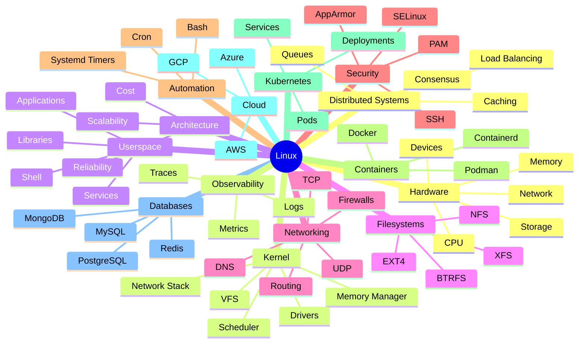

---

# The Complete Linux Learning Roadmap

```text
BEGINNER
│
├── Linux Basics
├── Commands
├── Filesystem
├── Users
├── Permissions
├── Editors
│
▼

INTERMEDIATE
│
├── Processes
├── Networking
├── Storage
├── systemd
├── Bash
├── Security
│
▼

ADVANCED
│
├── Kernel Concepts
├── Memory Internals
├── Scheduling
├── DNS Internals
├── TCP Internals
├── Performance Tuning
│
▼

PRODUCTION ENGINEER
│
├── Nginx
├── Databases
├── Monitoring
├── Logging
├── Incident Response
├── Capacity Planning
│
▼

DEVOPS / SRE
│
├── Docker
├── Kubernetes
├── CI/CD
├── Infrastructure as Code
├── Cloud Platforms
│
▼

SYSTEM ARCHITECT
│
├── Distributed Systems
├── Reliability Engineering
├── Scalability
├── High Availability
├── Disaster Recovery
│
▼

FOUNDER / CTO
│
├── Cost Optimization
├── Platform Strategy
├── Team Scaling
├── Infrastructure Economics
├── Global Architecture
```

---

# Modern Computing Stack

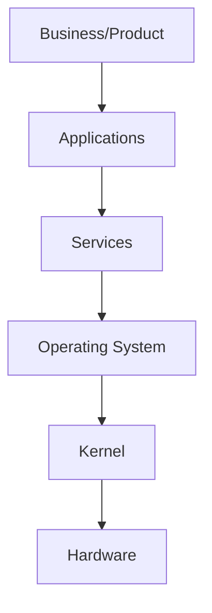

---

# Linux Inside Modern Technology

```text
YouTube
│
└── Linux

Netflix
│
└── Linux

Google
│
└── Linux

AWS
│
└── Linux

Kubernetes
│
└── Linux

Docker
│
└── Linux

PostgreSQL
│
└── Linux

Redis
│
└── Linux

OpenAI Infrastructure
│
└── Linux
```

---

# Linux Architecture Pyramid

```mermaid
flowchart BT

Applications

Services

Libraries

System Calls

Kernel

Hardware

Applications --> Services
Services --> Libraries
Libraries --> System Calls
System Calls --> Kernel
Kernel --> Hardware
```

---

# Linux Internal Subsystems

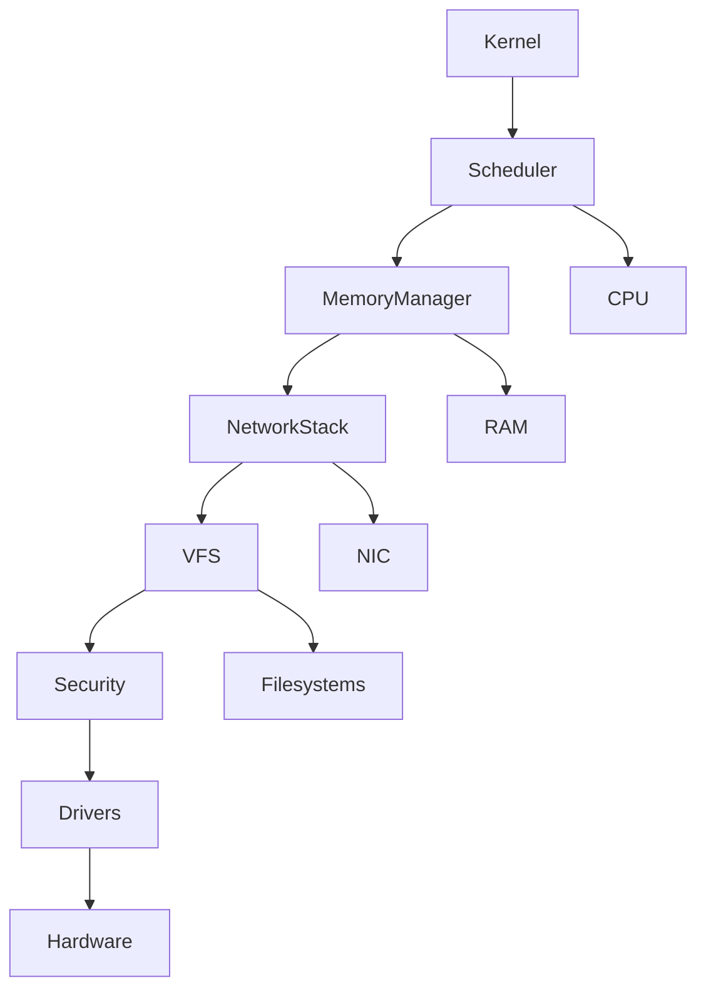

---

# Kernel Architecture Map

```text
KERNEL
│
├── Process Scheduler
│   ├── CFS
│   ├── Priorities
│   └── Context Switching
│
├── Memory Manager
│   ├── Virtual Memory
│   ├── Paging
│   ├── Swap
│   └── OOM Killer
│
├── Virtual File System
│   ├── EXT4
│   ├── XFS
│   └── BTRFS
│
├── Network Stack
│   ├── TCP
│   ├── UDP
│   ├── Routing
│   └── Firewall
│
└── Device Drivers
    ├── Disk
    ├── GPU
    ├── Network
    └── USB
```

---

# Linux Boot Journey

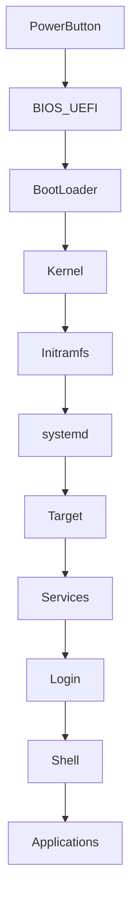

---

# Complete Filesystem Universe

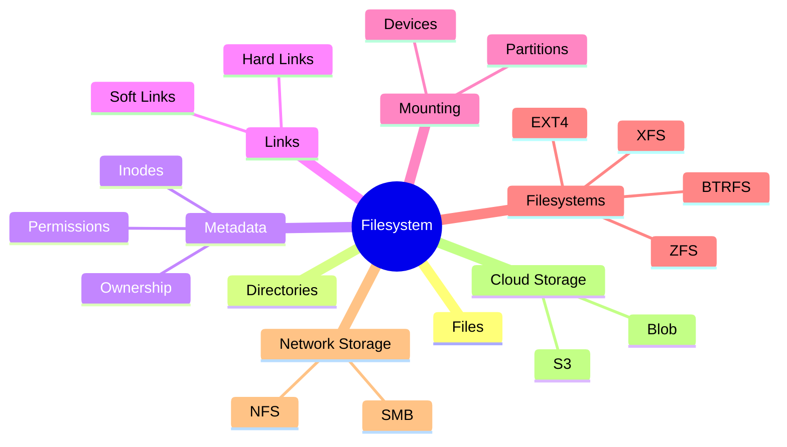

---

# Filesystem Request Flow

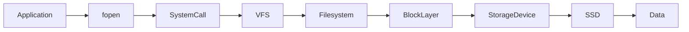

---

# Process Life Cycle

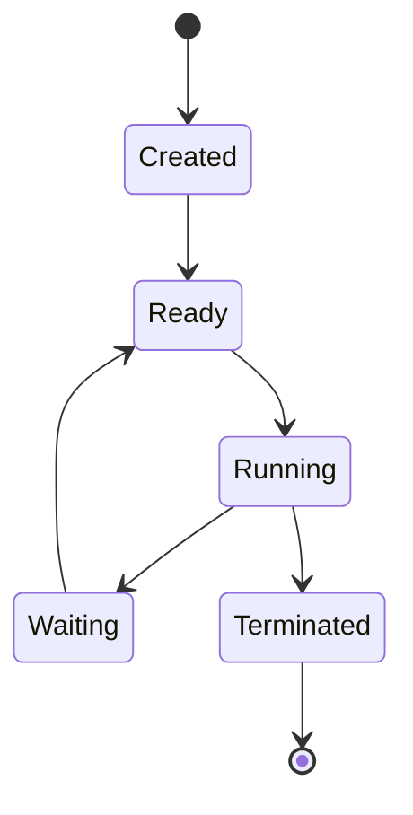

---

# Linux Process Ecosystem

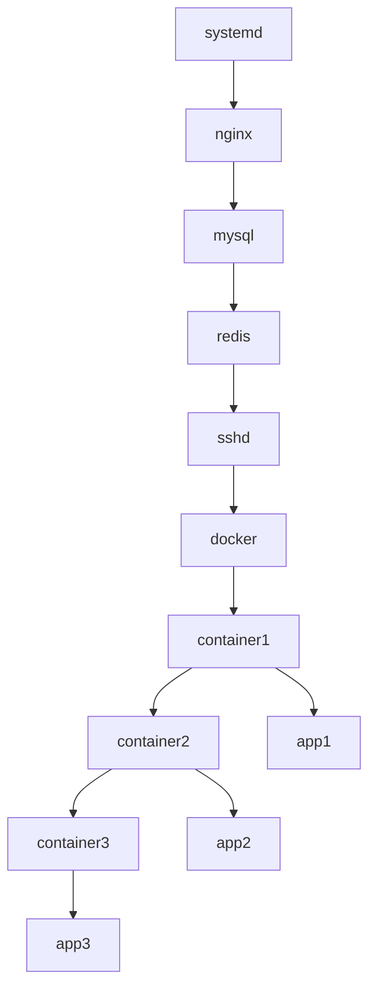

---

# CPU Scheduling Model

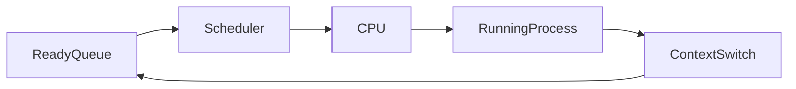

---

# Memory Management Universe

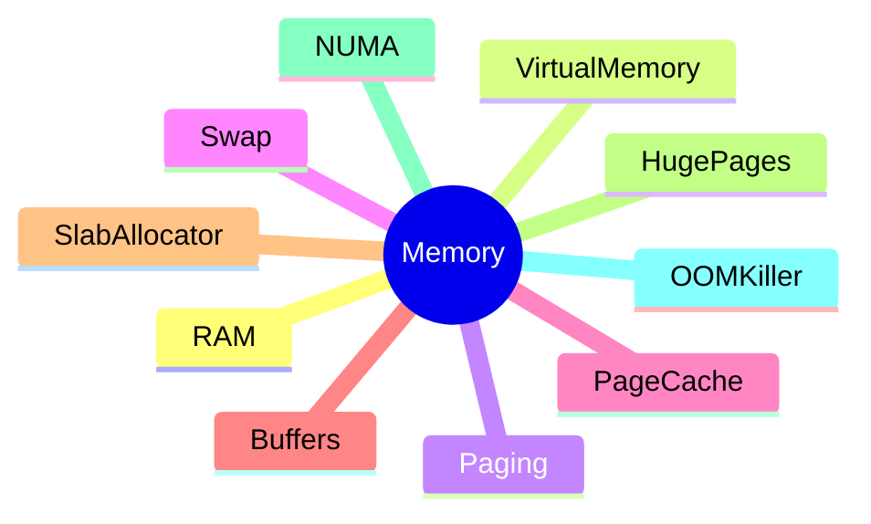

---

# Memory Flow

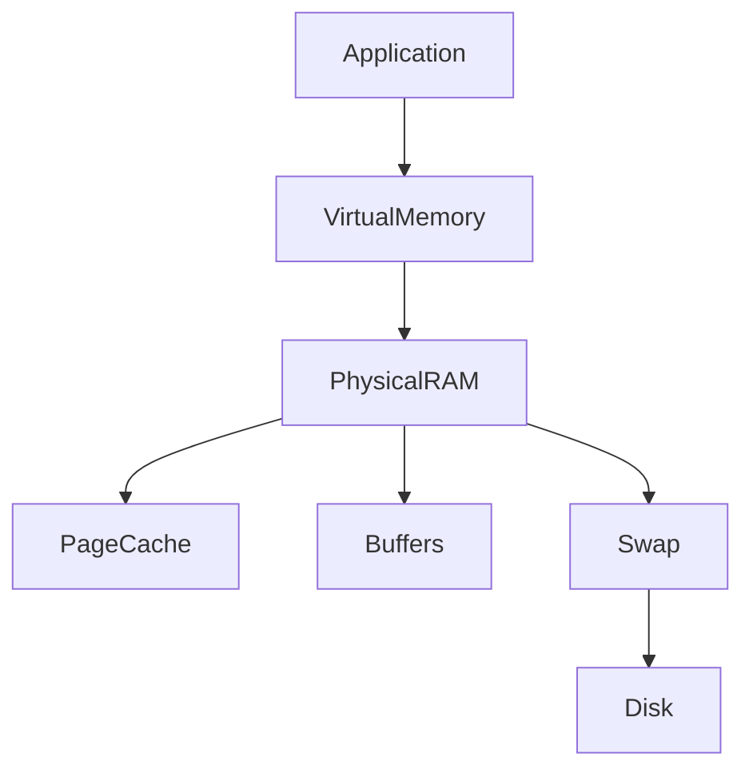

---

# Storage Stack

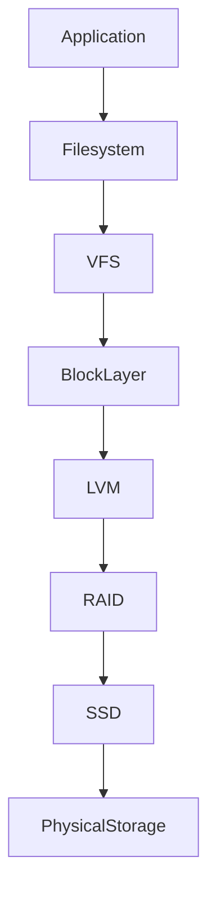

---

# Networking Master Map

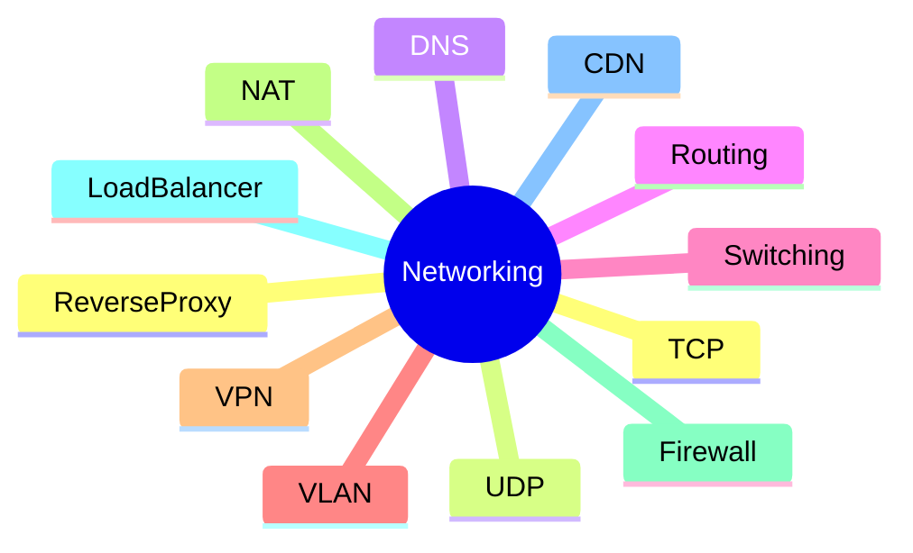

---

# Packet Journey Across The Internet

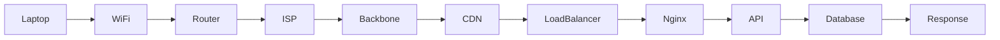

---

# DNS Resolution Flow

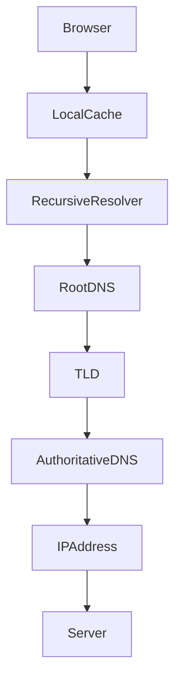

---

# TCP Three Way Handshake

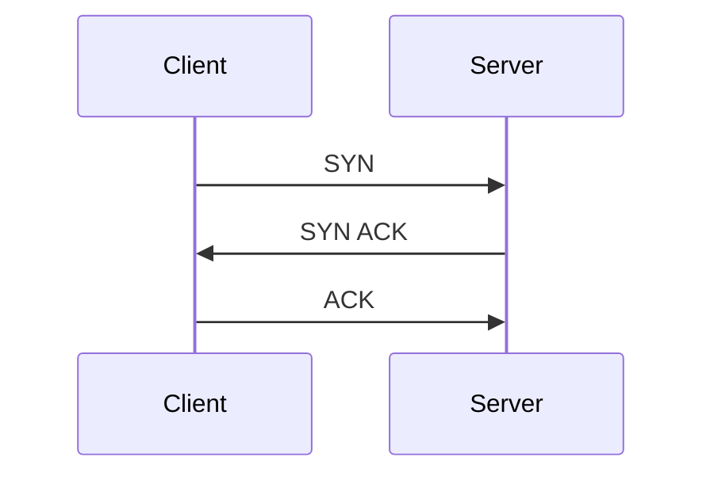

---

# Production Web Request

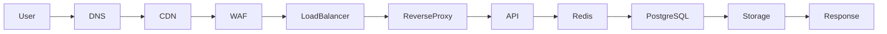

---

# Database Ecosystem

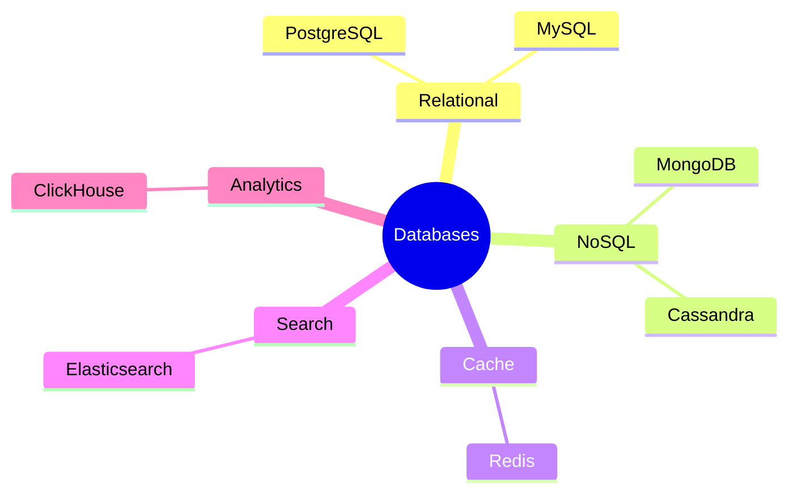

---

# Database Request Flow

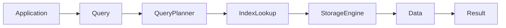

---

# Linux Security Architecture

```mermaid
mindmap
root((Security))

    Authentication

    Authorization

    PAM

    SSH

    Firewall

    SELinux

    AppArmor

    Audit

    Encryption

    SecretsManagement
```

---

# Container Architecture

```mermaid
flowchart TD

Application

--> Container

Container

--> Namespace

Container

--> Cgroups

Container

--> OverlayFS

Namespace

--> Isolation

Cgroups

--> ResourceControl
```

---

# Docker Internal Architecture

```mermaid
flowchart TD

DockerCLI

--> DockerDaemon

DockerDaemon

--> Containerd

Containerd

--> runc

runc

--> Namespaces

runc

--> Cgroups

runc

--> OverlayFS
```

---

# Kubernetes Architecture

```mermaid
flowchart LR

API_Server

--> Scheduler

--> ControllerManager

--> ETCD

WorkerNode

--> Kubelet

--> Runtime

--> Pods

Pods

--> Containers
```

---

# Kubernetes Request Flow

```mermaid
flowchart LR

User

--> Ingress

--> Service

--> Pod

--> Container

--> Database
```

---

# Cloud Infrastructure Stack

```mermaid
flowchart TD

Application

--> Containers

--> Kubernetes

--> VirtualMachines

--> Linux

--> Hypervisor

--> PhysicalServers

--> Datacenter
```

---

# Observability Stack

```mermaid
mindmap
root((Observability))

    Monitoring
        Prometheus

    Dashboards
        Grafana

    Logging
        ELK

    Tracing
        Jaeger

    Alerting
        AlertManager

    Profiling
        Pyroscope
```

---

# Incident Response Flow

```mermaid
flowchart TD

Alert

--> Detection

--> Investigation

--> Mitigation

--> Recovery

--> RootCauseAnalysis

--> Prevention
```

---

# Production Troubleshooting Framework

```text
Server Slow?
│
├── CPU High?
│   ├── top
│   ├── htop
│   └── pidstat
│
├── Memory High?
│   ├── free
│   ├── vmstat
│   └── sar
│
├── Disk Full?
│   ├── df
│   ├── du
│   └── lsof
│
├── Network Issue?
│   ├── ping
│   ├── traceroute
│   ├── ss
│   └── tcpdump
│
└── Service Issue?
    ├── systemctl
    ├── journalctl
    └── logs
```

---

# Distributed Systems Map

```mermaid
mindmap
root((Distributed Systems))

    LoadBalancers

    ServiceDiscovery

    Databases

    Replication

    Sharding

    Consensus

    EventStreaming

    MessageQueues

    Caching

    CAPTheorem

    PACELC
```

---

# Reliability Engineering

```mermaid
flowchart LR

Availability

--> Redundancy

--> Failover

--> Monitoring

--> Recovery

--> Resilience

--> Reliability
```

---

# Site Reliability Engineering Model

```mermaid
mindmap
root((SRE))

    SLI

    SLO

    SLA

    ErrorBudget

    Automation

    Monitoring

    CapacityPlanning

    IncidentManagement
```

---

# Linux → Docker → Kubernetes → Cloud → Distributed Systems

```mermaid
flowchart LR

Linux

--> Containers

--> Docker

--> Kubernetes

--> Cloud

--> MultiRegion

--> DistributedSystems

--> InternetScaleSystems
```

---

# Founder Infrastructure Thinking

```text
Developer
    ↓
Server
    ↓
Linux
    ↓
Containers
    ↓
Kubernetes
    ↓
Cloud
    ↓
Scaling
    ↓
Reliability
    ↓
Cost Optimization
    ↓
Business Success
```

---

# The Universal Infrastructure Knowledge Graph

```mermaid
graph TD

Linux --> Docker

Linux --> Kubernetes

Linux --> Networking

Linux --> Security

Linux --> Databases

Networking --> LoadBalancers

Networking --> DNS

Databases --> Replication

Databases --> Backups

Docker --> Kubernetes

Kubernetes --> Cloud

Cloud --> DistributedSystems

DistributedSystems --> Reliability

Reliability --> BusinessContinuity

BusinessContinuity --> CompanyGrowth
```

---

# The Final Truth About Linux

```text
Linux is not a subject.

Linux is the foundation of modern computing.

Linux powers:

✔ Internet
✔ Cloud
✔ Containers
✔ Kubernetes
✔ Databases
✔ AI Infrastructure
✔ Financial Systems
✔ Streaming Platforms
✔ Search Engines
✔ Smartphones
✔ Supercomputers

Understanding Linux deeply means understanding:

How software runs.
How hardware works.
How networks communicate.
How databases store data.
How clouds operate.
How distributed systems scale.

Linux is the gateway to becoming:

System Administrator
Backend Engineer
DevOps Engineer
Cloud Engineer
SRE
Platform Engineer
Infrastructure Engineer
Architect
CTO
Founder

Everything eventually leads back to Linux.
```

---

# One-Line Mental Model

```text
Hardware
   ↓
Kernel
   ↓
Operating System
   ↓
Processes
   ↓
Networking
   ↓
Applications
   ↓
Containers
   ↓
Kubernetes
   ↓
Cloud
   ↓
Distributed Systems
   ↓
Global Scale
```

**End of Linux Engineering Master Atlas**
