# Linux Universal Systems Map
## The Complete Map From Hardware to Internet Scale Systems

> Most people learn Linux as commands.
>
> Engineers learn Linux as systems.
>
> Architects learn Linux as interconnected layers.
>
> This document shows the complete map.

---

# The Entire Computing Universe

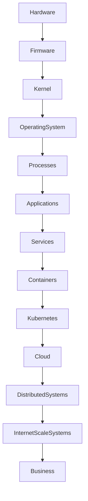

---

# The Universal Linux Stack

```text
BUSINESS
│
├── Revenue
├── Customers
├── Products
└── Growth

APPLICATIONS
│
├── APIs
├── Websites
├── Mobile Backends
├── AI Systems
└── SaaS Platforms

INFRASTRUCTURE
│
├── Kubernetes
├── Docker
├── Databases
├── Queues
├── Caches
└── Monitoring

OPERATING SYSTEM
│
└── Linux

KERNEL
│
├── Scheduling
├── Memory
├── Storage
├── Networking
└── Security

HARDWARE
│
├── CPU
├── RAM
├── SSD
├── Network Cards
└── Servers
```

---

# The Linux Knowledge Graph

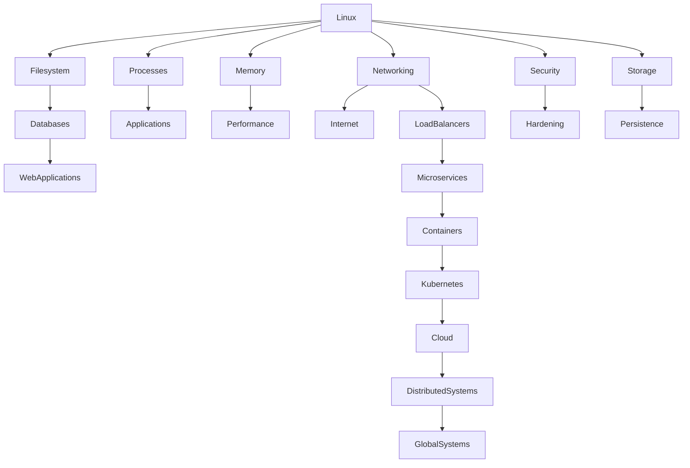

---

# Everything Starts With Hardware

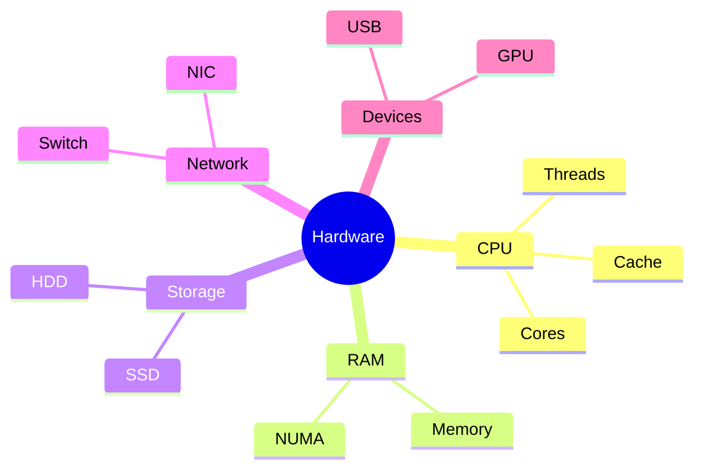

### Engineering Truth

Every production issue eventually touches:

- CPU
- Memory
- Disk
- Network

Nothing escapes hardware.

---

# How Linux Sees The World

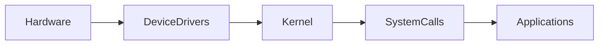

Linux acts as the translator between software and hardware.

---

# The Four Pillars Of Linux

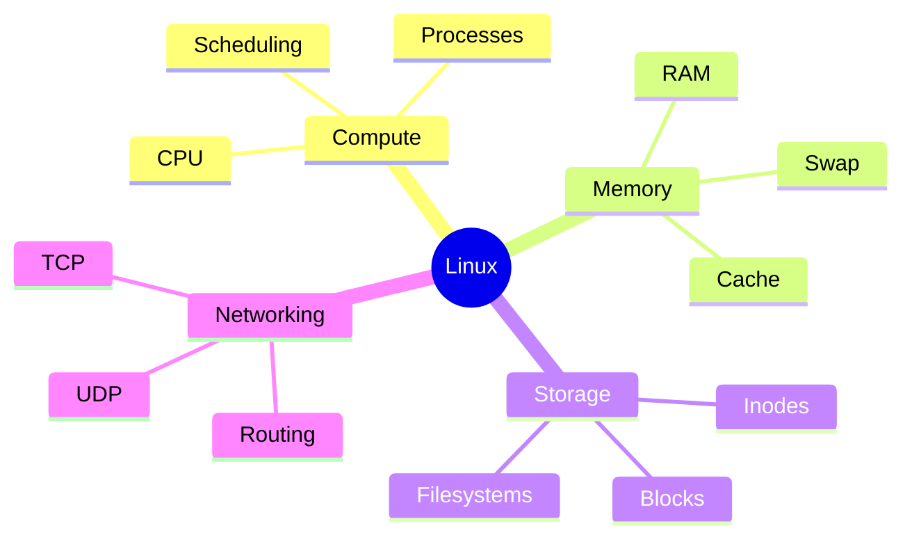

Everything Linux does belongs to one of these pillars.

---

# Linux Through An Engineering Lens

```text
User runs application
          │
          ▼

Application requests CPU
          │
          ▼

Scheduler decides execution

Application requests memory
          │
          ▼

Memory Manager allocates pages

Application requests file
          │
          ▼

VFS locates inode

Application sends network packet
          │
          ▼

TCP/IP stack transmits data
```

Linux is a resource management system.

---

# Linux Resource Flow

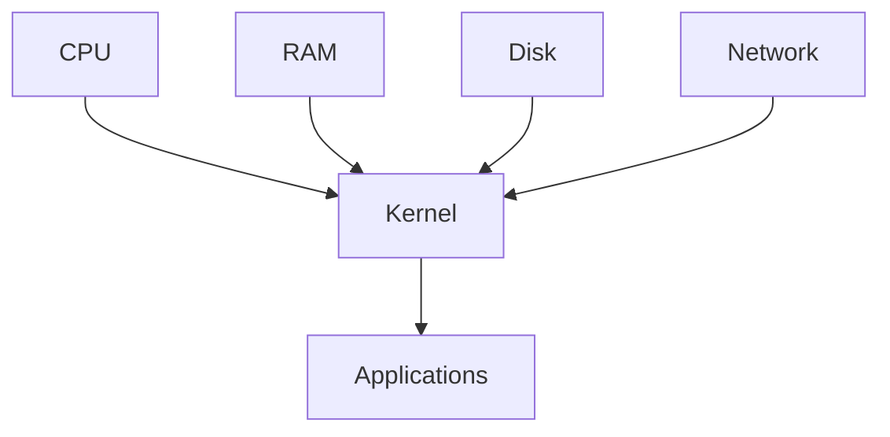

---

# The Kernel Kingdom

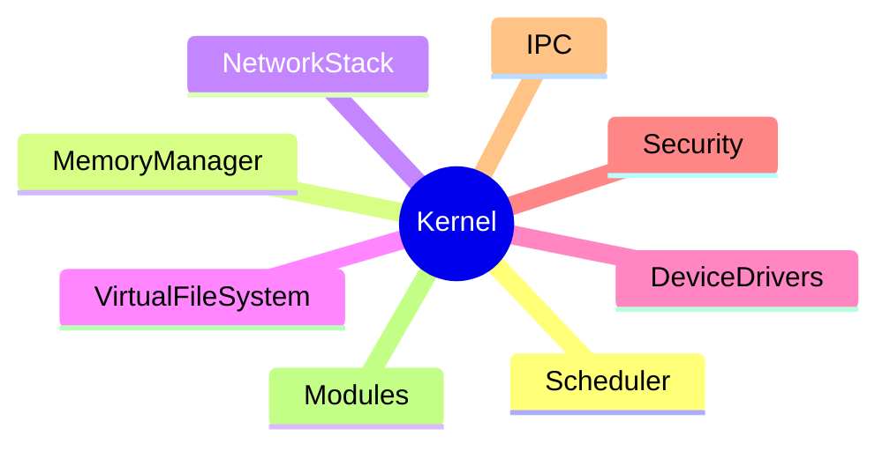

---

# Everything Is A Process

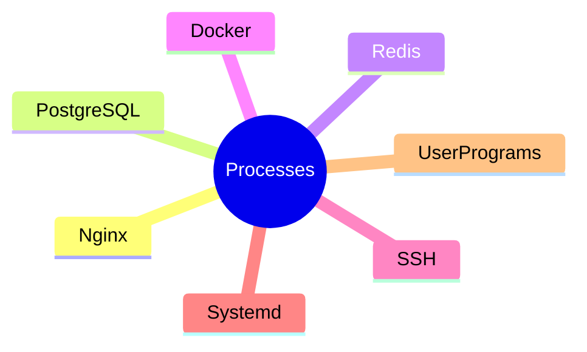

### Production Truth

A Linux server is just thousands of cooperating processes.

---

# Everything Is A File

```text
Regular Files
Directories
Devices
Sockets
Pipes
Proc Files
Sys Files
```

Linux abstracts nearly everything as files.

---

# Filesystem Relationship Map

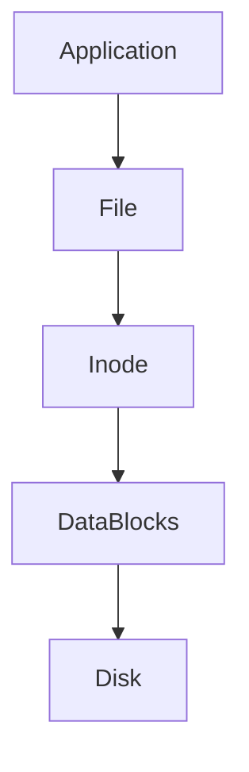

---

# Memory Relationship Map

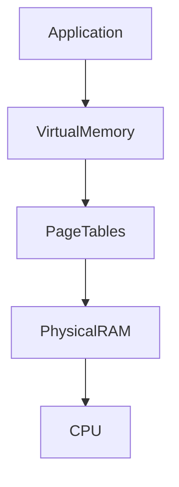

---

# Network Relationship Map


---

# Service Architecture

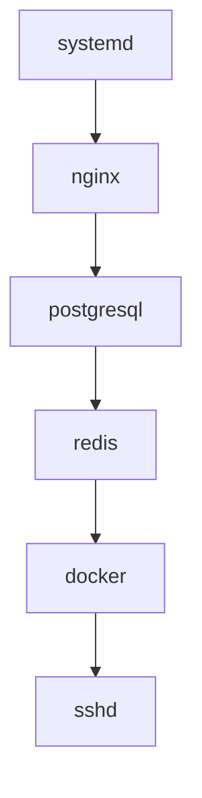

systemd is the operating system manager.

---

# Database Dependency Map

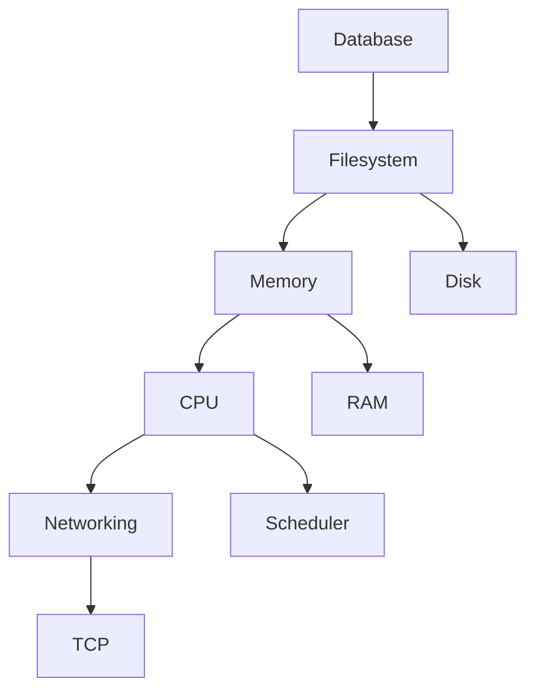

Databases depend on every Linux subsystem.

---

# Web Request Dependency Map

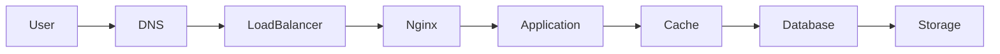

---

# Docker Dependency Map

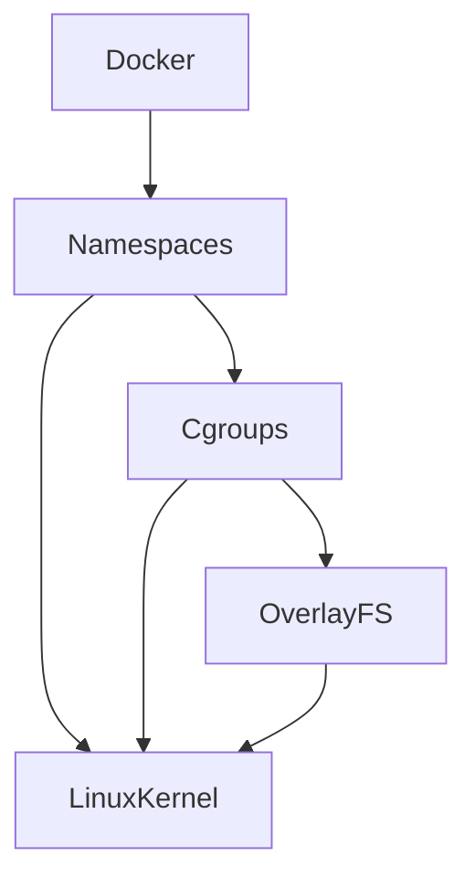

Docker is Linux features assembled together.

---

# Kubernetes Dependency Map

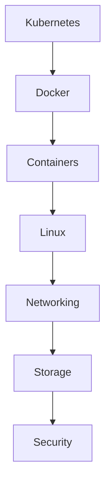

Kubernetes exists because Linux exists.

---

# Cloud Dependency Map

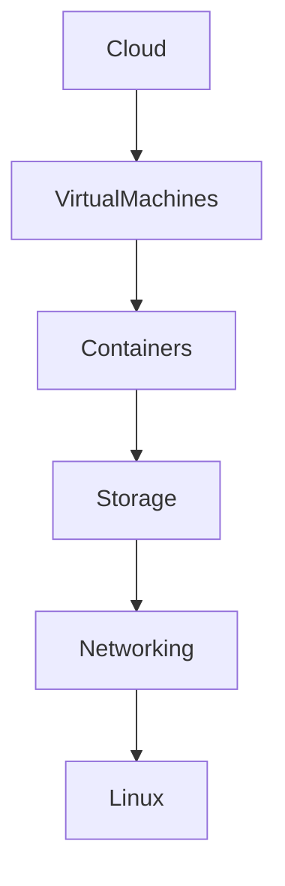

Cloud is Linux at massive scale.

---

# Distributed Systems Dependency Map

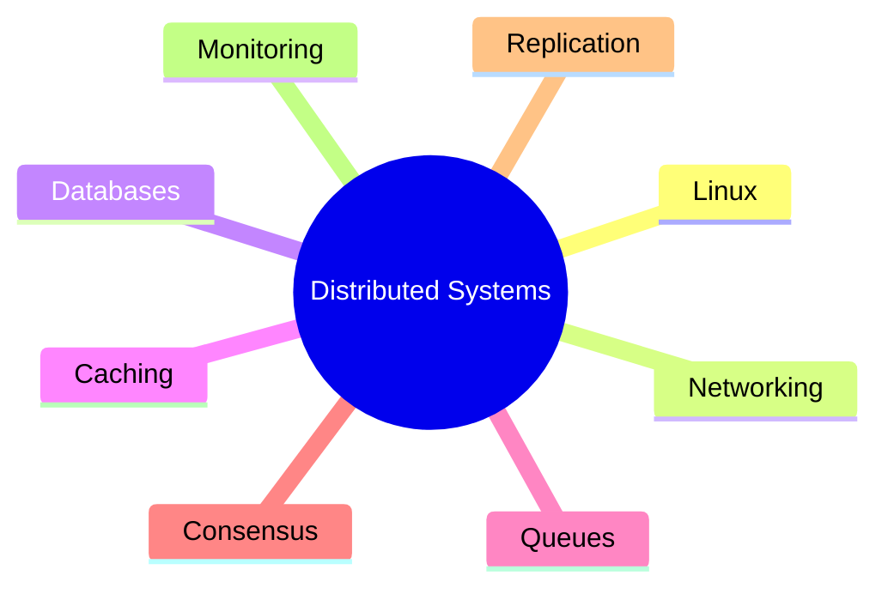

---

# Production Incident Map

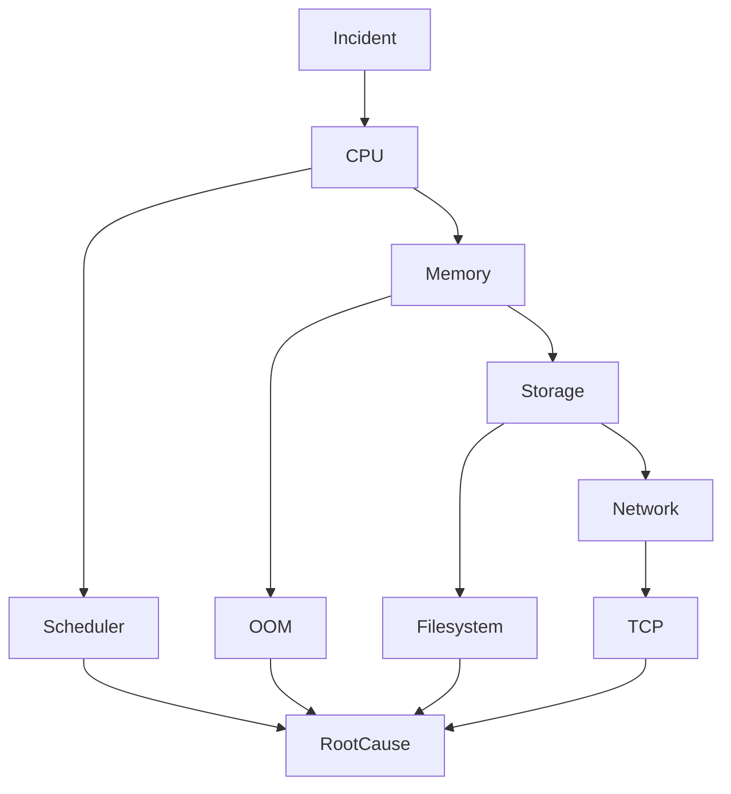

---

# Linux Troubleshooting Master Graph

```text
Server Down?
│
├── Hardware
│
├── Kernel
│
├── Service
│
├── Process
│
├── Memory
│
├── Storage
│
├── Network
│
└── Security
```

Every troubleshooting investigation eventually lands in one of these domains.

---

# Infrastructure Evolution Map


---

# Career Evolution Map

```mermaid
flowchart LR

LinuxUser

--> SysAdmin

--> BackendEngineer

--> DevOpsEngineer

--> SRE

--> PlatformEngineer

--> Architect

--> CTO

--> Founder
```

---

# The Universal Infrastructure Formula

```text
Hardware
    ↓
Kernel
    ↓
Linux
    ↓
Processes
    ↓
Networking
    ↓
Applications
    ↓
Containers
    ↓
Kubernetes
    ↓
Cloud
    ↓
Distributed Systems
    ↓
Global Scale
```

---

# The Most Important Linux Insight

```text
Linux is not an operating system.

Linux is a resource orchestration engine.

Its job is to manage:

CPU
Memory
Storage
Network

for thousands of processes simultaneously.

Everything else in modern infrastructure is built on top of that idea.
```

---

# The Final Systems Thinking Model

```mermaid
mindmap
root((Modern Computing))

    Hardware

    Linux

    Networking

    Databases

    Applications

    Containers

    Kubernetes

    Cloud

    DistributedSystems

    Reliability

    Scalability

    Business
```

> If a learner truly understands this map, every advanced topic—Docker, Kubernetes, Databases, Cloud, SRE, Platform Engineering, Distributed Systems—becomes dramatically easier because they can see how all parts fit together.
