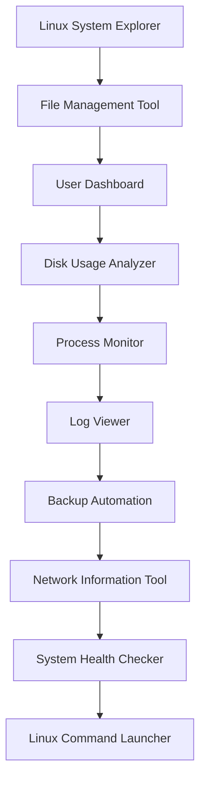

# Beginner Linux Engineering Projects

> Building Linux intuition through real systems, not tutorials.

---

# Why This Exists

Most Linux learners spend months reading commands but never develop engineering intuition.

They know:

```bash
ls
cd
cp
mv
grep
ps
top
```

But they often cannot answer:

* How does Linux organize information?
* How does Linux know which process is consuming memory?
* How does Linux know disk usage?
* Where does user information live?
* How does networking actually work?
* What happens internally when a command executes?
* How do administrators investigate problems?

This section exists to bridge the gap between:

```text
Command User
        ↓
Linux Thinker
```

The goal is not merely to build projects.

The goal is to build a mental model of Linux itself.

---

# The Problem With Traditional Learning

Many courses teach Linux like this:

```text
Learn Command
      ↓
Memorize Options
      ↓
Take Quiz
      ↓
Done
```

Real engineering does not work that way.

Production environments require understanding:

```text
System
      ↓
Components
      ↓
Relationships
      ↓
Failures
      ↓
Troubleshooting
```

Projects provide that understanding.

---

# Mental Model

Think of Linux as a city.

```text
Linux System
│
├── Citizens → Users
├── Buildings → Files
├── Roads → Networks
├── Factories → Processes
├── Warehouses → Storage
├── Police → Security
├── Government → Kernel
└── Utilities → Services
```

Every project explores one part of this city.

By the end, you will understand how the city operates as a complete system.

---

# Learning Philosophy

Each project follows the same pattern:

```text
Understand Problem
          ↓
Observe Linux
          ↓
Collect Data
          ↓
Automate Tasks
          ↓
Build Tool
          ↓
Debug Failures
          ↓
Improve Design
```

This mirrors real engineering work.

---

# What You Will Learn

These projects introduce:

### Filesystems

Understanding:

* Files
* Directories
* Paths
* Metadata
* Permissions

---

### Processes

Understanding:

* Running programs
* Process lifecycle
* CPU utilization
* Memory consumption

---

### Users

Understanding:

* Accounts
* Authentication
* Permissions
* Ownership

---

### Storage

Understanding:

* Disk usage
* Filesystem capacity
* Storage monitoring

---

### Networking

Understanding:

* Interfaces
* IP addresses
* DNS
* Connectivity

---

### Monitoring

Understanding:

* System health
* Metrics
* Resource utilization

---

### Automation

Understanding:

* Shell scripting
* Scheduling
* Repetitive tasks

---

# Beginner Project Roadmap

```text
Project 1
Linux System Explorer
        ↓
Project 2
File Management Tool
        ↓
Project 3
User Information Dashboard
        ↓
Project 4
Disk Usage Analyzer
        ↓
Project 5
Process Monitor
        ↓
Project 6
Log Viewer
        ↓
Project 7
Backup Automation Tool
        ↓
Project 8
Network Information Tool
        ↓
Project 9
System Health Checker
        ↓
Project 10
Linux Command Launcher
```

Each project builds on previous knowledge.

---

# Project 1: Linux System Explorer

## Problem

Most users do not understand their Linux environment.

Questions include:

* Which OS version am I running?
* Which kernel version exists?
* What hardware is available?
* How much memory exists?

## Concepts Learned

* Linux distributions
* Kernel basics
* System information
* Hardware visibility

## Linux Internals

Explore:

```text
/proc
/sys
/etc/os-release
uname
hostname
```

## Outcome

Understand how Linux exposes system information.

---

# Project 2: File Management Tool

## Problem

Managing files manually becomes difficult.

## Concepts Learned

* File creation
* Directory structures
* File movement
* File searching

## Linux Internals

Explore:

```text
inode
directory entries
filesystem hierarchy
```

## Outcome

Understand how Linux stores and organizes data.

---

# Project 3: User Information Dashboard

## Problem

Systems contain multiple users.

Administrators must understand:

* Who exists?
* Who is logged in?
* What permissions exist?

## Concepts Learned

* Users
* Groups
* Ownership

## Linux Internals

Explore:

```text
/etc/passwd
/etc/group
/etc/shadow
```

## Outcome

Understand Linux identity management.

---

# Project 4: Disk Usage Analyzer

## Problem

Production systems frequently fail due to full disks.

Example:

```text
Database Stops
      ↓
Application Fails
      ↓
Customers Impacted
```

Root cause:

```text
Disk Full
```

## Concepts Learned

* Storage
* Capacity
* Filesystem usage

## Linux Internals

Explore:

```bash
df
du
lsblk
mount
```

## Outcome

Understand storage visibility.

---

# Project 5: Process Monitor

## Problem

Applications consume resources.

Administrators must know:

* Which process is running?
* Which process is misbehaving?

## Concepts Learned

* Process lifecycle
* CPU
* Memory

## Linux Internals

Explore:

```text
/proc
scheduler
process table
```

## Outcome

Understand Linux process management.

---

# Project 6: Log Viewer

## Problem

Logs explain system behavior.

Without logs:

```text
Failure
      ↓
Guessing
```

With logs:

```text
Failure
      ↓
Evidence
      ↓
Root Cause
```

## Concepts Learned

* Logging
* Event analysis
* Troubleshooting

## Linux Internals

Explore:

```text
/var/log
journalctl
system logs
```

## Outcome

Develop troubleshooting skills.

---

# Project 7: Backup Automation Tool

## Problem

Data loss is inevitable.

Hardware fails.

Humans make mistakes.

Applications delete data.

## Concepts Learned

* Backups
* Automation
* Recovery

## Linux Internals

Explore:

```bash
tar
rsync
cron
```

## Outcome

Understand data protection.

---

# Project 8: Network Information Tool

## Problem

Modern systems communicate through networks.

Every engineer eventually asks:

```text
Why can't this server connect?
```

## Concepts Learned

* IP addresses
* Routing
* DNS

## Linux Internals

Explore:

```bash
ip
ss
ping
dig
host
```

## Outcome

Understand Linux networking fundamentals.

---

# Project 9: System Health Checker

## Problem

Engineers need quick visibility.

Questions include:

* Is CPU healthy?
* Is memory healthy?
* Is disk healthy?
* Is network healthy?

## Concepts Learned

* Monitoring
* Metrics
* Health checks

## Linux Internals

Explore:

```text
/proc
/sys
kernel statistics
```

## Outcome

Think like an operations engineer.

---

# Project 10: Linux Command Launcher

## Problem

Frequently used administrative commands are repetitive.

Automation improves productivity.

## Concepts Learned

* Menus
* Scripts
* Automation workflows

## Linux Internals

Combines:

```text
Processes
Filesystems
Networking
Users
Monitoring
```

## Outcome

Build your first Linux administration toolkit.

---

# How These Projects Connect



Every project reinforces previous concepts.

Knowledge accumulates instead of resetting.

---

# Real-World Production Connection

Although these are beginner projects, the concepts power large systems.

| Beginner Project | Production Equivalent       |
| ---------------- | --------------------------- |
| System Explorer  | Infrastructure Inventory    |
| File Tool        | Storage Management Platform |
| User Dashboard   | Identity Management System  |
| Disk Analyzer    | Capacity Planning Tool      |
| Process Monitor  | Observability Platform      |
| Log Viewer       | Centralized Logging Stack   |
| Backup Tool      | Disaster Recovery Platform  |
| Network Tool     | Network Operations Center   |
| Health Checker   | Monitoring System           |
| Command Launcher | Internal Operations Portal  |

Small projects teach big systems.

---

# Common Mistakes

## Mistake 1

Learning commands without understanding.

Bad:

```bash
ps aux
```

Good:

Understand what a process actually is.

---

## Mistake 2

Ignoring troubleshooting.

Always ask:

```text
How would this fail?
```

---

## Mistake 3

Building without observing.

Linux provides information everywhere.

Learn to inspect before changing.

---

## Mistake 4

Thinking projects are the goal.

Projects are merely vehicles.

The real goal is understanding systems.

---

# Engineering Mindset

A beginner asks:

```text
What command fixes this?
```

An engineer asks:

```text
Why did this happen?
```

A senior engineer asks:

```text
How can we prevent this permanently?
```

These projects are designed to help you move through those stages.

---

# Success Criteria

You are ready for the Intermediate Projects section when you can:

* Navigate Linux confidently
* Understand filesystem structures
* Analyze disk usage
* Investigate processes
* Read logs effectively
* Troubleshoot basic networking
* Write useful shell scripts
* Automate repetitive tasks
* Perform basic monitoring

At that point, you stop being merely a Linux user and begin becoming a Linux engineer.

---

# Next Step

Start with:

```text
Project 01
Linux System Explorer
```

Do not rush.

The goal is not to finish quickly.

The goal is to build intuition that will remain useful throughout your career as:

* Linux Administrator
* Backend Engineer
* DevOps Engineer
* Cloud Engineer
* SRE
* Platform Engineer
* System Architect
* Startup Founder
