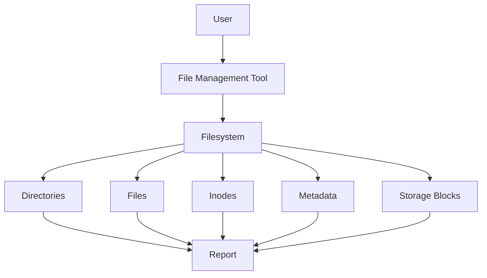
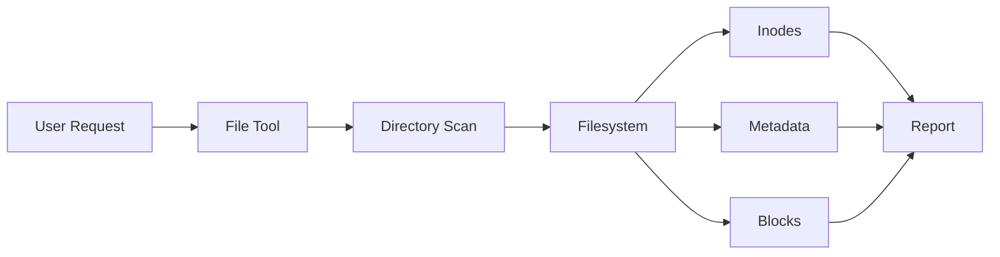

# Project 02: File Management Tool

> Understanding how Linux stores, organizes, and manages data.

---

# Why This Project Exists

Every application, database, web server, container, and operating system component ultimately depends on one fundamental concept:

```text
Data
  ↓
Files
  ↓
Filesystem
```

Whether you are:

* Opening a photo
* Reading source code
* Running a Docker container
* Querying a database
* Viewing logs

Linux is interacting with files.

Most beginners think files are simple objects:

```text
document.txt
image.png
app.js
```

But Linux sees something very different.

Linux sees:

```text
Inodes
Metadata
Permissions
Blocks
Directories
Filesystem Structures
```

This project teaches how Linux actually manages files and how engineers build tools to work with them.

---

# Problem It Solves

Imagine a production server:

```text
100 GB Storage
      ↓
95 GB Used
      ↓
Server Slow
      ↓
Application Failure
```

The first question becomes:

```text
Where is the storage being used?
```

Or:

```text
Which files are consuming space?
```

Or:

```text
Which files were modified recently?
```

Or:

```text
Which files belong to a particular user?
```

Manually finding answers becomes difficult as systems grow.

Engineers solve this by building tools.

---

# Mental Model

Think of a filesystem as a giant library.

```text
Filesystem
│
├── Shelves        → Directories
├── Books          → Files
├── Catalog IDs    → Inodes
├── Librarian      → Kernel
├── Access Rules   → Permissions
└── Storage Room   → Disk Blocks
```

Users see filenames.

Linux tracks much deeper information.

---

# Learning Objectives

By completing this project, you will understand:

* Linux filesystem hierarchy
* Files and directories
* Absolute and relative paths
* Inodes
* Metadata
* Ownership
* Permissions
* File searching
* File statistics
* Storage usage
* Bash scripting
* Automation

---

# First Principles

When you create a file:

```bash
touch report.txt
```

Most people think:

```text
File Created
```

Reality:

```text
Kernel
   ↓
Allocate Inode
   ↓
Allocate Metadata
   ↓
Create Directory Entry
   ↓
Allocate Blocks
   ↓
Expose File
```

Many layers exist beneath the surface.

---

# Understanding Files

A file is not simply data.

A file consists of:

```text
File
│
├── Name
├── Owner
├── Group
├── Permissions
├── Size
├── Creation Metadata
├── Modification Metadata
└── Data Blocks
```

Linux stores this information separately.

---

# Understanding Inodes

One of the most important Linux concepts.

Consider:

```bash
touch notes.txt
```

Linux creates:

```text
Directory Entry
       ↓
Filename
       ↓
Inode Number
       ↓
Metadata
       ↓
Data Blocks
```

Visualization:

```text
notes.txt
    │
    ▼
Inode 13501
    │
    ├── Owner
    ├── Permissions
    ├── Size
    ├── Timestamps
    └── Block Locations
```

The filename is not the file.

The inode is the file.

---

# Linux Filesystem Hierarchy

Before building the tool, understand where files live.

```text
/
├── bin
├── boot
├── dev
├── etc
├── home
├── lib
├── media
├── mnt
├── opt
├── proc
├── root
├── run
├── srv
├── sys
├── tmp
├── usr
└── var
```

Every directory has a purpose.

---

# Architecture



---

# Project Goal

Build a command-line tool that can:

* Browse directories
* Count files
* Count directories
* Find large files
* Find recently modified files
* Display file information
* Display inode information
* Generate reports

Example:

```text
=================================
FILE MANAGEMENT REPORT
=================================

Directory: /home/user

Total Files: 421

Total Directories: 37

Largest File:
database_backup.tar

Size:
2.1 GB

Recently Modified:
logs/error.log

=================================
```

---

# Project Structure

```text
file-management-tool/
│
├── file-manager.sh
│
├── reports/
│   └── filesystem-report.txt
│
└── README.md
```

---

# Step 1: Create Project

```bash
mkdir file-management-tool

cd file-management-tool

mkdir reports

touch file-manager.sh

chmod +x file-manager.sh
```

---

# Step 2: Script Header

```bash
#!/bin/bash

echo "================================="
echo "FILE MANAGEMENT TOOL"
echo "================================="
```

---

# Step 3: Accept Directory Input

```bash
TARGET_DIR=$1
```

Example:

```bash
./file-manager.sh /home
```

---

# Step 4: Verify Directory Exists

```bash
if [ ! -d "$TARGET_DIR" ]; then
    echo "Directory does not exist."
    exit 1
fi
```

---

# Exploring Directory Contents

## Why It Matters

Directories are fundamental filesystem structures.

Command:

```bash
ls -lah
```

Tool:

```bash
echo "Directory Contents:"
ls -lah "$TARGET_DIR"
```

---

# Counting Files

## Why It Matters

Large systems may contain millions of files.

Command:

```bash
find . -type f | wc -l
```

Tool:

```bash
FILE_COUNT=$(find "$TARGET_DIR" -type f | wc -l)

echo "Total Files: $FILE_COUNT"
```

---

# Counting Directories

Command:

```bash
find . -type d | wc -l
```

Tool:

```bash
DIR_COUNT=$(find "$TARGET_DIR" -type d | wc -l)

echo "Total Directories: $DIR_COUNT"
```

---

# Finding Largest Files

## Production Importance

Storage outages often result from:

```text
Unexpected Large Files
```

Command:

```bash
find . -type f -exec du -h {} +
```

Better:

```bash
find . -type f -exec du -h {} + | sort -hr
```

Tool:

```bash
echo "Largest Files:"

find "$TARGET_DIR" \
-type f \
-exec du -h {} + \
| sort -hr \
| head -10
```

---

# Finding Recently Modified Files

## Production Use Cases

Engineers frequently ask:

```text
What changed recently?
```

Command:

```bash
find . -mtime -1
```

Tool:

```bash
echo "Recently Modified Files:"

find "$TARGET_DIR" -mtime -1
```

---

# Exploring File Metadata

Linux stores metadata separately.

Command:

```bash
stat file.txt
```

Example:

```text
File
Size
Owner
Group
Permissions
Access Time
Modify Time
Change Time
```

Tool:

```bash
stat "$TARGET_DIR"
```

---

# Exploring Inodes

One of Linux's most important concepts.

Command:

```bash
ls -i
```

Example:

```text
13501 file.txt
13502 image.png
13503 notes.md
```

Tool:

```bash
echo "Inode Information"

ls -li "$TARGET_DIR"
```

---

# Understanding Data Flow



---

# Generating Reports

Save output:

```bash
./file-manager.sh /home > reports/filesystem-report.txt
```

Useful for:

* Capacity planning
* Audits
* Compliance
* Troubleshooting

---

# Linux Internals Deep Dive

When running:

```bash
ls
```

Linux performs:

```text
User Command
      ↓
System Call
      ↓
Kernel
      ↓
Filesystem Driver
      ↓
Directory Lookup
      ↓
Inode Lookup
      ↓
Return Results
```

This process happens thousands of times daily.

---

# Real-World Production Example

A server reports:

```text
Disk Usage: 98%
```

Investigation:

```bash
df -h
```

Then:

```bash
du -sh /*
```

Then:

```bash
find /var -type f -size +500M
```

Root cause:

```text
Application Logs
```

Solution:

```text
Rotate Logs
Archive Data
Increase Storage
```

This project teaches the same workflow.

---

# Docker Connection

Containers are built from filesystems.

Docker images consist of:

```text
Layers
    ↓
Files
    ↓
Directories
```

Commands:

```bash
docker image inspect
```

ultimately relate to filesystem concepts.

Understanding filesystems improves Docker knowledge dramatically.

---

# Kubernetes Connection

Pods use:

```text
Volumes
Persistent Volumes
ConfigMaps
Secrets
```

All rely on Linux filesystem concepts.

Without filesystem understanding, Kubernetes storage becomes difficult.

---

# Database Connection

Databases are file-heavy systems.

Example:

```text
PostgreSQL
     ↓
Data Files
     ↓
WAL Files
     ↓
Indexes
```

Everything eventually becomes files on storage.

---

# Performance Considerations

Filesystem performance depends on:

* Storage type
* Number of files
* Directory size
* Cache usage
* Filesystem implementation

Example:

```text
Directory with 50 Files
```

versus

```text
Directory with 5 Million Files
```

Performance changes dramatically.

---

# Security Considerations

Files contain:

* Credentials
* Logs
* Secrets
* Source code
* Certificates

Improper permissions can expose sensitive data.

Example:

```bash
chmod 777 secret.txt
```

Dangerous in production.

---

# Troubleshooting

## Problem

Permission denied.

Check:

```bash
ls -l
```

---

## Problem

Cannot access file.

Verify:

```bash
stat filename
```

---

## Problem

Disk usage high.

Investigate:

```bash
du -sh *
```

---

## Problem

File missing.

Search:

```bash
find / -name filename
```

---

# Common Mistakes

## Mistake 1

Thinking filename equals file.

Reality:

```text
Filename
      ↓
Inode
      ↓
Data
```

---

## Mistake 2

Ignoring filesystem hierarchy.

Linux organization matters.

---

## Mistake 3

Ignoring file ownership.

Ownership affects everything.

---

## Mistake 4

Ignoring inode limits.

Systems can run out of inodes before storage.

---

# Engineering Mindset

Beginner:

```text
Where is my file?
```

Engineer:

```text
Which inode stores this file?
```

Senior Engineer:

```text
How efficiently does this filesystem scale?
```

Architect:

```text
How will this design behave with billions of files?
```

Always think deeper.

---

# Interview Questions

### Beginner

What is a file?

### Beginner

What command displays file metadata?

### Intermediate

What is an inode?

### Intermediate

How does Linux locate a file?

### Intermediate

Difference between absolute and relative paths?

### Advanced

Why can a filesystem run out of inodes?

### Advanced

How does ext4 locate file blocks?

### Advanced

How do databases use filesystems?

---

# Cheat Sheet

```bash
pwd

ls -lah

find

du -sh

df -h

stat

ls -i

tree

touch

mkdir

cp

mv

rm

ln

find . -mtime -1

find . -size +100M
```

---

# Project Completion Checklist

* [ ] Created project directory
* [ ] Built file management script
* [ ] Counted files
* [ ] Counted directories
* [ ] Found large files
* [ ] Found recently modified files
* [ ] Explored metadata
* [ ] Explored inode information
* [ ] Generated filesystem report
* [ ] Understood filesystem hierarchy
* [ ] Understood inodes
* [ ] Understood Linux file organization

---

# What You'll Understand After This Project

You will understand:

* How Linux organizes data
* How files are stored internally
* What inodes are
* How directories work
* How metadata works
* How engineers investigate storage problems
* How production systems manage files
* Why filesystems are foundational to Linux

You are no longer just using files.

You are beginning to understand how Linux manages them.
