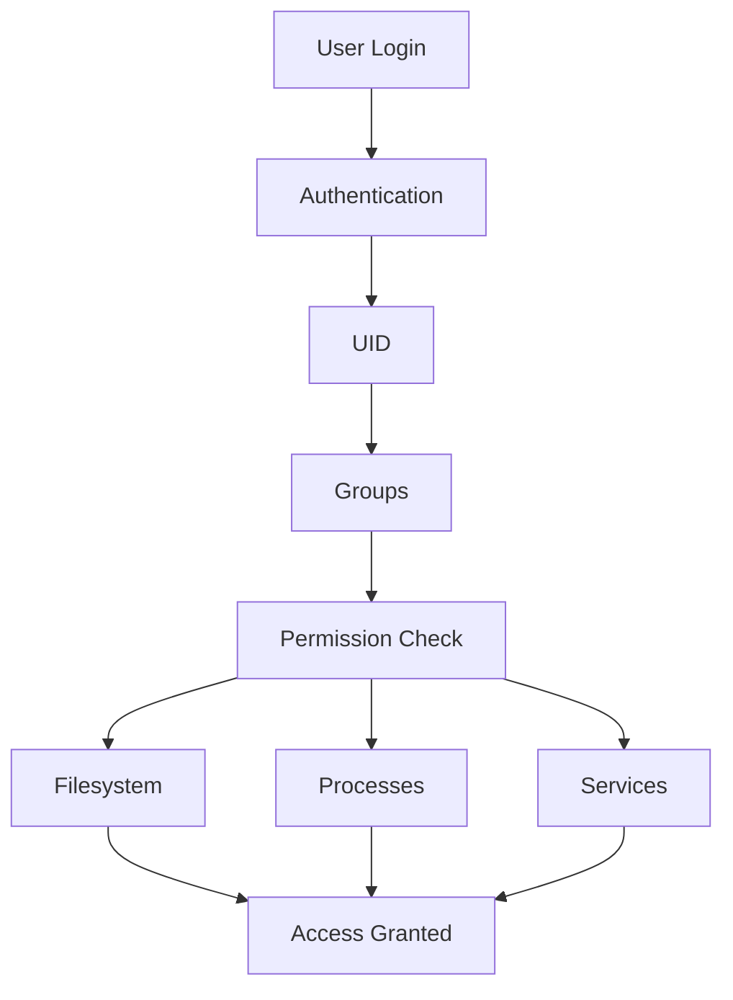

# Project 03: User Information Dashboard

> Understanding how Linux identifies, authenticates, authorizes, and tracks users.

---

# Why This Project Exists

Every Linux system exists to serve users.

Whether it is:

* A laptop
* A cloud VM
* A Kubernetes node
* A database server
* A web server
* A supercomputer

There is always a fundamental question:

```text
Who is using the system?
```

Linux is a multi-user operating system.

This means multiple people, services, applications, and processes can coexist on the same machine.

Understanding users is essential because users determine:

* Access control
* Security
* Ownership
* Auditing
* Accountability
* Resource usage

Many security incidents, outages, and operational failures are related to user misconfiguration.

This project teaches how Linux manages identities and how engineers investigate user-related information.

---

# Problem It Solves

Imagine a production server.

An application suddenly stops working.

The error says:

```text
Permission denied
```

Questions immediately arise:

* Which user is running the application?
* Which group does that user belong to?
* Who owns the file?
* Who changed permissions?
* Is the account locked?
* Has the user recently logged in?

Without understanding Linux users, troubleshooting becomes guesswork.

---

# Mental Model

Think of Linux as a large office building.

```text
Linux System
│
├── Employees          → Users
├── Departments        → Groups
├── Office Keys        → Permissions
├── Security Desk      → Authentication
├── Access Policies    → Authorization
└── Audit Logs         → Accountability
```

The operating system must know:

```text
Who are you?
        ↓
Can you enter?
        ↓
What can you access?
        ↓
What did you do?
```

This is the foundation of Linux security.

---

# Learning Objectives

By completing this project, you will understand:

* Linux users
* Linux groups
* User IDs (UID)
* Group IDs (GID)
* User ownership
* Group ownership
* Authentication basics
* Authorization basics
* User sessions
* Login tracking
* System accounts
* Service accounts
* User auditing
* User-related troubleshooting

---

# First Principles

Most beginners think:

```text
User
 ↓
Login
 ↓
Use System
```

Linux internally sees:

```text
Username
      ↓
UID
      ↓
Groups
      ↓
Permissions
      ↓
Access Decisions
```

The username is mostly for humans.

Linux primarily uses numeric identifiers.

---

# Linux User Architecture



---

# Understanding Users

Display current user:

```bash
whoami
```

Example:

```text
vipul
```

Linux internally stores:

```text
Username: vipul
UID: 1000
```

The UID is the actual identity Linux uses.

---

# Understanding User IDs

Display user information:

```bash
id
```

Example:

```text
uid=1000(vipul)
gid=1000(vipul)
groups=1000(vipul),27(sudo)
```

Linux evaluates permissions using these IDs.

---

# Understanding Groups

Groups simplify permission management.

Instead of:

```text
Grant Access
To 100 Users
```

Linux uses:

```text
Create Group
      ↓
Add Users
      ↓
Grant Group Access
```

Example:

```text
developers
admins
docker
sudo
database
```

---

# Linux User Database

Linux stores user information in:

```text
/etc/passwd
```

Example:

```text
vipul:x:1000:1000:Vipul:/home/vipul:/bin/bash
```

Fields:

```text
Username
Password Placeholder
UID
GID
Description
Home Directory
Shell
```

---

# Linux Group Database

Stored in:

```text
/etc/group
```

Example:

```text
sudo:x:27:vipul
```

---

# Password Storage

Passwords are NOT stored in:

```text
/etc/passwd
```

They are stored in:

```text
/etc/shadow
```

Example:

```text
Encrypted Password Hash
Password Aging
Expiration Information
```

Security reason:

```text
Regular Users
Cannot Read Password Hashes
```

---

# System Users vs Human Users

Linux contains many users.

Example:

```bash
cat /etc/passwd
```

You may see:

```text
root
daemon
syslog
www-data
mysql
postgres
nginx
```

These are service accounts.

They allow services to run with limited privileges.

---

# Understanding Root

Root is the superuser.

```text
UID = 0
```

Root can:

```text
Read Everything
Write Everything
Kill Any Process
Modify Any Configuration
```

This power is why root access must be protected.

---

# Project Goal

Build a dashboard that collects:

* Current user
* User ID
* Group ID
* User groups
* Logged-in users
* Recent logins
* User count
* System users
* Home directories
* Shell information

Example output:

```text
=================================
USER INFORMATION DASHBOARD
=================================

Current User:
vipul

UID:
1000

Primary Group:
1000

Groups:
sudo,docker

Logged In Users:
3

Total Human Users:
5

System Users:
42

Recent Logins:
...

=================================
```

---

# Project Structure

```text
user-information-dashboard/
│
├── dashboard.sh
│
├── reports/
│   └── user-report.txt
│
└── README.md
```

---

# Step 1: Create Project

```bash
mkdir user-information-dashboard

cd user-information-dashboard

mkdir reports

touch dashboard.sh

chmod +x dashboard.sh
```

---

# Step 2: Dashboard Header

```bash
#!/bin/bash

echo "================================="
echo "USER INFORMATION DASHBOARD"
echo "================================="
```

---

# Current User

Command:

```bash
whoami
```

Script:

```bash
echo "Current User:"
whoami
echo
```

---

# Display UID and GID

Command:

```bash
id
```

Script:

```bash
echo "Identity Information:"
id
echo
```

---

# Display Groups

Command:

```bash
groups
```

Script:

```bash
echo "Groups:"
groups
echo
```

---

# Display Logged-in Users

Command:

```bash
who
```

Script:

```bash
echo "Logged In Users:"
who
echo
```

---

# Count Logged-in Users

Command:

```bash
who | wc -l
```

Script:

```bash
echo "Logged In User Count:"
who | wc -l
echo
```

---

# Display Recent Logins

Command:

```bash
last
```

Script:

```bash
echo "Recent Logins:"
last | head
echo
```

---

# Display Human Users

Most Linux distributions assign:

```text
UID >= 1000
```

to human users.

Command:

```bash
awk -F: '$3 >= 1000 {print $1}' /etc/passwd
```

Script:

```bash
echo "Human Users:"

awk -F: '$3 >= 1000 {print $1}' /etc/passwd

echo
```

---

# Count Human Users

```bash
awk -F: '$3 >= 1000 {count++} END {print count}' /etc/passwd
```

---

# Display System Users

Command:

```bash
awk -F: '$3 < 1000 {print $1}' /etc/passwd
```

Script:

```bash
echo "System Users:"

awk -F: '$3 < 1000 {print $1}' /etc/passwd

echo
```

---

# Home Directories

Command:

```bash
awk -F: '{print $1 " -> " $6}' /etc/passwd
```

Script:

```bash
echo "Home Directories:"

awk -F: '{print $1 " -> " $6}' /etc/passwd

echo
```

---

# Login Shells

Command:

```bash
awk -F: '{print $1 " -> " $7}' /etc/passwd
```

Script:

```bash
echo "Login Shells:"

awk -F: '{print $1 " -> " $7}' /etc/passwd

echo
```

---

# User Data Flow

```mermaid
flowchart LR

A[User]

A --> B[Login]

B --> C[Authentication]

C --> D[/etc/shadow]

D --> E[UID]

E --> F[Groups]

F --> G[Permission Check]

G --> H[Access Granted]
```

---

# Understanding Authentication

Authentication answers:

```text
Who are you?
```

Example:

```bash
ssh user@server
```

Linux checks:

```text
Username
Password
SSH Key
Token
```

If valid:

```text
Authenticated
```

---

# Understanding Authorization

Authorization answers:

```text
What are you allowed to do?
```

Example:

```text
User A
Can Read File

User B
Cannot Read File
```

Same system.

Different permissions.

---

# Understanding Ownership

Display ownership:

```bash
ls -l
```

Example:

```text
-rw-r--r-- 1 vipul developers file.txt
```

Linux evaluates:

```text
Owner
Group
Others
```

before granting access.

---

# Production Example

A web server fails.

Error:

```text
Permission denied
```

Investigation:

```bash
ps aux | grep nginx
```

Output:

```text
nginx runs as www-data
```

Then:

```bash
ls -l website.conf
```

Result:

```text
Owned by root
```

Root cause:

```text
Incorrect Ownership
```

Without understanding users and groups, finding the issue would be difficult.

---

# Docker Connection

Containers use Linux users.

Example:

```dockerfile
USER appuser
```

Why?

```text
Security
```

Running everything as root inside containers is dangerous.

---

# Kubernetes Connection

Pods support:

```yaml
securityContext:
  runAsUser: 1000
```

Why?

Because Linux permissions still apply.

Kubernetes security builds on Linux security.

---

# Database Connection

Databases run as dedicated users.

Examples:

```text
postgres
mysql
mongodb
```

Reasons:

```text
Isolation
Security
Least Privilege
```

---

# Security Considerations

Never expose:

```text
/etc/shadow
```

Never run everything as:

```text
root
```

Always follow:

```text
Least Privilege Principle
```

Meaning:

```text
Only Give Required Access
```

Nothing more.

---

# Performance Considerations

Large organizations may contain:

```text
Thousands of Users
```

Authentication systems often integrate with:

```text
LDAP
Active Directory
SSO
Kerberos
OAuth
```

Understanding local Linux users is the foundation.

---

# Troubleshooting

## Problem

User cannot log in.

Check:

```bash
id username
```

---

## Problem

Permission denied.

Check:

```bash
ls -l
```

---

## Problem

User missing.

Verify:

```bash
grep username /etc/passwd
```

---

## Problem

Wrong group membership.

Check:

```bash
groups username
```

---

## Problem

Recent login investigation.

Use:

```bash
last
```

---

# Common Mistakes

## Mistake 1

Thinking username is identity.

Linux uses:

```text
UID
```

---

## Mistake 2

Using root for everything.

Bad security practice.

---

## Mistake 3

Ignoring group permissions.

Groups simplify administration.

---

## Mistake 4

Not understanding service accounts.

Many services require dedicated users.

---

# Engineering Mindset

Beginner:

```text
I know my username.
```

Engineer:

```text
I know my UID and groups.
```

Senior Engineer:

```text
I understand how Linux authorizes access.
```

Architect:

```text
I understand identity systems across thousands of servers.
```

---

# Interview Questions

### Beginner

What command displays the current user?

### Beginner

What is UID?

### Intermediate

Difference between authentication and authorization?

### Intermediate

What is stored in `/etc/passwd`?

### Intermediate

What is stored in `/etc/shadow`?

### Advanced

Why do services use dedicated accounts?

### Advanced

How does Linux evaluate permissions?

### Advanced

How would you manage users across 10,000 servers?

---

# Cheat Sheet

```bash
whoami

id

groups

who

w

last

cat /etc/passwd

cat /etc/group

sudo cat /etc/shadow

getent passwd

getent group

ls -l

chown

chgrp

passwd
```

---

# Project Completion Checklist

* [ ] Created dashboard project
* [ ] Displayed current user
* [ ] Displayed UID and GID
* [ ] Displayed groups
* [ ] Listed logged-in users
* [ ] Counted logged-in users
* [ ] Displayed recent logins
* [ ] Listed human users
* [ ] Listed system users
* [ ] Displayed home directories
* [ ] Displayed login shells
* [ ] Generated user report
* [ ] Understood authentication
* [ ] Understood authorization
* [ ] Understood ownership

---

# What You'll Understand After This Project

You will understand:

* How Linux identifies users
* How Linux stores user information
* How authentication works
* How authorization works
* How groups simplify administration
* Why service accounts exist
* How permissions relate to users
* How engineers investigate access issues
* Why identity management is fundamental to system security

You are now beginning to understand one of the most important pillars of Linux:

```text
Identity
      ↓
Access
      ↓
Security
```

Every modern system—from Linux servers to Docker containers to Kubernetes clusters—builds upon these concepts.
