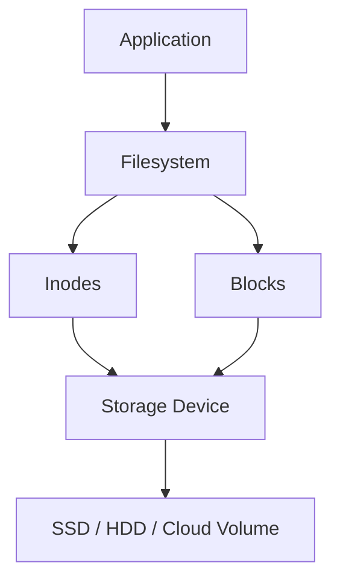
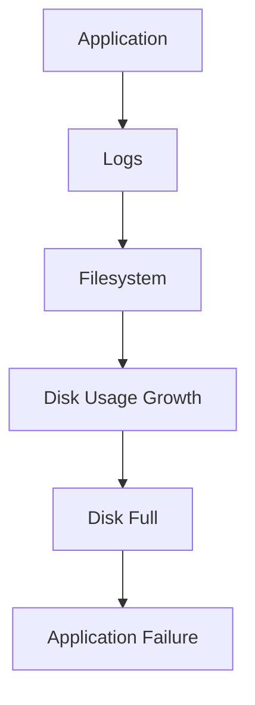

# Project 04: Disk Usage Analyzer

> Understanding how Linux stores data, consumes storage, and why disks become full in production systems.

---

# Why This Project Exists

One of the most common causes of production outages is surprisingly simple:

```text
Disk Full
```

It affects:

* Web servers
* Databases
* Kubernetes nodes
* CI/CD systems
* Logging platforms
* Monitoring systems
* Cloud infrastructure

A full disk can cause:

```text
Application Failure
        ↓
Database Failure
        ↓
Logging Failure
        ↓
Service Outage
        ↓
Customer Impact
```

Many engineers first encounter a serious Linux incident because a filesystem reached 100% usage.

Understanding storage usage is therefore one of the most valuable Linux skills.

This project teaches how Linux uses storage and how engineers investigate disk consumption.

---

# Problem It Solves

Imagine a production alert:

```text
CRITICAL ALERT

Filesystem Usage: 98%
```

Questions immediately arise:

* Which filesystem is full?
* Which directory is consuming space?
* Which files are responsible?
* Is the issue logs, backups, databases, or user files?
* Is storage usage growing rapidly?
* Will the system fail soon?

Without a systematic approach, finding the cause can take hours.

This project builds a tool that automates the investigation process.

---

# Mental Model

Think of storage as a warehouse.

```text
Warehouse
│
├── Rooms              → Directories
├── Boxes              → Files
├── Shelves            → Blocks
├── Inventory Labels   → Inodes
├── Warehouse Manager  → Filesystem
└── Security Rules     → Permissions
```

When the warehouse becomes full:

```text
No New Boxes
Can Be Stored
```

Similarly, Linux cannot store additional data.

---

# Learning Objectives

By completing this project, you will understand:

* Filesystems
* Storage devices
* Disk partitions
* Mounted filesystems
* Storage blocks
* Inodes
* Disk usage analysis
* Large file discovery
* Storage bottlenecks
* Capacity planning
* Storage troubleshooting
* Production storage monitoring

---

# First Principles

Most users think:

```text
File
 ↓
Stored Somewhere
```

Linux actually performs:

```text
File
 ↓
Filesystem
 ↓
Inode
 ↓
Block Allocation
 ↓
Storage Device
```

Every file consumes blocks.

Every filesystem has limits.

Every storage device has capacity constraints.

---

# Linux Storage Architecture



---

# Understanding Filesystems

Linux does not store files directly on disks.

Instead:

```text
Disk
 ↓
Filesystem
 ↓
Files
```

Examples:

```text
ext4
xfs
btrfs
zfs
tmpfs
```

Each filesystem manages storage differently.

---

# Understanding Blocks

Storage is divided into blocks.

Example:

```text
Storage Device

[Block]
[Block]
[Block]
[Block]
[Block]
```

A file consumes one or more blocks.

Even a tiny file uses storage blocks.

---

# Understanding Inodes

Linux tracks files using inodes.

Each inode stores:

```text
Owner
Permissions
Size
Timestamps
Block Locations
```

Important:

```text
Filesystem Can Run Out Of:

Storage Space

OR

Inodes
```

Both situations cause failures.

---

# Project Goal

Build a tool that reports:

* Mounted filesystems
* Disk usage percentages
* Largest directories
* Largest files
* Available storage
* Filesystem inode usage
* Recently modified large files
* Storage health summary

Example:

```text
=================================
DISK USAGE ANALYZER
=================================

Filesystem:
/dev/sda1

Total:
100 GB

Used:
75 GB

Free:
25 GB

Usage:
75%

Largest Directory:
/var/log

Largest File:
application.log

Size:
4.2 GB

=================================
```

---

# Project Structure

```text
disk-usage-analyzer/
│
├── analyzer.sh
│
├── reports/
│   └── disk-report.txt
│
└── README.md
```

---

# Step 1: Create Project

```bash
mkdir disk-usage-analyzer

cd disk-usage-analyzer

mkdir reports

touch analyzer.sh

chmod +x analyzer.sh
```

---

# Step 2: Script Header

```bash
#!/bin/bash

echo "================================="
echo "DISK USAGE ANALYZER"
echo "================================="
```

---

# Understanding Mounted Filesystems

## Why It Matters

Linux can mount many filesystems.

Example:

```text
/
/boot
/home
/var
/tmp
```

Each can fill independently.

---

## Command

```bash
df -h
```

Output:

```text
Filesystem      Size Used Avail Use%
/dev/sda1       50G  20G   28G  42%
```

---

## Script

```bash
echo "Mounted Filesystems:"
df -h
echo
```

---

# Understanding Inode Usage

Storage usage alone is not enough.

A filesystem can still fail because of inode exhaustion.

Command:

```bash
df -i
```

Example:

```text
Filesystem      Inodes Used IUse%
/dev/sda1       1M     900K 90%
```

---

## Script

```bash
echo "Inode Usage:"
df -i
echo
```

---

# Finding Largest Directories

## Why It Matters

Most storage problems originate from directories.

Examples:

```text
/var/log
/var/lib/docker
/var/lib/postgresql
/home
```

Command:

```bash
du -sh /*
```

---

## Better Version

```bash
du -sh /* 2>/dev/null | sort -hr
```

---

## Script

```bash
echo "Largest Directories:"

du -sh /* 2>/dev/null | sort -hr | head -10

echo
```

---

# Finding Largest Files

Production incidents often involve:

```text
Huge Log Files
Huge Backups
Huge Database Dumps
```

Command:

```bash
find / -type f -exec du -h {} + 2>/dev/null
```

Better:

```bash
find / -type f -exec du -h {} + 2>/dev/null \
| sort -hr \
| head
```

---

## Script

```bash
echo "Largest Files:"

find / \
-type f \
-exec du -h {} + \
2>/dev/null \
| sort -hr \
| head -10

echo
```

---

# Finding Large Files Over 100 MB

Command:

```bash
find / -type f -size +100M
```

Script:

```bash
echo "Files Larger Than 100 MB:"

find / -type f -size +100M 2>/dev/null

echo
```

---

# Finding Recently Modified Files

Useful during investigations.

Command:

```bash
find /var -mtime -1
```

Meaning:

```text
Modified Within Last Day
```

Script:

```bash
echo "Recently Modified Files:"

find /var -mtime -1 2>/dev/null | head -20

echo
```

---

# Storage Data Flow


---

# Understanding Storage Growth

Most storage growth follows patterns.

Example:

```text
Application
      ↓
Generates Logs
      ↓
Logs Stored
      ↓
Logs Grow
      ↓
Disk Fills
```

Visualization:



---

# Production Example: Full Log Files

Incident:

```text
Website Offline
```

Investigation:

```bash
df -h
```

Result:

```text
98% Used
```

Next:

```bash
du -sh /var/*
```

Result:

```text
/var/log = 25 GB
```

Next:

```bash
ls -lh /var/log
```

Result:

```text
application.log
20 GB
```

Root Cause:

```text
Log Rotation Misconfigured
```

Solution:

```text
Configure logrotate
Archive old logs
```

---

# Production Example: Docker Storage Explosion

Investigation:

```bash
df -h
```

Result:

```text
95% Usage
```

Next:

```bash
du -sh /var/lib/docker
```

Result:

```text
120 GB
```

Root Cause:

```text
Unused Images
Unused Containers
Unused Volumes
```

Cleanup:

```bash
docker system prune
```

---

# Linux Internals Deep Dive

When a file is written:

```text
Application
     ↓
System Call
     ↓
Kernel
     ↓
Filesystem Driver
     ↓
Block Allocation
     ↓
Storage Device
```

Commands such as:

```bash
df
du
```

query filesystem metadata maintained by the kernel.

---

# Docker Connection

Docker storage exists primarily in:

```text
/var/lib/docker
```

Contains:

```text
Images
Layers
Containers
Volumes
```

Disk analysis is a critical Docker skill.

---

# Kubernetes Connection

Kubernetes nodes frequently experience:

```text
Ephemeral Storage Exhaustion
```

Important locations:

```text
/var/lib/kubelet
/var/log
/var/lib/containerd
```

Node failures often begin with storage issues.

---

# Database Connection

Databases are storage-intensive systems.

Examples:

```text
PostgreSQL
MySQL
MongoDB
```

Store:

```text
Data Files
Indexes
Transaction Logs
Backups
```

Understanding disk usage is mandatory for database administration.

---

# Security Considerations

Large unexpected files may indicate:

```text
Compromised System
Malware
Data Exfiltration
Unauthorized Backups
```

Always investigate unknown storage growth.

---

# Performance Considerations

Storage performance depends on:

```text
Filesystem Type
Storage Hardware
IOPS
Block Size
Cache Efficiency
```

Large filesystems require efficient analysis techniques.

Avoid scanning the entire filesystem repeatedly on busy production servers.

---

# Troubleshooting

## Problem

Filesystem Full

Check:

```bash
df -h
```

---

## Problem

Unknown Storage Usage

Check:

```bash
du -sh /*
```

---

## Problem

Too Many Files

Check:

```bash
df -i
```

---

## Problem

Large Log Files

Check:

```bash
du -sh /var/log/*
```

---

## Problem

Docker Consuming Storage

Check:

```bash
du -sh /var/lib/docker
```

---

# Common Mistakes

## Mistake 1

Only checking storage space.

Also check:

```text
Inodes
```

---

## Mistake 2

Ignoring log growth.

Logs are a major source of outages.

---

## Mistake 3

Ignoring old backups.

Backups frequently consume unexpected storage.

---

## Mistake 4

Assuming deleted files always free space.

Processes may still hold deleted files open.

Check:

```bash
lsof | grep deleted
```

---

# Engineering Mindset

Beginner:

```text
Disk Is Full
```

Engineer:

```text
Which Filesystem Is Full?
```

Senior Engineer:

```text
Which Workload Is Causing Growth?
```

Architect:

```text
How Will Storage Scale
Across Thousands Of Servers?
```

Always move toward root causes.

---

# Interview Questions

### Beginner

What command shows filesystem usage?

### Beginner

What command shows inode usage?

### Intermediate

What is an inode?

### Intermediate

Difference between `df` and `du`?

### Intermediate

How do you find large files?

### Advanced

Can a filesystem fail while having free storage?

### Advanced

Why does inode exhaustion occur?

### Advanced

How would you investigate storage growth on a production server?

---

# Cheat Sheet

```bash
df -h

df -i

du -sh *

du -sh /*

find / -type f -size +100M

find /var -mtime -1

lsblk

mount

stat

lsof | grep deleted

sort -hr
```

---

# Project Completion Checklist

* [ ] Created analyzer project
* [ ] Displayed mounted filesystems
* [ ] Displayed storage usage
* [ ] Displayed inode usage
* [ ] Found largest directories
* [ ] Found largest files
* [ ] Found files over 100 MB
* [ ] Found recently modified files
* [ ] Generated storage report
* [ ] Understood filesystems
* [ ] Understood blocks
* [ ] Understood inodes
* [ ] Understood storage troubleshooting

---

# What You'll Understand After This Project

You will understand:

* How Linux manages storage
* How files consume disk space
* How filesystems allocate blocks
* Why disks become full
* Why inode exhaustion occurs
* How engineers investigate storage incidents
* How production outages are caused by storage problems
* How Docker, Kubernetes, and databases rely on Linux storage

You are no longer simply storing files.

You are beginning to understand how Linux manages capacity, storage reliability, and filesystem health—the foundation of every modern computing system.
