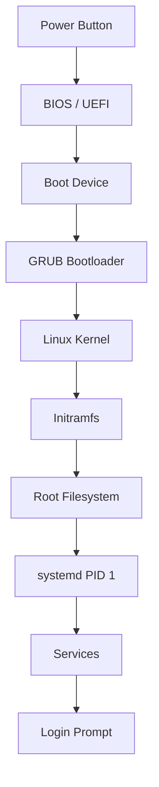
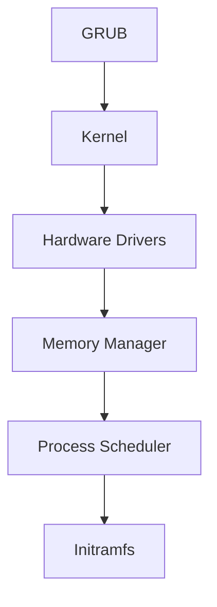
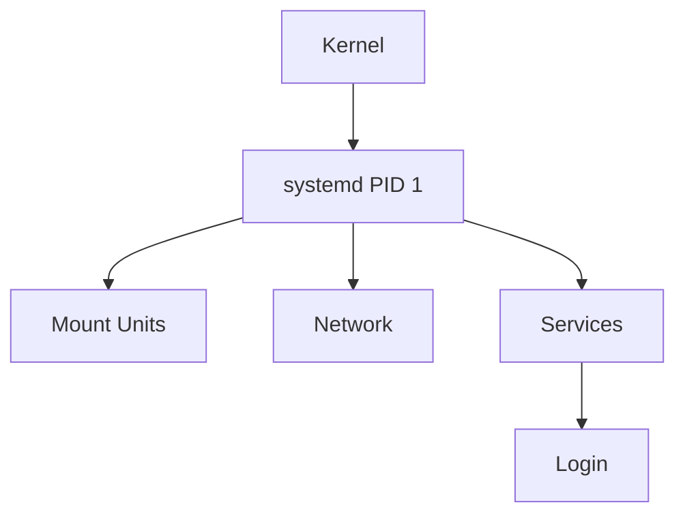
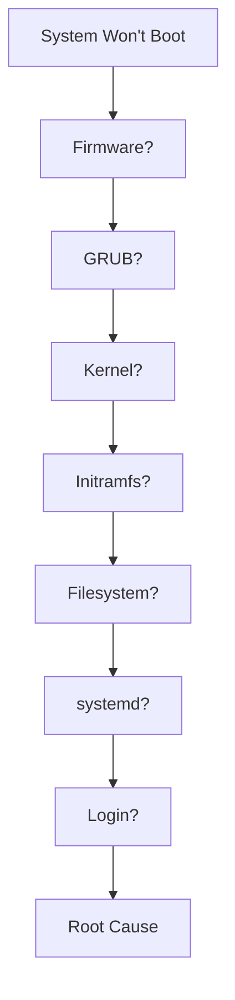

# Boot Failure Troubleshooting Guide

> The ultimate Linux troubleshooting challenge.
>
> The incident that turns a running server into a completely unavailable system.
>
> The fastest way to discover whether someone truly understands Linux internals.

---

# Why This Exists

Most Linux troubleshooting starts after Linux is already running.

Examples:

```text
Service Failed
Disk Full
SSH Not Working
High CPU
Memory Exhaustion
```

In all of these situations:

```text
Linux Is Alive
```

Boot failures are different.

Linux never becomes operational.

The operating system itself cannot start.

This means:

```text
No SSH
No Services
No Applications
No Kubernetes
No Docker
No Database
No Monitoring
```

The entire machine is unavailable.

Understanding boot failures requires understanding:

```text
Hardware
Firmware
Bootloaders
Kernel
Initramfs
Filesystems
Systemd
Userspace
```

This is why boot troubleshooting is one of the most valuable Linux engineering skills.

---

# Problem It Solves

Imagine a factory.

Normal incidents:

```text
Factory Running

One Machine Broken
```

Boot failure:

```text
Factory Never Opened
```

Nothing works because startup itself failed.

The challenge becomes:

```text
Which stage failed?
```

---

# Mental Model

Think of Linux booting like launching a rocket.

```text
Stage 1 → Firmware
Stage 2 → Bootloader
Stage 3 → Kernel
Stage 4 → Initramfs
Stage 5 → Root Filesystem
Stage 6 → systemd
Stage 7 → Services
Stage 8 → Login
```

Failure at any stage:

```text
Rocket Never Reaches Orbit
```

Your job:

```text
Identify Failed Stage
Identify Root Cause
Recover Safely
```

---

# First Principles

A computer cannot directly execute Linux.

Something must first:

```text
Power Hardware
Initialize CPU
Detect Memory
Locate Boot Device
Load Bootloader
Load Kernel
Start Operating System
```

Linux startup is a chain.

```text
Each Stage Depends
On Previous Stage
```

---

# Complete Linux Boot Architecture



---

# The Golden Rule

Never think:

```text
Linux Won't Boot
```

Think:

```text
Which Boot Stage Failed?
```

This single mindset dramatically improves troubleshooting speed.

---

# Stage 1: Firmware Failures

Modern systems use:

```text
BIOS
UEFI
```

Responsibilities:

```text
Hardware Initialization
Memory Detection
CPU Startup
Boot Device Discovery
```

---

## Symptoms

```text
Black Screen
No Boot Menu
Hardware Errors
Continuous Reboot
```

---

## Common Causes

### Failed Hardware

```text
Bad RAM
Failed CPU
Motherboard Problems
```

### Missing Boot Device

```text
Disk Not Detected
NVMe Failure
RAID Failure
```

### Incorrect Firmware Configuration

```text
Wrong Boot Order
Disabled Boot Device
UEFI/Legacy Mismatch
```

---

# Stage 2: Bootloader Failures

Most Linux systems use:

```text
GRUB2
```

GRUB responsibilities:

```text
Load Kernel
Pass Kernel Parameters
Load Initramfs
```

---

## Symptoms

```text
grub rescue>
```

or

```text
error: unknown filesystem
```

or

```text
no such partition
```

---

# GRUB Architecture


---

## Common Causes

### Deleted Boot Partition

Example:

```text
/dev/sda1 removed
```

GRUB cannot find files.

---

### Corrupted GRUB

Example:

```text
Failed Upgrade
Disk Corruption
```

---

### Incorrect UUID

```text
GRUB Points To Wrong Disk
```

---

## Recovery

Boot from rescue media:

```bash
mount /dev/sda2 /mnt

grub-install /dev/sda

update-grub
```

---

# Stage 3: Kernel Failures

GRUB loads kernel.

Kernel begins execution.

Responsibilities:

```text
Memory Management
CPU Scheduling
Driver Loading
Filesystem Access
```

---

## Symptoms

```text
Kernel Panic
```

Example:

```text
Kernel panic - not syncing
```

---

# Kernel Boot Flow



---

# Kernel Panic

Equivalent to:

```text
Fatal Operating System Crash
```

Kernel cannot continue safely.

---

## Common Causes

### Missing Drivers

Example:

```text
Storage Driver Missing
```

Kernel cannot access disk.

---

### Corrupted Kernel

```text
Broken Upgrade
Disk Corruption
```

---

### Unsupported Hardware

```text
New Hardware
Old Kernel
```

---

### Invalid Kernel Parameters

Example:

```text
root=/wrong-device
```

---

# Stage 4: Initramfs Failures

Initramfs is a temporary mini Linux environment.

Purpose:

```text
Load Essential Drivers
Find Root Filesystem
Prepare Boot Environment
```

---

## Symptoms

```text
(initramfs)
```

prompt appears.

System stops booting.

---

## Common Causes

### Missing Root Filesystem

```text
Cannot Find Root Device
```

---

### Corrupted Initramfs

```text
Bad Upgrade
Broken Image
```

---

### Missing Storage Modules

```text
NVMe Driver Missing
RAID Driver Missing
```

---

# Stage 5: Root Filesystem Failures

Kernel must mount:

```text
/
```

Root filesystem.

Without it:

```text
Linux Cannot Continue
```

---

## Symptoms

```text
Cannot mount root fs
```

or

```text
VFS panic
```

---

# Filesystem Boot Dependency


---

## Common Causes

### Filesystem Corruption

Example:

```text
Power Failure
Storage Failure
```

---

### Wrong UUID

Check:

```bash
blkid
```

Compare with:

```bash
cat /etc/fstab
```

---

### Failed Storage Device

```text
SSD Failure
RAID Failure
SAN Failure
```

---

# Stage 6: systemd Failures

Kernel successfully boots.

Filesystem mounted.

systemd starts.

systemd becomes:

```text
PID 1
```

---

# systemd Boot Architecture



---

## Symptoms

Boot hangs:

```text
Starting...
Waiting...
Dependency failed...
```

---

## Common Causes

### Broken Service

Example:

```text
Database Service Deadlock
```

---

### Dependency Loops

```text
Service A Requires B

Service B Requires A
```

---

### Bad Unit Files

```text
Invalid Configuration
```

---

# Stage 7: Login Failures

System boots.

Login unavailable.

---

## Symptoms

```text
Login Prompt Missing
GUI Missing
Authentication Failure
```

---

## Common Causes

### PAM Misconfiguration

### Corrupted Accounts

### Failed Display Manager

```text
GDM
SDDM
LightDM
```

---

# Emergency Recovery Modes

---

# Single User Mode

GRUB:

```text
e
```

Append:

```text
single
```

or:

```text
init=/bin/bash
```

Provides:

```text
Root Shell
```

---

# Rescue Target

```bash
systemctl rescue
```

Minimal environment.

---

# Emergency Target

```bash
systemctl emergency
```

Lowest operational state.

---

# Production Incident Example

## Incident

Cloud VM rebooted after kernel upgrade.

Server never returned.

Monitoring:

```text
DOWN
```

Console:

```text
Kernel Panic
```

Investigation:

```text
New Kernel
Missing NVMe Driver
```

Kernel could not access root volume.

Recovery:

```text
Boot Previous Kernel
Rebuild Initramfs
Reinstall Kernel
```

Downtime:

```text
12 Minutes
```

---

# Boot Failure Investigation Workflow



---

# Modern Cloud Connection

Boot failures occur in:

```text
AWS EC2
Azure VM
Google Compute Engine
DigitalOcean
OpenStack
```

Common causes:

```text
Broken Kernel Updates
Filesystem Corruption
Volume Attachment Failures
Cloud-Init Issues
```

---

# Docker Connection

Containers do not boot like Linux systems.

However:

```text
Host Boot Failure
=
All Containers Down
```

Container infrastructure depends entirely on host startup.

---

# Kubernetes Connection

Node boot failure means:

```text
Node Not Ready
Pods Unavailable
Cluster Capacity Reduced
```

Production impact can be massive.

---

# Performance Considerations

Slow boot often indicates:

```text
Filesystem Checks
Network Timeouts
Dependency Delays
Hardware Problems
```

Investigate:

```bash
systemd-analyze blame
```

---

# Security Considerations

Boot process is a security boundary.

Examples:

```text
Secure Boot
TPM
Measured Boot
Kernel Verification
```

Compromising boot chain compromises entire system.

---

# Observability

Useful commands:

```bash
journalctl -b

journalctl -xb

systemd-analyze

systemd-analyze blame

dmesg

lsblk

blkid

cat /etc/fstab
```

---

# Common Mistakes

## Mistake 1

Treating boot as a single step.

It is:

```text
8+ Independent Stages
```

---

## Mistake 2

Immediately reinstalling Linux.

Often unnecessary.

---

## Mistake 3

Ignoring console output.

Boot messages contain clues.

---

## Mistake 4

Assuming kernel panic means hardware failure.

Often configuration issues.

---

## Mistake 5

Not understanding boot sequence.

This leads to random guessing.

---

# Engineering Mindset

Beginners think:

```text
Server Is Down
```

Experienced engineers think:

```text
Which Boot Stage Failed?
```

Elite engineers think:

```text
What dependency was required by that stage,
why was it unavailable,
and how can we prevent recurrence?
```

---

# Interview Questions

### What happens immediately after power-on?

```text
BIOS / UEFI Executes
```

---

### What is GRUB?

Linux bootloader responsible for loading the kernel.

---

### What is initramfs?

Temporary filesystem used during early boot.

---

### What is PID 1?

```text
systemd
```

on most modern Linux systems.

---

### What causes kernel panic?

```text
Missing Drivers
Filesystem Issues
Kernel Bugs
Hardware Problems
Invalid Parameters
```

---

### Difference Between Rescue And Emergency Mode?

Rescue:

```text
Minimal Services
```

Emergency:

```text
Almost No Services
```

---

# Boot Failure Command Cheat Sheet

```bash
# Boot logs
journalctl -b

# Previous boot logs
journalctl -b -1

# Kernel logs
dmesg

# Filesystem UUIDs
blkid

# Disk layout
lsblk

# Check fstab
cat /etc/fstab

# Analyze boot time
systemd-analyze

# Slow services
systemd-analyze blame

# GRUB config
cat /boot/grub/grub.cfg

# Rebuild initramfs
dracut -f
```

---

# Final Takeaway

Linux booting is not magic.

It is a carefully orchestrated sequence:

```text
Power
 ↓
Firmware
 ↓
Bootloader
 ↓
Kernel
 ↓
Initramfs
 ↓
Filesystem
 ↓
systemd
 ↓
Services
 ↓
Login
```

Every boot failure is simply:

```text
A Dependency Failure
At A Specific Stage
```

The best Linux engineers do not memorize fixes.

They understand the boot chain deeply enough to reason through failures systematically.

That ability scales from:

```text
Laptop
→ Server
→ Cloud VM
→ Kubernetes Node
→ Entire Datacenter
```

and is one of the clearest indicators of true Linux expertise.
