# Certificate & SSL/TLS Errors Troubleshooting Guide

> One of the most common causes of production outages.
>
> The invisible security layer behind HTTPS, APIs, Kubernetes, service meshes, databases, cloud platforms, and modern distributed systems.
>
> A topic that combines Linux, cryptography, networking, trust, security, and systems engineering.

---

# Why This Exists

Modern infrastructure assumes:

```text
Everything Is Encrypted
```

Examples:

```text
HTTPS Websites
REST APIs
gRPC Services
Kubernetes Components
Cloud Services
Databases
Load Balancers
VPNs
Service Meshes
```

All depend on:

```text
Certificates
TLS
Public Key Infrastructure
```

When SSL fails:

```text
Applications Stop Communicating
APIs Return Errors
Browsers Show Warnings
Databases Reject Connections
Pods Fail To Start
Customers Cannot Access Services
```

---

# Problem It Solves

Imagine entering a secure building.

Before entry:

```text
Identity Must Be Verified
```

Security asks:

```text
Who Are You?

Can I Trust You?
```

Certificates solve exactly this problem.

When trust verification fails:

```text
Access Denied
```

SSL errors are fundamentally:

```text
Trust Failures
```

---

# Mental Model

Most people think HTTPS means:

```text
Encryption
```

Partially true.

TLS provides:

```text
Identity
Encryption
Integrity
Authentication
```

Think:

```text
Passport
+
Tamper-Proof Envelope
+
Digital Signature
```

Combined together.

---

# First Principles

Without TLS:

```text
Client
  ↓
Plain Text
  ↓
Server
```

Anyone can:

```text
Read
Modify
Intercept
```

traffic.

---

# Without TLS

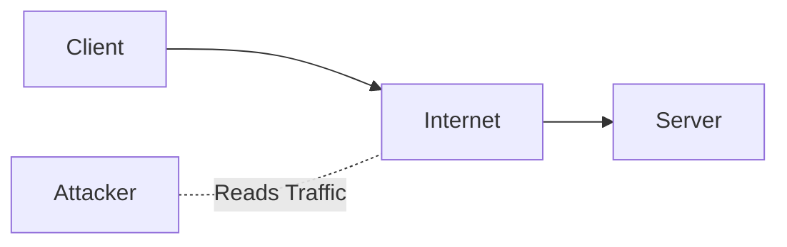

---

# With TLS

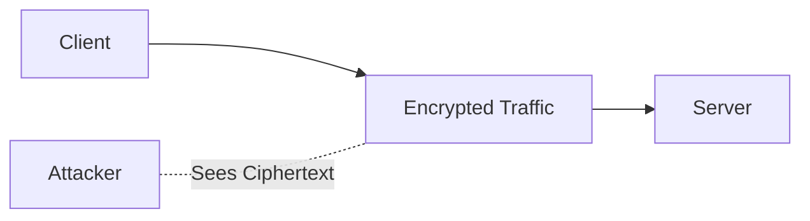

---

# SSL vs TLS

Historically:

```text
SSL 2.0
SSL 3.0
```

Modern systems use:

```text
TLS 1.2
TLS 1.3
```

Today:

```text
SSL
```

usually means:

```text
TLS
```

---

# Core Components

TLS relies on:

```text
Certificates
Private Keys
Public Keys
Certificate Authorities
Trust Stores
```

---

# Trust Architecture

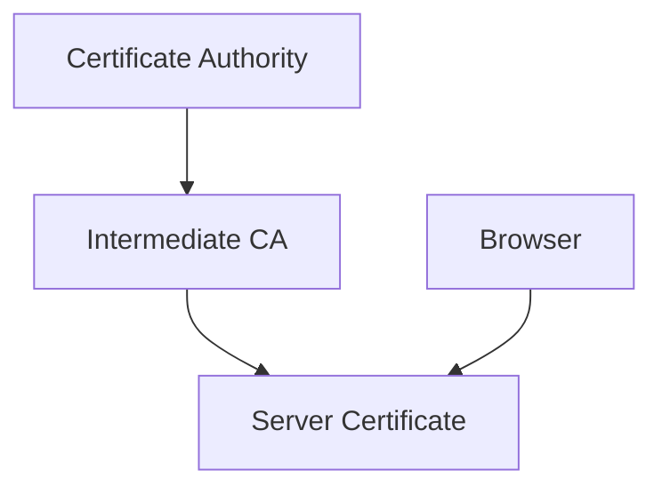

---

# What Is A Certificate?

A certificate contains:

```text
Domain Name
Public Key
Expiration Date
Issuer
Digital Signature
```

Example:

```text
example.com

Issued By:
Let's Encrypt

Expires:
2027-05-01
```

---

# Certificate Chain

Most production issues occur here.

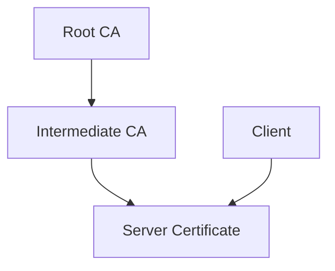

If any link breaks:

```text
Trust Fails
```

---

# TLS Handshake

Before encrypted communication:

```text
Trust Must Be Established
```

---

# TLS Handshake Flow

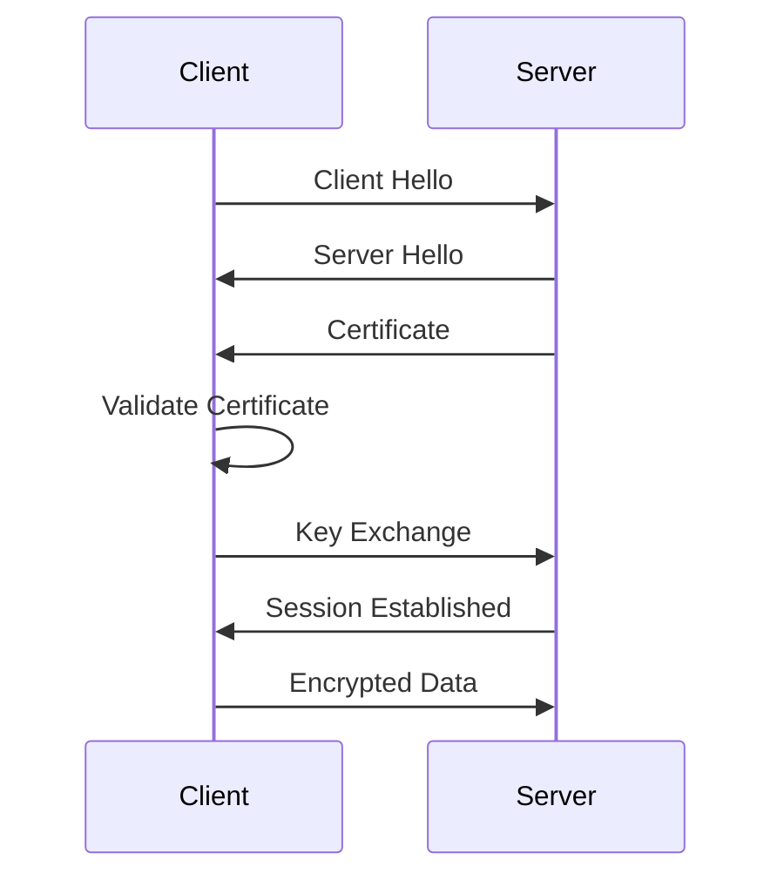

---

# Simplified TLS Handshake


---

# Golden Rule

Never ask:

```text
Why Is HTTPS Broken?
```

Ask:

```text
Which TLS Phase Failed?
```

Possible failures:

```text
DNS
TCP
Handshake
Certificate Validation
Cipher Negotiation
Trust Verification
Expiration
```

---

# Common Error Categories

```text
Expired Certificate
Invalid Certificate
Hostname Mismatch
Unknown CA
Incomplete Chain
TLS Version Mismatch
Cipher Mismatch
Clock Skew
```

---

# Error 1: Certificate Expired

Most common production incident.

Example:

```text
certificate has expired
```

---

# Why It Happens

Certificates have:

```text
Start Date
End Date
```

After expiration:

```text
Trust Invalid
```

---

# Expiration Timeline

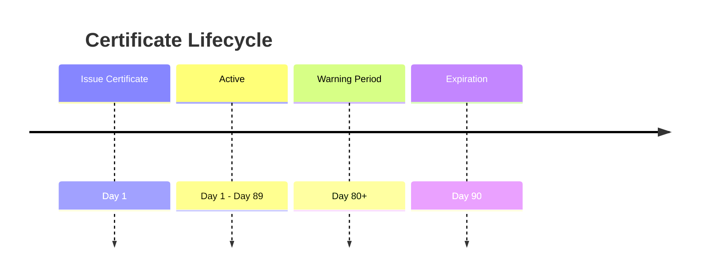

---

# Investigation

Check:

```bash
openssl x509 -in cert.pem -text
```

or

```bash
openssl s_client -connect example.com:443
```

---

# Error 2: Hostname Mismatch

Example:

```text
certificate is not valid for requested host
```

---

# Why It Happens

User accesses:

```text
api.company.com
```

Certificate issued for:

```text
www.company.com
```

Validation fails.

---

# Validation Logic

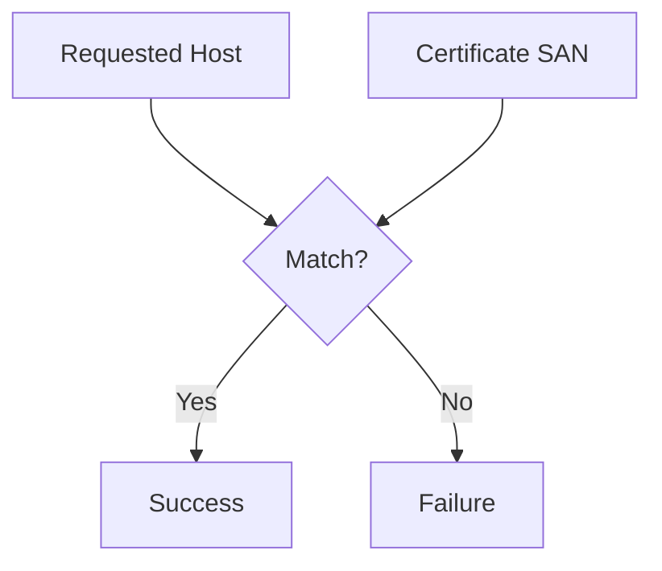

---

# Error 3: Unknown Certificate Authority

Example:

```text
certificate signed by unknown authority
```

---

# Why It Happens

Certificate signed by:

```text
Internal CA
Self-Signed CA
Untrusted CA
```

Client trust store lacks CA.

---

# Trust Store Architecture

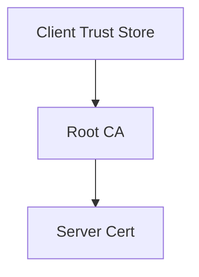

Missing root:

```text
Validation Fails
```

---

# Error 4: Incomplete Certificate Chain

Extremely common.

Server sends:

```text
Leaf Certificate
```

but forgets:

```text
Intermediate Certificate
```

---

# Broken Chain

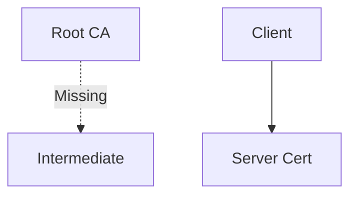

Validation impossible.

---

# Correct Chain

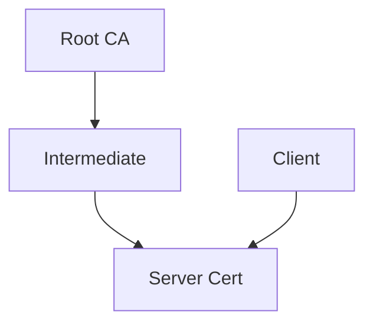

---

# Investigation

```bash
openssl s_client -connect HOST:443 -showcerts
```

---

# Error 5: TLS Version Mismatch

Example:

```text
protocol version not supported
```

---

# Cause

Client:

```text
TLS 1.0
```

Server:

```text
TLS 1.3 Only
```

No common protocol.

---

# Version Negotiation

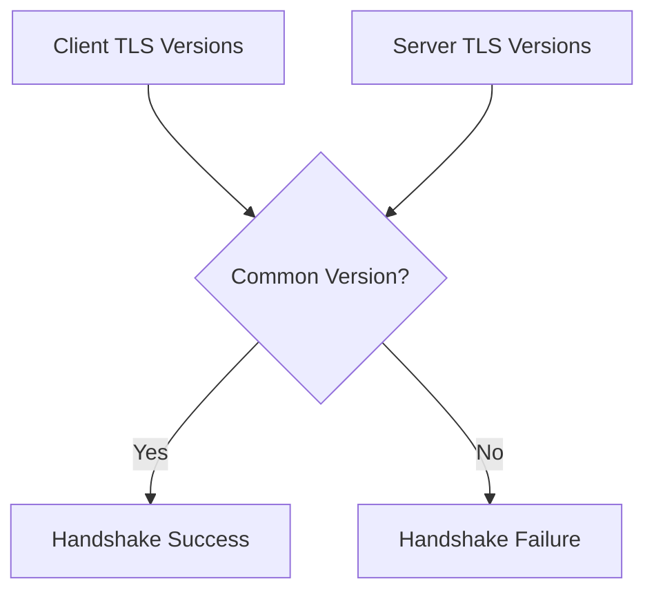

---

# Error 6: Cipher Suite Mismatch

TLS requires:

```text
Encryption Algorithm Agreement
```

No overlap:

```text
Handshake Fails
```

---

# Cipher Negotiation

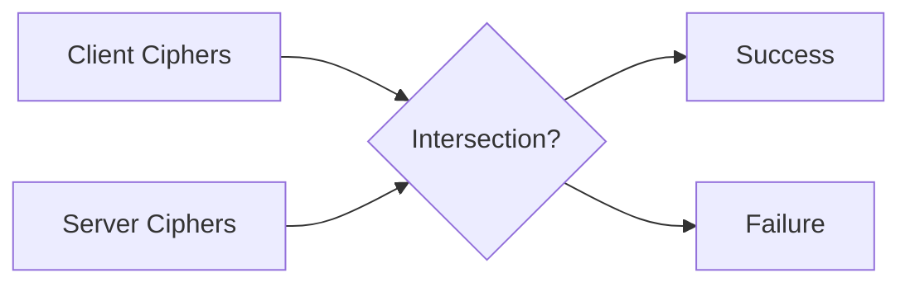

---

# Error 7: Clock Skew

Underrated issue.

Example:

```text
certificate not yet valid
```

or

```text
certificate expired
```

even though certificate is correct.

---

# Why?

System clock incorrect.

Example:

```text
Certificate Valid:
2026

Server Time:
2022
```

Validation fails.

---

# Time Dependency

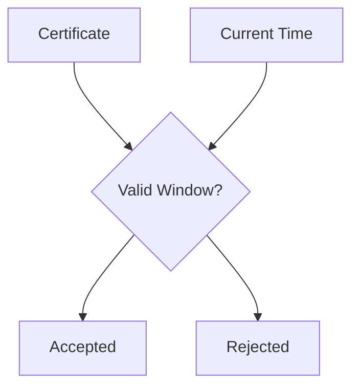

---

# Linux Internals

Linux trust store:

Ubuntu/Debian:

```text
/etc/ssl/certs
```

RedHat:

```text
/etc/pki
```

Applications consult trust stores during validation.

---

# Certificate Validation Flow

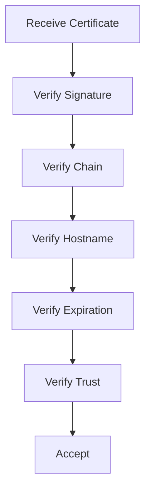

---

# Essential OpenSSL Commands

Inspect certificate:

```bash
openssl x509 -text -noout -in cert.pem
```

Check remote server:

```bash
openssl s_client -connect example.com:443
```

Check expiration:

```bash
openssl x509 -enddate -noout -in cert.pem
```

---

# Reverse Proxy Example

Architecture:


Common issue:

```text
Certificate Installed
On Wrong Layer
```

---

# Kubernetes Example

TLS everywhere:

```text
API Server
etcd
Ingress
Webhook
Service Mesh
```

---

# Kubernetes TLS Architecture

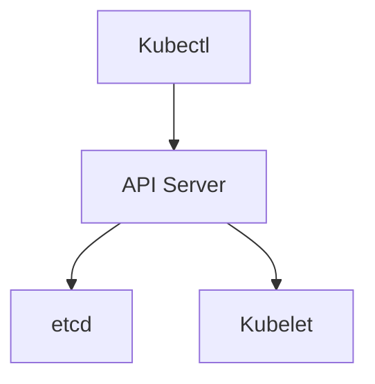

Expired certificate:

```text
Cluster Outage
```

---

# Service Mesh Example

Istio:

```text
Pod To Pod Traffic
```

uses:

```text
mTLS
```

---

# mTLS Architecture

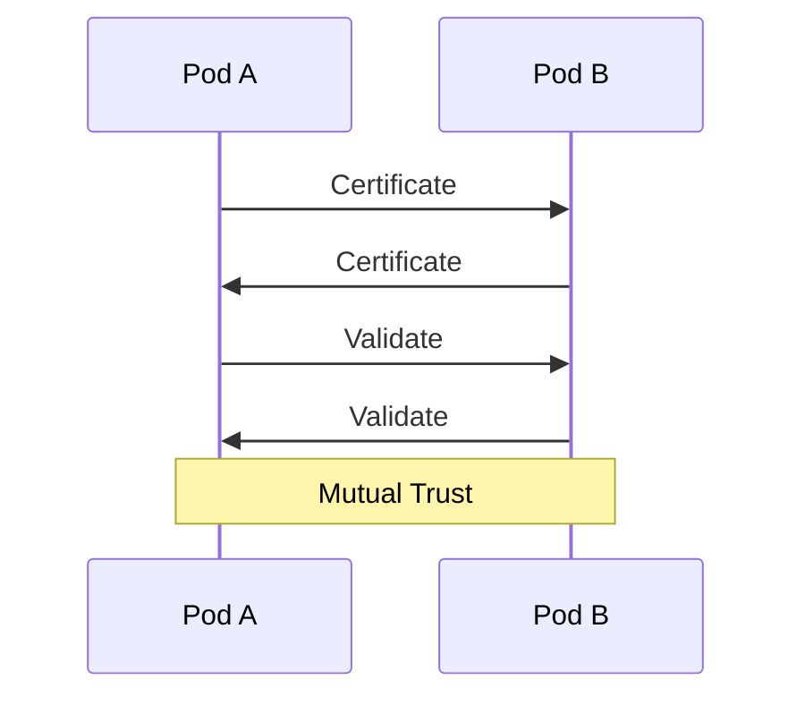

---

# Docker Example

Container issue:

```text
certificate signed by unknown authority
```

Often caused by:

```text
Missing Root CA
Inside Container
```

---

# Cloud Example

Common incidents:

```text
Expired Load Balancer Certificate

Expired API Gateway Certificate

Broken ACM Renewal

Broken Key Vault Certificate
```

---

# Performance Considerations

TLS introduces:

```text
Handshake Cost
Encryption Cost
Certificate Validation Cost
```

TLS 1.3 significantly reduces:

```text
Handshake Latency
```

---

# Security Considerations

Never:

```text
Disable Verification
```

Bad example:

```bash
curl -k
```

or

```python
verify=False
```

These bypass trust.

---

# Observability

Monitor:

```text
Certificate Expiration

Handshake Failures

TLS Errors

Renewal Failures
```

Alert before:

```text
30 Days
15 Days
7 Days
```

to expiration.

---

# Troubleshooting Workflow

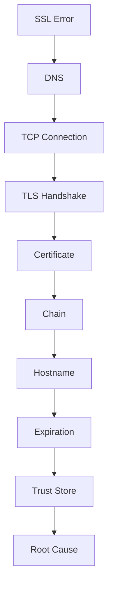

---

# Advanced Production Workflow

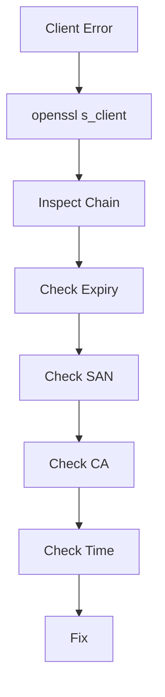

---

# Common Mistakes

## Mistake 1

Disabling certificate validation.

---

## Mistake 2

Ignoring expiration monitoring.

---

## Mistake 3

Installing only leaf certificate.

---

## Mistake 4

Forgetting intermediate certificates.

---

## Mistake 5

Ignoring system time synchronization.

---

## Mistake 6

Using self-signed certificates in production.

---

# Engineering Mindset

Beginners think:

```text
HTTPS Is Broken
```

Engineers think:

```text
Certificate Validation Failed
```

Senior engineers think:

```text
Which Trust Assumption Failed?
```

Elite infrastructure engineers think:

```text
Which Step Of
The TLS Trust Chain
Failed And Why?
```

Because SSL/TLS errors are rarely networking problems.

They are usually:

```text
Trust Problems
```

---

# Interview Questions

### What is the difference between SSL and TLS?

TLS is the modern successor to SSL.

---

### What is a certificate chain?

```text
Root CA
→ Intermediate CA
→ Server Certificate
```

---

### Why does hostname mismatch occur?

Certificate SAN does not match requested host.

---

### What causes "unknown authority"?

Missing trusted root certificate.

---

### What command inspects remote TLS?

```bash
openssl s_client -connect HOST:443
```

---

### What is mTLS?

Mutual TLS where both client and server authenticate.

---

### Why are intermediate certificates important?

They complete the chain of trust.

---

# Cheat Sheet

```bash
# Inspect Remote Certificate
openssl s_client -connect host:443

# Show Full Chain
openssl s_client -showcerts -connect host:443

# View Certificate
openssl x509 -text -noout -in cert.pem

# Expiration Date
openssl x509 -enddate -noout -in cert.pem

# Verify Certificate
openssl verify cert.pem

# Test HTTPS
curl -v https://host

# Check Time
timedatectl

# Update CA Store
update-ca-certificates
```

---

# Final Takeaway

SSL/TLS is not merely:

```text
Encryption
```

It is a global distributed trust system.

Every successful HTTPS request depends on:

```text
DNS
TCP
TLS
Certificates
Trust Stores
Cryptographic Validation
```

The most important lesson:

```text
SSL Errors
≠
Networking Problems
```

Most SSL incidents are actually:

```text
Trust Failures
```

The best Linux engineers troubleshoot TLS by following the complete trust path:

```text
Client
 ↓
Certificate
 ↓
Chain
 ↓
CA
 ↓
Trust Store
 ↓
Validation
```

Because every TLS outage ultimately answers one question:

```text
Why Did Trust Break?
```
