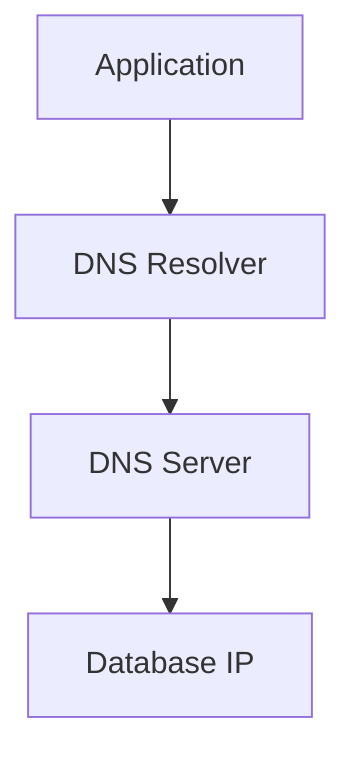
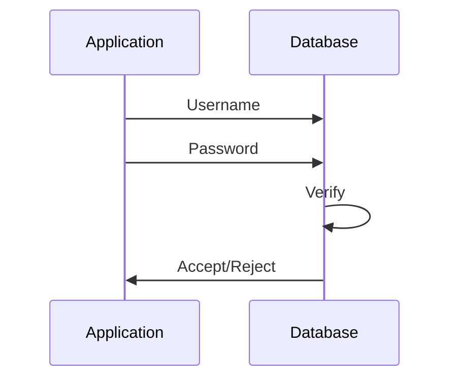
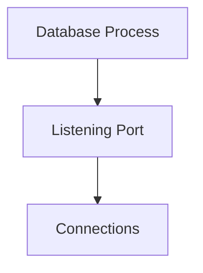
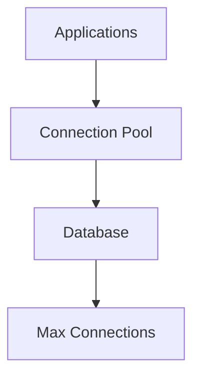
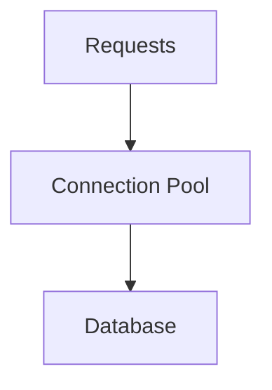
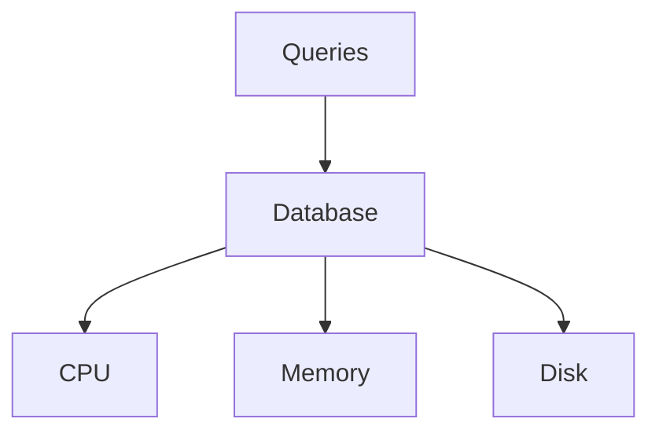
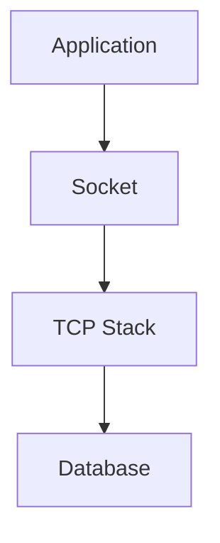
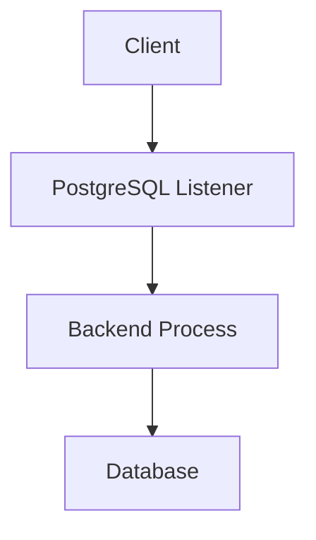
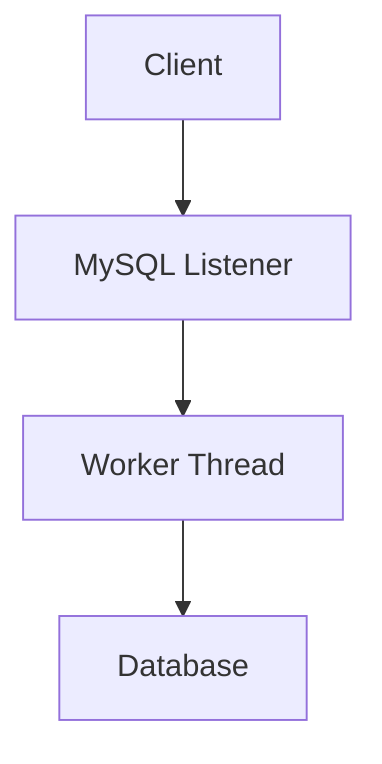
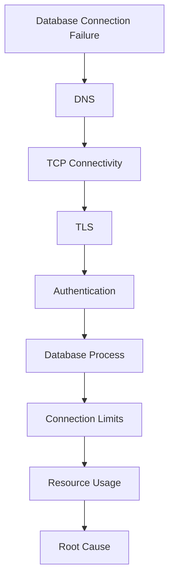

# Database Connection Failures Troubleshooting Guide

> One of the most common production incidents.
>
> The root cause behind API outages, application crashes, authentication failures, Kubernetes incidents, microservice failures, and cloud platform disruptions.
>
> A topic that teaches networking, operating systems, distributed systems, connection pooling, databases, and application architecture.

---

# Why This Exists

Modern applications are data-driven.

Almost every request eventually becomes:

```text
User Request
      ↓
Application
      ↓
Database Query
      ↓
Response
```

Examples:

```text
Login
Payments
Orders
Inventory
Messaging
Analytics
Authentication
```

all require database connectivity.

When database connections fail:

```text
Applications Timeout
APIs Return 500 Errors
Users Cannot Login
Transactions Fail
Services Crash
```

Understanding database connection failures means understanding how modern systems communicate.

---

# Problem It Solves

Imagine a company headquarters.

```text
Application = Employee

Database = Archive Room
```

Every employee constantly needs information:

```text
Customer Data
Orders
Invoices
Settings
```

If access to the archive room fails:

```text
Business Stops
```

Database connection failures are exactly this.

---

# Mental Model

Most engineers think:

```text
Database Error
=
Database Problem
```

Usually wrong.

Database communication depends on:

```text
Application
Connection Pool
DNS
TCP
TLS
Firewall
Database Server
Authentication
Storage
```

Failure anywhere can appear as:

```text
Database Connection Failure
```

---

# First Principles

Applications do not directly access databases.

The path looks like:

```text
Application
   ↓
Database Driver
   ↓
TCP Socket
   ↓
Network
   ↓
Database Server
```

Many systems exist between:

```text
Application
and
Database
```

---

# High-Level Architecture


---

# Golden Rule

Never ask:

```text
Why Can't Application Reach Database?
```

Ask:

```text
Which Layer Failed?
```

Possible layers:

```text
Application
Driver
DNS
TCP
TLS
Firewall
Authentication
Database
Storage
```

---

# Connection Lifecycle


Failure can occur anywhere.

---

# Common Error Categories

```text
Connection Refused
Connection Timeout
Authentication Failed
TLS Failure
DNS Failure
Too Many Connections
Connection Pool Exhaustion
Database Down
Network Failure
```

---

# Failure 1: Connection Refused

Example:

```text
connection refused
```

Meaning:

```text
Database Host Reachable

Port Closed
```

---

# Visual Explanation

```mermaid
sequenceDiagram

Application->>Database: SYN

Database->>Application: RST

Note over Application,Database:
Connection Refused
```

---

# Common Causes

```text
Database Service Down
Wrong Port
Database Not Listening
Firewall Rejection
```

---

# Investigation

Check:

```bash
ss -tulpn
```

Verify:

```bash
systemctl status postgresql
```

or:

```bash
systemctl status mysql
```

---

# Failure 2: Connection Timeout

Example:

```text
connection timed out
```

Meaning:

```text
No Response Received
```

---

# Timeout Flow

```mermaid
sequenceDiagram

Application->>Database: SYN

Application->>Database: SYN

Application->>Database: SYN

Note over Application:
Timeout
```

---

# Common Causes

```text
Firewall
Routing Issues
Network Partition
Cloud Security Groups
Database Overload
```

---

# Investigation

```bash
ping DATABASE_IP
```

Then:

```bash
nc -zv DATABASE_IP PORT
```

---

# Failure 3: DNS Resolution Failure

Example:

```text
could not resolve host
```

---

# Architecture



DNS failure prevents:

```text
Database Discovery
```

---

# Investigation

```bash
dig database.company.internal
```

or:

```bash
nslookup database.company.internal
```

---

# Failure 4: Authentication Failure

Example:

```text
Access denied
```

or

```text
password authentication failed
```

---

# Authentication Flow



---

# Common Causes

```text
Wrong Password
Expired Credentials
User Missing
Role Misconfiguration
Secrets Rotation Failure
```

---

# Investigation

Verify:

```text
Username
Password
Database Name
Authentication Method
```

---

# Failure 5: TLS / SSL Failure

Example:

```text
certificate signed by unknown authority
```

or

```text
SSL handshake failed
```

---

# TLS Architecture


---

# Common Causes

```text
Expired Certificates
Invalid Hostname
Unknown CA
Clock Skew
Broken Trust Chain
```

---

# Investigation

```bash
openssl s_client -connect DB_HOST:5432
```

---

# Failure 6: Database Service Down

Example:

```text
No Listener Found
```

---

# Architecture



No process:

```text
No Connections
```

---

# Investigation

PostgreSQL:

```bash
systemctl status postgresql
```

MySQL:

```bash
systemctl status mysqld
```

---

# Failure 7: Too Many Connections

Very common production issue.

Example:

```text
too many connections
```

---

# Why?

Databases have limits.

Example:

```text
PostgreSQL max_connections

MySQL max_connections
```

---

# Connection Saturation



When:

```text
Connections > Limit
```

new connections fail.

---

# Investigation

PostgreSQL:

```sql
SELECT count(*) FROM pg_stat_activity;
```

MySQL:

```sql
SHOW PROCESSLIST;
```

---

# Failure 8: Connection Pool Exhaustion

One of the most misunderstood failures.

---

# Mental Model

Applications rarely create:

```text
One Connection Per Request
```

Instead:

```text
Pool Of Connections
```

is maintained.

---

# Pool Architecture



---

# Problem

Requests:

```text
1000
```

Pool Size:

```text
50
```

If connections never return:

```text
Pool Exhausted
```

---

# Symptoms

```text
Application Hangs
Request Timeouts
Database Appears Healthy
```

---

# Investigation

Check:

```text
Pool Metrics
Connection Wait Time
Active Connections
```

---

# Failure 9: Database Resource Exhaustion

Database overloaded.

---

# Architecture



---

# Symptoms

```text
Slow Queries
Timeouts
Connection Failures
```

---

# Investigation

Linux:

```bash
top

htop

iostat -x

vmstat
```

---

# Failure 10: Firewall Problems

Example:

```text
Database Works Locally
Fails Remotely
```

---

# Network Security Architecture


---

# Investigation

Linux:

```bash
iptables -L
```

or:

```bash
nft list ruleset
```

Cloud:

```text
Security Groups
Network ACLs
```

---

# Linux Internals

Database connections are:

```text
TCP Sockets
```

---

# Socket Architecture



Connection failures often originate from:

```text
Socket Layer
```

not database layer.

---

# PostgreSQL Connection Architecture



Each connection creates:

```text
Backend Process
```

---

# MySQL Connection Architecture



Each connection consumes:

```text
Memory
CPU
Resources
```

---

# Kubernetes Example

Application Pod:

```text
Cannot Reach PostgreSQL
```

---

# Investigation

Check:

```bash
kubectl exec POD -- nslookup postgres
```

Then:

```bash
kubectl exec POD -- nc -zv postgres 5432
```

---

# Kubernetes Data Path


Failure anywhere breaks connectivity.

---

# Docker Example

Container:

```text
Works Locally

Fails In Docker
```

Common cause:

```text
Wrong Network
Missing DNS
Bridge Misconfiguration
```

---

# Cloud Example

Common failures:

```text
AWS Security Groups
Azure NSGs
GCP Firewall Rules
Private Endpoint Misconfiguration
```

---

# Production Incident Example

## Incident

API latency increased:

```text
50 ms
```

to:

```text
30 seconds
```

Monitoring showed:

```text
Database Healthy
CPU Normal
```

Investigation:

```sql
SELECT count(*) FROM pg_stat_activity;
```

Result:

```text
Max Connections Reached
```

Root Cause:

```text
Connection Leak
```

Applications opened:

```text
Thousands Of Connections
```

without closing them.

---

# Distributed Systems Perspective

Database connection failures are often:

```text
Network Problems

Disguised As

Database Problems
```

---

# Observability

Monitor:

```text
Connection Count
Connection Pool Usage
Connection Errors
Query Latency
Network Latency
TLS Failures
```

---

# Important Metrics

```text
Active Connections
Idle Connections
Connection Wait Time
Pool Utilization
Connection Errors/sec
```

---

# Essential Commands

```bash
ss -tulpn

nc -zv HOST PORT

ping HOST

dig HOST

traceroute HOST

openssl s_client -connect HOST:PORT
```

PostgreSQL:

```sql
SELECT * FROM pg_stat_activity;
```

MySQL:

```sql
SHOW PROCESSLIST;
```

---

# Master Troubleshooting Workflow



---

# Common Mistakes

## Mistake 1

Assuming database is down.

---

## Mistake 2

Ignoring DNS.

---

## Mistake 3

Ignoring connection pools.

---

## Mistake 4

Ignoring firewalls.

---

## Mistake 5

Ignoring TLS.

---

## Mistake 6

Only checking application logs.

---

# Engineering Mindset

Beginners think:

```text
Database Is Broken
```

Engineers think:

```text
Connection Failed
```

Senior engineers think:

```text
Which Layer Failed?
```

Elite distributed systems engineers think:

```text
Application
 ↓
Driver
 ↓
DNS
 ↓
TCP
 ↓
TLS
 ↓
Authentication
 ↓
Database

Where Did The Conversation Break?
```

Because database connectivity is fundamentally:

```text
A Networked Distributed System Problem
```

not merely:

```text
A Database Problem
```

---

# Interview Questions

### Difference between timeout and refused?

Timeout:

```text
No Response
```

Refused:

```text
Port Closed
```

---

### What causes too many connections?

Connection count exceeded database limit.

---

### What is connection pooling?

Reusing connections instead of creating new ones.

---

### Why do databases use TCP?

Reliable communication.

---

### What causes connection pool exhaustion?

Connections not returned to pool.

---

### What command checks PostgreSQL connections?

```sql
SELECT * FROM pg_stat_activity;
```

---

### What command checks port connectivity?

```bash
nc -zv HOST PORT
```

---

# Cheat Sheet

```bash
# DNS
dig HOST

# Reachability
ping HOST

# Port Connectivity
nc -zv HOST PORT

# TLS
openssl s_client -connect HOST:PORT

# Listening Ports
ss -tulpn

# Routes
ip route
```

PostgreSQL:

```sql
SELECT * FROM pg_stat_activity;
```

MySQL:

```sql
SHOW PROCESSLIST;
```

---

# Final Takeaway

Database connection failures are rarely:

```text
Database Problems
```

Most are failures somewhere in:

```text
DNS
Network
TCP
TLS
Authentication
Connection Pooling
Resource Limits
```

The most important lesson:

```text
Database Connection Failure
≠
Database Failure
```

The best Linux, DevOps, SRE, Backend, and Platform Engineers troubleshoot from:

```text
Application
 ↓
Connection Pool
 ↓
DNS
 ↓
TCP
 ↓
TLS
 ↓
Authentication
 ↓
Database
```

until they identify:

```text
The Exact Layer
Where Trust
And Communication
Broke Down
```

That mindset is the foundation of production-grade database troubleshooting.
