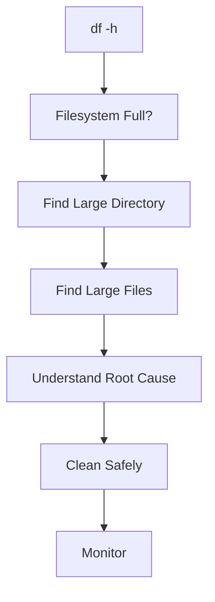

# Disk Full Troubleshooting Guide

> One of the most common Linux production incidents.
>
> One of the fastest ways to crash applications.
>
> One of the most misunderstood infrastructure failures.

---

# Why This Exists

Storage is not infinite.

Every Linux system eventually runs into storage pressure.

When disk space reaches 100%, systems begin failing in unexpected ways:

* Applications stop writing data
* Databases become unstable
* Log collection breaks
* Containers crash
* Deployments fail
* Package managers stop working
* SSH may become unreliable
* Entire servers can become unusable

Most engineers think:

```text
Disk Full = Need More Storage
```

This is often wrong.

A full disk is usually a symptom of:

* Poor housekeeping
* Log explosions
* Application bugs
* Misconfigured backups
* Runaway containers
* Unexpected traffic growth

Understanding why disks become full is a core production engineering skill.

---

# Problem It Solves

Imagine a city.

Storage is like available land.

```text
City
 ├── Houses
 ├── Roads
 ├── Factories
 ├── Warehouses
```

Everything needs space.

When space runs out:

```text
Nothing new can be built.
```

Linux behaves the same way.

When free blocks reach zero:

```text
No more writes
```

Result:

```text
Application failures
Database failures
Container failures
System instability
```

---

# Mental Model

Think of a filesystem as a giant warehouse.

```text
Warehouse
│
├── Shelves
├── Boxes
├── Inventory Records
│
└── Free Space
```

Files consume:

```text
Data Blocks
```

Directories consume:

```text
Metadata
```

Filesystem tracks:

```text
Used Space
Free Space
Reserved Space
```

Once free space disappears:

```text
New writes fail
```

---

# First Principles

Data ultimately becomes blocks on storage devices.

```text
Application
    ↓
Filesystem
    ↓
Block Layer
    ↓
Disk
```

Every file requires:

```text
Blocks
```

Example:

```text
1 MB File
    ↓
Multiple Disk Blocks
```

Disk full means:

```text
No Free Blocks Available
```

Kernel returns:

```bash
No space left on device
```

Error code:

```text
ENOSPC
```

---

# What Actually Happens?

Application:

```bash
echo "hello" >> app.log
```

Internally:

```text
Application
     ↓
write()
     ↓
Kernel
     ↓
Filesystem
     ↓
Allocate Block
     ↓
No Free Blocks
     ↓
ENOSPC
```

Application receives:

```text
No space left on device
```

---

# Linux Storage Architecture


---

# Types of Disk Full Situations

Many engineers assume only one type exists.

Reality:

```text
1. Actual Disk Full
2. Inode Exhaustion
3. Reserved Block Exhaustion
4. Container Filesystem Full
5. Volume Full
6. Network Storage Full
```

Each requires different troubleshooting.

---

# Visualizing Capacity

```text
Filesystem Size

|---------------------------|

Used Space

|======================      |

Free Space

|        |
```

Eventually:

```text
|===========================|

100% Used
```

---

# How Linux Measures Storage

Check capacity:

```bash
df -h
```

Example:

```text
Filesystem      Size Used Avail Use%

/dev/sda1       100G 98G 2G 98%
```

Meaning:

```text
Total: 100 GB
Used: 98 GB
Free: 2 GB
```

---

# Understanding df Output

```bash
df -h
```

Example:

```text
Filesystem     Size Used Avail Use%

/dev/sda1      500G 490G 10G 98%
```

Important columns:

```text
Size
Used
Available
Use%
```

---

# Finding the Problem

## Step 1

Check utilization.

```bash
df -h
```

Example:

```text
/var = 100%
```

Now focus on:

```text
/var
```

---

## Step 2

Identify large directories.

```bash
du -sh /*
```

Or:

```bash
du -sh /var/*
```

Example:

```text
/var/log
= 150 GB
```

Problem discovered.

---

## Step 3

Drill deeper.

```bash
du -sh /var/log/*
```

Example:

```text
app.log
120 GB
```

---

# Investigation Workflow



---

# Common Root Causes

## Log Explosion

Most common production cause.

Example:

```text
Application bug
      ↓
Millions of errors
      ↓
Log growth
      ↓
Disk Full
```

Example:

```text
app.log

300 GB
```

---

## Forgotten Backups

```text
backup-2025.tar
backup-2026.tar
backup-old.tar
```

Accumulated for years.

Result:

```text
Storage exhaustion
```

---

## Docker Images

```bash
docker images
```

Unused layers accumulate.

Example:

```text
200 images
```

Consumes:

```text
100+ GB
```

---

## Container Logs

Check:

```bash
du -sh /var/lib/docker
```

Very common issue.

---

## Core Dumps

Application crash:

```text
core.12345
```

Can consume:

```text
Gigabytes
```

---

## Temporary Files

```text
/tmp
/var/tmp
```

Applications forget cleanup.

---

# Linux Internals

Filesystem stores:

```text
Data Blocks
Inodes
Metadata
Journals
```

Disk full generally means:

```text
No blocks available
```

But filesystem metadata also consumes space.

---

# Reserved Blocks

Linux reserves space for root.

View:

```bash
tune2fs -l /dev/sda1
```

Example:

```text
Reserved block count
```

Purpose:

```text
Allow root recovery
Prevent total collapse
```

---

# Open Deleted Files

One of the most dangerous disk-full scenarios.

Example:

```bash
rm huge.log
```

Disk usage:

```text
Still Full
```

Why?

Process still has file open.

```text
Process
      ↓
File Descriptor
      ↓
Deleted File
```

Storage remains allocated.

---

# Visualizing Open Deleted Files

```text
Application
     │
     ▼

File Descriptor
     │
     ▼

Deleted File
     │
     ▼

Blocks Still Occupied
```

Check:

```bash
lsof | grep deleted
```

---

# Production Example

## Incident

E-commerce website unavailable.

Symptoms:

```text
500 Errors
Database Write Failures
Login Failures
```

Investigation:

```bash
df -h
```

Result:

```text
/var
100%
```

Further analysis:

```bash
du -sh /var/log/*
```

Found:

```text
payment-service.log

230 GB
```

Root cause:

```text
Infinite retry loop
```

Fix:

```text
Rotate logs
Patch application
```

System restored.

---

# Databases and Full Disks

Databases hate full disks.

Examples:

```text
PostgreSQL
MySQL
MongoDB
Redis Persistence
```

Failures:

```text
Write operations fail
Transactions fail
Replication breaks
Backups fail
```

Some databases may enter protective modes.

---

# Docker and Disk Full

Check:

```bash
docker system df
```

Clean:

```bash
docker system prune
```

Careful:

```text
Can remove unused resources
```

---

# Kubernetes Connection

Kubernetes nodes often fail because:

```text
Container Images
Container Logs
Overlay Filesystems
```

Node condition:

```text
DiskPressure
```

Check:

```bash
kubectl describe node
```

Possible result:

```text
DiskPressure=True
```

---

# Cloud Environment Impact

In cloud:

```text
AWS EBS
Azure Managed Disk
GCP Persistent Disk
```

Full volumes cause:

```text
Application outages
Database issues
Pod evictions
```

Storage monitoring becomes critical.

---

# Performance Implications

As disks become full:

```text
Fragmentation increases
Allocation becomes harder
Metadata operations slow
```

Filesystems perform best with free space.

Rule:

```text
Keep 15-20% free
```

Production systems should avoid:

```text
>90%
```

utilization.

---

# Security Implications

Attackers may intentionally fill storage.

Examples:

```text
Log Flooding
Mass File Uploads
Dump Attacks
```

Results:

```text
Denial of Service
```

Mitigation:

```text
Quotas
Log Rotation
Monitoring
Rate Limiting
```

---

# Observability

Monitor:

```text
Filesystem Usage
Growth Rate
Top Consumers
Inode Usage
```

Tools:

```bash
df -h
du -sh
iostat
lsof
```

Monitoring Systems:

```text
Prometheus
Grafana
Datadog
New Relic
CloudWatch
```

---

# Troubleshooting Checklist

## Check Usage

```bash
df -h
```

---

## Check Inodes

```bash
df -i
```

---

## Find Large Directories

```bash
du -sh /*
```

---

## Find Large Files

```bash
find / -type f -size +1G
```

---

## Check Deleted Open Files

```bash
lsof | grep deleted
```

---

## Check Docker

```bash
docker system df
```

---

## Check Logs

```bash
du -sh /var/log/*
```

---

# Common Mistakes

## Mistake 1

Deleting random files.

---

## Mistake 2

Ignoring root cause.

---

## Mistake 3

Cleaning logs without fixing application.

---

## Mistake 4

Not checking deleted open files.

---

## Mistake 5

Running at 99% permanently.

---

## Mistake 6

Ignoring inode usage.

---

# Engineering Mindset

Beginners ask:

```text
How do I free space?
```

Engineers ask:

```text
Why did space disappear?
```

The objective is not cleanup.

The objective is:

```text
Prevent recurrence
```

Storage incidents are usually symptoms.

Find the system behavior creating them.

---

# Interview Questions

### What does ENOSPC mean?

```text
No Space Left On Device
```

---

### Why can disk remain full after deleting a file?

Process still has file open.

---

### How do you find large directories?

```bash
du -sh *
```

---

### Difference between df and du?

df:

```text
Filesystem Usage
```

du:

```text
Directory/File Usage
```

---

### Why keep free disk space?

For:

```text
Performance
Metadata
Recovery
Filesystem health
```

---

### How do Kubernetes nodes react to low storage?

```text
DiskPressure
Pod Evictions
```

---

# Cheat Sheet

```bash
# Disk usage
df -h

# Inodes
df -i

# Directory sizes
du -sh *

# Large files
find / -type f -size +1G

# Open deleted files
lsof | grep deleted

# Docker usage
docker system df

# Cleanup unused containers/images
docker system prune

# Log sizes
du -sh /var/log/*

# Block devices
lsblk

# Filesystem details
tune2fs -l /dev/sda1
```

---

# Final Takeaway

A full disk is rarely a storage problem.

It is usually an engineering problem.

The real investigation is:

```text
Who consumed the space?
Why did they consume it?
Why was it not detected?
Why was it not prevented?
```

Elite Linux engineers do not simply free disk space.

They build systems that never reach crisis mode in the first place.
