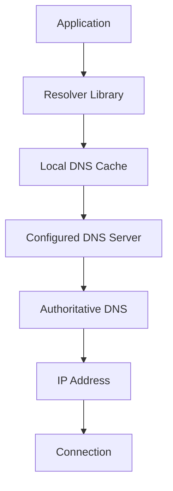
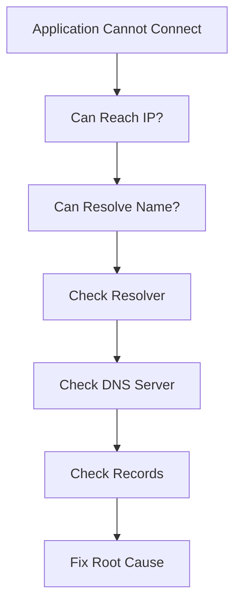

# DNS Resolution Failure Troubleshooting Guide

> The most common network problem that engineers mistakenly blame on the network.
>
> The invisible system that makes the modern internet usable.
>
> The reason applications can fail even when servers, databases, and networks are perfectly healthy.

---

# Why This Exists

Humans think in names.

```text
google.com
github.com
api.company.com
database.internal
```

Computers communicate using:

```text
142.250.183.110
140.82.121.4
10.0.1.25
```

DNS exists to bridge this gap.

```text
Human Name
      ↓
DNS
      ↓
IP Address
```

Without DNS:

```text
Websites Fail
APIs Fail
Containers Fail
Microservices Fail
Cloud Systems Fail
```

DNS is one of the most critical pieces of infrastructure in modern computing.

Ironically:

```text
When DNS breaks,
everything looks broken.
```

---

# Problem It Solves

Imagine a world without contact names.

Every phone call requires:

```text
Remember Exact Number
```

instead of:

```text
Call Mom
Call Friend
Call Office
```

DNS is the internet's contact list.

```text
google.com
      ↓
142.250.x.x

github.com
      ↓
140.82.x.x
```

Without DNS:

```text
Applications Cannot Find Services
```

---

# Mental Model

Think of DNS as a giant distributed phonebook.

```text
User
  ↓
DNS Query
  ↓
Phonebook Lookup
  ↓
IP Address
  ↓
Connection
```

When DNS fails:

```text
Application
    ↓
Cannot Find Destination
    ↓
Connection Never Starts
```

Many engineers waste hours troubleshooting:

```text
Firewall
Network
Application
Database
```

when the actual problem is:

```text
Name Resolution
```

---

# First Principles

Applications do not connect to names.

Applications connect to:

```text
IP Addresses
```

Example:

```bash
curl https://api.company.com
```

Internally:

```text
curl
  ↓
DNS Lookup
  ↓
IP Address
  ↓
TCP Connection
  ↓
HTTPS
```

If DNS fails:

```text
TCP Never Starts
```

---

# DNS Resolution Flow



---

# Common DNS Error Messages

---

## Temporary Failure In Name Resolution

```bash
ping google.com
```

Output:

```text
Temporary failure in name resolution
```

Meaning:

```text
DNS Lookup Failed
```

---

## Name Or Service Not Known

```text
Name or service not known
```

Meaning:

```text
Hostname Cannot Be Resolved
```

---

## NXDOMAIN

```text
NXDOMAIN
```

Meaning:

```text
Domain Does Not Exist
```

---

## SERVFAIL

```text
SERVFAIL
```

Meaning:

```text
DNS Server Failed
```

---

## Host Not Found

```text
Host not found
```

Meaning:

```text
Resolver Could Not Obtain IP Address
```

---

# Golden Rule

Always separate:

```text
DNS Problem
```

from

```text
Network Problem
```

Example:

```bash
ping 8.8.8.8
```

works.

But:

```bash
ping google.com
```

fails.

Network is healthy.

DNS is broken.

---

# The First Investigation

Check:

```bash
ping 8.8.8.8
```

If successful:

```text
Network Works
```

Then test:

```bash
ping google.com
```

If this fails:

```text
DNS Failure Confirmed
```

---

# Systematic Troubleshooting Workflow



---

# Understanding Linux DNS Resolution

Linux uses:

```text
glibc resolver
```

Configuration:

```bash
/etc/resolv.conf
```

Example:

```text
nameserver 8.8.8.8
nameserver 1.1.1.1
```

These are DNS servers.

---

# Verify Resolver Configuration

Check:

```bash
cat /etc/resolv.conf
```

Example:

```text
nameserver 8.8.8.8
```

Missing nameservers:

```text
DNS Cannot Function
```

---

# Testing DNS Directly

Use:

```bash
nslookup google.com
```

or

```bash
dig google.com
```

Example:

```bash
dig google.com
```

Expected:

```text
ANSWER SECTION
google.com
142.x.x.x
```

---

# Understanding dig Output

```bash
dig github.com
```

Important sections:

```text
QUESTION SECTION
ANSWER SECTION
AUTHORITY SECTION
ADDITIONAL SECTION
```

Most troubleshooting focuses on:

```text
ANSWER SECTION
```

---

# DNS Architecture


---

# DNS Caching

DNS is heavily cached.

```text
Browser
OS
Resolver
DNS Server
```

Benefits:

```text
Lower Latency
Reduced Load
Faster Responses
```

Problems:

```text
Stale Records
Incorrect Results
```

---

# Common Root Causes

---

# Cause 1: Bad /etc/resolv.conf

Example:

```text
nameserver 10.10.10.10
```

Server unreachable.

Result:

```text
DNS Failure
```

Check:

```bash
cat /etc/resolv.conf
```

---

# Cause 2: DNS Server Down

Example:

```text
Corporate DNS Server Offline
```

Verify:

```bash
dig google.com @DNS_SERVER
```

Example:

```bash
dig google.com @8.8.8.8
```

---

# Cause 3: Firewall Blocking DNS

DNS uses:

```text
UDP 53
TCP 53
```

Blocked firewall:

```text
Queries Fail
```

Check:

```bash
iptables -L
```

or

```bash
nft list ruleset
```

---

# Cause 4: Wrong DNS Records

Example:

```text
api.company.com
```

points to:

```text
Wrong IP
```

Application appears broken.

Actual problem:

```text
DNS Misconfiguration
```

---

# Cause 5: Expired Records

Common cloud issue.

Example:

```text
Instance Replaced
DNS Not Updated
```

Result:

```text
Traffic Sent To Dead Server
```

---

# Cause 6: Split DNS Problems

Enterprise networks often use:

```text
Internal DNS
External DNS
```

Internal users:

```text
Resolve Correctly
```

External users:

```text
Fail
```

Very common production issue.

---

# Cause 7: DNS Cache Poisoning

Incorrect cached entries.

Results:

```text
Wrong Destination
```

Rare but important.

---

# Linux Internals

Application:

```bash
curl api.company.com
```

Internally:

```text
getaddrinfo()
       ↓
Resolver Library
       ↓
/etc/resolv.conf
       ↓
DNS Query
       ↓
IP Address
       ↓
TCP Connection
```

Failure occurs before networking.

---

# Verify DNS Service

Many Linux systems run:

```text
systemd-resolved
```

Check:

```bash
systemctl status systemd-resolved
```

View status:

```bash
resolvectl status
```

---

# DNS In Containers

Containers often use:

```text
Docker DNS
Kubernetes DNS
CoreDNS
```

Failure symptoms:

```text
Pod Cannot Reach Service
```

but:

```text
Network Works
```

Root cause:

```text
DNS
```

---

# Kubernetes DNS Troubleshooting

Check:

```bash
kubectl get pods -n kube-system
```

Look for:

```text
coredns
```

Verify:

```bash
kubectl logs coredns-pod
```

Common failures:

```text
CrashLoopBackOff
Config Errors
Upstream Resolver Failure
```

---

# Docker DNS Troubleshooting

Inspect:

```bash
docker exec container cat /etc/resolv.conf
```

Verify:

```bash
nslookup google.com
```

inside container.

---

# Cloud DNS Problems

Common examples:

```text
AWS Route53
Azure DNS
Google Cloud DNS
Cloudflare
```

Typical failures:

```text
Wrong Records
Propagation Delays
Expired Entries
```

---

# Production Incident Example

## Incident

E-commerce site down.

Symptoms:

```text
Payment Service Failing
```

Logs:

```text
Unable to connect to db.company.internal
```

Initial assumption:

```text
Database Down
```

Database healthy.

Investigation:

```bash
dig db.company.internal
```

Result:

```text
NXDOMAIN
```

Root cause:

```text
Accidental DNS Record Deletion
```

Recovery:

```text
Restore Record
```

Downtime:

```text
7 Minutes
```

---

# Observability

Monitor:

```text
DNS Latency
DNS Errors
NXDOMAIN Rate
SERVFAIL Rate
```

Metrics:

```text
Query Success Rate
Resolution Time
Cache Hit Rate
```

Tools:

```text
Prometheus
Grafana
Datadog
CloudWatch
New Relic
```

---

# Performance Implications

Slow DNS causes:

```text
Slow APIs
Slow Websites
Slow Containers
Slow Databases
```

Applications often appear slow when:

```text
DNS Is Slow
```

---

# Security Implications

DNS is a major attack target.

Threats:

```text
Cache Poisoning
DNS Hijacking
Spoofing
Domain Takeover
Amplification Attacks
```

Defenses:

```text
DNSSEC
Monitoring
Least Privilege
Access Controls
```

---

# Troubleshooting Checklist

```text
1. Test IP Connectivity
2. Test Hostname Resolution
3. Check /etc/resolv.conf
4. Check DNS Service
5. Query DNS Directly
6. Verify Records
7. Verify Firewall Rules
8. Check Cache
9. Check Containers
10. Check Kubernetes DNS
11. Check Cloud DNS
12. Verify Authoritative Server
```

---

# Common Mistakes

## Mistake 1

Assuming network failure.

---

## Mistake 2

Only testing hostnames.

Always test:

```bash
ping IP_ADDRESS
```

---

## Mistake 3

Ignoring caches.

---

## Mistake 4

Not checking `/etc/resolv.conf`.

---

## Mistake 5

Blaming applications.

Often:

```text
DNS Is Broken
```

---

# Engineering Mindset

DNS is not networking.

DNS is:

```text
Service Discovery
```

When troubleshooting:

Ask:

```text
Can I reach the destination?
```

and separately:

```text
Can I find the destination?
```

These are different problems.

Elite engineers isolate them immediately.

---

# Interview Questions

### What file contains DNS server configuration?

```bash
/etc/resolv.conf
```

---

### Difference between pinging an IP and hostname?

IP tests:

```text
Network
```

Hostname tests:

```text
DNS + Network
```

---

### What does NXDOMAIN mean?

```text
Domain Does Not Exist
```

---

### What command is most useful for DNS troubleshooting?

```bash
dig
```

---

### What ports does DNS use?

```text
UDP 53
TCP 53
```

---

### What DNS service is commonly used on modern Linux systems?

```text
systemd-resolved
```

---

# Cheat Sheet

```bash
# DNS Lookup
dig google.com

# Alternative
nslookup google.com

# Resolver Config
cat /etc/resolv.conf

# DNS Service
systemctl status systemd-resolved

# Resolver Status
resolvectl status

# Test Network
ping 8.8.8.8

# Test DNS
ping google.com

# Query Specific DNS Server
dig google.com @8.8.8.8

# Check DNS Port
ss -ulpn | grep :53

# Container DNS
docker exec container cat /etc/resolv.conf
```

---

# Final Takeaway

DNS is the internet's distributed service discovery system.

When DNS fails:

```text
Applications Cannot Find Services
```

even when:

```text
Servers Are Healthy
Networks Are Healthy
Databases Are Healthy
```

The fastest Linux engineers always separate:

```text
Can I Reach It?
```

from:

```text
Can I Resolve It?
```

That distinction alone solves a huge percentage of production networking incidents.
