# Docker Container Failures Troubleshooting Guide

> One of the most important modern Linux troubleshooting skills.
>
> The root cause behind application outages, Kubernetes incidents, CI/CD failures, deployment problems, and cloud-native infrastructure issues.
>
> A topic that teaches how containers actually work beneath the Docker CLI.

---

# Why This Exists

Modern infrastructure runs on containers.

Examples:

```text
Web Applications
APIs
Databases
Microservices
CI/CD Pipelines
Kubernetes Pods
Machine Learning Workloads
```

Many engineers think:

```text
Container = Application
```

Reality:

```text
Container
=
Linux Features
+
Runtime
+
Filesystem
+
Networking
+
Process Isolation
+
Resource Control
```

When containers fail:

```text
Applications Crash
Deployments Fail
Pods Restart
Services Become Unavailable
Clusters Become Unhealthy
```

Understanding container failures means understanding Linux itself.

---

# Problem It Solves

Imagine an apartment building.

```text
Host Linux = Building

Container = Apartment
```

Each apartment has:

```text
Its Own View
Its Own Processes
Its Own Filesystem
Its Own Network
```

But all apartments still depend on:

```text
Same Building
```

When a container fails:

```text
Apartment Problem
```

When Docker fails:

```text
Building Infrastructure Problem
```

Understanding the distinction is critical.

---

# Mental Model

Most engineers troubleshoot:

```bash
docker ps
docker logs
```

and stop.

Elite engineers think:

```text
Container
 ↓
Runtime
 ↓
Namespaces
 ↓
Cgroups
 ↓
Filesystem
 ↓
Network
 ↓
Kernel
```

Every container issue occurs somewhere in this stack.

---

# First Principles

A container is NOT:

```text
A Virtual Machine
```

Containers share:

```text
Host Kernel
```

Unlike VMs:

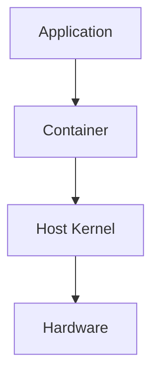

There is:

```text
One Kernel
```

for all containers.

---

# Docker Architecture

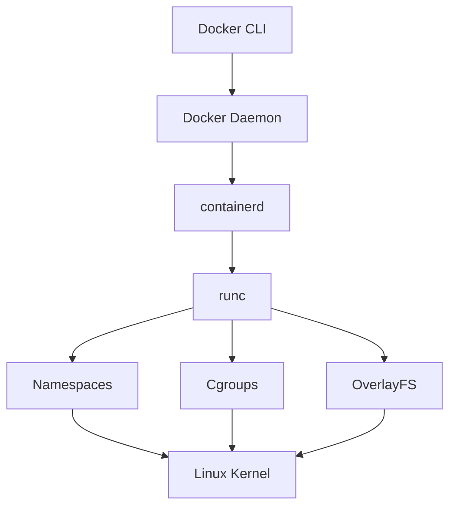

Failure can occur at any layer.

---

# The Golden Rule

Never ask:

```text
Why Did The Container Fail?
```

Ask:

```text
Which Layer Failed?
```

Possible layers:

```text
Application
Process
Filesystem
Network
Resources
Container Runtime
Docker Engine
Kernel
```

---

# Container Lifecycle


Understanding where failure occurs dramatically speeds troubleshooting.

---

# Common Failure Categories

```text
Container Won't Start

Container Exits Immediately

CrashLoop

OOMKilled

Network Failures

Storage Failures

Permission Issues

Docker Daemon Failures

Image Pull Failures

Runtime Failures
```

---

# Failure 1: Container Exits Immediately

Most common issue.

Example:

```bash
docker run nginx
```

Container exits instantly.

---

# Why?

Containers live as long as:

```text
PID 1 Lives
```

When PID 1 exits:

```text
Container Stops
```

---

# Process Architecture

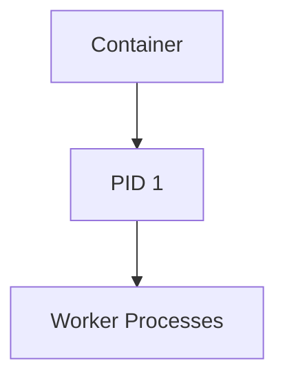

No PID 1:

```text
No Container
```

---

# Investigation

Check:

```bash
docker logs CONTAINER
```

Check:

```bash
docker inspect CONTAINER
```

---

# Failure 2: CrashLoop

Container repeatedly:

```text
Start
Crash
Restart
Crash
Restart
```

---

# CrashLoop Flow

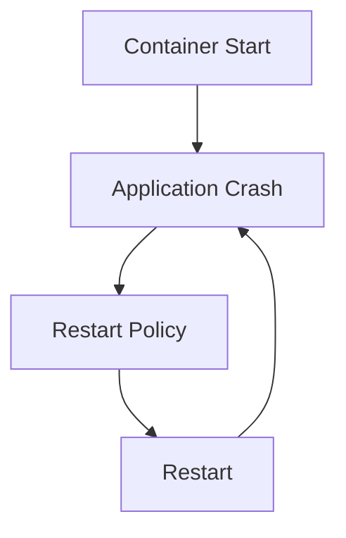

---

# Common Causes

```text
Bad Configuration
Missing Environment Variables
Database Unreachable
Application Bugs
Permission Errors
```

---

# Investigation

```bash
docker logs CONTAINER
```

Most useful command.

---

# Failure 3: OOMKilled

Very common in production.

Container disappears.

Exit code:

```text
137
```

---

# Why?

Linux memory exhausted.

Kernel activates:

```text
OOM Killer
```

---

# Memory Pressure Architecture

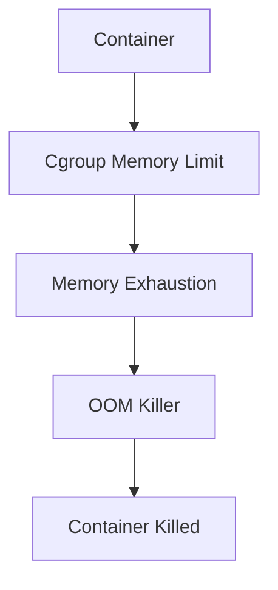

---

# Investigation

Check:

```bash
docker inspect CONTAINER
```

Look for:

```text
OOMKilled=true
```

Check:

```bash
dmesg
```

---

# Failure 4: Image Pull Failure

Example:

```text
ImagePullBackOff
```

or

```text
pull access denied
```

---

# Causes

```text
Wrong Image Name
Private Registry Authentication
DNS Failure
Network Failure
Registry Outage
```

---

# Image Pull Architecture

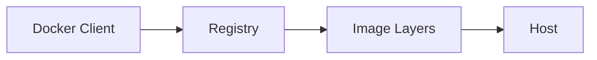

---

# Investigation

```bash
docker pull IMAGE
```

Verify:

```bash
ping registry
```

---

# Failure 5: Container Networking Failure

Example:

```text
Container Running

Application Unreachable
```

---

# Networking Stack


---

# Common Causes

```text
Port Mapping Missing
Bridge Issues
Firewall Rules
DNS Failure
Application Not Listening
```

---

# Investigation

Check:

```bash
docker ps
```

Look for:

```text
0.0.0.0:8080->80
```

Verify listening:

```bash
docker exec CONTAINER ss -tulpn
```

---

# Failure 6: DNS Resolution Failure

Inside container:

```bash
curl google.com
```

fails.

---

# Docker DNS Flow

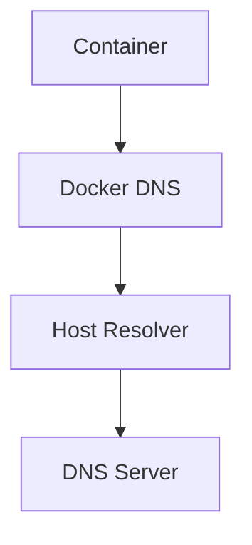

---

# Investigation

```bash
cat /etc/resolv.conf
```

inside container.

---

# Failure 7: Volume Mount Problems

Example:

```text
File Missing
Data Lost
Configuration Missing
```

---

# Storage Architecture

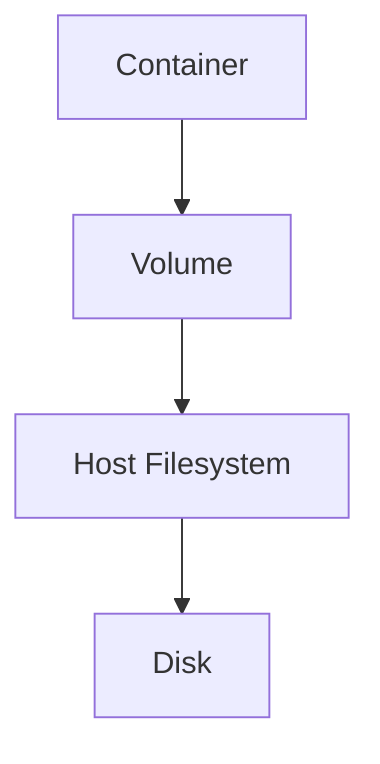

---

# Investigation

Check:

```bash
docker inspect CONTAINER
```

Look for:

```text
Mounts
```

section.

---

# Failure 8: OverlayFS Issues

Containers use:

```text
OverlayFS
```

---

# OverlayFS Architecture

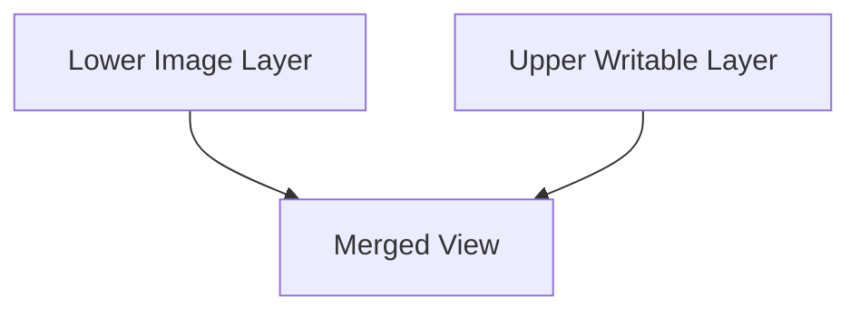

Problems:

```text
Disk Full
Corruption
Overlay Mount Failure
```

---

# Investigation

Check:

```bash
df -h
```

and

```bash
docker system df
```

---

# Failure 9: Docker Daemon Failure

Example:

```bash
docker ps
```

returns:

```text
Cannot connect to Docker daemon
```

---

# Docker Runtime Stack

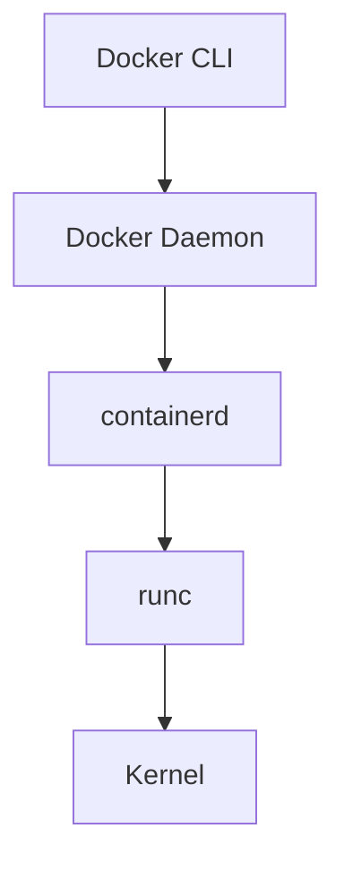

---

# Investigation

Check:

```bash
systemctl status docker
```

Check:

```bash
journalctl -u docker
```

---

# Failure 10: Permission Denied

Example:

```text
permission denied
```

---

# Common Causes

```text
SELinux
AppArmor
Volume Permissions
UID/GID Mismatch
Read-Only Filesystem
```

---

# User Mapping Problem

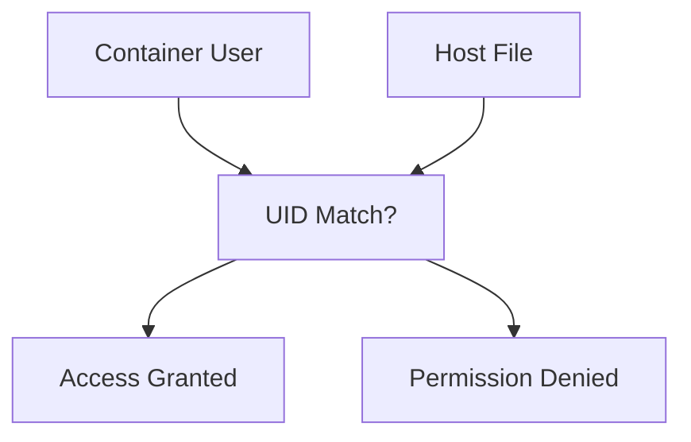

---

# Linux Internals

Containers rely heavily on:

```text
Namespaces
Cgroups
OverlayFS
Capabilities
Seccomp
```

---

# Namespace Isolation

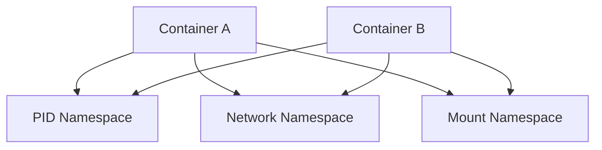

---

# Resource Isolation

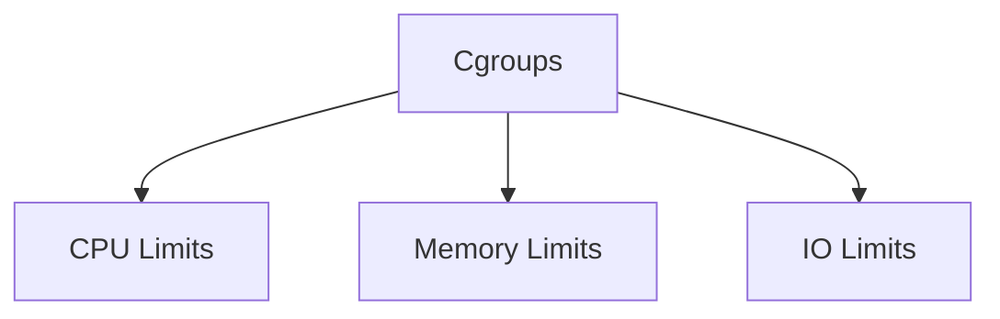

---

# Production Incident Example

## Incident

E-commerce API outage.

Monitoring:

```text
Containers Restarting
```

Investigation:

```bash
docker ps -a
```

Found:

```text
Exited (137)
```

Check:

```bash
docker inspect
```

Result:

```text
OOMKilled=true
```

Root Cause:

```text
Memory Leak
```

Fix:

```text
Application Patch
Increase Memory Limit
```

---

# Kubernetes Connection

Every Kubernetes pod is:

```text
A Container
```

Most pod failures are actually:

```text
Container Failures
```

Examples:

```text
CrashLoopBackOff
OOMKilled
ImagePullBackOff
ContainerCreating
```

Understanding Docker troubleshooting directly improves Kubernetes troubleshooting.

---

# CI/CD Connection

Pipeline failures often originate from:

```text
Container Build Errors
Registry Authentication
Image Pull Problems
```

not CI systems themselves.

---

# Cloud Connection

Cloud-native systems depend heavily on:

```text
Containers
```

Failures impact:

```text
ECS
EKS
AKS
GKE
Nomad
OpenShift
```

---

# Performance Considerations

Monitor:

```text
CPU Usage
Memory Usage
Disk IO
Network Throughput
```

Commands:

```bash
docker stats
```

```bash
cgroup metrics
```

---

# Security Considerations

Common issues:

```text
Privileged Containers
Root Containers
Exposed Docker Socket
Excessive Capabilities
```

Always investigate:

```text
Who Can Access What
```

inside container.

---

# Observability

Essential commands:

```bash
docker ps

docker logs

docker inspect

docker stats

docker exec

docker events

journalctl -u docker
```

---

# Master Troubleshooting Workflow

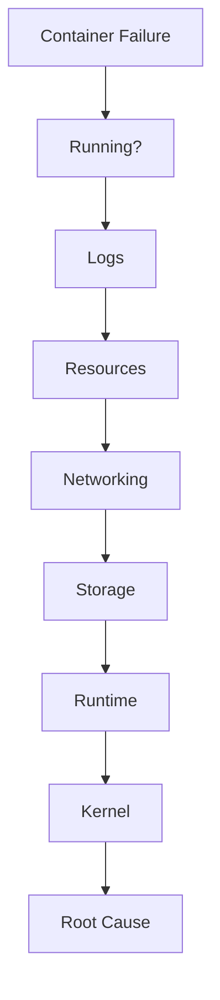

---

# Common Mistakes

## Mistake 1

Treating containers as virtual machines.

---

## Mistake 2

Ignoring container logs.

---

## Mistake 3

Ignoring PID 1 behavior.

---

## Mistake 4

Blaming Docker before checking application.

---

## Mistake 5

Ignoring resource limits.

---

## Mistake 6

Ignoring host-level failures.

---

# Engineering Mindset

Beginners think:

```text
Docker Is Broken
```

Engineers think:

```text
Container Failed
```

Senior engineers think:

```text
Which Layer Failed?
```

Elite platform engineers think:

```text
Application
↓
Container
↓
Runtime
↓
Namespaces
↓
Cgroups
↓
Kernel

Where Did The Failure Actually Occur?
```

Because containers are not magic.

They are Linux features assembled into a platform.

---

# Interview Questions

### Why does a container stop?

Because PID 1 exited.

---

### What does Exit Code 137 mean?

Usually OOMKilled.

---

### Difference between image and container?

Image:

```text
Template
```

Container:

```text
Running Instance
```

---

### What command shows container logs?

```bash
docker logs CONTAINER
```

---

### What command shows resource usage?

```bash
docker stats
```

---

### What Linux features power containers?

```text
Namespaces
Cgroups
OverlayFS
Capabilities
```

---

### Can a container have its own kernel?

No.

Containers share host kernel.

---

# Cheat Sheet

```bash
# Running Containers
docker ps

# All Containers
docker ps -a

# Logs
docker logs CONTAINER

# Detailed Info
docker inspect CONTAINER

# Resource Usage
docker stats

# Execute Shell
docker exec -it CONTAINER sh

# Networks
docker network ls

# Volumes
docker volume ls

# Images
docker images

# Pull Image
docker pull IMAGE

# Events
docker events

# Docker Logs
journalctl -u docker
```

---

# Final Takeaway

Container failures are rarely:

```text
Docker Problems
```

Most are:

```text
Application Problems
Resource Problems
Filesystem Problems
Network Problems
Kernel Problems
```

The most important lesson:

```text
Container
≠
Magic Box
```

A container is simply:

```text
Linux Namespaces
+
Cgroups
+
Filesystem Layers
+
Networking
+
Processes
```

The best Linux engineers troubleshoot containers by peeling back layers:

```text
Application
 ↓
Container
 ↓
Runtime
 ↓
Kernel
```

until they discover the real root cause.

That mindset scales from:

```text
Single Docker Container
        ↓
Docker Host
        ↓
Kubernetes Pod
        ↓
Production Cluster
        ↓
Cloud Platform
```

and is one of the defining skills of modern Linux, DevOps, SRE, and Platform Engineers.
