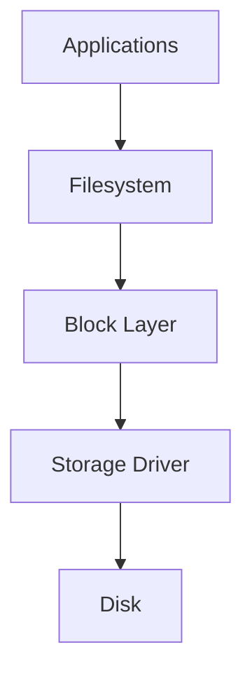
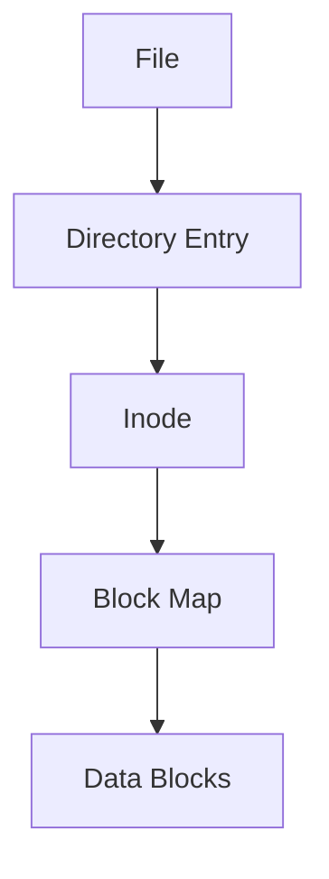
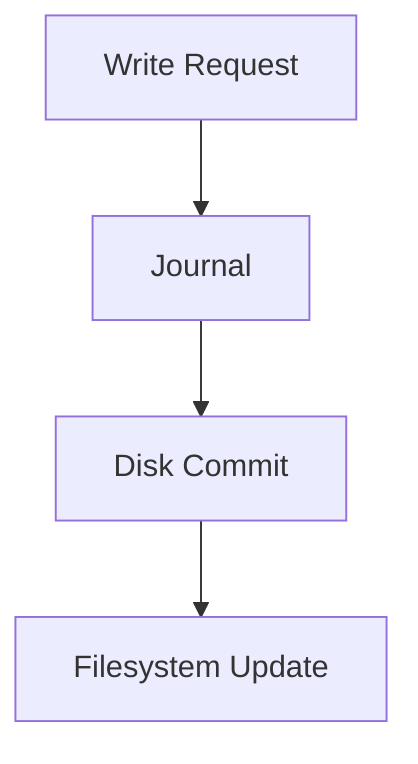
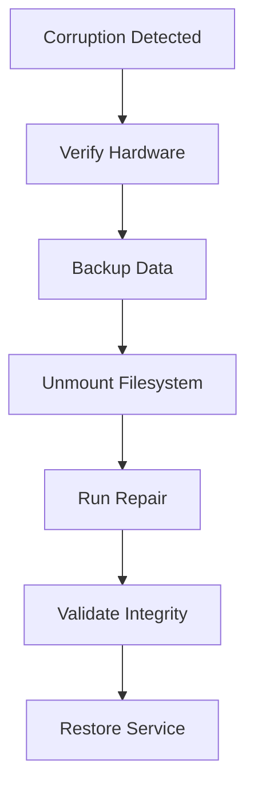
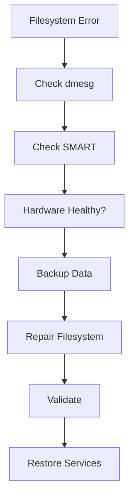

# Filesystem Corruption Troubleshooting Guide

> One of the most dangerous failures in Linux.
>
> The moment when storage can no longer be trusted.
>
> A problem capable of causing boot failures, application crashes, database corruption, and permanent data loss.
>
> A topic every Linux engineer must understand deeply.

---

# Why This Exists

Everything in Linux is built on files.

Applications:

```text
Executables
Libraries
Configurations
Logs
Databases
Containers
```

all ultimately depend on:

```text
Filesystem Integrity
```

When the filesystem becomes corrupted:

```text
Files Disappear
Data Changes
Reads Fail
Writes Fail
Boot Fails
Applications Crash
```

At that point:

```text
Storage Exists
But Trust Is Gone
```

Filesystem corruption is fundamentally a:

```text
Data Integrity Incident
```

not merely a storage problem.

---

# Problem It Solves

Imagine a library.

Healthy library:

```text
Books
Shelves
Catalog
Locations
```

all match.

You can find any book.

Corrupted library:

```text
Catalog Says Shelf A

Book Actually On Shelf Z

Or Missing Entirely
```

The library still exists.

But:

```text
Organization Is Broken
```

Filesystems work the same way.

Corruption means:

```text
Metadata
Data
Or Both
Are No Longer Consistent
```

---

# Mental Model

Think of a filesystem as:

```text
Data
+
Metadata
```

Data:

```text
Actual File Contents
```

Metadata:

```text
Filename
Permissions
Ownership
Timestamps
Location On Disk
```

Corruption occurs when:

```text
Reality
≠
Filesystem Metadata
```

---

# First Principles

Storage devices provide:

```text
Blocks
```

Filesystems provide:

```text
Files
Directories
Permissions
Links
```

Filesystem responsibility:

```text
Translate

Human View
      ↓
Disk Blocks
```

Example:

```text
/etc/passwd

Actually Stored As

Thousands Of Disk Blocks
```

Filesystem corruption occurs when:

```text
Translation Layer Breaks
```

---

# Linux Storage Stack



Corruption may occur at any layer.

---

# What Is Filesystem Corruption?

Filesystem corruption means:

```text
Filesystem Structures
No Longer Match Expected State
```

Examples:

```text
Damaged Inodes
Broken Directories
Corrupted Journals
Lost Blocks
Invalid Metadata
```

---

# Filesystem Architecture


If any layer becomes inconsistent:

```text
Corruption
```

occurs.

---

# Symptoms

Common symptoms:

```text
Input/output errors
Read failures
Missing files
Unexpected reboots
Kernel panics
Filesystem mounted read-only
```

---

# Common Error Messages

Example:

```text
EXT4-fs error
```

Example:

```text
Input/output error
```

Example:

```text
Structure needs cleaning
```

Example:

```text
Filesystem check failed
```

Example:

```text
Corrupt journal
```

---

# First Investigation

Check:

```bash
dmesg
```

Look for:

```text
EXT4 Errors
XFS Errors
I/O Errors
Journal Errors
```

---

# Golden Rule

Never run repair tools blindly.

Always ask:

```text
Corruption Or Hardware Failure?
```

Repairing corruption on failing hardware can:

```text
Destroy Recoverable Data
```

---

# Common Root Causes

---

# Cause 1: Power Failure

Most common cause.

Example:

```text
Database Writing
↓
Power Loss
↓
Incomplete Metadata Update
```

Result:

```text
Filesystem Inconsistency
```

---

# Cause 2: Sudden Reboot

Examples:

```text
Reset Button
Kernel Panic
Virtual Machine Crash
Cloud Instance Failure
```

Filesystem never finishes pending writes.

---

# Cause 3: Storage Device Failure

Examples:

```text
SSD Failure
NVMe Failure
Hard Drive Failure
SAN Failure
```

Bad sectors create corruption.

---

# Cause 4: Faulty RAM

Dangerous and often overlooked.

Example:

```text
Filesystem Metadata
↓
Corrupted In Memory
↓
Written To Disk
```

Result:

```text
Perfectly Written
Incorrect Data
```

---

# Cause 5: RAID Issues

Examples:

```text
Controller Bugs
Failed Rebuild
Split Brain
```

Result:

```text
Filesystem Damage
```

---

# Cause 6: Kernel Bugs

Rare but possible.

Filesystem driver writes:

```text
Incorrect Metadata
```

Result:

```text
Corruption
```

---

# Cause 7: Storage Firmware Bugs

Examples:

```text
SSD Firmware Defect
NVMe Firmware Bug
```

Can silently corrupt writes.

---

# Cause 8: Filesystem Bugs

Examples:

```text
EXT4 Bugs
XFS Bugs
Btrfs Bugs
```

Rare but possible.

---

# Corruption Types

---

# Metadata Corruption

Data still exists.

Metadata damaged.

Example:

```text
File Exists

Directory Entry Missing
```

---

# Data Corruption

Metadata healthy.

Content damaged.

Example:

```text
Database File Exists

Contents Incorrect
```

---

# Journal Corruption

Journal damaged.

Recovery impossible.

Boot often fails.

---

# Inode Corruption

Critical filesystem structures damaged.

Example:

```text
Permissions Wrong

File Location Lost
```

---

# Directory Corruption

Filesystem cannot traverse directories.

Symptoms:

```text
Missing Files
Broken Paths
```

---

# Linux Internals

Filesystems manage:

```text
Inodes
Directories
Block Maps
Journals
Allocation Tables
```

Corruption means:

```text
Internal Structures
Become Inconsistent
```

---

# EXT4 Internal Architecture



Any broken link:

```text
Corruption
```

---

# Journaling Filesystems

Modern filesystems use journals.

Examples:

```text
EXT4
XFS
Btrfs
```

Purpose:

```text
Crash Recovery
```

---

# Journal Workflow



If crash occurs:

```text
Replay Journal
```

Recovery succeeds.

---

# Why Journaling Matters

Without journal:

```text
Power Failure
↓
Corruption
```

With journal:

```text
Power Failure
↓
Replay
↓
Recovery
```

Huge improvement.

---

# Detecting Corruption

---

# dmesg

```bash
dmesg | less
```

Look for:

```text
EXT4-fs error
```

---

# journalctl

```bash
journalctl -k
```

Shows kernel storage errors.

---

# SMART Diagnostics

Check device health:

```bash
smartctl -a /dev/sda
```

Look for:

```text
Reallocated Sectors
Pending Sectors
Media Errors
```

---

# Filesystem Consistency Check

EXT4:

```bash
fsck /dev/sda1
```

XFS:

```bash
xfs_repair /dev/sda1
```

---

# IMPORTANT WARNING

Never run:

```bash
fsck
```

on mounted filesystems unless you fully understand consequences.

Can worsen corruption.

---

# Filesystem Recovery Workflow



---

# Production Incident Example

## Incident

Database node rebooted unexpectedly.

After reboot:

```text
Filesystem Mounted Read-Only
```

Applications failed.

Logs:

```text
EXT4-fs error
```

Investigation:

```bash
smartctl -a /dev/nvme0n1
```

Found:

```text
Media Errors
```

Root Cause:

```text
Failing NVMe SSD
```

Filesystem corruption was:

```text
Symptom
```

Storage failure was:

```text
Root Cause
```

---

# Database Connection

Databases are extremely sensitive.

Examples:

```text
PostgreSQL
MySQL
MongoDB
Redis Persistence
```

Filesystem corruption can cause:

```text
Transaction Loss
Index Corruption
Recovery Failure
```

---

# Docker Connection

Docker relies on:

```text
OverlayFS
Images
Volumes
```

Filesystem corruption may cause:

```text
Containers Not Starting
Images Missing
Volume Errors
```

---

# Kubernetes Connection

Node filesystem corruption can cause:

```text
Node Not Ready
Container Runtime Failure
Pod Startup Failures
```

Cluster instability follows.

---

# Cloud Connection

Common cloud causes:

```text
Abrupt VM Shutdown
Volume Failure
Snapshot Restoration Issues
```

Always investigate:

```text
Underlying Storage Health
```

not just filesystem symptoms.

---

# Performance Implications

Filesystem corruption often causes:

```text
Slow Reads
Slow Writes
Retry Storms
I/O Wait
Kernel Errors
```

Performance degradation may appear before failure.

---

# Security Implications

Corrupted filesystems may affect:

```text
Audit Logs
Authentication Files
Security Policies
```

Potentially creating:

```text
Security Blind Spots
```

---

# Observability

Monitor:

```text
SMART Health
Filesystem Errors
Kernel Errors
Disk Latency
Read/Write Failures
```

Useful tools:

```text
Prometheus
Node Exporter
Grafana
Datadog
```

---

# Essential Commands

```bash
dmesg

journalctl -k

lsblk

blkid

mount

smartctl -a DEVICE

fsck DEVICE

xfs_repair DEVICE

df -h
```

---

# Troubleshooting Workflow



---

# Common Mistakes

## Mistake 1

Running fsck immediately.

Investigate hardware first.

---

## Mistake 2

Ignoring SMART warnings.

---

## Mistake 3

Assuming corruption is root cause.

Often:

```text
Storage Failure
```

caused corruption.

---

## Mistake 4

Repairing before backups.

---

## Mistake 5

Ignoring kernel logs.

---

# Engineering Mindset

Beginners think:

```text
Filesystem Corruption
```

Experienced engineers think:

```text
What Corrupted The Filesystem?
```

Elite engineers think:

```text
What Broke Data Integrity
And How Do We Prevent
Future Corruption?
```

Because corruption is rarely the first failure.

It is usually:

```text
The Final Evidence
```

of an earlier problem.

---

# Interview Questions

### What is filesystem corruption?

Inconsistency between filesystem metadata and actual storage state.

---

### Common causes?

```text
Power Failure
Storage Failure
RAM Errors
Kernel Bugs
```

---

### What command checks EXT4?

```bash
fsck
```

---

### What command checks XFS?

```bash
xfs_repair
```

---

### Why are journals important?

They enable crash recovery and reduce corruption risk.

---

### Why check SMART before repair?

Because failing hardware may continue corrupting data.

---

# Cheat Sheet

```bash
# Kernel Messages
dmesg

# Storage Logs
journalctl -k

# Device Health
smartctl -a /dev/sda

# Block Devices
lsblk

# Filesystem UUIDs
blkid

# Mounted Filesystems
mount

# EXT4 Repair
fsck /dev/sda1

# XFS Repair
xfs_repair /dev/sda1

# Space Usage
df -h
```

---

# Final Takeaway

Filesystem corruption is not merely:

```text
A Broken Filesystem
```

It is a breakdown of:

```text
Trust
```

between:

```text
Filesystem
Storage
Memory
Kernel
Applications
```

The most important lesson:

```text
Filesystem Corruption
≠
Root Cause
```

Filesystem corruption is usually evidence of:

```text
Power Problems
Storage Failures
Hardware Defects
Kernel Issues
Operational Mistakes
```

The best Linux engineers do not stop at:

```text
Repair The Filesystem
```

They continue until they understand:

```text
Why The Corruption Happened
How Data Integrity Was Lost
How It Can Be Prevented Forever
```

That mindset is what separates system administrators from true Linux infrastructure engineers.
