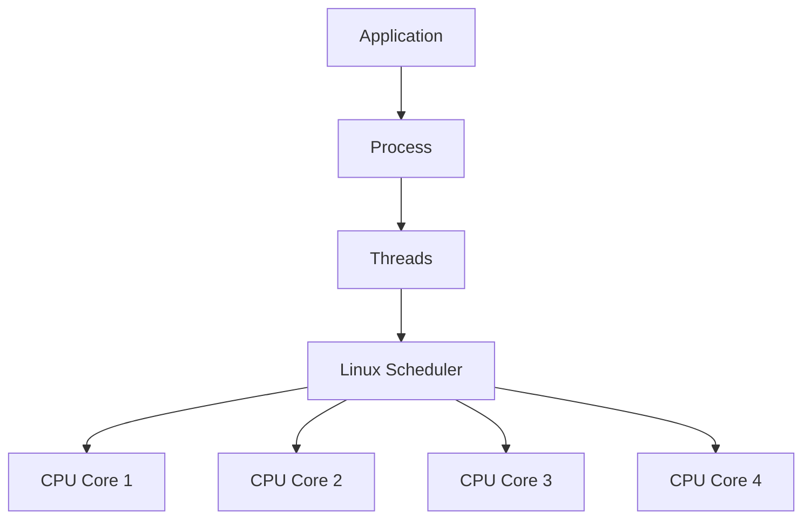
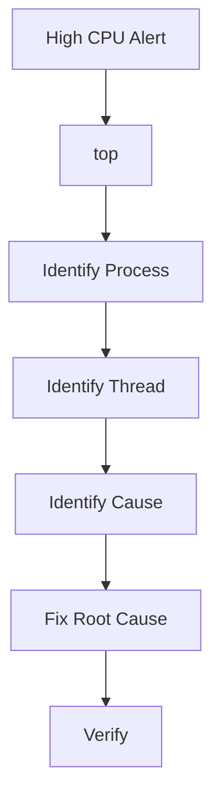

# High CPU Usage Troubleshooting Guide

> One of the most common production incidents.
>
> One of the most misunderstood Linux performance problems.
>
> The gateway to understanding how Linux actually executes work.

---

# Why This Exists

CPU is the engine of a computer.

Every application ultimately becomes:

```text
Instructions
     ↓
CPU Execution
```

When CPU usage becomes excessive:

```text
Slow Applications
Slow APIs
High Latency
Timeouts
User Complaints
Infrastructure Costs
```

Many engineers see:

```text
CPU = 100%
```

and immediately panic.

But high CPU is not always bad.

Sometimes it means:

```text
System Busy Doing Useful Work
```

Other times it means:

```text
System Wasting Resources
```

The job of an engineer is discovering the difference.

---

# Problem It Solves

Imagine a factory.

```text
Workers = CPU Cores
Jobs = Processes
```

If workers are busy:

```text
Factory Productive
```

Good.

But if workers spend all day:

```text
Searching
Waiting
Repeating Mistakes
```

Factory slows down.

High CPU incidents are often:

```text
Resource Waste Incidents
```

not capacity problems.

---

# Mental Model

Think of CPU as a finite number of workers.

Example:

```text
4 CPU Cores

Worker 1
Worker 2
Worker 3
Worker 4
```

Each process wants CPU time.

```text
Nginx
PostgreSQL
Java App
Docker
System Services
```

Linux scheduler decides:

```text
Who Runs
When
For How Long
```

High CPU means:

```text
Demand > Available CPU Time
```

---

# First Principles

CPU executes instructions.

Everything becomes:

```text
Machine Code
       ↓
CPU Cycles
```

Applications consume CPU by:

```text
Calculations
Loops
Encryption
Compression
Serialization
Garbage Collection
Queries
```

More work:

```text
More CPU Cycles
```

---

# What Does 100% CPU Mean?

This is often misunderstood.

Single-core system:

```text
100% = Entire CPU Busy
```

4-core system:

```text
400% = All Cores Busy
```

Example:

```bash
top
```

Output:

```text
CPU Usage: 400%
```

means:

```text
4 Core Machine
All Cores Busy
```

---

# CPU Utilization Architecture



---

# Understanding CPU States

Linux CPU time is divided into categories.

View:

```bash
top
```

Example:

```text
us
sy
ni
id
wa
hi
si
st
```

These values tell a story.

---

# User CPU (us)

Time spent executing:

```text
Applications
```

Examples:

```text
Java
Python
Node.js
PostgreSQL
```

High:

```text
Application Workload
```

---

# System CPU (sy)

Time spent inside kernel.

Examples:

```text
Network Stack
Filesystem
Drivers
Kernel Operations
```

High system CPU often indicates:

```text
Kernel Bottleneck
```

---

# Idle CPU (id)

Unused CPU.

Example:

```text
95% Idle
```

System healthy.

---

# I/O Wait (wa)

CPU waiting for disk.

Example:

```text
40% wa
```

Common misconception:

```text
CPU Problem
```

Reality:

```text
Storage Problem
```

---

# Steal Time (st)

Common in cloud environments.

Meaning:

```text
Hypervisor Took CPU Away
```

Example:

```text
AWS
Azure
GCP
VMware
```

High steal:

```text
Noisy Neighbor Problem
```

---

# Golden Rule

Before investigating:

Ask:

```text
Is CPU Actually The Problem?
```

High CPU may be:

```text
Symptom
```

not root cause.

---

# High CPU Investigation Workflow



---

# Step 1: Verify CPU Usage

Check:

```bash
top
```

or

```bash
htop
```

Look for:

```text
CPU %
```

and

```text
Top Processes
```

---

# Step 2: Find Offending Process

Example:

```bash
top -o %CPU
```

Output:

```text
java
320%
```

Problem identified.

---

# Step 3: Detailed Process Analysis

Use:

```bash
ps aux --sort=-%cpu
```

Example:

```text
PID 1234
CPU 280%
```

---

# Step 4: Thread-Level Analysis

Important for:

```text
Java
Databases
Containers
```

Check:

```bash
top -H -p PID
```

Shows:

```text
Individual Threads
```

---

# Common Root Causes

---

# Cause 1: Infinite Loops

Example:

```python
while True:
    pass
```

Result:

```text
100% CPU
```

per core.

Very common bug.

---

# Cause 2: Traffic Spike

Example:

```text
Normal Requests:
100/sec

Current Requests:
10,000/sec
```

CPU increases naturally.

System may be healthy.

---

# Cause 3: Inefficient Code

Example:

```text
O(n²)
```

algorithm processing:

```text
Millions Of Records
```

Results:

```text
CPU Explosion
```

---

# Cause 4: Database Queries

Example:

```sql
SELECT *
FROM huge_table;
```

without indexes.

CPU usage spikes.

---

# Cause 5: Garbage Collection

Java example:

```text
GC Running Constantly
```

Symptoms:

```text
High CPU
High Latency
```

Check:

```bash
jstat
```

or

```bash
jcmd
```

---

# Cause 6: Encryption

Examples:

```text
TLS
VPN
HTTPS
SSH
```

CPU-intensive operations.

---

# Cause 7: Compression

Examples:

```text
gzip
tar
zip
backup jobs
```

can saturate CPUs.

---

# Cause 8: Runaway Containers

Container bug:

```text
Infinite Retry Loop
```

causes:

```text
100% CPU
```

Check:

```bash
docker stats
```

---

# Cause 9: Kubernetes Workloads

Pod consumes:

```text
Entire Node CPU
```

Check:

```bash
kubectl top pod
```

and

```bash
kubectl top node
```

---

# Cause 10: Malware

Cryptominers often appear as:

```text
100% CPU
```

Unknown process:

```text
xmrig
miner
random binary
```

Investigate immediately.

---

# Linux Internals

Linux uses:

```text
Completely Fair Scheduler
(CFS)
```

Responsibilities:

```text
CPU Allocation
Process Prioritization
Fairness
```

Flow:


---

# Understanding Load Average

Check:

```bash
uptime
```

Example:

```text
load average: 8.00
```

Interpretation depends on CPUs.

Example:

```text
4 CPU Machine

Load = 4
Fully Utilized

Load = 8
Overloaded
```

---

# CPU vs Load Average

Many engineers confuse these.

CPU:

```text
Current Utilization
```

Load:

```text
Work Waiting To Run
```

Possible:

```text
Low CPU
High Load
```

during I/O bottlenecks.

---

# Production Incident Example

## Incident

API latency:

```text
20 ms → 3 seconds
```

Alert:

```text
CPU 95%
```

Investigation:

```bash
top
```

Result:

```text
Java Process
```

Thread analysis:

```bash
top -H -p PID
```

Problem:

```text
Infinite Retry Loop
```

after failed database connection.

Root cause:

```text
Database Network Failure
```

CPU spike was:

```text
Symptom
```

not cause.

---

# Database CPU Troubleshooting

PostgreSQL:

```bash
SELECT * FROM pg_stat_activity;
```

Check:

```text
Long Queries
Sequential Scans
Missing Indexes
```

---

# Container CPU Troubleshooting

Docker:

```bash
docker stats
```

Kubernetes:

```bash
kubectl top pod
```

Find:

```text
Top CPU Consumers
```

---

# Cloud CPU Troubleshooting

Check:

```text
CPU Credits
Steal Time
Autoscaling Events
```

Particularly:

```text
AWS T-Series
Burstable Instances
```

---

# Performance Implications

High CPU causes:

```text
Longer Queues
Higher Latency
Timeouts
Reduced Throughput
```

Because:

```text
More Work
Than Available CPU
```

---

# Security Implications

CPU exhaustion attacks:

```text
DDoS
Expensive Queries
Crypto Mining
Fork Bombs
```

can create:

```text
Denial Of Service
```

---

# Observability

Monitor:

```text
CPU Usage
Load Average
Context Switches
Run Queue Length
```

Tools:

```text
Prometheus
Grafana
Datadog
New Relic
Elastic
```

Useful commands:

```bash
top
htop
vmstat
mpstat
sar
pidstat
```

---

# Advanced CPU Analysis

Per-core usage:

```bash
mpstat -P ALL
```

Real-time:

```bash
pidstat 1
```

Scheduler behavior:

```bash
perf top
```

Deep analysis:

```bash
perf record
perf report
```

---

# Troubleshooting Playbook

```text
1. Confirm High CPU
2. Identify Process
3. Identify Thread
4. Analyze Workload
5. Check Traffic
6. Check Dependencies
7. Check Database
8. Check Containers
9. Check Scheduler Metrics
10. Find Root Cause
```

---

# Common Mistakes

## Mistake 1

Assuming CPU is root cause.

---

## Mistake 2

Killing processes immediately.

---

## Mistake 3

Ignoring traffic increases.

---

## Mistake 4

Ignoring database queries.

---

## Mistake 5

Confusing load with CPU.

---

## Mistake 6

Ignoring thread-level analysis.

---

# Engineering Mindset

Beginners see:

```text
CPU = 100%
```

and ask:

```text
How do I reduce CPU?
```

Engineers ask:

```text
Why is CPU being consumed?
```

The difference matters.

High CPU is often:

```text
Evidence
```

not the actual problem.

---

# Interview Questions

### What command shows CPU usage?

```bash
top
```

---

### Difference between CPU utilization and load average?

CPU:

```text
Current Usage
```

Load:

```text
Work Waiting To Execute
```

---

### What is steal time?

CPU taken by hypervisor.

---

### What causes high system CPU?

```text
Kernel Activity
Networking
Filesystem Operations
Drivers
```

---

### How do you find CPU-heavy processes?

```bash
ps aux --sort=-%cpu
```

---

### How do you find CPU-heavy threads?

```bash
top -H -p PID
```

---

# Cheat Sheet

```bash
# CPU Overview
top

# Better UI
htop

# Top CPU Processes
ps aux --sort=-%cpu

# Per Thread
top -H -p PID

# Per CPU Core
mpstat -P ALL

# Historical Metrics
sar -u

# Process Statistics
pidstat

# Load Average
uptime

# Scheduler Analysis
perf top

# VM Statistics
vmstat 1
```

---

# Final Takeaway

High CPU is not a diagnosis.

It is a symptom.

Elite Linux engineers follow a systematic path:

```text
CPU Alert
     ↓
Process
     ↓
Thread
     ↓
Workload
     ↓
Root Cause
```

The best engineers never stop at:

```text
CPU High
```

They continue until they understand:

```text
Exactly Which Work
Consumed Exactly Which Cycles
And Why
```

That is production-grade Linux troubleshooting.
