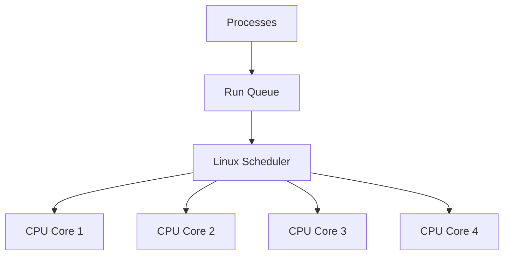
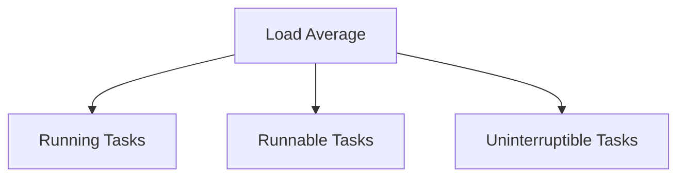
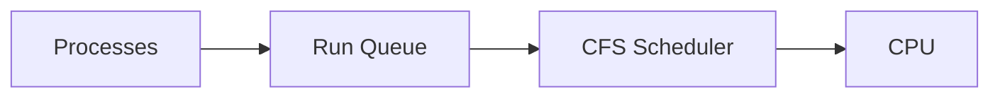
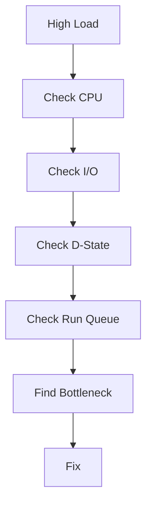

# High Load Average Troubleshooting Guide

> One of the most misunderstood Linux metrics.
>
> The metric that confuses beginners, interview candidates, and even experienced engineers.
>
> The key to understanding how Linux schedules work and manages resource contention.

---

# Why This Exists

Many engineers see:

```bash
load average: 25.42
```

and immediately think:

```text
CPU is 25% busy
```

Wrong.

Others see:

```bash
CPU Usage = 20%
Load Average = 30
```

and become confused.

How can:

```text
CPU Low
Load High
```

exist at the same time?

The answer reveals deep truths about:

```text
Linux Scheduler
CPU Queues
I/O Wait
Process States
Resource Bottlenecks
```

Understanding load average transforms how you troubleshoot Linux systems.

---

# Problem It Solves

Imagine a supermarket.

You have:

```text
4 Cashiers
```

and

```text
40 Customers
```

waiting in line.

Even if cashiers are working efficiently:

```text
Queue Is Growing
```

The problem is not cashier utilization.

The problem is:

```text
Too Much Work Waiting
```

Load average measures:

```text
How Much Work Is Waiting
```

not:

```text
How Busy CPUs Are
```

---

# Mental Model

Think of CPU cores as workers.

Example:

```text
4 CPU Cores

Worker 1
Worker 2
Worker 3
Worker 4
```

Processes want CPU time.

```text
Process A
Process B
Process C
Process D
Process E
Process F
```

Only four can run simultaneously.

Others must wait.

The queue length becomes:

```text
Load
```

Load average measures:

```text
Running Work
+
Waiting Work
```

---

# First Principles

A process can be:

```text
Running
Runnable
Sleeping
Stopped
Zombie
```

Linux load average counts:

```text
Running Processes
+
Runnable Processes
+
Uninterruptible Tasks
```

Important:

```text
Not Just CPU Usage
```

This is why load average is more powerful than CPU utilization.

---

# What Is Load Average?

Load average represents:

```text
Average Number Of Tasks
Competing For Resources
```

over time.

Linux reports:

```bash
uptime
```

Example:

```text
load average: 2.10, 1.80, 1.50
```

These values represent:

```text
1 Minute Average
5 Minute Average
15 Minute Average
```

---

# Load Average Visualization

```text
CPU Cores = 4

Running

CPU1 [Task]
CPU2 [Task]
CPU3 [Task]
CPU4 [Task]

Waiting

Task
Task
Task

Load = 7
```

Four executing.

Three waiting.

Load average:

```text
7
```

---

# Load Average Architecture



Load average reflects:

```text
Run Queue Pressure
```

---

# Understanding The Numbers

Many engineers misunderstand interpretation.

Example:

```text
4 Core Machine

Load = 4
```

Meaning:

```text
All CPUs Busy
No Queue
```

Healthy.

---

Example:

```text
4 Core Machine

Load = 8
```

Meaning:

```text
4 Running
4 Waiting
```

System overloaded.

---

Example:

```text
4 Core Machine

Load = 20
```

Meaning:

```text
4 Running
16 Waiting
```

Severe contention.

---

# Formula

Think:

```text
Load / CPU Count
```

Example:

```text
Load = 8
CPUs = 4

Ratio = 2
```

Meaning:

```text
Demand Is Double Capacity
```

---

# Why CPU And Load Differ

This is the most important concept.

Example:

```text
CPU = 20%
Load = 30
```

Possible?

Yes.

---

# The Hidden Truth

Linux load includes:

```text
Uninterruptible Tasks
```

Typically:

```text
Disk Wait
Storage Wait
NFS Wait
Network Filesystem Wait
```

Example:

```text
100 Processes Waiting For Disk
```

CPU:

```text
Idle
```

Load:

```text
Very High
```

---

# Load Components



---

# Process States

Check:

```bash
ps aux
```

or

```bash
top
```

Important states:

```text
R = Running

D = Uninterruptible Sleep

S = Sleeping

Z = Zombie
```

Load heavily influenced by:

```text
R
D
```

states.

---

# Understanding D State

D state means:

```text
Waiting On Kernel Resource
```

Usually:

```text
Disk I/O
NFS
Block Device
Storage
```

Example:

```text
Database Waiting For Disk
```

CPU:

```text
Idle
```

Load:

```text
High
```

---

# Common Root Causes

---

# Cause 1: CPU Saturation

Classic case.

Example:

```text
Load = 32
CPU = 100%
```

Reason:

```text
Too Many Compute Tasks
```

Examples:

```text
Compression
Encryption
Video Processing
Machine Learning
Compilation
```

---

# Cause 2: Disk Bottleneck

Very common.

Symptoms:

```text
Load = 50
CPU = 15%
```

Why?

Processes waiting:

```text
Disk Reads
Disk Writes
```

Check:

```bash
iostat -x 1
```

---

# Cause 3: Slow Storage

Examples:

```text
Failed SSD
Slow SAN
Cloud Volume Problems
```

Processes queue.

Load rises.

---

# Cause 4: NFS Issues

Example:

```text
NFS Server Slow
```

Clients enter:

```text
D State
```

Load explodes.

CPU remains low.

---

# Cause 5: Database Bottlenecks

Example:

```text
PostgreSQL
MySQL
MongoDB
```

Waiting on:

```text
Disk
Locks
I/O
```

Load increases.

---

# Cause 6: Fork Bomb

Example:

```bash
:(){ :|:& };:
```

Creates:

```text
Thousands Of Processes
```

Scheduler overwhelmed.

Load skyrockets.

---

# Cause 7: Container Explosion

Kubernetes:

```text
Thousands Of Pods
```

Competing for CPU.

Load increases.

---

# Linux Internals

The scheduler maintains:

```text
Run Queue
```

Every CPU has:

```text
Per-Core Run Queue
```

Visualization:

```text
CPU1 Queue

Task
Task
Task

CPU2 Queue

Task
Task
```

Long queues:

```text
High Load
```

---

# Scheduler Architecture



---

# How Linux Calculates Load

Kernel periodically samples:

```text
Runnable Tasks
Uninterruptible Tasks
```

Then computes:

```text
1 Minute Average

5 Minute Average

15 Minute Average
```

using exponential moving averages.

---

# Reading Load Correctly

Example:

```text
load average:
12.00
8.00
4.00
```

Interpretation:

```text
Load Rising Rapidly
```

---

Example:

```text
4.00
8.00
12.00
```

Interpretation:

```text
Load Falling
```

System recovering.

---

# First Investigation

Check:

```bash
uptime
```

Example:

```text
load average:
20
18
15
```

Now ask:

```text
CPU Problem?
Storage Problem?
```

---

# Step 1

Check CPU:

```bash
top
```

or:

```bash
mpstat -P ALL
```

---

# Step 2

Check I/O:

```bash
iostat -x 1
```

Look for:

```text
await
util
```

---

# Step 3

Check D-State Processes

```bash
ps aux | grep " D "
```

or

```bash
top
```

Look for:

```text
State = D
```

---

# Step 4

Check Scheduler Queue

```bash
vmstat 1
```

Important column:

```text
r
```

Meaning:

```text
Runnable Tasks
```

---

# vmstat Example

```text
r b

20 10
```

Meaning:

```text
20 Runnable Tasks

10 Blocked Tasks
```

Load likely high.

---

# Production Incident Example

## Incident

E-commerce API latency:

```text
20ms
```

became:

```text
5 Seconds
```

Monitoring:

```text
Load Average = 60
CPU = 12%
```

Confusing.

Investigation:

```bash
iostat -x
```

Output:

```text
Disk Utilization = 100%
```

Root cause:

```text
Failed Storage Array
```

CPU healthy.

Storage bottleneck caused:

```text
Massive D-State Queue
```

Load explosion.

---

# Cloud Connection

Common cloud causes:

```text
EBS Latency
Persistent Disk Delays
Network Storage Issues
```

Symptoms:

```text
High Load
Low CPU
```

Very common.

---

# Docker Connection

Container hosts often show:

```text
High Load
```

due to:

```text
Image Pulls
OverlayFS
Storage Bottlenecks
```

Check:

```bash
docker stats
```

---

# Kubernetes Connection

Node symptoms:

```text
High Load Average
```

Potential causes:

```text
CPU Pressure
Disk Pressure
Pod Explosion
Storage Latency
```

Check:

```bash
kubectl top node
```

---

# Performance Implications

High load creates:

```text
Long Queues
Increased Latency
Reduced Throughput
Timeouts
```

Applications wait longer for resources.

---

# Security Implications

Attackers may intentionally create:

```text
Fork Bombs
CPU Exhaustion
I/O Floods
```

Result:

```text
Load Average Explosion
```

Denial of Service.

---

# Observability

Monitor:

```text
Load Average
Run Queue Length
CPU Usage
I/O Wait
Context Switches
```

Tools:

```text
Prometheus
Grafana
Datadog
New Relic
```

---

# Troubleshooting Workflow



---

# Common Mistakes

## Mistake 1

Treating load as CPU usage.

---

## Mistake 2

Ignoring disk bottlenecks.

---

## Mistake 3

Looking only at CPU%.

---

## Mistake 4

Ignoring D-state processes.

---

## Mistake 5

Not normalizing by CPU count.

---

# Engineering Mindset

Beginners ask:

```text
Why Is Load High?
```

Experienced engineers ask:

```text
What Work Is Waiting?
```

Elite engineers ask:

```text
Which Resource
Is Causing The Queue
To Grow?
```

Because load average is ultimately:

```text
A Queue Metric
```

not

```text
A CPU Metric
```

---

# Interview Questions

### What does load average measure?

Average number of runnable and uninterruptible tasks.

---

### Why can load be high while CPU is low?

Processes waiting on:

```text
Disk
Storage
NFS
I/O
```

---

### What is D-state?

Uninterruptible sleep.

Usually waiting for kernel resources.

---

### How do you check load average?

```bash
uptime
```

---

### What command shows runnable tasks?

```bash
vmstat 1
```

column:

```text
r
```

---

### What is a healthy load?

Depends on CPU count.

Example:

```text
Load = CPU Count
```

Generally healthy.

---

# Cheat Sheet

```bash
# Load Average
uptime

# Real-Time View
top

# Better UI
htop

# Scheduler Metrics
vmstat 1

# CPU Analysis
mpstat -P ALL

# Disk Analysis
iostat -x 1

# D-State Processes
ps aux | grep " D "

# Process Tree
pstree

# Historical Metrics
sar -q
```

---

# Final Takeaway

Load average is one of Linux's most powerful metrics because it measures:

```text
Work Demand
```

not simply:

```text
CPU Usage
```

The most important lesson:

```text
High CPU
≠
High Load

High Load
≠
High CPU
```

Load tells you:

```text
How Many Tasks Want Resources
```

The real troubleshooting challenge is discovering:

```text
Which Resource
Is Preventing Progress
```

That insight is what separates Linux operators from Linux performance engineers.
