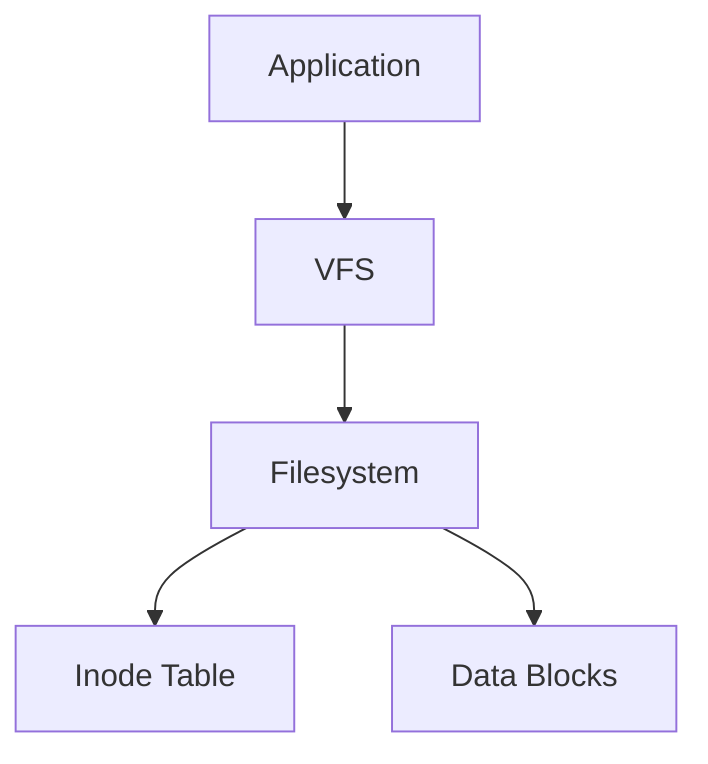
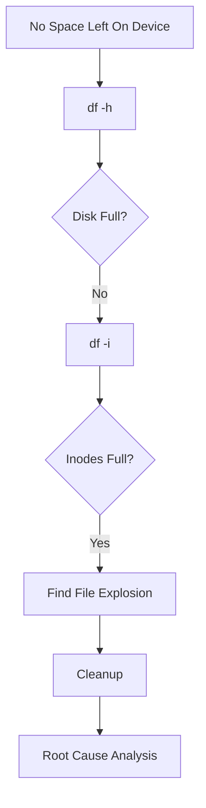

# Inode Exhaustion Troubleshooting Guide

> One of the most confusing Linux incidents.
>
> One of the easiest production outages to misdiagnose.
>
> The reason a filesystem can be "full" even when hundreds of gigabytes are still available.

---

# Why This Exists

Most engineers think storage is only about bytes.

They imagine:

```text
Disk Space = Storage Capacity
```

Reality is different.

Linux filesystems must track two resources:

```text
1. Data Blocks
2. Inodes
```

A filesystem can have:

```text
500 GB Free Space
```

and still refuse to create files.

Why?

Because it has run out of:

```text
Inodes
```

This situation is called:

```text
Inode Exhaustion
```

and it causes production incidents every year across:

* Linux servers
* Databases
* Kubernetes nodes
* CI/CD systems
* Logging systems
* Mail servers
* Object storage systems

---

# Problem It Solves

Imagine a warehouse.

Storage blocks are shelves.

```text
Warehouse
│
├── Shelf Space
```

But every item also requires:

```text
Inventory Record
```

Without inventory records:

```text
No new items can be stored
```

Even if shelves are empty.

Linux works the same way.

Files need:

```text
Data Blocks
+
Inode
```

No inode means:

```text
No file
```

---

# Mental Model

Think of a filesystem as a giant library.

Books:

```text
Actual Data
```

Catalog Entries:

```text
Inodes
```

Example:

```text
Library

100,000 Bookshelves
100,000 Catalog Cards
```

If all catalog cards are used:

```text
No new books can be added
```

Even if:

```text
80% of shelves are empty
```

That's inode exhaustion.

---

# First Principles

Linux stores file data separately from file metadata.

Metadata includes:

```text
Owner
Permissions
Timestamp
Size
Block Locations
```

This metadata lives inside:

```text
Inode
```

Every file requires one inode.

Always.

No exceptions.

---

# What Is An Inode?

An inode is a filesystem data structure.

It stores information about a file.

```text
Inode

├── Owner
├── Group
├── Permissions
├── File Size
├── Timestamps
├── Block Pointers
└── Metadata
```

It does NOT store:

```text
Filename
```

This surprises many engineers.

---

# Relationship Between Files And Inodes


Directory maps:

```text
Filename → Inode
```

Inode maps:

```text
Inode → Data Blocks
```

---

# Visualizing File Creation

Creating a file requires:

```text
Step 1
Allocate Inode

Step 2
Allocate Data Blocks

Step 3
Create Directory Entry
```

If inode allocation fails:

```text
File Creation Fails
```

Even if:

```text
Free Disk Space Exists
```

---

# Symptoms Of Inode Exhaustion

Common symptoms:

```bash
No space left on device
```

Yet:

```bash
df -h
```

shows:

```text
200 GB Free
```

This creates confusion.

---

# Example Incident

Filesystem:

```text
1 TB Volume
```

Usage:

```bash
df -h
```

Output:

```text
Used: 100 GB
Free: 900 GB
```

Everything appears healthy.

But:

```bash
touch test.txt
```

fails:

```text
No space left on device
```

Actual issue:

```bash
df -i
```

Output:

```text
IUse% = 100%
```

All inodes consumed.

---

# Why Linux Uses Inodes

Without inodes:

```text
Finding Data
Permissions
Ownership
Links
```

would be extremely inefficient.

Inodes provide:

```text
Fast Lookup
Efficient Metadata
Filesystem Consistency
```

---

# Linux Filesystem Architecture



---

# Checking Inode Usage

Most important command:

```bash
df -i
```

Example:

```text
Filesystem      Inodes  IUsed  IFree IUse%

/dev/sda1       5M      5M     0     100%
```

Meaning:

```text
All Inodes Consumed
```

---

# Comparing df -h vs df -i

Disk usage:

```bash
df -h
```

Shows:

```text
Bytes
Blocks
Capacity
```

Inode usage:

```bash
df -i
```

Shows:

```text
File Count Capacity
```

Think:

```text
df -h = Space

df -i = Objects
```

---

# Common Causes Of Inode Exhaustion

## Millions Of Small Files

Most common cause.

Example:

```text
1 KB files
```

consume:

```text
1 inode each
```

Storage usage remains tiny.

Inode usage explodes.

---

# Log Explosion

Bad application:

```text
Creates New File
Every Request
```

Example:

```text
logs/
 ├── req1.log
 ├── req2.log
 ├── req3.log
```

Millions of files.

---

# Mail Servers

Maildir architecture:

```text
One Email
=
One File
```

Millions of emails:

```text
Millions of Inodes
```

---

# Cache Directories

Common offenders:

```text
/tmp
/var/tmp
/cache
```

Applications forget cleanup.

---

# Kubernetes And Containers

Container workloads often generate:

```text
Temporary Files
Logs
Build Artifacts
```

Thousands of pods:

```text
Millions of Files
```

Node eventually reaches:

```text
Inode Pressure
```

---

# CI/CD Systems

Build servers often accumulate:

```text
Artifacts
Dependencies
Cache Files
Logs
```

Result:

```text
Inode Exhaustion
```

before disk exhaustion.

---

# Production Example

Directory:

```text
/tmp/uploads
```

contains:

```text
20 million files
```

Average file size:

```text
2 KB
```

Storage usage:

```text
40 GB
```

Disk size:

```text
1 TB
```

Free space:

```text
960 GB
```

Yet:

```bash
touch file.txt
```

fails.

Reason:

```text
No Inodes Remaining
```

---

# Finding Inode Consumers

Check filesystem:

```bash
df -i
```

Find top directories:

```bash
for i in /*; do
  echo $i
  find $i | wc -l
done
```

---

# Faster Method

```bash
find /var | wc -l
```

Counts filesystem objects.

---

# Directory Ranking

```bash
find /var -xdev -printf '.' | wc -c
```

Large counts indicate:

```text
Possible Inode Leak
```

---

# Finding Massive Small File Trees

```bash
du --inodes -d 3 /
```

Very useful.

Example:

```text
/var/cache
2,000,000 inodes
```

---

# Visualizing Inode Consumption

```text
Filesystem

Inodes

[####################]

100%

Blocks

[#####               ]

20%
```

Classic inode exhaustion pattern.

---

# Linux Internals

When file creation occurs:

```text
open()
     ↓
create()
     ↓
allocate inode
     ↓
allocate blocks
```

Failure point:

```text
allocate inode
```

Kernel returns:

```text
ENOSPC
```

Same error as disk-full.

---

# Why The Error Is Confusing

Both conditions return:

```text
No space left on device
```

Yet root causes differ.

```text
Disk Full
=
No Blocks

Inode Exhaustion
=
No Inodes
```

---

# ext4 Inode Allocation

Traditional filesystems preallocate inodes.

During format:

```bash
mkfs.ext4
```

Filesystem decides:

```text
Number Of Inodes
```

Later:

```text
Cannot Easily Increase
```

This makes planning important.

---

# XFS Behavior

XFS allocates metadata dynamically.

Less prone to inode exhaustion.

One reason many enterprise systems prefer:

```text
XFS
```

for large workloads.

---

# Docker Connection

Docker creates:

```text
Layers
Logs
Temporary Files
OverlayFS Entries
```

Check:

```bash
docker system df
```

Also inspect:

```bash
du --inodes /var/lib/docker
```

---

# Kubernetes Connection

Node problems:

```text
DiskPressure
InodePressure
```

Possible condition:

```text
NodeNotReady
```

Check:

```bash
kubectl describe node
```

Example:

```text
InodePressure=True
```

---

# Database Connection

Databases rarely create millions of files.

However:

```text
Backups
Exports
WAL Archives
Logs
```

can trigger inode issues.

Especially:

```text
Poorly Managed Backup Systems
```

---

# Performance Implications

Millions of tiny files create:

```text
Directory Traversal Costs
Metadata Lookups
Filesystem Cache Pressure
```

Result:

```text
Slower Systems
```

even before inode exhaustion occurs.

---

# Security Implications

Attackers may deliberately create:

```text
Millions Of Files
```

to exhaust:

```text
Storage Metadata
```

Result:

```text
Denial Of Service
```

Mitigations:

```text
Quotas
Monitoring
Limits
Cleanup Policies
```

---

# Observability

Monitor:

```text
Disk Usage
Inode Usage
File Growth Rates
```

Metrics:

```text
node_filesystem_files
node_filesystem_files_free
```

Prometheus exporters provide these.

---

# Troubleshooting Workflow



---

# Recovery Steps

## Check Inodes

```bash
df -i
```

---

## Find Offending Directory

```bash
du --inodes -d 3 /
```

---

## Count Files

```bash
find /path | wc -l
```

---

## Remove Unneeded Files

```bash
rm
```

or

```bash
find /path -mtime +30 -delete
```

---

## Fix Application

Prevent recurrence.

---

# Common Mistakes

## Mistake 1

Checking only:

```bash
df -h
```

---

## Mistake 2

Assuming free GB means healthy filesystem.

---

## Mistake 3

Deleting random files.

---

## Mistake 4

Ignoring application behavior.

---

## Mistake 5

Not monitoring inode usage.

---

# Engineering Mindset

Storage is not just bytes.

A filesystem is:

```text
Space
+
Metadata
```

Professional engineers monitor both.

Always remember:

```text
A filesystem can run out of files
before it runs out of storage.
```

This insight separates beginners from experienced Linux operators.

---

# Interview Questions

### What is an inode?

Filesystem metadata structure describing a file.

---

### Does an inode contain filename?

No.

Directory entries map filenames to inodes.

---

### Why can "No space left on device" occur with free storage?

Inode exhaustion.

---

### How do you check inode usage?

```bash
df -i
```

---

### What workloads commonly trigger inode exhaustion?

```text
Logs
Mail Servers
Caches
Containers
CI/CD Systems
```

---

### Difference between disk-full and inode-full?

```text
Disk Full
=
No Data Blocks

Inode Full
=
No Metadata Entries
```

---

# Cheat Sheet

```bash
# Check inode usage
df -i

# Check storage usage
df -h

# Count files
find /path | wc -l

# Find inode-heavy directories
du --inodes -d 3 /

# Docker inode usage
du --inodes /var/lib/docker

# Large file count
find /var -type f | wc -l

# Old files cleanup
find /path -mtime +30 -delete

# Top directories by inode usage
du --inodes -d 2 /
```

---

# Final Takeaway

Disk space and inode capacity are two different resources.

A filesystem requires both:

```text
Data Blocks
+
Inodes
```

Running out of either causes outages.

When you encounter:

```text
No space left on device
```

Never stop at:

```bash
df -h
```

Always check:

```bash
df -i
```

That single command has solved countless production incidents that appeared impossible at first glance.
