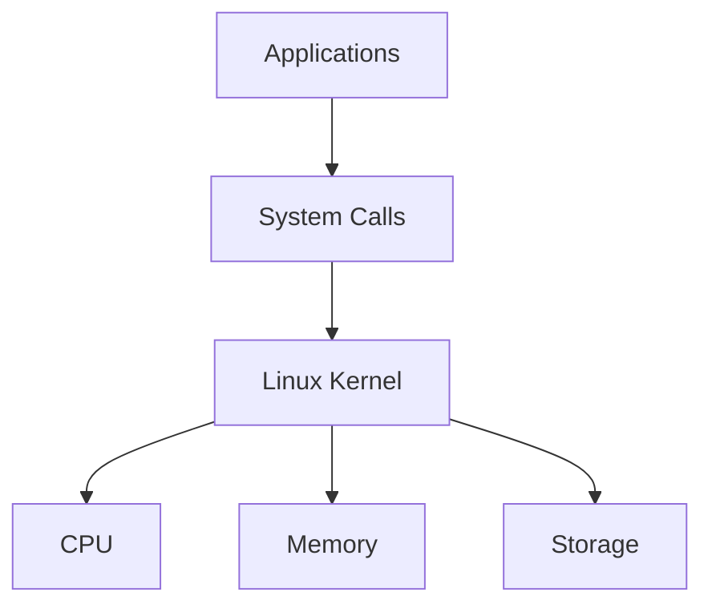
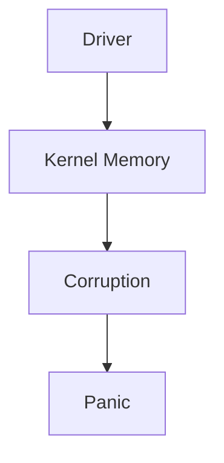
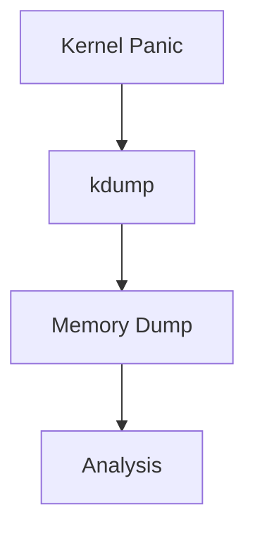
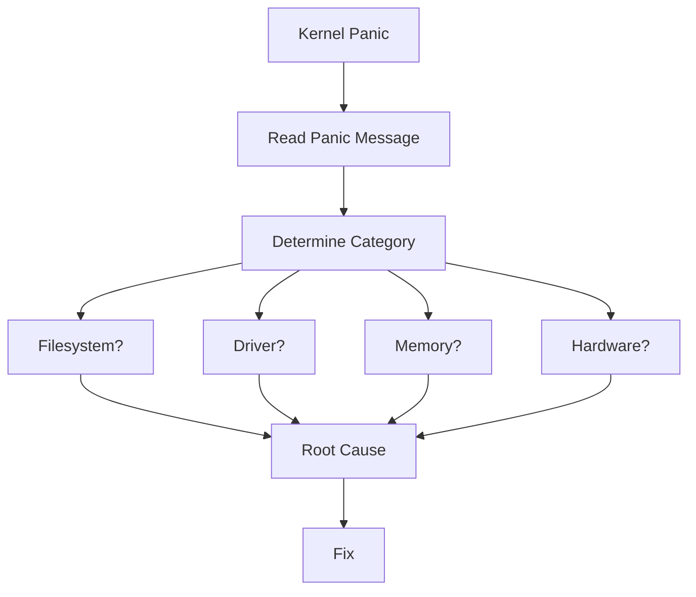

# Kernel Panic Troubleshooting Guide

> The Linux equivalent of a Blue Screen of Death (BSOD).
>
> The moment when the operating system itself decides it cannot continue safely.
>
> One of the most serious failures a Linux engineer can encounter.
>
> A topic that separates Linux users from Linux systems engineers.

---

# Why This Exists

Most Linux failures occur in:

```text
Applications
Services
Containers
Databases
User Processes
```

These failures are isolated.

Linux can usually continue running.

Example:

```text
Nginx Crashes
↓
Restart Service
↓
System Survives
```

Kernel panics are different.

The failure occurs inside:

```text
The Operating System Itself
```

At that point Linux concludes:

```text
Continuing Execution
May Corrupt Data
May Damage State
May Cause Unpredictable Behavior
```

So Linux intentionally stops.

This stop is called:

```text
Kernel Panic
```

---

# Problem It Solves

Imagine a hospital.

Normal incidents:

```text
Patient Problem
```

The hospital continues operating.

Kernel panic:

```text
The Hospital Building
Starts Collapsing
```

At that point:

```text
Evacuate Immediately
```

Linux does the same thing.

Rather than continuing with a corrupted kernel:

```text
Stop Everything
Protect Data
Prevent Further Damage
```

---

# Mental Model

Think of the Linux kernel as:

```text
Air Traffic Control
```

Applications are:

```text
Airplanes
```

Applications can crash.

Airplanes can fail.

The system continues.

But if:

```text
Air Traffic Control
Fails
```

The entire system becomes unsafe.

Linux responds by:

```text
Stopping The Entire Airport
```

This is a kernel panic.

---

# First Principles

Linux operates in two worlds.

```text
User Space
Kernel Space
```

---

# User Space

Examples:

```text
Chrome
Nginx
Java
Python
Docker
PostgreSQL
```

Failures usually affect:

```text
One Process
```

---

# Kernel Space

Examples:

```text
Memory Manager
Scheduler
Filesystem
Drivers
Networking Stack
Process Manager
```

Failures affect:

```text
Entire Operating System
```

---

# Linux Architecture



Applications depend on kernel.

Kernel depends on hardware.

---

# What Is A Kernel Panic?

A kernel panic occurs when Linux detects:

```text
An Unrecoverable Error
```

and determines:

```text
System Cannot Continue Safely
```

Kernel executes:

```text
panic()
```

function.

Result:

```text
Stop Execution
Print Diagnostics
Freeze Or Reboot
```

---

# Typical Kernel Panic Screen

Example:

```text
Kernel panic - not syncing:
VFS: Unable to mount root fs
```

or

```text
Kernel panic - not syncing:
Fatal exception
```

---

# Why "Not Syncing"?

Syncing means:

```text
Writing Data To Disk
```

Kernel message:

```text
not syncing
```

means:

```text
Unable To Continue Safe Disk Operations
```

---

# Kernel Panic Lifecycle

```mermaid
flowchart TD

A[Kernel Detects Fatal Error]

B[panic()]

C[Print Stack Trace]

D[Stop CPUs]

E[Freeze Or Reboot]

A --> B
B --> C
C --> D
D --> E
```

---

# Common Panic Categories

Most kernel panics fall into a few categories.

```text
Filesystem
Memory
Drivers
Hardware
Kernel Bugs
Boot Problems
Corruption
```

---

# Cause 1: Cannot Mount Root Filesystem

Most common boot panic.

Example:

```text
Kernel panic - not syncing:
VFS: Unable to mount root fs
```

Meaning:

```text
Kernel Started
But Cannot Find /
```

Root filesystem unavailable.

---

# Boot Dependency Chain


Failure at:

```text
Root Filesystem
```

causes panic.

---

# Common Reasons

```text
Wrong UUID
Missing Driver
Broken initramfs
Corrupted Filesystem
Failed Disk
```

---

# Cause 2: Kernel Bug

Rare but serious.

Example:

```text
Null Pointer Dereference
Memory Corruption
Race Condition
```

Kernel code fails.

Linux cannot recover.

---

# Cause 3: Driver Failure

Drivers execute in:

```text
Kernel Space
```

Bad driver:

```text
Can Crash Entire OS
```

Examples:

```text
GPU Drivers
Storage Drivers
Network Drivers
Vendor Modules
```

---

# Driver Panic Flow



---

# Cause 4: Memory Corruption

Kernel relies on:

```text
Valid Memory Structures
```

Corruption can occur due to:

```text
Faulty RAM
Kernel Bugs
Driver Bugs
DMA Errors
```

Result:

```text
Kernel Panic
```

---

# Cause 5: Hardware Failure

Examples:

```text
Bad RAM
CPU Errors
Motherboard Problems
Storage Failure
```

Hardware corrupts kernel state.

Kernel stops.

---

# Memory Architecture


Corrupted RAM:

```text
Corrupted Kernel
```

---

# Cause 6: Out-Of-Tree Kernel Modules

Examples:

```text
Proprietary Drivers
Custom Modules
Third-Party Security Agents
```

Common enterprise panic source.

---

# Cause 7: Filesystem Corruption

Filesystem metadata damaged.

Kernel encounters impossible state.

Example:

```text
EXT4 Corruption
XFS Corruption
Btrfs Corruption
```

---

# Cause 8: Storage Failures

Examples:

```text
NVMe Failure
RAID Failure
SAN Failure
Cloud Volume Failure
```

Kernel loses critical data structures.

---

# Cause 9: CPU Machine Check Exception

Modern CPUs detect hardware failures.

Example:

```text
Machine Check Exception
```

Kernel receives:

```text
Fatal Hardware Event
```

Panic follows.

---

# Linux Internals

Kernel panic originates from:

```c
panic()
```

inside kernel source.

Purpose:

```text
Stop Unsafe Execution
```

Internally:

```text
Disable Scheduling
Stop CPUs
Print Diagnostics
Generate Crash Dump
Halt Or Reboot
```

---

# Kernel Panic Internals

```mermaid
flowchart TD

A[Kernel Error]

B[panic()]

C[Stack Trace]

D[CPU Stop]

E[Dump Memory]

F[Reboot]

A --> B
B --> C
C --> D
D --> E
E --> F
```

---

# Understanding Stack Traces

Example:

```text
Call Trace:
 functionA
 functionB
 functionC
 panic
```

This shows:

```text
Execution Path
```

before crash.

One of the most valuable debugging clues.

---

# Reading Panic Messages

Example:

```text
Unable to mount root fs
```

Interpretation:

```text
Boot Problem
```

---

Example:

```text
BUG: unable to handle kernel NULL pointer dereference
```

Interpretation:

```text
Kernel Code Bug
```

---

Example:

```text
Machine Check Exception
```

Interpretation:

```text
Hardware Failure
```

---

# Capturing Panic Information

---

# dmesg

Before reboot:

```bash
dmesg
```

contains warnings leading to panic.

---

# journalctl

Previous boot:

```bash
journalctl -b -1
```

Often reveals:

```text
Storage Errors
Driver Errors
Memory Errors
```

---

# kdump

Enterprise environments use:

```text
kdump
```

Purpose:

```text
Capture Memory Dump
After Panic
```

---

# Crash Dump Architecture



---

# Production Incident Example

## Incident

Production database node rebooted unexpectedly.

Console:

```text
Kernel panic
```

Investigation:

```bash
journalctl -b -1
```

Found:

```text
NVMe Timeout Errors
```

Further investigation:

```bash
smartctl -a /dev/nvme0n1
```

Result:

```text
SSD Failure
```

Root cause:

```text
Storage Hardware Failure
```

Kernel panic was:

```text
Symptom
```

not root cause.

---

# Cloud Environment Example

Cloud VM panic:

```text
Unable to mount root fs
```

Cause:

```text
Broken Kernel Upgrade
```

New kernel:

```text
Missing NVMe Driver
```

Recovery:

```text
Boot Previous Kernel
Rebuild Initramfs
```

---

# Kubernetes Connection

Node panic means:

```text
Node Lost
```

Consequences:

```text
Pods Evicted
Workloads Rescheduled
Reduced Capacity
```

Production impact can be severe.

---

# Docker Connection

Containers share host kernel.

Important concept:

```text
Container Panic
Impossible
```

Containers do not have kernels.

Only:

```text
Host Kernel Can Panic
```

When host panics:

```text
All Containers Die
```

---

# Performance Considerations

Kernel panic often follows:

```text
Hardware Degradation
Driver Instability
Storage Problems
```

Performance warnings frequently appear first.

Investigate:

```text
Slow I/O
Hardware Errors
Kernel Warnings
```

before panic occurs.

---

# Security Considerations

Kernel vulnerabilities may trigger:

```text
Privilege Escalation
Memory Corruption
Kernel Crashes
```

Keep kernels updated.

---

# Observability

Monitor:

```text
Kernel Errors
Storage Errors
ECC Errors
Machine Check Events
Driver Failures
```

Tools:

```bash
journalctl -k

dmesg

smartctl

rasdaemon
```

---

# Essential Commands

```bash
dmesg

journalctl -k

journalctl -b -1

uname -a

lsmod

modinfo MODULE

lsblk

blkid

smartctl -a DEVICE
```

---

# Troubleshooting Workflow



---

# Common Mistakes

## Mistake 1

Assuming panic is the root cause.

Often:

```text
Hardware
Storage
Drivers
```

caused the panic.

---

## Mistake 2

Ignoring logs before panic.

Most panics give warnings first.

---

## Mistake 3

Blaming Linux immediately.

Linux usually panics because:

```text
Something Else Broke
```

---

## Mistake 4

Deleting crash dumps.

Crash dumps are gold.

---

## Mistake 5

Only reading first panic line.

Always read:

```text
Full Stack Trace
```

---

# Engineering Mindset

Beginners see:

```text
Kernel Panic
```

and think:

```text
Linux Crashed
```

Experienced engineers think:

```text
What Corrupted Kernel State?
```

Elite engineers think:

```text
What Dependency Failed
That Forced The Kernel
To Protect The System
By Stopping?
```

Because kernel panic is usually:

```text
Final Symptom
```

of a deeper issue.

---

# Interview Questions

### What is a kernel panic?

An unrecoverable kernel error that causes Linux to stop execution.

---

### Is kernel panic similar to BSOD?

Yes.

Linux equivalent of Windows Blue Screen of Death.

---

### What causes kernel panic?

```text
Kernel Bugs
Driver Bugs
Filesystem Issues
Hardware Failures
Memory Corruption
Boot Problems
```

---

### Can user-space applications cause panic?

Directly:

```text
Usually No
```

Indirectly:

```text
Through Kernel Bugs
```

possible.

---

### What is kdump?

Kernel crash dump mechanism used to capture memory after panic.

---

### Why does Linux panic instead of continuing?

To prevent:

```text
Data Corruption
Undefined Behavior
System Damage
```

---

# Cheat Sheet

```bash
# Kernel Messages
dmesg

# Previous Boot
journalctl -b -1

# Kernel Logs
journalctl -k

# Kernel Version
uname -r

# Loaded Modules
lsmod

# Module Details
modinfo MODULE

# Storage Health
smartctl -a DEVICE

# Block Devices
lsblk

# Filesystem UUIDs
blkid
```

---

# Final Takeaway

Kernel panic is not simply:

```text
Linux Crashed
```

Kernel panic means:

```text
Linux Determined
Continuing Execution
Was More Dangerous
Than Stopping
```

The most important lesson is:

```text
Kernel Panic
≠
Root Cause
```

Kernel panic is usually:

```text
The Final Safety Mechanism
```

triggered after:

```text
Hardware Failure
Driver Failure
Memory Corruption
Filesystem Failure
Boot Failure
Kernel Bug
```

The best Linux engineers don't stop at the panic message.

They keep asking:

```text
What Broke The Kernel's World
Before The Panic Happened?
```

That question is where real root-cause analysis begins.
