# Kubernetes Node Not Ready Troubleshooting Guide

> One of the most common Kubernetes production incidents.
>
> The warning sign that a worker node can no longer participate correctly in the cluster.
>
> A topic that teaches how Kubernetes, Linux, networking, container runtimes, and distributed systems interact.

---

# Why This Exists

A Kubernetes cluster is ultimately:

```text
A Collection Of Linux Machines
Working Together
```

Kubernetes constantly asks:

```text
Can This Node Run Workloads?
Can This Node Communicate?
Can This Node Be Trusted?
```

If the answer becomes:

```text
No
```

the node enters:

```text
NotReady
```

state.

At that moment:

```text
Pods Stop Scheduling
Workloads Migrate
Services Degrade
Applications Fail
```

Understanding Node Not Ready means understanding Kubernetes itself.

---

# Problem It Solves

Imagine a logistics company.

```text
Warehouse = Kubernetes Node

Company = Cluster
```

Headquarters constantly communicates with warehouses.

If a warehouse:

```text
Stops Responding
Loses Power
Loses Connectivity
Runs Out Of Space
```

headquarters marks it:

```text
Unavailable
```

and reroutes operations.

Node Not Ready is Kubernetes doing exactly that.

---

# Mental Model

Most engineers think:

```text
Node Not Ready
=
Broken Server
```

Wrong.

Node Not Ready means:

```text
Control Plane
Cannot Trust
The Node's State
```

This is fundamentally:

```text
A Distributed Systems Problem
```

not merely:

```text
A Linux Problem
```

---

# First Principles

Kubernetes must continuously answer:

```text
Which Nodes Exist?

Which Nodes Are Healthy?

Which Nodes Can Run Pods?
```

To achieve this:

```text
Node
 ↓
Kubelet
 ↓
API Server
 ↓
Control Plane
```

communicate continuously.

---

# High-Level Architecture

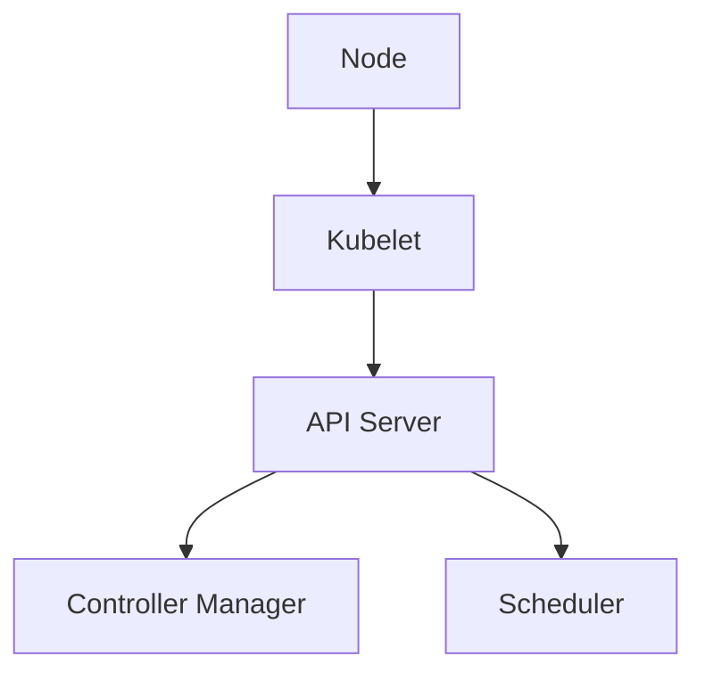

If communication breaks:

```text
Node Not Ready
```

appears.

---

# What Is Node Ready?

Healthy:

```bash
kubectl get nodes
```

Output:

```text
worker-1 Ready
```

Meaning:

```text
Node Reachable
Kubelet Healthy
Resources Available
Networking Functional
```

---

# What Is Node Not Ready?

Example:

```bash
kubectl get nodes
```

Output:

```text
worker-1 NotReady
```

Meaning:

```text
Cluster Cannot Reliably Use Node
```

---

# Health Check Architecture


---

# The Golden Rule

Never ask:

```text
Why Is Node Not Ready?
```

Ask:

```text
What Broke The Trust Relationship
Between Node And Control Plane?
```

---

# Node Lifecycle


---

# How Kubernetes Determines Readiness

Kubelet periodically reports:

```text
CPU
Memory
Disk
Network
Runtime Status
Node Conditions
```

to API Server.

---

# Node Heartbeat Flow

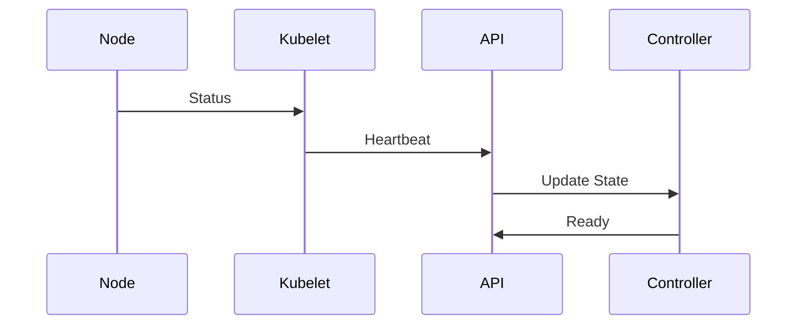

Heartbeat failure causes:

```text
NotReady
```

---

# First Investigation

Check:

```bash
kubectl get nodes
```

Then:

```bash
kubectl describe node NODE_NAME
```

Most useful command.

---

# Example Output

```text
Ready=False

Reason:
KubeletNotReady
```

This immediately narrows investigation.

---

# Node Conditions

```bash
kubectl describe node
```

shows:

```text
Ready
MemoryPressure
DiskPressure
PIDPressure
NetworkUnavailable
```

These conditions tell the story.

---

# Node Condition Architecture

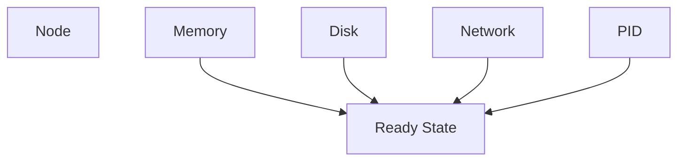

---

# Cause 1: Kubelet Failure

Most common cause.

Check:

```bash
systemctl status kubelet
```

If kubelet stops:

```text
No Heartbeats
```

Result:

```text
Node Not Ready
```

---

# Kubelet Architecture

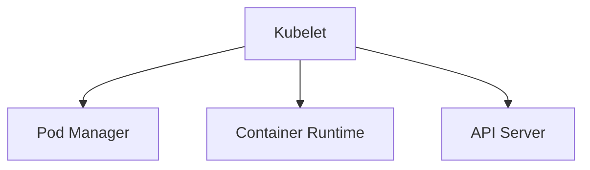

---

# Investigation

```bash
journalctl -u kubelet -xe
```

Look for:

```text
Crash
Certificate Error
Connection Error
Resource Error
```

---

# Cause 2: Container Runtime Failure

Kubelet depends on:

```text
containerd
CRI-O
Docker (legacy)
```

---

# Runtime Architecture

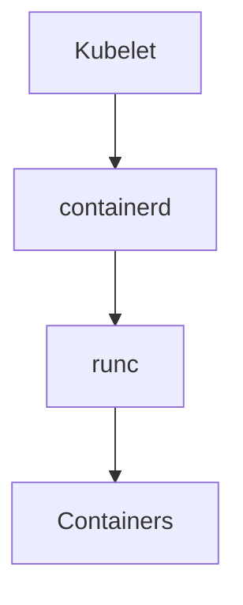

If containerd fails:

```text
Node Not Ready
```

---

# Investigation

```bash
systemctl status containerd
```

Check:

```bash
journalctl -u containerd
```

---

# Cause 3: Network Failure

Node cannot reach:

```text
API Server
```

Heartbeats stop.

---

# Network Dependency

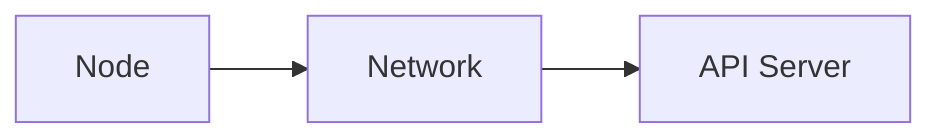

Broken network:

```text
Not Ready
```

---

# Investigation

Check:

```bash
ping API_SERVER
```

Check:

```bash
curl API_SERVER
```

Check:

```bash
ss -tulpn
```

---

# Cause 4: CNI Failure

Examples:

```text
Calico
Flannel
Cilium
Weave
```

---

# Kubernetes Networking Stack

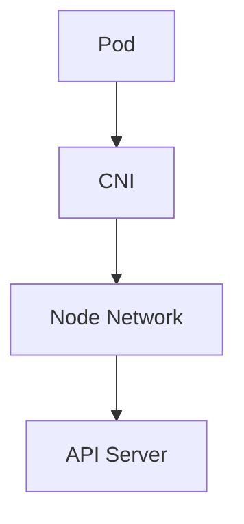

If CNI fails:

```text
NetworkUnavailable
```

condition appears.

---

# Investigation

```bash
kubectl get pods -n kube-system
```

Look for:

```text
CrashLoopBackOff
```

on CNI pods.

---

# Cause 5: Disk Pressure

Node filesystem becomes full.

---

# Disk Pressure Flow

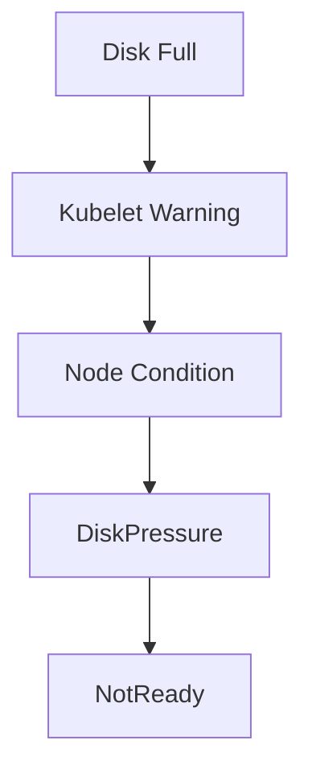

---

# Investigation

```bash
df -h
```

Check:

```bash
df -i
```

Look for:

```text
100%
```

usage.

---

# Cause 6: Memory Pressure

Node memory exhausted.

---

# Memory Architecture

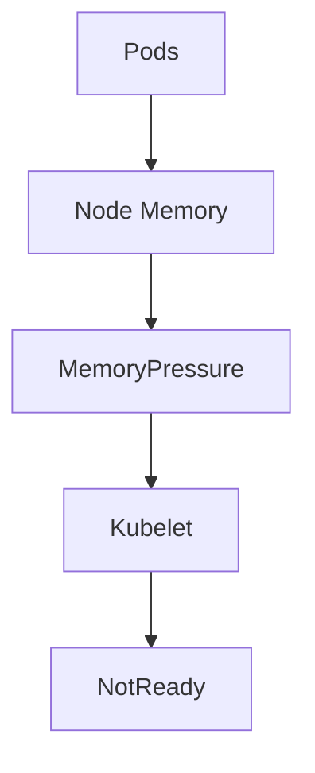

---

# Investigation

```bash
free -h
```

Check:

```bash
top
```

or:

```bash
htop
```

---

# Cause 7: PID Pressure

Linux cannot create new processes.

---

# PID Architecture

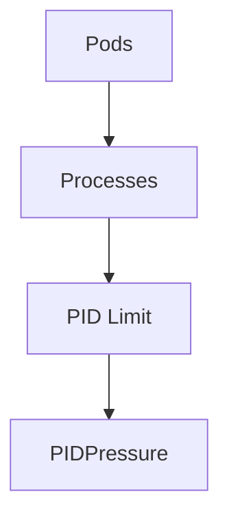

---

# Investigation

Check:

```bash
cat /proc/sys/kernel/pid_max
```

Check:

```bash
ps aux | wc -l
```

---

# Cause 8: Certificate Expiration

Kubelet uses certificates.

Expired certificate:

```text
Authentication Failure
```

---

# Trust Architecture

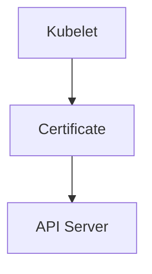

Expired certificate:

```text
Node Not Ready
```

---

# Investigation

Check:

```bash
openssl x509 -in kubelet.crt -text
```

Look for:

```text
Not After
```

---

# Cause 9: Cloud Infrastructure Failure

Cloud nodes depend on:

```text
Storage
Networking
IAM
Metadata Services
```

Failures can cascade.

---

# Cloud Dependency Map

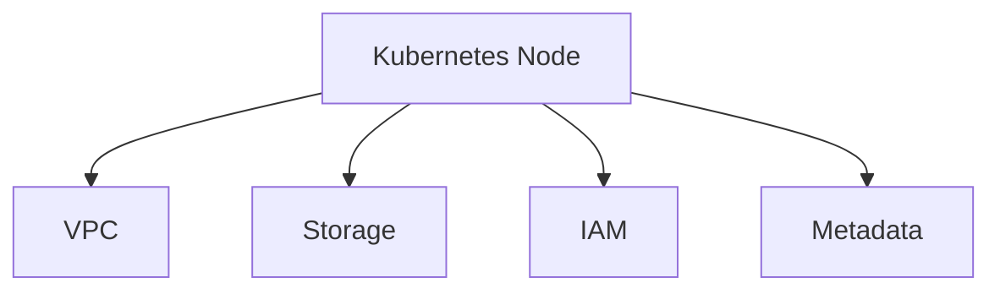

---

# Cause 10: Kernel Problems

Examples:

```text
Kernel Panic
Filesystem Corruption
Memory Errors
Driver Failures
```

Node becomes unhealthy.

---

# Linux Internals Connection

Node readiness ultimately depends on:

```text
systemd
Kubelet
containerd
Networking
Storage
Kernel
```

Kubernetes is built on Linux.

---

# Complete Dependency Graph

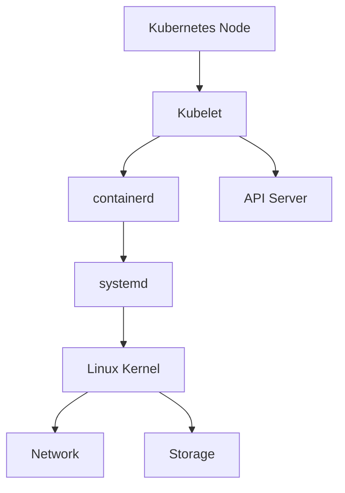

---

# Production Incident Example

## Incident

E-commerce cluster outage.

Monitoring:

```text
3 Nodes NotReady
```

---

Investigation:

```bash
kubectl describe node
```

Output:

```text
DiskPressure=True
```

Check:

```bash
df -h
```

Result:

```text
100% Full
```

Cause:

```text
Container Logs Filled Disk
```

Fix:

```text
Clean Logs
Rotate Logs
Increase Disk
```

Node recovered.

---

# Kubernetes Controller Behavior

When node becomes NotReady:

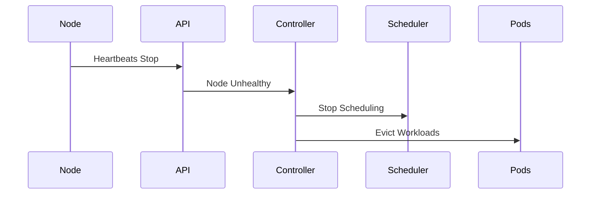

---

# Pod Impact

After prolonged NotReady:

```text
Pods Evicted
Services Degraded
Traffic Rerouted
```

Cluster attempts self-healing.

---

# Observability

Monitor:

```text
Node Conditions
Kubelet Health
Runtime Health
Disk Usage
Memory Usage
Network Latency
```

Important metrics:

```text
node_ready

node_memory

node_filesystem

kubelet_health
```

---

# Essential Commands

```bash
kubectl get nodes

kubectl describe node NODE

kubectl get events

systemctl status kubelet

journalctl -u kubelet

systemctl status containerd

journalctl -u containerd

df -h

free -h

top

ip addr

ip route
```

---

# Master Troubleshooting Workflow

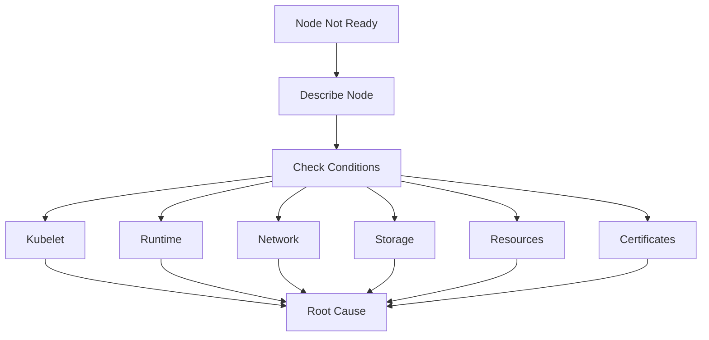

---

# Common Mistakes

## Mistake 1

Restarting node immediately.

Investigate first.

---

## Mistake 2

Ignoring node conditions.

---

## Mistake 3

Checking pods before kubelet.

---

## Mistake 4

Ignoring container runtime.

---

## Mistake 5

Ignoring CNI plugins.

---

## Mistake 6

Assuming Kubernetes is the problem.

Often:

```text
Linux Problem
```

causes Kubernetes symptoms.

---

# Engineering Mindset

Beginners think:

```text
Kubernetes Is Broken
```

Engineers think:

```text
Node Lost Readiness
```

Senior engineers think:

```text
Which Dependency Failed?
```

Elite platform engineers think:

```text
Node
 ↓
Kubelet
 ↓
Runtime
 ↓
Linux
 ↓
Network
 ↓
Storage
 ↓
Control Plane

Where Was Trust Lost?
```

Because Node Not Ready is fundamentally:

```text
A Distributed Systems Health Check Failure
```

not merely:

```text
A Kubernetes Error
```

---

# Interview Questions

### What causes a node to become NotReady?

```text
Kubelet Failure
Network Failure
Runtime Failure
Disk Pressure
Memory Pressure
Certificate Issues
```

---

### What command is most useful first?

```bash
kubectl describe node NODE
```

---

### What component reports node health?

```text
Kubelet
```

---

### What is DiskPressure?

Node storage resources exhausted.

---

### What is MemoryPressure?

Node memory resources exhausted.

---

### What happens when a node becomes NotReady?

Scheduler stops using it and controllers may evict pods.

---

### Can containerd failure cause NotReady?

Yes.

Kubelet depends on container runtime.

---

# Cheat Sheet

```bash
kubectl get nodes

kubectl describe node NODE

kubectl get events

systemctl status kubelet

journalctl -u kubelet

systemctl status containerd

journalctl -u containerd

kubectl get pods -A

kubectl get pods -n kube-system

df -h

df -i

free -h

top

ss -tulpn
```

---

# Final Takeaway

A Kubernetes Node is not just:

```text
A Server
```

It is a chain of dependencies:

```text
Linux
 ↓
systemd
 ↓
containerd
 ↓
Kubelet
 ↓
Networking
 ↓
API Server
 ↓
Control Plane
```

The most important lesson:

```text
Node Not Ready
≠
Root Cause
```

It is merely:

```text
A Symptom
```

that Kubernetes has lost confidence in a node.

The best engineers keep digging until they answer:

```text
What Broke The Trust Relationship
Between The Node
And The Cluster?
```

That question is the foundation of Kubernetes troubleshooting, SRE thinking, and platform engineering.
