# Log Explosion Troubleshooting Guide

> One of the most common hidden causes of production outages.
>
> The silent infrastructure killer that slowly consumes storage, destroys performance, crashes services, breaks Kubernetes nodes, fills Docker hosts, and generates massive cloud bills.
>
> A topic that teaches Linux logging, observability, storage systems, containers, Kubernetes, distributed systems, and production engineering.

---

# Why This Exists

Every production system generates logs.

Logs help answer:

```text
What Happened?

When Did It Happen?

Why Did It Happen?
```

Without logs:

```text
Troubleshooting Becomes Guesswork
```

With too many logs:

```text
Infrastructure Collapses
```

Logging is one of the few systems that can simultaneously:

```text
Help Reliability

AND

Destroy Reliability
```

if not properly controlled.

---

# The Great Logging Paradox

No logs:

```text
Blind Infrastructure
```

Too many logs:

```text
Dead Infrastructure
```

Engineering is finding balance.

---

# Problem It Solves

Imagine a security camera system.

Every event is recorded.

Normal operation:

```text
100 Events Per Hour
```

Storage grows slowly.

Now imagine a faulty sensor generating:

```text
10 Million Events Per Hour
```

Eventually:

```text
Storage Full

Recording Stops

System Fails
```

Log explosions are exactly this problem.

---

# Mental Model

Most engineers think:

```text
Logs Are Text Files
```

Wrong.

Logs are actually:

```text
Storage Workloads

I/O Workloads

Network Workloads

Cost Generators

Reliability Risks
```

A log line is not free.

Every log line consumes:

```text
CPU

Memory

Disk

Network

Money
```

---

# First Principles

Every log follows:

```text
Application
      ↓
Logger
      ↓
File
      ↓
Storage
      ↓
Monitoring System
```

---

# Logging Architecture

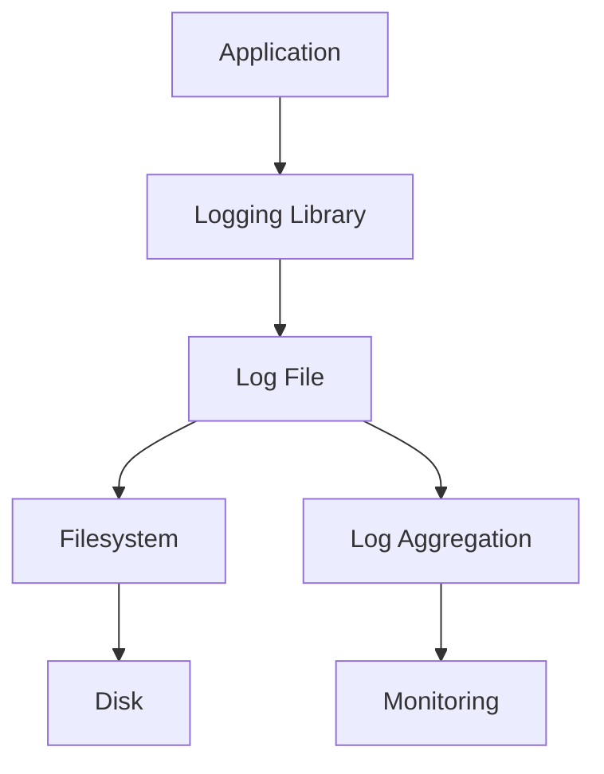

A failure anywhere can become a logging incident.

---

# What Is A Log Explosion?

A log explosion occurs when:

```text
Log Generation Rate
>
Storage Capacity
```

or

```text
Log Generation Rate
>
System Processing Capacity
```

---

# Simple Formula

```text
Logs Per Second
×
Log Size
×
Time
=
Storage Consumption
```

Example:

```text
50,000 Logs/sec

500 Bytes/log

=
25 MB/sec
```

Daily:

```text
2.1 TB/day
```

A single bug can generate terabytes.

---

# The Golden Rule

Never ask:

```text
How Large Is The Log File?
```

Ask:

```text
Why Is The Log File Growing?
```

Size is a symptom.

Growth rate is the real problem.

---

# Typical Symptoms

---

## Symptom 1

Disk usage rapidly increases.

```bash
df -h
```

shows:

```text
95%

98%

100%
```

---

## Symptom 2

Applications become slow.

---

## Symptom 3

High disk I/O.

---

## Symptom 4

Docker host crashes.

---

## Symptom 5

Kubernetes node becomes:

```text
NotReady
```

---

## Symptom 6

Database writes slow down.

---

## Symptom 7

Cloud logging bill explodes.

---

# Log Growth Lifecycle

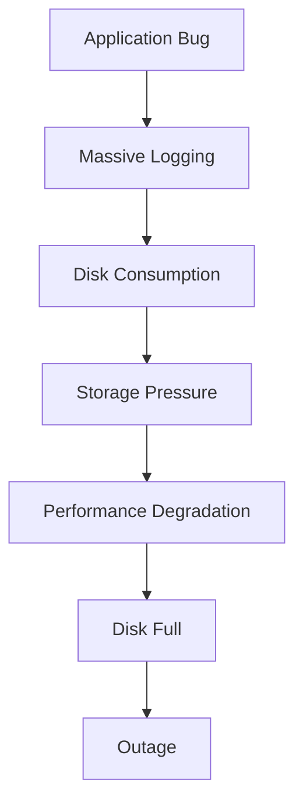

---

# Common Root Cause #1

## Infinite Error Loops

Most common production cause.

Example:

```python
while True:
    log.error("Database unavailable")
```

Millions of log lines generated.

---

# Error Storm Architecture

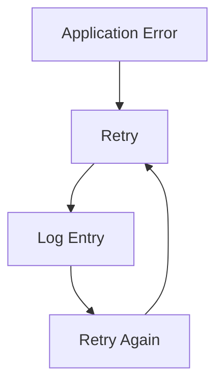

Creates:

```text
Infinite Log Storm
```

---

# Common Root Cause #2

## Debug Logging Enabled

Production accidentally configured:

```text
DEBUG
```

instead of:

```text
INFO
```

or

```text
WARN
```

---

# Logging Levels

```text
TRACE

DEBUG

INFO

WARN

ERROR

FATAL
```

---

# Log Volume Comparison

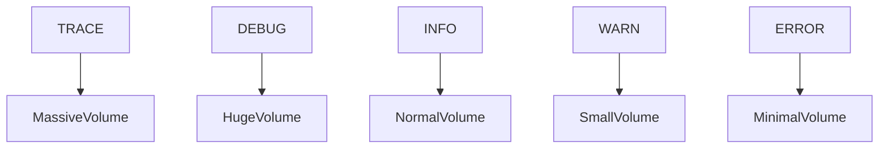

---

# Common Root Cause #3

## Request Logging Explosion

Traffic spike:

```text
100 Requests/sec
```

becomes:

```text
50,000 Requests/sec
```

Each request logged.

Result:

```text
Massive Log Growth
```

---

# Common Root Cause #4

## Stack Trace Storms

Example:

```text
NullPointerException
```

Every request fails.

Every failure logs:

```text
500-Line Stack Trace
```

Thousands of times per second.

---

# Stack Trace Multiplication

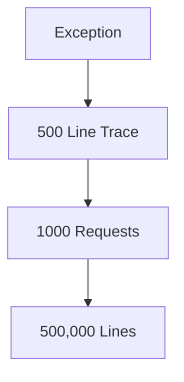

---

# Common Root Cause #5

## Recursive Logging

Application logs an error.

Logging system itself errors.

Error gets logged again.

Creates:

```text
Recursive Log Generation
```

---

# Common Root Cause #6

## Container Log Explosion

Docker stores logs by default.

Location:

```bash
/var/lib/docker/containers/
```

---

# Docker Logging Architecture

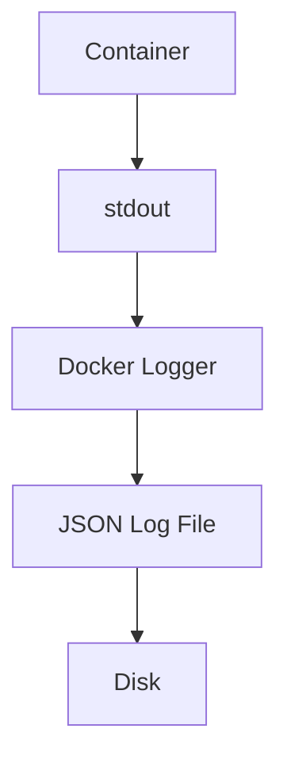

Container can generate:

```text
Hundreds Of GB
```

without anyone noticing.

---

# Investigation

Check:

```bash
docker ps
```

Then:

```bash
du -sh /var/lib/docker/containers/*
```

---

# Common Root Cause #7

## Kubernetes Log Explosion

Pods log to:

```text
stdout
stderr
```

Kubelet stores logs locally.

---

# Kubernetes Logging Flow

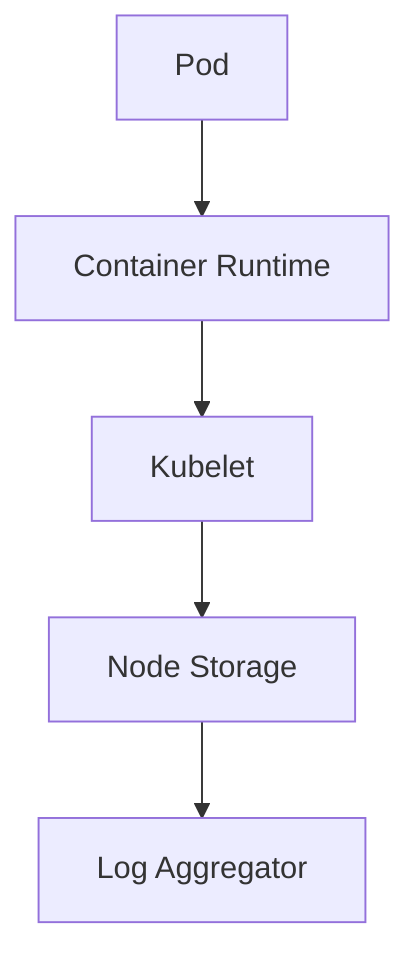

Excessive logging causes:

```text
Node DiskPressure
```

---

# Kubernetes Symptoms

```bash
kubectl describe node
```

Shows:

```text
DiskPressure=True
```

---

# Common Root Cause #8

## Access Log Explosion

Nginx:

```text
1 Line Per Request
```

At:

```text
100,000 Requests/sec
```

access logs become enormous.

---

# Nginx Architecture

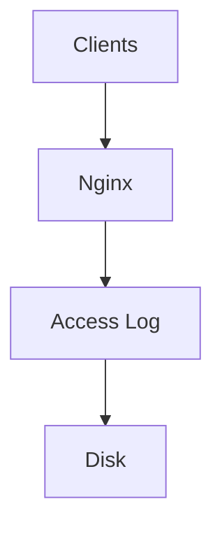

---

# Common Root Cause #9

## Security Attack

Attackers intentionally generate:

```text
404 Requests

Authentication Failures

Malformed Requests
```

causing:

```text
Log Amplification
```

---

# Security Impact

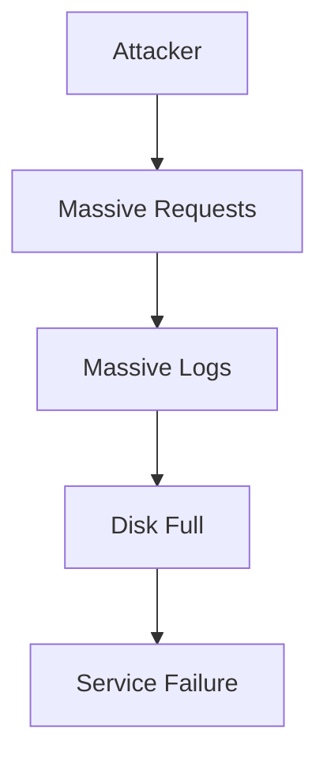

---

# Common Root Cause #10

## Missing Log Rotation

One of the most common Linux mistakes.

---

# Without Rotation

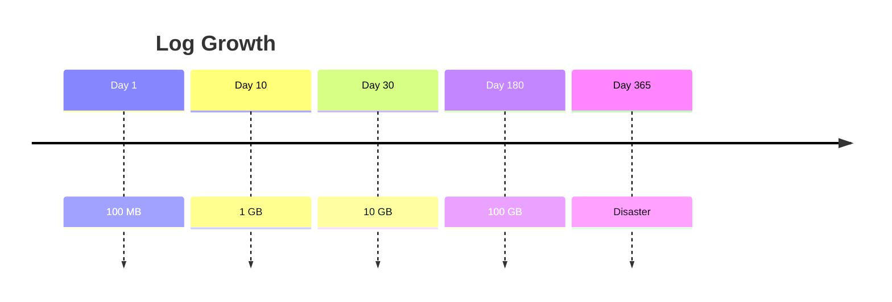

---

# What Is Log Rotation?

Process of:

```text
Archive Old Logs

Compress Them

Delete Old Copies
```

---

# Linux Rotation Architecture

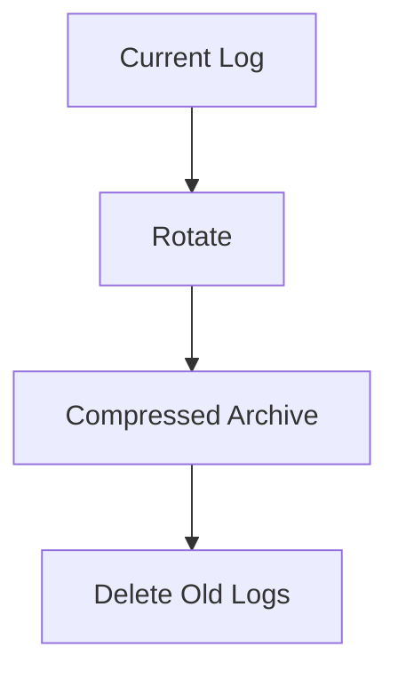

---

# Investigating Log Explosions

---

## Step 1

Check disk usage:

```bash
df -h
```

---

## Step 2

Find largest directories:

```bash
du -sh /*
```

---

## Step 3

Find largest log files:

```bash
find /var/log -type f -exec ls -lh {} \;
```

---

## Step 4

Check growth rate:

```bash
watch ls -lh logfile.log
```

---

## Step 5

Count log volume:

```bash
wc -l logfile.log
```

---

# Finding Active Writers

Check:

```bash
lsof | grep logfile
```

Find process generating logs.

---

# Linux Internals

Every log write triggers:

```text
Userspace Write

Kernel Buffer

Filesystem

Storage Driver

Disk
```

---

# Data Flow

```mermaid
flowchart TD

A[Application]

B[write()]

C[Kernel]

D[Filesystem]

E[Storage Driver]

F[Disk]

A --> B
B --> C
C --> D
D --> E
E --> F
```

Millions of log lines mean millions of write operations.

---

# Performance Impact

Log explosions cause:

```text
High IOPS

Disk Contention

Latency Spikes

CPU Overhead

Filesystem Fragmentation
```

---

# Database Impact

Databases compete with logs.

---

# Shared Disk Problem

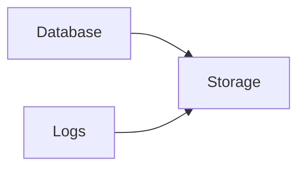

Log traffic can starve databases.

---

# Observability Cost Explosion

Cloud logging platforms charge by:

```text
Volume

Retention

Queries
```

A logging bug can cost:

```text
Thousands Of Dollars
```

in hours.

---

# Production Incident Example

## Incident

Kubernetes node became:

```text
NotReady
```

---

Investigation:

```bash
df -h
```

Output:

```text
100% Disk Used
```

---

Further analysis:

```bash
du -sh /var/log/*
```

Found:

```text
app.log = 450 GB
```

---

Root Cause:

```text
Infinite Retry Loop
```

logging:

```text
Database Unavailable
```

50,000 times per second.

---

# Production Incident Example #2

Cloud bill increased:

```text
$200

→

$12,000
```

within one week.

Root cause:

```text
Debug Logging Enabled
```

in production.

---

# Essential Commands

```bash
df -h

du -sh *

du -sh /var/log/*

journalctl -xe

wc -l logfile.log

tail -f logfile.log

lsof

find /var/log -type f

logrotate -d
```

Docker:

```bash
docker logs

docker inspect
```

Kubernetes:

```bash
kubectl logs

kubectl describe node
```

---

# Master Troubleshooting Workflow

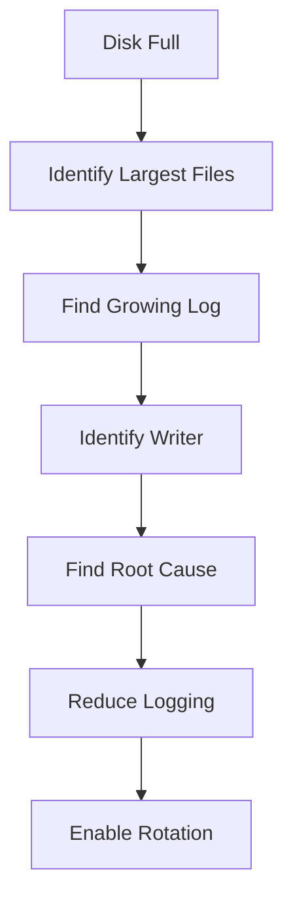

---

# Prevention Strategy

## Logging Levels

Production:

```text
INFO

WARN

ERROR
```

Avoid:

```text
TRACE

DEBUG
```

unless temporarily troubleshooting.

---

## Log Rotation

Use:

```text
logrotate
```

everywhere.

---

## Centralized Logging

Send logs to:

```text
ELK

OpenSearch

Loki

Splunk
```

instead of keeping everything locally.

---

## Alerting

Monitor:

```text
Log Growth Rate

Disk Usage

Logging Volume
```

not just total size.

---

# Common Mistakes

## Mistake 1

Logging entire requests.

---

## Mistake 2

Logging inside loops.

---

## Mistake 3

Leaving DEBUG enabled.

---

## Mistake 4

Ignoring log rotation.

---

## Mistake 5

Logging stack traces repeatedly.

---

## Mistake 6

Assuming logs are free.

---

# Engineering Mindset

Beginners think:

```text
Logs Help Troubleshooting
```

Engineers think:

```text
Logs Consume Resources
```

Senior engineers think:

```text
Logs Are Production Workloads
```

Elite platform engineers think:

```text
Every Log Line
Has A Cost
```

Because:

```text
Log
=
Storage
+
CPU
+
IO
+
Network
+
Money
```

---

# Interview Questions

### What is a log explosion?

Uncontrolled log generation causing resource exhaustion.

---

### Most common symptom?

```text
Disk Full
```

---

### Most common cause?

```text
Infinite Error Loops
```

---

### Why can logs slow databases?

Shared disk contention.

---

### Why is DEBUG dangerous in production?

Massively increases log volume.

---

### What tool handles Linux log rotation?

```text
logrotate
```

---

### Where are Docker logs stored?

```text
/var/lib/docker/containers/
```

---

# Cheat Sheet

```bash
# Disk Usage
df -h

# Directory Sizes
du -sh *

# Largest Logs
du -sh /var/log/*

# Active Growth
tail -f logfile.log

# Open Files
lsof

# Journal Logs
journalctl -xe

# Docker Logs
docker logs CONTAINER

# Kubernetes Logs
kubectl logs POD
```

---

# Final Takeaway

Logs are not:

```text
Just Text Files
```

They are:

```text
Infrastructure Workloads
```

The most important lesson:

```text
Log Explosion
≠
Logging Problem
```

It is usually:

```text
Application Bug

Retry Storm

Configuration Error

Observability Failure
```

manifesting through logs.

The best Linux, DevOps, SRE, Platform, and Cloud Engineers always ask:

```text
Why Is This Log Being Written?
```

instead of:

```text
How Big Is The Log File?
```

Because fixing the file size treats the symptom.

Fixing the log generation fixes the system.
