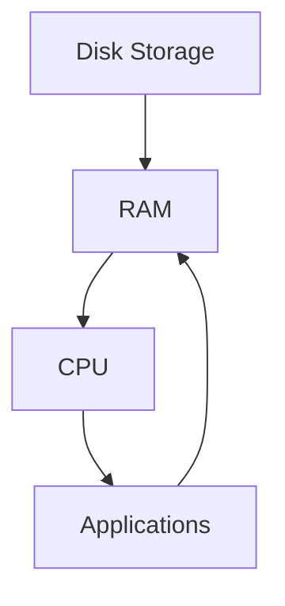
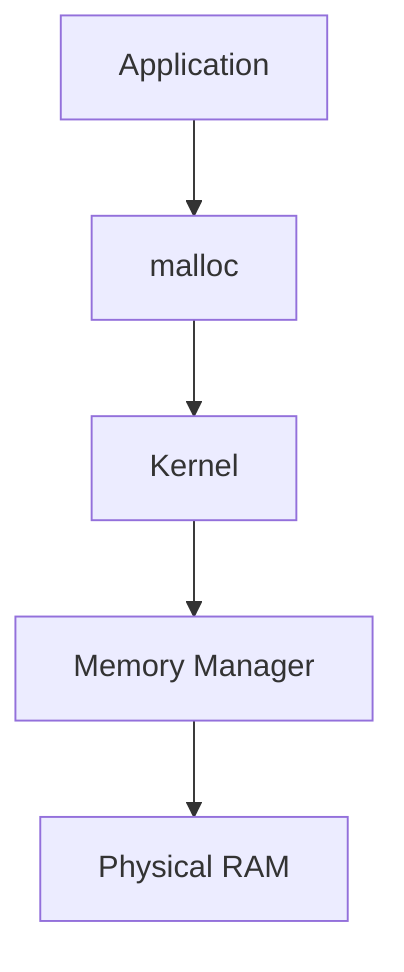
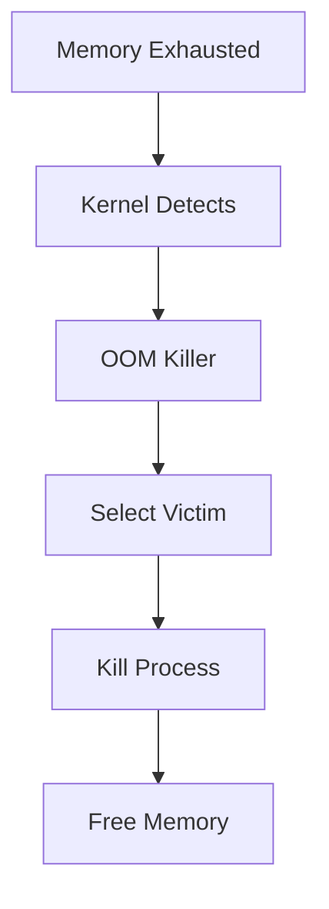
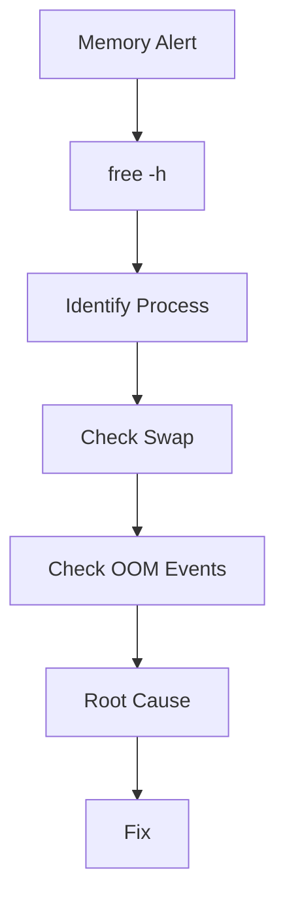

# Memory Exhaustion Troubleshooting Guide

> One of the most dangerous Linux production incidents.
>
> The root cause behind application crashes, database failures, container restarts, node instability, and OOM Killer events.
>
> A critical topic every Linux engineer, DevOps engineer, SRE, and platform engineer must deeply understand.

---

# Why This Exists

Modern systems run on memory.

Every application depends on RAM.

```text
CPU executes instructions.
Memory stores working data.
```

Without memory:

```text
Applications Cannot Run
Databases Cannot Cache
Containers Cannot Start
Operating Systems Become Unstable
```

Unlike disk exhaustion, memory exhaustion can destroy system responsiveness within seconds.

A healthy server can become unusable almost instantly.

This makes memory incidents some of the most stressful production failures.

---

# Problem It Solves

Imagine a factory.

```text
Workers = CPU

Workspace = Memory
```

Even if workers are available:

```text
No Workspace
        ↓
No Work
```

Linux applications require memory for:

```text
Code
Variables
Caches
Buffers
Stacks
Heaps
Network Data
```

When memory runs out:

```text
Performance Collapses
Processes Crash
Kernel Intervenes
```

---

# Mental Model

Think of RAM as a workbench.

```text
Application
      ↓
Needs Workspace
      ↓
RAM
```

Small application:

```text
Small Workspace
```

Large application:

```text
Large Workspace
```

When all workbenches are occupied:

```text
New Work Cannot Start
```

Linux must decide:

```text
Wait?
Swap?
Kill Processes?
```

---

# First Principles

Programs execute instructions.

Instructions need data.

Data must reside in memory.

Flow:

```text
Disk
  ↓
RAM
  ↓
CPU
```

CPU cannot efficiently operate directly from disk.

Memory acts as:

```text
High-Speed Working Area
```

---

# What Is Memory Exhaustion?

Memory exhaustion occurs when:

```text
Memory Demand
      >
Memory Supply
```

Result:

```text
Allocation Failures
Swapping
OOM Events
System Slowdowns
```

---

# Memory Architecture



---

# Linux Memory Components

Linux memory is not just:

```text
Used
Free
```

Memory consists of:

```text
Processes
Page Cache
Buffers
Kernel Memory
Slab Cache
Swap
```

Understanding these is critical.

---

# Viewing Memory

Check:

```bash
free -h
```

Example:

```text
total        16G
used          8G
free          1G
buff/cache    7G
```

Many engineers panic:

```text
Only 1 GB Free
```

Wrong.

Linux intentionally uses memory for caching.

---

# Golden Rule

Linux tries to use available RAM.

Unused memory is wasted memory.

Example:

```text
RAM = 64 GB

Applications = 20 GB

Cache = 40 GB
```

Healthy system.

Not a problem.

---

# Memory Usage Visualization

```text
RAM

+------------------------+
| Applications           |
+------------------------+
| Kernel                 |
+------------------------+
| Cache                  |
+------------------------+
| Free                   |
+------------------------+
```

Linux dynamically reallocates memory.

---

# Memory Allocation Flow



---

# Symptoms Of Memory Exhaustion

Common symptoms:

```text
Application Crashes
Slow Response Times
Container Restarts
OOM Kills
Swap Thrashing
System Freezes
```

---

# Common Error Messages

Application:

```text
Cannot allocate memory
```

Java:

```text
OutOfMemoryError
```

Container:

```text
OOMKilled
```

Kernel:

```text
Killed process
```

---

# First Investigation

Check:

```bash
free -h
```

Then:

```bash
vmstat 1
```

Then:

```bash
top
```

or

```bash
htop
```

---

# Understanding free Output

Example:

```bash
free -h
```

Output:

```text
total  used free shared buff/cache available
```

Important metric:

```text
available
```

NOT:

```text
free
```

Available memory represents:

```text
Memory Linux Can Reclaim
```

---

# Understanding Memory Pressure

Healthy:

```text
Available > 20%
```

Warning:

```text
Available < 10%
```

Danger:

```text
Available < 5%
```

Critical:

```text
OOM Events
```

---

# OOM Killer

Linux has protection.

Called:

```text
OOM Killer
```

Out Of Memory Killer.

Purpose:

```text
Prevent Entire System Crash
```

When memory exhausted:

```text
Kernel Selects Victim
         ↓
Kills Process
```

---

# OOM Killer Flow



---

# Detecting OOM Events

Check:

```bash
dmesg | grep -i kill
```

or

```bash
journalctl -k
```

Example:

```text
Out of memory
Killed process 1234 java
```

This is one of the most important Linux troubleshooting skills.

---

# Common Root Causes

---

# Cause 1: Memory Leak

Most common application issue.

Example:

```python
cache.append(data)
```

Never removed.

Memory usage:

```text
1 GB
2 GB
4 GB
8 GB
16 GB
```

Eventually:

```text
OOM Killer
```

---

# Cause 2: Traffic Spike

Normal:

```text
100 Requests/sec
```

Current:

```text
20,000 Requests/sec
```

More users:

```text
More Objects
More Memory
```

---

# Cause 3: Large Queries

Database loads:

```text
Millions Of Rows
```

into memory.

Result:

```text
Memory Explosion
```

---

# Cause 4: Java Heap Misconfiguration

Example:

```bash
-Xmx64G
```

on:

```text
32 GB Server
```

Disaster.

---

# Cause 5: Container Limits

Container configured:

```text
512 MB
```

Application needs:

```text
2 GB
```

Result:

```text
OOMKilled
```

---

# Cause 6: Runaway Cache

Example:

```text
Redis
Memcached
Application Cache
```

Consumes all RAM.

---

# Cause 7: Fork Bomb

Example:

```bash
:(){ :|:& };:
```

Processes multiply rapidly.

Memory exhausted quickly.

---

# Linux Internals

Linux uses:

```text
Virtual Memory
```

Applications believe they own:

```text
Huge Address Spaces
```

Kernel maps:

```text
Virtual Pages
      ↓
Physical Pages
```

---

# Virtual Memory Architecture


---

# Page Cache

One of Linux's greatest optimizations.

Linux caches:

```text
Disk Reads
Filesystem Data
Metadata
```

inside RAM.

Benefits:

```text
Massive Performance Gains
```

Many engineers mistake cache usage for memory leaks.

---

# How To Differentiate?

Check:

```bash
free -h
```

Large:

```text
buff/cache
```

usually healthy.

Large process growth:

```text
Memory Leak Suspected
```

---

# Swap

Swap is overflow memory.

Stored on disk.

```text
RAM Full
      ↓
Move Pages To Disk
```

Benefits:

```text
Avoid Immediate Crash
```

Costs:

```text
Massive Performance Penalty
```

---

# Swap Visualization

```text
RAM
  ↓ Full

Swap
  ↓ Disk

Much Slower
```

---

# Swap Thrashing

Dangerous condition.

```text
Page In
Page Out
Page In
Page Out
```

CPU spends time moving memory.

Applications become unusable.

Check:

```bash
vmstat 1
```

Look for:

```text
si
so
```

Swap-in and swap-out.

---

# Production Example

## Incident

API latency:

```text
50 ms
```

became:

```text
12 seconds
```

Investigation:

```bash
free -h
```

Result:

```text
Available Memory
200 MB
```

Check:

```bash
top
```

Java process:

```text
24 GB RAM
```

Check:

```bash
jmap
```

Root cause:

```text
Memory Leak
```

User session objects never released.

Fix:

```text
Patch Application
```

---

# Database Memory Exhaustion

PostgreSQL:

```text
shared_buffers
work_mem
maintenance_work_mem
```

Misconfiguration causes:

```text
Memory Pressure
```

Check:

```bash
ps aux --sort=-rss
```

---

# Docker Memory Troubleshooting

Check:

```bash
docker stats
```

View:

```text
Memory Usage
Memory Limit
```

---

# Kubernetes Memory Troubleshooting

Check:

```bash
kubectl top pod
```

Look for:

```text
High Memory Pods
```

Check:

```bash
kubectl describe pod
```

Example:

```text
OOMKilled
```

---

# Cloud Memory Troubleshooting

Cloud environments often show:

```text
Memory Exhaustion
Swap Usage
OOM Events
```

Common services:

```text
AWS CloudWatch
Azure Monitor
Google Operations
```

should alert before failure.

---

# Performance Implications

Memory pressure causes:

```text
Page Faults
Swapping
Latency
Timeouts
Reduced Throughput
```

Eventually:

```text
System Collapse
```

---

# Security Implications

Attackers can intentionally trigger:

```text
Memory Exhaustion
```

through:

```text
Large Requests
Resource Abuse
Fork Bombs
Memory Allocation Attacks
```

Result:

```text
Denial Of Service
```

---

# Observability

Monitor:

```text
Available Memory
Swap Usage
Page Faults
OOM Events
Cache Usage
```

Tools:

```text
Prometheus
Grafana
Datadog
New Relic
Elastic
```

---

# Essential Commands

```bash
free -h

top

htop

vmstat 1

ps aux --sort=-rss

cat /proc/meminfo

dmesg | grep -i kill

journalctl -k
```

---

# Troubleshooting Workflow



---

# Common Mistakes

## Mistake 1

Using:

```text
free
```

instead of:

```text
available
```

---

## Mistake 2

Assuming cache is a leak.

---

## Mistake 3

Disabling swap entirely.

---

## Mistake 4

Ignoring OOM logs.

---

## Mistake 5

Restarting applications without investigation.

---

## Mistake 6

Blaming Linux for memory leaks.

Usually:

```text
Application Bug
```

---

# Engineering Mindset

Beginners ask:

```text
Why Is Memory Full?
```

Engineers ask:

```text
What Is Using Memory?
Why Is It Using Memory?
Should It Be Using Memory?
```

Memory usage itself is not the problem.

Unexpected memory growth is.

---

# Interview Questions

### What is the OOM Killer?

Kernel mechanism that kills processes when memory is exhausted.

---

### How do you detect OOM events?

```bash
dmesg | grep -i kill

journalctl -k
```

---

### Difference between free and available memory?

Free:

```text
Unused Memory
```

Available:

```text
Memory Available For Allocation
```

---

### What causes swap thrashing?

Excessive page movement between RAM and disk.

---

### How do you find top memory consumers?

```bash
ps aux --sort=-rss
```

---

### Why does Linux use memory for cache?

To improve filesystem performance.

---

# Cheat Sheet

```bash
# Memory Overview
free -h

# Real-Time Memory
top

# Better UI
htop

# VM Statistics
vmstat 1

# Top Memory Processes
ps aux --sort=-rss

# Memory Info
cat /proc/meminfo

# OOM Events
dmesg | grep -i kill

# Kernel Logs
journalctl -k

# Docker Memory
docker stats

# Kubernetes Memory
kubectl top pod
```

---

# Final Takeaway

Memory exhaustion is not merely a resource problem.

It is often:

```text
Application Design Problem
Capacity Planning Problem
Traffic Problem
Configuration Problem
```

Elite Linux engineers never stop at:

```text
Memory Full
```

They continue until they understand:

```text
Who Allocated The Memory
Why It Was Allocated
Why It Was Not Released
Why Monitoring Did Not Catch It
```

That is production-grade Linux troubleshooting.
