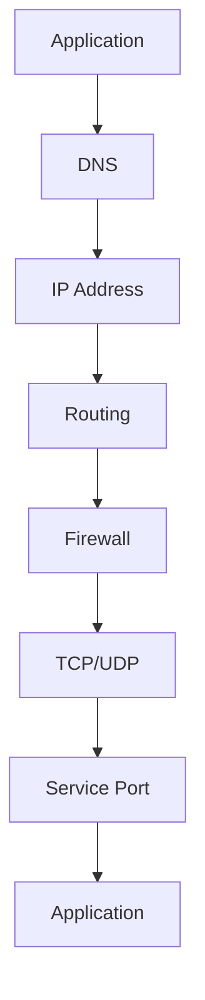
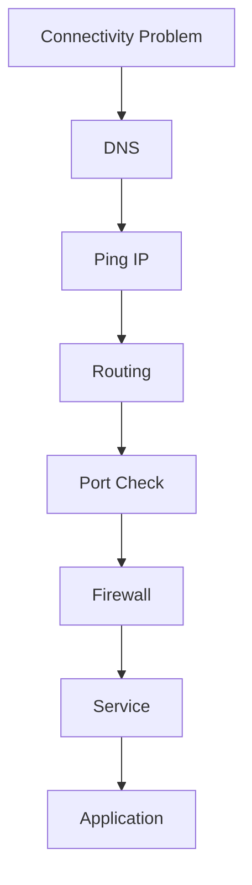
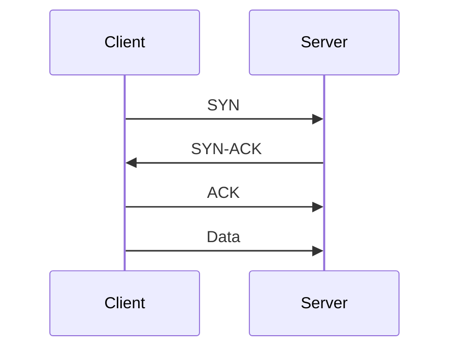

# Network Connectivity Troubleshooting Guide

> The foundation of all distributed systems troubleshooting.
>
> The skill that separates junior engineers from production engineers.
>
> The reason why modern applications, containers, cloud platforms, databases, and microservices either work or fail.

---

# Why This Exists

Modern systems are networked systems.

Today almost every application depends on:

```text
Client
  ↓
Load Balancer
  ↓
API Gateway
  ↓
Application
  ↓
Database
  ↓
Cache
  ↓
Message Queue
```

Every arrow represents:

```text
Network Connectivity
```

When connectivity breaks:

```text
Website Down
API Timeout
Database Unreachable
Microservices Fail
Containers Fail
Cluster Failures
```

Most engineers immediately blame:

```text
Application Bugs
```

But many production outages are actually:

```text
Network Problems
```

---

# Problem It Solves

Imagine a city.

```text
Buildings = Services
Roads = Network
```

Even if every building works perfectly:

```text
No Roads
      ↓
No Communication
```

Networking is the road system of computing.

Connectivity problems mean:

```text
Systems Exist
But Cannot Talk
```

---

# Mental Model

When an application says:

```text
Connection Failed
```

Think:

```text
Can Source Reach Destination?
```

Network troubleshooting is the art of finding:

```text
Which Layer Broke?
```

Not:

```text
Which Application Broke?
```

---

# First Principles

Network communication requires:

```text
Source
Destination
Route
Protocol
Port
Application
```

All must work.

Example:

```text
Laptop
   ↓
Router
   ↓
Internet
   ↓
Firewall
   ↓
Server
   ↓
Application
```

Failure at any point breaks connectivity.

---

# Connectivity Journey



---

# The Golden Rule

Never start troubleshooting at Layer 7.

Always start from the bottom.

Ask:

```text
Can I reach the IP?
```

before asking:

```text
Can I access the application?
```

---

# Layered Troubleshooting Model

```text
Layer 7 → Application
Layer 4 → TCP/UDP
Layer 3 → IP Routing
Layer 2 → Ethernet
Layer 1 → Physical Link
```

Troubleshoot:

```text
Bottom → Top
```

Never:

```text
Top → Bottom
```

---

# Common Connectivity Symptoms

---

## Connection Refused

```text
Connection refused
```

Meaning:

```text
Host Reachable
Port Closed
```

Usually:

```text
Service Down
Wrong Port
Firewall Reject
```

---

## Connection Timed Out

```text
Connection timed out
```

Meaning:

```text
Packet Never Reached Destination
```

Possible causes:

```text
Routing
Firewall
Server Offline
```

---

## No Route To Host

```text
No route to host
```

Meaning:

```text
Routing Failure
```

---

## Host Unreachable

```text
Destination host unreachable
```

Meaning:

```text
Network Path Missing
```

---

# Connectivity Troubleshooting Framework



---

# Step 1: Verify DNS

Check:

```bash
nslookup example.com
```

or

```bash
dig example.com
```

If DNS fails:

```text
Network Troubleshooting Stops Here
```

Fix DNS first.

---

# Step 2: Verify IP Reachability

Test:

```bash
ping 8.8.8.8
```

If successful:

```text
Network Path Exists
```

If failed:

```text
Routing
Firewall
Host
```

must be investigated.

---

# Step 3: Verify Local Network

Check interfaces:

```bash
ip addr
```

Example:

```text
eth0 UP
```

If interface down:

```bash
ip link set eth0 up
```

---

# Linux Network Architecture


---

# Step 4: Check Routing

View routing table:

```bash
ip route
```

Example:

```text
default via 192.168.1.1
```

Without default route:

```text
Internet Unreachable
```

---

# Understanding Routing

Imagine:

```text
Every Destination
Needs Directions
```

Routing table provides:

```text
Destination
Next Hop
Interface
```

Without routes:

```text
Packets Get Lost
```

---

# Step 5: Trace The Path

Use:

```bash
traceroute google.com
```

or

```bash
tracepath google.com
```

Shows:

```text
Hop-by-Hop Journey
```

Example:

```text
Laptop
Router
ISP
Internet
Destination
```

Failure identifies broken segment.

---

# Step 6: Verify Port Reachability

Test:

```bash
nc -zv HOST PORT
```

Example:

```bash
nc -zv 10.0.0.5 5432
```

Expected:

```text
Connected
```

Failure:

```text
Port Closed
Firewall
Service Down
```

---

# Step 7: Verify Listening Service

Check:

```bash
ss -tulpn
```

Example:

```text
LISTEN 0.0.0.0:80
```

No listener:

```text
Application Problem
```

---

# Understanding TCP Connectivity



If handshake fails:

```text
No Connection
```

---

# Firewall Troubleshooting

Linux firewalls:

```text
iptables
nftables
ufw
firewalld
```

Check:

```bash
iptables -L
```

or

```bash
nft list ruleset
```

Verify:

```text
Required Port Allowed
```

---

# Common Root Causes

---

# Cause 1: Interface Down

Check:

```bash
ip link
```

Output:

```text
DOWN
```

No traffic possible.

---

# Cause 2: Wrong IP Address

Check:

```bash
ip addr
```

Incorrect address:

```text
Routing Failure
```

---

# Cause 3: Missing Route

Check:

```bash
ip route
```

No default route:

```text
Internet Access Fails
```

---

# Cause 4: Firewall Rules

Common production issue.

Firewall blocks:

```text
80
443
5432
3306
22
```

Traffic dropped.

---

# Cause 5: Service Down

Example:

```text
Database Offline
```

Network healthy.

Application unavailable.

---

# Cause 6: DNS Failure

Most common.

Example:

```text
Can Reach IP
Cannot Reach Hostname
```

---

# Cause 7: Cloud Security Rules

Cloud environments introduce:

```text
AWS Security Groups
Azure NSGs
GCP Firewalls
```

Linux may be healthy.

Cloud firewall blocks traffic.

---

# Cause 8: MTU Issues

Packets too large.

Symptoms:

```text
Intermittent Connectivity
TLS Failures
VPN Problems
```

Check:

```bash
ip link
```

---

# Linux Internals

Application:

```bash
curl example.com
```

Internally:

```text
Socket
  ↓
TCP
  ↓
IP
  ↓
NIC Driver
  ↓
Network Card
  ↓
Wire
```

Every layer must function.

---

# Packet Flow Visualization


---

# Production Incident Example

## Incident

Customers report:

```text
Website Down
```

Initial assumption:

```text
Application Bug
```

Investigation:

```bash
curl localhost
```

Success.

Check:

```bash
ss -tulpn
```

Nginx healthy.

Check:

```bash
iptables -L
```

Found:

```text
Port 443 Blocked
```

Root cause:

```text
Firewall Deployment Error
```

Recovery:

```text
Restore Rule
```

Downtime:

```text
4 Minutes
```

---

# Docker Networking Connection

Containers add extra layers.

```text
Application
   ↓
Container Network
   ↓
Bridge
   ↓
Host Network
   ↓
Internet
```

Useful commands:

```bash
docker network ls
docker inspect container
```

---

# Kubernetes Networking Connection

Connectivity issues often involve:

```text
Pod
Service
DNS
CNI
Ingress
Node
```

Check:

```bash
kubectl get pods
kubectl get svc
kubectl describe pod
```

---

# Performance Considerations

Poor connectivity causes:

```text
Latency
Retries
Packet Loss
Timeouts
```

Applications appear slow even when:

```text
CPU Healthy
Memory Healthy
```

Network becomes bottleneck.

---

# Security Considerations

Connectivity failures may be intentional.

Examples:

```text
Firewall Rules
Zero Trust Policies
Network Segmentation
Security Groups
```

Never blindly disable security controls.

Understand:

```text
Why Traffic Is Blocked
```

---

# Observability

Monitor:

```text
Packet Loss
Latency
TCP Errors
Connection Failures
DNS Errors
```

Tools:

```text
Prometheus
Grafana
Datadog
New Relic
Elastic
```

Useful commands:

```bash
ss
ip
ping
traceroute
tcpdump
```

---

# Advanced Troubleshooting

Capture packets:

```bash
tcpdump -i eth0
```

Example:

```bash
tcpdump port 443
```

Observe:

```text
SYN
ACK
RST
Drops
```

This reveals actual network behavior.

---

# Troubleshooting Playbook

```text
1. Verify DNS
2. Verify IP Reachability
3. Verify Interface
4. Verify Routing
5. Verify Port Reachability
6. Verify Firewall
7. Verify Service
8. Verify Application
9. Capture Packets
10. Identify Root Cause
```

---

# Common Mistakes

## Mistake 1

Blaming applications first.

---

## Mistake 2

Ignoring DNS.

---

## Mistake 3

Ignoring cloud firewalls.

---

## Mistake 4

Skipping routing checks.

---

## Mistake 5

Not checking listening ports.

---

## Mistake 6

Changing firewall rules blindly.

---

# Engineering Mindset

Professional engineers think:

```text
Layer By Layer
```

Beginners think:

```text
Application Broken
```

Connectivity troubleshooting is the process of answering:

```text
Can Source Reach Destination?
```

Then discovering:

```text
Which Layer Prevents Communication?
```

---

# Interview Questions

### Difference between timeout and refused?

Timeout:

```text
No Response
```

Refused:

```text
Host Reachable
Port Closed
```

---

### How do you view routes?

```bash
ip route
```

---

### How do you check listening ports?

```bash
ss -tulpn
```

---

### How do you trace packet path?

```bash
traceroute HOST
```

---

### What command captures packets?

```bash
tcpdump
```

---

### What cloud components commonly block connectivity?

```text
Security Groups
Network ACLs
Firewall Rules
```

---

# Cheat Sheet

```bash
# DNS
dig HOST

# Connectivity
ping HOST

# Routes
ip route

# Interfaces
ip addr

# Listening Ports
ss -tulpn

# Port Test
nc -zv HOST PORT

# Packet Capture
tcpdump -i eth0

# Firewall
iptables -L

# Trace Route
traceroute HOST

# Connections
ss -ant
```

---

# Final Takeaway

Network connectivity is the foundation of modern computing.

Every distributed system ultimately depends on:

```text
Packets Moving Successfully
```

The fastest Linux engineers never guess.

They follow a systematic path:

```text
DNS
↓
IP
↓
Route
↓
Firewall
↓
Port
↓
Service
↓
Application
```

Master this workflow and you can troubleshoot Linux servers, cloud infrastructure, Docker hosts, Kubernetes clusters, databases, APIs, and internet-scale distributed systems with confidence.
