# Network Packet Loss Troubleshooting Guide

> One of the most dangerous and misunderstood networking problems.
>
> The hidden cause behind slow APIs, database failures, SSH freezes, video call quality issues, Kubernetes networking problems, cloud outages, and distributed system instability.
>
> A topic that teaches Linux networking, TCP/IP internals, routing, congestion control, network hardware, cloud networking, and distributed systems engineering.

---

# Why This Exists

Networks are built around a simple assumption:

```text
Data Sent
=
Data Received
```

Reality is different.

Packets can be:

```text
Dropped

Corrupted

Delayed

Reordered

Duplicated
```

Packet loss occurs when:

```text
Packets Sent
>
Packets Received
```

Even small amounts of loss can have dramatic effects on applications.

---

# The Most Important Lesson

Bandwidth problems and packet loss problems are not the same thing.

Many engineers assume:

```text
Slow Network
=
Low Bandwidth
```

Often wrong.

A network with:

```text
10 Gbps Bandwidth
```

can perform worse than:

```text
100 Mbps Link
```

if packet loss exists.

---

# Problem It Solves

Imagine a courier service.

You send:

```text
100 Packages
```

Destination receives:

```text
95 Packages
```

Missing packages must be:

```text
Re-sent
```

This creates:

```text
Delays

Congestion

Inefficiency
```

Exactly how TCP behaves.

---

# Mental Model

Most people think:

```text
Network
=
Pipe
```

Better model:

```text
Network
=
Postal System
```

Packets travel independently.

Some arrive.

Some arrive late.

Some never arrive.

Protocols must handle uncertainty.

---

# First Principles

Data transmission:

```text
Application
      ↓
TCP/UDP
      ↓
IP
      ↓
Network
      ↓
Destination
```

---

# Network Architecture


Loss can occur at any layer.

---

# What Is Packet Loss?

Packet loss means:

```text
Packet Transmitted

Packet Never Arrives
```

---

# Simplified Formula

```text
Packet Loss %

=
Lost Packets
/
Total Packets
× 100
```

Example:

```text
1000 Sent

10 Lost

=
1% Packet Loss
```

---

# Why Packet Loss Matters

Applications see:

```text
Timeouts

Slow Responses

Disconnected Sessions
```

while networking teams see:

```text
Only 1% Loss
```

Small loss can create huge impact.

---

# Packet Journey


A packet only needs to be lost once.

---

# The Golden Rule

Never ask:

```text
Is The Network Up?
```

Ask:

```text
How Reliable Is The Network?
```

A network can be:

```text
Reachable

But Unusable
```

---

# Symptoms

---

## Symptom 1

Slow websites.

---

## Symptom 2

SSH lag.

---

## Symptom 3

Video call freezes.

---

## Symptom 4

Database timeouts.

---

## Symptom 5

High TCP retransmissions.

---

## Symptom 6

Random Kubernetes failures.

---

## Symptom 7

Microservice communication errors.

---

# Packet Loss Lifecycle

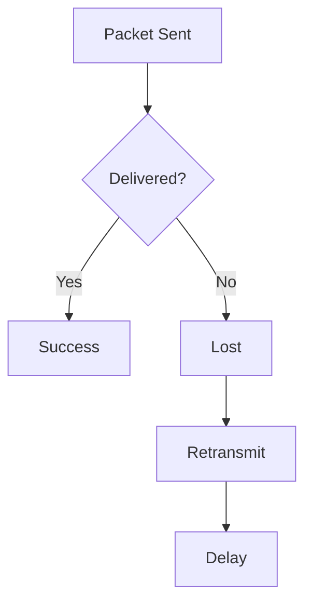

---

# Why TCP Suffers

TCP assumes:

```text
Packet Loss
=
Congestion
```

When loss occurs:

```text
TCP Slows Down
```

---

# TCP Recovery

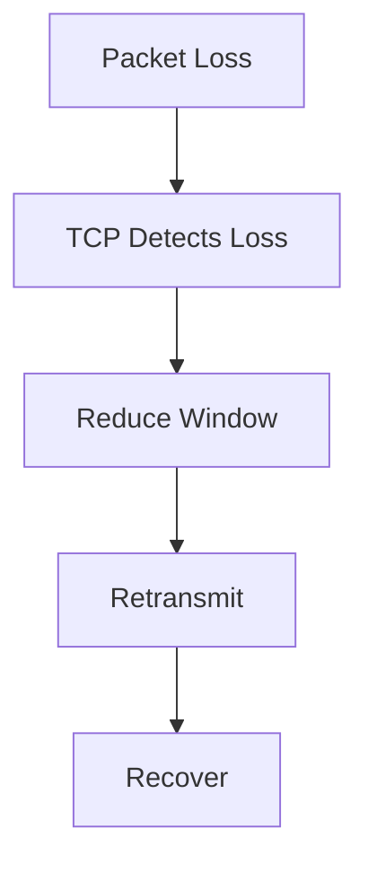

---

# Result

Even:

```text
1% Packet Loss
```

can dramatically reduce throughput.

---

# Common Cause #1

## Network Congestion

Most common cause.

Link capacity exceeded.

---

# Congestion Model

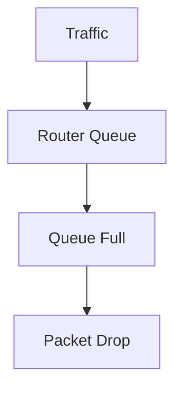

---

# Symptoms

```text
Latency Increase

Packet Loss

Retransmissions
```

---

# Investigation

Check interface statistics:

```bash
ip -s link
```

---

# Common Cause #2

## Interface Errors

Bad:

```text
NIC

Cable

SFP Module

Switch Port
```

---

# Physical Layer


Hardware issues create loss.

---

# Investigation

```bash
ethtool eth0
```

Check:

```text
CRC Errors

Frame Errors

Drops
```

---

# Common Cause #3

## Duplex Mismatch

Classic networking problem.

Example:

```text
Server: Full Duplex

Switch: Half Duplex
```

Result:

```text
Collisions

Packet Loss
```

---

# Investigation

```bash
ethtool eth0
```

Verify:

```text
Speed

Duplex
```

---

# Common Cause #4

## Overloaded Router

Router CPU reaches:

```text
100%
```

Packets dropped.

---

# Router Path

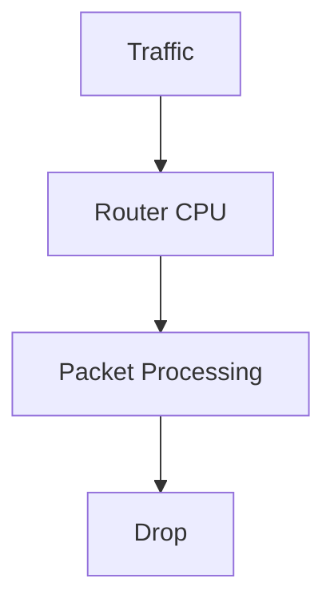

---

# Common Cause #5

## Firewall Saturation

Modern firewalls inspect packets.

Heavy traffic causes:

```text
Packet Drops
```

---

# Common Cause #6

## Wireless Networks

Wi-Fi inherently experiences:

```text
Interference

Signal Loss

Collisions
```

More loss than wired networks.

---

# Wireless Environment

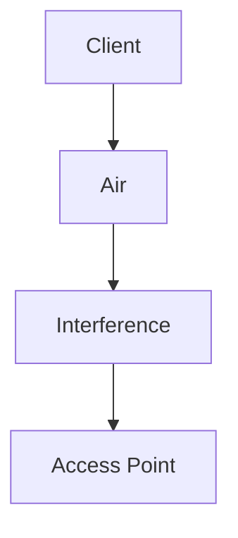

---

# Common Cause #7

## Cloud Networking

Cloud providers abstract hardware.

Packet loss may occur inside:

```text
Virtual Switches

Overlay Networks

Hypervisors
```

---

# Cloud Network Path


---

# Common Cause #8

## DDoS Attacks

Traffic overwhelms links.

Packets dropped.

---

# Attack Model

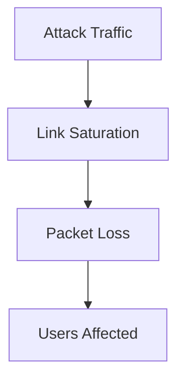

---

# Common Cause #9

## MTU Mismatch

Different systems use different packet sizes.

Example:

```text
Server MTU = 9000

Router MTU = 1500
```

Results:

```text
Fragmentation

Drops

Connectivity Issues
```

---

# Investigation

```bash
ip link
```

Check:

```text
MTU
```

---

# Common Cause #10

## Buffer Exhaustion

Network device buffers fill.

New packets dropped.

---

# Buffer Architecture

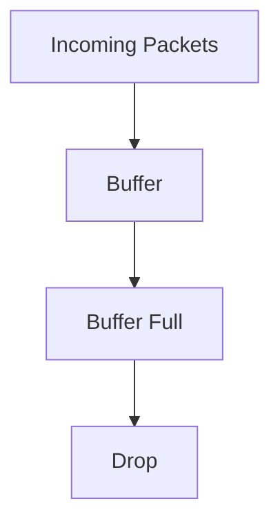

---

# Linux Investigation Workflow

---

## Step 1

Check reachability.

```bash
ping HOST
```

---

## Step 2

Check packet loss.

```bash
ping -c 100 HOST
```

---

Example:

```text
100 packets transmitted

95 received

5% packet loss
```

---

## Step 3

Check path.

```bash
traceroute HOST
```

---

## Step 4

Check hop loss.

```bash
mtr HOST
```

Most useful tool.

---

# MTR Architecture


MTR identifies:

```text
Where Loss Begins
```

---

# Step 5

Check interface statistics.

```bash
ip -s link
```

Look for:

```text
RX Dropped

TX Dropped

Errors
```

---

# Step 6

Check NIC errors.

```bash
ethtool -S eth0
```

---

# Step 7

Check retransmissions.

```bash
ss -s
```

---

# Linux Internals

Packets travel through:

```text
NIC

Driver

Kernel

TCP Stack

Application
```

---

# Packet Flow

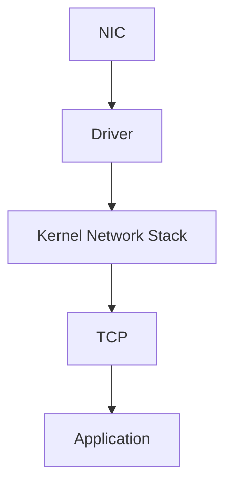

Loss can occur before application ever sees data.

---

# Packet Drops Inside Linux

Kernel may drop packets because:

```text
Receive Queue Full

Memory Pressure

Firewall Rules

Rate Limits
```

---

# Linux Receive Path

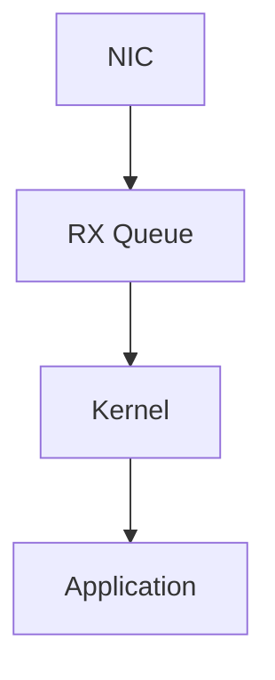

Queue overflow:

```text
Packet Loss
```

---

# TCP Retransmissions

Packet loss causes:

```text
Retransmissions
```

---

# Retransmission Cycle

```mermaid
sequenceDiagram

Client->>Server: Packet

Note over Client,Server:
Lost

Client->>Server: Retransmit

Server->>Client: ACK
```

---

# Why Distributed Systems Hate Packet Loss

Microservices constantly communicate.

Even:

```text
1% Packet Loss
```

can multiply across services.

---

# Service Dependency Graph


Loss affects entire chain.

---

# Kubernetes Impact

Packet loss causes:

```text
Pod Communication Failures

DNS Issues

API Timeouts

Service Mesh Problems
```

---

# Kubernetes Network Path

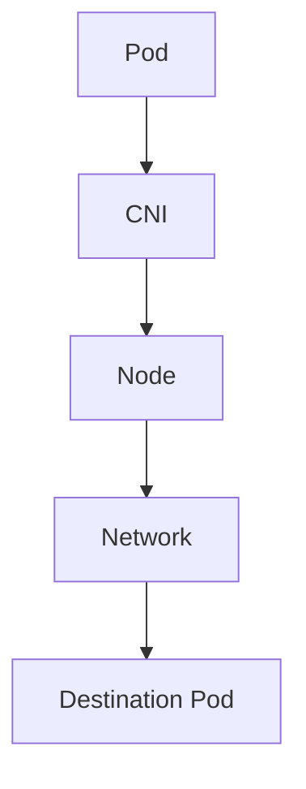

---

# Production Incident Example

## Incident

Users report:

```text
Website Slow
```

Monitoring:

```text
CPU Normal

Memory Normal

Disk Normal
```

---

Investigation:

```bash
mtr api-server
```

Found:

```text
3% Packet Loss
```

on upstream router.

---

Result:

```text
TCP Retransmissions

Latency Spikes

Slow APIs
```

---

Root Cause:

```text
Failing Switch Port
```

---

# Production Incident Example #2

Kubernetes cluster instability.

Symptoms:

```text
Random Service Failures
```

Investigation:

```bash
ping
mtr
```

Found:

```text
1% Packet Loss
```

between nodes.

Cause:

```text
Bad NIC
```

---

# Performance Implications

Packet loss causes:

```text
Reduced Throughput

Higher Latency

TCP Window Reduction

Retransmissions

Application Slowdowns
```

---

# Security Implications

Attackers may intentionally create:

```text
Congestion

Packet Drops

Link Saturation
```

to create service degradation.

---

# Observability

Monitor:

```text
Packet Loss

Retransmissions

Interface Errors

Queue Drops

Latency
```

Important metrics:

```text
rx_dropped

tx_dropped

tcp_retransmits

packet_loss

network_errors
```

---

# Essential Commands

```bash
ping HOST

ping -c 100 HOST

traceroute HOST

mtr HOST

ip -s link

ss -s

ethtool eth0

ethtool -S eth0

tcpdump

iftop
```

---

# Master Troubleshooting Workflow

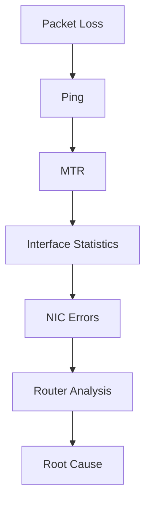

---

# Common Mistakes

## Mistake 1

Assuming bandwidth is the problem.

---

## Mistake 2

Ignoring small loss percentages.

---

## Mistake 3

Checking only endpoints.

---

## Mistake 4

Ignoring retransmissions.

---

## Mistake 5

Ignoring hardware errors.

---

## Mistake 6

Trusting a single ping test.

---

# Engineering Mindset

Beginners think:

```text
Network Slow
```

Engineers think:

```text
Network Reliability Issue
```

Senior engineers think:

```text
Where Are Packets Being Lost?
```

Elite network engineers think:

```text
Every Lost Packet
Creates Additional Work
For The Entire System
```

Because packet loss is not merely:

```text
Missing Data
```

It is:

```text
Retransmissions

Congestion

Latency

Reduced Throughput

System Instability
```

combined.

---

# Interview Questions

### What is packet loss?

Packets transmitted but not received.

---

### Why does packet loss hurt TCP?

TCP retransmits and reduces sending rate.

---

### Best tool for locating packet loss?

```bash
mtr
```

---

### What causes packet loss?

```text
Congestion

Hardware Errors

Duplex Mismatch

Bad Links

Buffer Exhaustion
```

---

### Why can 1% packet loss be serious?

TCP performance degrades significantly.

---

### How do you check interface drops?

```bash
ip -s link
```

---

### How do you check NIC statistics?

```bash
ethtool -S eth0
```

---

# Cheat Sheet

```bash
# Reachability
ping HOST

# Packet Loss
ping -c 100 HOST

# Route Analysis
traceroute HOST

# Loss Analysis
mtr HOST

# Interface Stats
ip -s link

# NIC Statistics
ethtool -S eth0

# TCP Statistics
ss -s

# Packet Capture
tcpdump

# Traffic Analysis
iftop
```

---

# Final Takeaway

Packet loss is one of the most expensive networking failures because:

```text
Small Loss
=
Large Consequences
```

The most important lesson:

```text
Network Up
≠
Network Healthy
```

A network can:

```text
Respond To Ping

Pass Health Checks

Remain Reachable
```

while still losing packets and destroying application performance.

The best Linux, Network, SRE, Platform, Cloud, and Distributed Systems Engineers always ask:

```text
How Reliable Is Packet Delivery?
```

because every distributed system ultimately depends on one simple promise:

```text
What Was Sent

Must Arrive.
```

And when that promise breaks, everything built on top of the network begins to fail.
