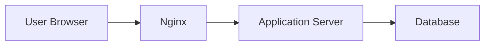
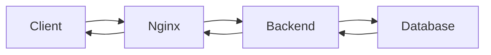
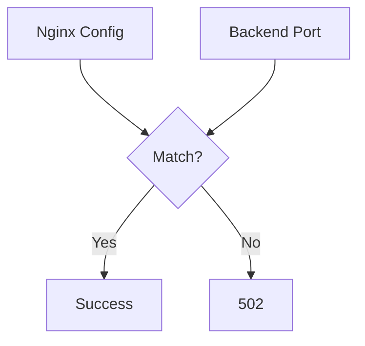
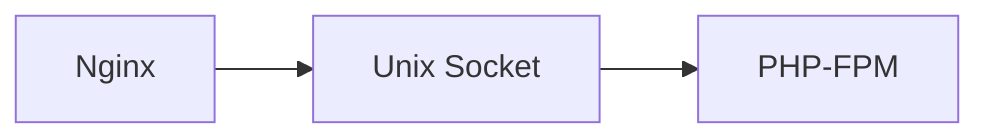
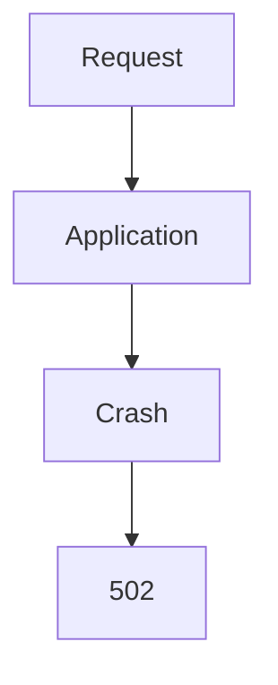
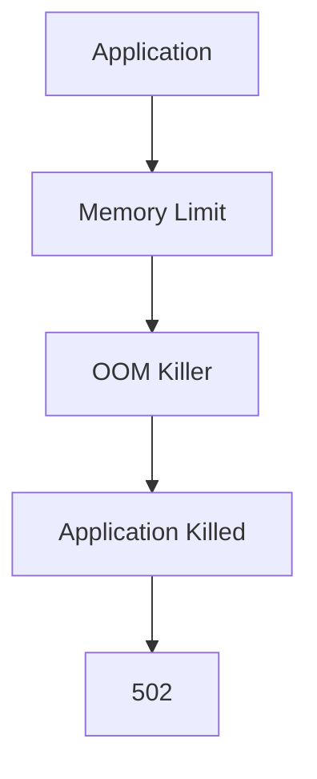
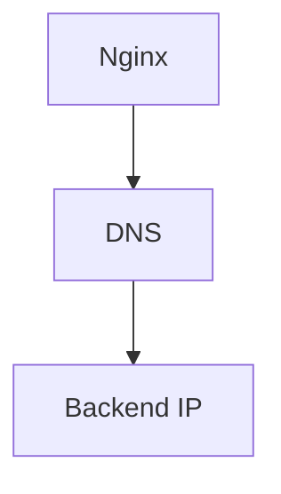
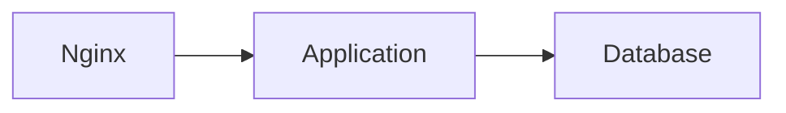
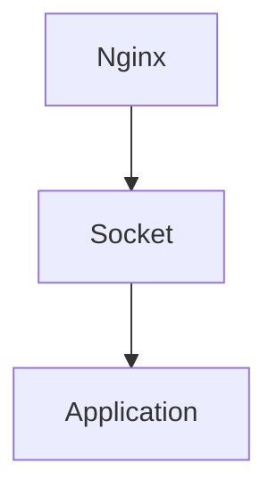
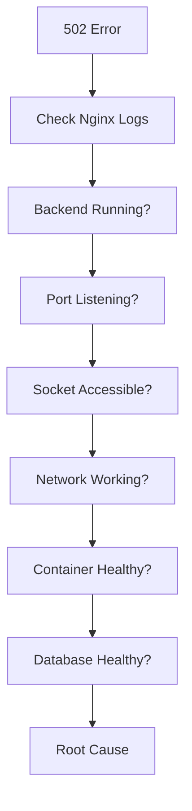

# Nginx 502 Bad Gateway Troubleshooting Guide

> One of the most common production outages on the internet.
>
> The error that causes websites, APIs, mobile apps, SaaS platforms, and microservices to suddenly become unavailable.
>
> A topic that teaches how reverse proxies, application servers, networking, Linux, containers, Kubernetes, and distributed systems actually work together.

---

# Why This Exists

Most modern applications do not expose themselves directly to users.

Instead:

```text
User
 ↓
Nginx
 ↓
Application
```

Examples:

```text
React + Nginx + Node.js
Django + Nginx + Gunicorn
Laravel + Nginx + PHP-FPM
Go + Nginx
Java + Nginx
Microservices + API Gateway
```

Nginx acts as:

```text
Traffic Controller
```

When Nginx cannot successfully communicate with the backend:

```text
502 Bad Gateway
```

appears.

This is one of the most common production incidents in modern infrastructure.

---

# Problem It Solves

Imagine a receptionist.

```text
Customer
   ↓
Receptionist
   ↓
Employee
```

The receptionist receives requests and forwards them.

If the employee:

```text
Crashes
Disappears
Stops Responding
Rejects Requests
```

the receptionist cannot provide an answer.

Instead:

```text
"I couldn't get a valid response."
```

Nginx is the receptionist.

The backend server is the employee.

---

# Mental Model

Most engineers think:

```text
502
=
Nginx Problem
```

Usually wrong.

A 502 actually means:

```text
Nginx
↓
Attempted Communication
↓
Backend Failed
```

The failure is often:

```text
Application
Network
Container
Database
Resource Exhaustion
```

rather than Nginx itself.

---

# First Principles

A successful request follows:

```text
Browser
 ↓
TCP Connection
 ↓
Nginx
 ↓
TCP Connection
 ↓
Backend Application
 ↓
Response
```

If the second connection fails:

```text
Nginx Returns 502
```

---

# High-Level Architecture



Nginx sits between:

```text
Clients
and
Backends
```

---

# What Is A 502 Error?

Official meaning:

```text
Bad Gateway
```

Meaning:

```text
Gateway Received
Invalid Response
From Upstream Server
```

---

# Important Distinction

| Error | Meaning                      |
| ----- | ---------------------------- |
| 500   | Application Failed           |
| 502   | Backend Communication Failed |
| 503   | Service Unavailable          |
| 504   | Backend Timeout              |

Understanding the difference dramatically improves troubleshooting.

---

# Request Lifecycle



Failure anywhere after Nginx can become:

```text
502
```

---

# The Golden Rule

Never ask:

```text
Why Is Nginx Returning 502?
```

Ask:

```text
Why Could Nginx
Not Obtain
A Valid Response
From Upstream?
```

---

# Common 502 Root Causes

```text
Backend Process Down
Port Closed
Connection Refused
Socket Problems
Timeouts
Container Crash
DNS Failure
Resource Exhaustion
Application Crash
Load Balancer Issues
```

---

# Failure 1: Backend Process Not Running

Most common cause.

Example:

```text
Nginx Running

Node.js Crashed
```

Result:

```text
502 Bad Gateway
```

---

# Architecture


Nginx attempts:

```text
TCP Connection
```

No process exists.

Connection fails.

---

# Investigation

Check:

```bash
systemctl status SERVICE
```

Examples:

```bash
systemctl status node-app

systemctl status gunicorn

systemctl status php-fpm
```

---

# Failure 2: Connection Refused

Common log:

```text
connect() failed (111: Connection refused)
```

Meaning:

```text
Host Reachable

Port Closed
```

---

# TCP Flow

```mermaid
sequenceDiagram

Nginx->>Backend: SYN

Backend->>Nginx: RST

Note over Nginx,Backend:
Connection Refused
```

---

# Investigation

Check listening ports:

```bash
ss -tulpn
```

Example:

```bash
ss -tulpn | grep 3000
```

Verify application listens on configured port.

---

# Failure 3: Wrong Upstream Configuration

Example:

```nginx
proxy_pass http://127.0.0.1:3000;
```

Application actually runs on:

```text
4000
```

Nginx reaches wrong destination.

Result:

```text
502
```

---

# Configuration Dependency



---

# Investigation

Check:

```bash
nginx -T
```

Verify:

```text
proxy_pass
upstream
listen ports
```

---

# Failure 4: Unix Socket Problems

Example:

```nginx
fastcgi_pass unix:/run/php/php8.2-fpm.sock;
```

Socket missing.

Result:

```text
502
```

---

# Unix Socket Architecture



---

# Investigation

Check:

```bash
ls -lah /run/php/
```

Verify socket exists.

---

# Failure 5: Permission Problems

Nginx cannot access socket.

---

# Example

Socket:

```text
Owned By:
root
```

Nginx:

```text
www-data
```

Result:

```text
Permission Denied
```

which becomes:

```text
502
```

---

# Investigation

Check:

```bash
ls -lah SOCKET
```

Verify:

```text
Owner
Group
Permissions
```

---

# Failure 6: Application Crash

Application starts.

Receives requests.

Crashes.

---

# Architecture



---

# Investigation

Check:

```bash
journalctl -u APP
```

or:

```bash
docker logs CONTAINER
```

Look for:

```text
Exceptions
Segmentation Faults
OOM Events
```

---

# Failure 7: OOMKilled

Very common in containers.

Application:

```text
Killed By Kernel
```

Nginx still forwards requests.

Backend disappears.

Result:

```text
502
```

---

# Memory Flow



---

# Investigation

Check:

```bash
dmesg
```

Look for:

```text
Killed process
```

Docker:

```bash
docker inspect CONTAINER
```

Look for:

```text
OOMKilled=true
```

---

# Failure 8: Backend Timeout

Backend too slow.

Nginx waits.

Eventually:

```text
Upstream Failure
```

---

# Timing Diagram

```mermaid
sequenceDiagram

User->>Nginx: Request

Nginx->>Backend: Request

Note over Backend:
Very Slow

Nginx->>User: Failure
```

---

# Investigation

Check:

```nginx
proxy_read_timeout
```

and:

```text
Application Response Time
```

---

# Failure 9: DNS Resolution Failure

Common in containers and Kubernetes.

---

# Example

```nginx
proxy_pass http://api-service;
```

DNS fails.

Nginx cannot find backend.

---

# DNS Architecture



---

# Investigation

Test:

```bash
nslookup api-service
```

or:

```bash
dig api-service
```

---

# Failure 10: Container Failure

Container stopped.

Nginx still routes traffic.

---

# Container Architecture


Container exits.

Result:

```text
502
```

---

# Investigation

Check:

```bash
docker ps
```

Verify container running.

---

# Failure 11: Kubernetes Pod Failure

Most common cloud-native cause.

---

# Architecture


If pod dies:

```text
502
```

---

# Investigation

```bash
kubectl get pods
```

Look for:

```text
CrashLoopBackOff
Error
OOMKilled
```

---

# Failure 12: No Service Endpoints

Very common Kubernetes issue.

---

# Service Architecture


No endpoints:

```text
502
```

---

# Investigation

```bash
kubectl get endpoints
```

Example:

```text
ENDPOINTS <none>
```

Root cause identified.

---

# Failure 13: Database Dependency Failure

Application depends on database.

Database unavailable.

Application crashes.

Nginx returns:

```text
502
```

---

# Hidden Dependency Chain



Database issue surfaces as:

```text
502
```

---

# Linux Internals

Nginx communicates through:

```text
TCP Sockets
Unix Sockets
```

---

# Socket Architecture



Most 502 errors are ultimately:

```text
Socket Failures
```

---

# Log Analysis

Most important file:

```bash
tail -f /var/log/nginx/error.log
```

Typical messages:

```text
Connection Refused

Upstream Timed Out

No Live Upstreams

Permission Denied

Host Not Found
```

These messages usually reveal root cause immediately.

---

# Production Incident Example

## Incident

E-commerce API outage.

Users see:

```text
502 Bad Gateway
```

Investigation:

```bash
systemctl status node-api
```

Output:

```text
Failed
```

Check logs:

```bash
journalctl -u node-api
```

Result:

```text
Database Authentication Failure
```

Root Cause:

```text
Database Password Rotated
```

Application crashed.

Nginx produced:

```text
502
```

---

# Container Production Example

Users receive:

```text
502
```

Investigation:

```bash
docker ps
```

Container restarting.

Check:

```bash
docker inspect
```

Result:

```text
OOMKilled=true
```

Root Cause:

```text
Memory Leak
```

---

# Observability

Monitor:

```text
502 Rate
Backend Health
Response Time
Connection Errors
Container Restarts
```

Important metrics:

```text
nginx_http_requests_total

upstream_response_time

5xx_errors

pod_restarts
```

---

# Essential Commands

```bash
systemctl status nginx

nginx -t

nginx -T

tail -f /var/log/nginx/error.log

ss -tulpn

curl localhost:PORT

netstat -tulpn

journalctl -u SERVICE
```

Docker:

```bash
docker ps

docker logs CONTAINER
```

Kubernetes:

```bash
kubectl get pods

kubectl get svc

kubectl get endpoints
```

---

# Master Troubleshooting Workflow



---

# Common Mistakes

## Mistake 1

Restarting Nginx first.

Usually not the problem.

---

## Mistake 2

Ignoring error.log.

---

## Mistake 3

Only checking access.log.

---

## Mistake 4

Assuming application is healthy.

---

## Mistake 5

Ignoring backend dependencies.

---

## Mistake 6

Ignoring container restarts.

---

# Engineering Mindset

Beginners think:

```text
Nginx Broken
```

Engineers think:

```text
Backend Communication Failed
```

Senior engineers think:

```text
Which Upstream Dependency Failed?
```

Elite platform engineers think:

```text
Client
 ↓
Nginx
 ↓
Socket
 ↓
Application
 ↓
Database
 ↓
Infrastructure

Where Did The Request Path Break?
```

Because:

```text
502
```

is not usually an Nginx problem.

It is a symptom that:

```text
Nginx Could Not Obtain
A Valid Upstream Response
```

---

# Interview Questions

### What does 502 Bad Gateway mean?

Nginx received an invalid response from upstream.

---

### Difference between 502 and 504?

502:

```text
Bad Response
```

504:

```text
No Response In Time
```

---

### Most useful log file?

```bash
/var/log/nginx/error.log
```

---

### What causes connection refused?

Backend not listening.

---

### Can database failures cause 502?

Yes.

Applications often crash when databases become unavailable.

---

### Can Kubernetes endpoint issues cause 502?

Yes.

Services without endpoints often produce 502 errors.

---

# Cheat Sheet

```bash
# Nginx Status
systemctl status nginx

# Validate Config
nginx -t

# Full Config
nginx -T

# Error Logs
tail -f /var/log/nginx/error.log

# Check Ports
ss -tulpn

# Backend Health
curl localhost:PORT

# Service Logs
journalctl -u SERVICE

# Docker
docker ps
docker logs CONTAINER

# Kubernetes
kubectl get pods
kubectl get svc
kubectl get endpoints
```

---

# Final Takeaway

A 502 Bad Gateway error is rarely:

```text
An Nginx Problem
```

Most 502 incidents originate from:

```text
Backend Crashes
Socket Failures
Port Issues
DNS Problems
Container Failures
Kubernetes Problems
Database Failures
Resource Exhaustion
```

The most important lesson:

```text
502
≠
Root Cause
```

It is simply:

```text
Nginx Reporting
That Upstream Communication Failed
```

The best Linux, DevOps, SRE, Backend, and Platform Engineers follow the complete request path:

```text
Client
 ↓
Nginx
 ↓
Socket
 ↓
Application
 ↓
Database
 ↓
Infrastructure
```

until they discover:

```text
The Exact Dependency
That Broke The Request Chain
```

That mindset is the foundation of production-grade web infrastructure troubleshooting.
