# OOM Killer Incidents Troubleshooting Guide

> One of the most misunderstood Linux production incidents.
>
> The silent executioner that kills processes to keep the operating system alive.
>
> A topic that teaches Linux memory management, kernel internals, containers, Kubernetes, databases, JVM tuning, cloud infrastructure, and production reliability engineering.

---

# Why This Exists

Memory is finite.

Applications often behave as if memory is infinite.

Eventually reality wins.

When Linux cannot satisfy memory allocation requests:

```text
Memory Requested
>
Available Memory
```

the kernel faces a decision:

```text
Kill Something

OR

Allow Entire System To Die
```

Linux chooses survival.

The component responsible is:

```text
OOM Killer
```

which stands for:

```text
Out Of Memory Killer
```

---

# Why Engineers Must Understand This

Many production outages look like:

```text
Application Randomly Stopped

Container Suddenly Restarted

Database Disappeared

Pod Restarted

JVM Crashed
```

Root cause:

```text
OOM Killer
```

---

# Problem It Solves

Imagine a lifeboat.

Capacity:

```text
100 People
```

Current passengers:

```text
120 People
```

Without intervention:

```text
Entire Boat Sinks
```

The kernel faces the same problem.

When memory is exhausted:

```text
System Stability
OR
Application Survival
```

must be chosen.

Linux prioritizes:

```text
System Survival
```

---

# Mental Model

Most engineers think:

```text
OOM Killer
=
Bug
```

Wrong.

OOM Killer is:

```text
Emergency Protection Mechanism
```

Without it:

```text
Kernel Panic

System Hang

Total Outage
```

would become far more common.

---

# First Principles

Memory consumers:

```text
Applications

Databases

Containers

Kernel

Filesystem Cache

Buffers
```

all compete for finite RAM.

---

# Linux Memory Architecture

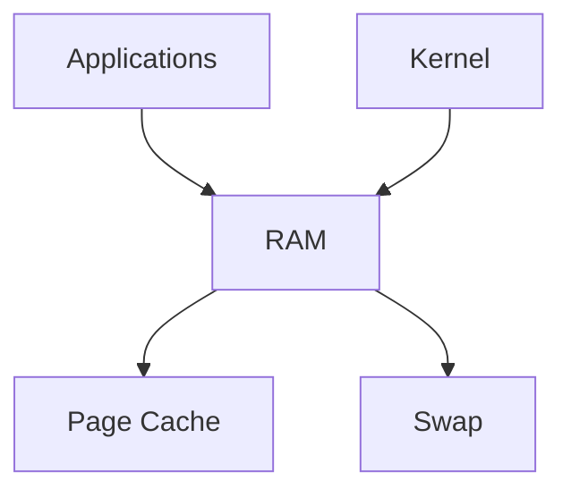

When all available memory disappears:

```text
OOM Event
```

occurs.

---

# What Is An OOM Event?

OOM:

```text
Out Of Memory
```

means:

```text
Kernel Cannot Satisfy
Memory Allocation Request
```

---

# OOM Killer Workflow

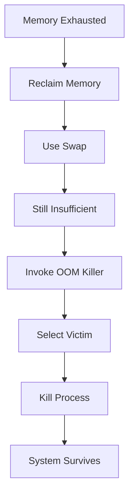

---

# The Golden Rule

Never ask:

```text
Why Did The Process Crash?
```

Ask:

```text
Did Linux Kill It?
```

Because many application crashes are not:

```text
Application Failures
```

but:

```text
Kernel Decisions
```

---

# Typical Symptoms

---

## Symptom 1

Application suddenly exits.

No warning.

---

## Symptom 2

Container restarts repeatedly.

---

## Symptom 3

Kubernetes pod shows:

```text
OOMKilled
```

---

## Symptom 4

Database disappears.

---

## Symptom 5

JVM terminates.

---

## Symptom 6

System logs show:

```text
Killed process
```

---

# How Linux Detects OOM

Kernel tracks:

```text
Free Memory

Available Memory

Swap Availability

Allocation Requests
```

---

# Simplified Decision Process

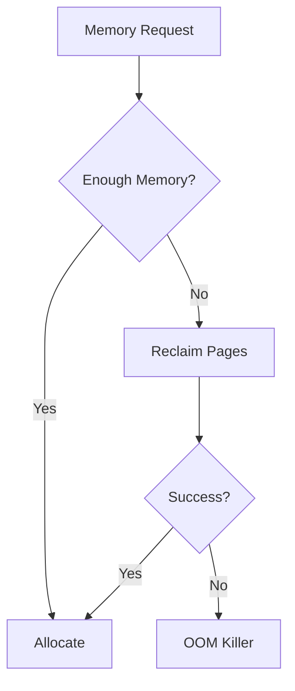

---

# Where To Investigate First

Most important command:

```bash
dmesg -T | grep -i kill
```

or:

```bash
journalctl -k
```

Typical output:

```text
Out of memory:
Killed process 14562 (java)
```

This is usually the smoking gun.

---

# Understanding OOM Score

Linux assigns:

```text
OOM Score
```

to processes.

Higher score:

```text
More Likely To Die
```

---

# OOM Selection Process

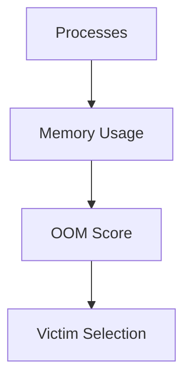

---

# Check OOM Score

Current process:

```bash
cat /proc/self/oom_score
```

Specific process:

```bash
cat /proc/PID/oom_score
```

---

# OOM Score Adjustment

Linux supports:

```text
oom_score_adj
```

Range:

```text
-1000 to 1000
```

---

# Meaning

```text
-1000
Almost Never Kill

0
Default

1000
Kill First
```

---

# Example

Critical database:

```bash
echo -1000 > /proc/PID/oom_score_adj
```

---

# Cause 1: Memory Leak

Most common cause.

Application continuously allocates:

```text
Memory
Memory
Memory
Memory
```

Never releases it.

---

# Leak Lifecycle

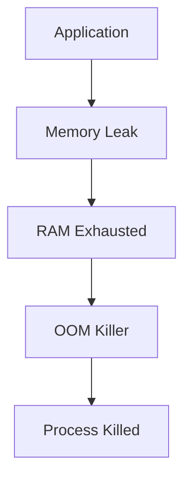

---

# Cause 2: Container Memory Limits

Very common.

Container limit:

```text
512 MB
```

Application uses:

```text
700 MB
```

Result:

```text
OOM Kill
```

even if host still has free RAM.

---

# Container Memory Architecture

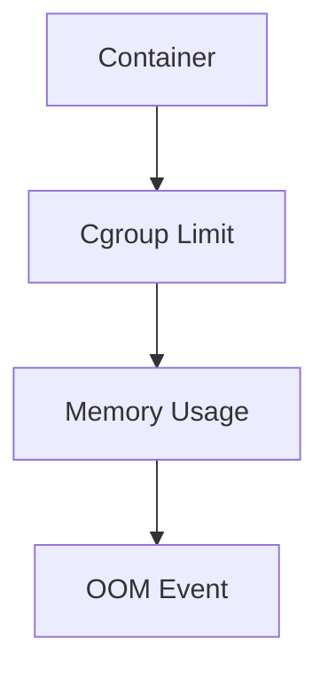

---

# Cause 3: JVM Misconfiguration

Common production incident.

Example:

```text
Server RAM = 8 GB

JVM Heap = 8 GB
```

No room for:

```text
Kernel

Buffers

Native Memory

Cache
```

OOM follows.

---

# JVM Memory Model

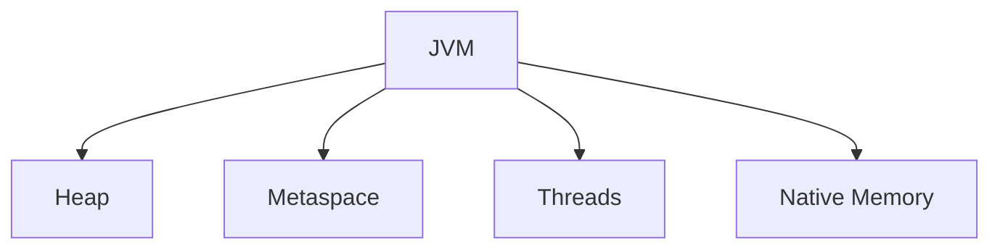

---

# Cause 4: Database Memory Misconfiguration

Examples:

```text
PostgreSQL

MySQL

MongoDB

Elasticsearch
```

Poor tuning can consume all memory.

---

# Database Memory Pressure

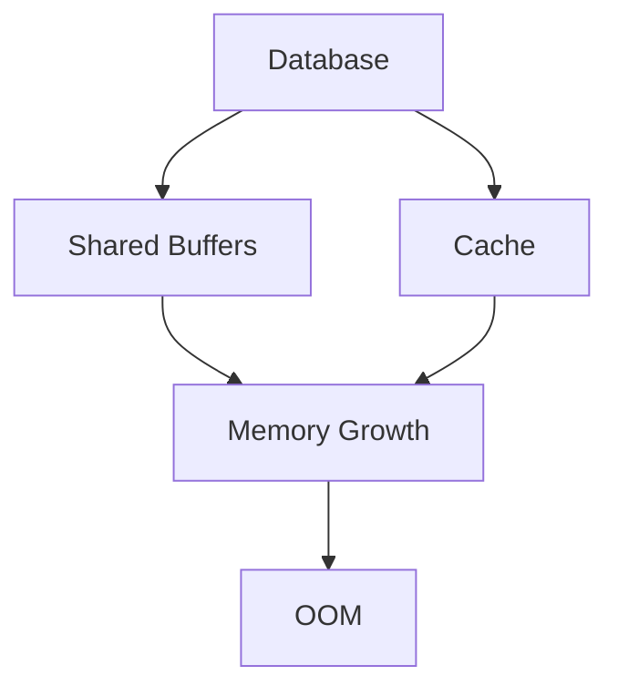

---

# Cause 5: Fork Bomb

Classic Linux disaster.

Example:

```bash
:(){ :|:& };:
```

Creates:

```text
Infinite Processes
```

Memory exhausted rapidly.

---

# Cause 6: Kubernetes Workload Explosion

Cluster scaling event:

```text
More Pods

More Containers

More Memory Usage
```

than node capacity.

---

# Kubernetes Memory Path

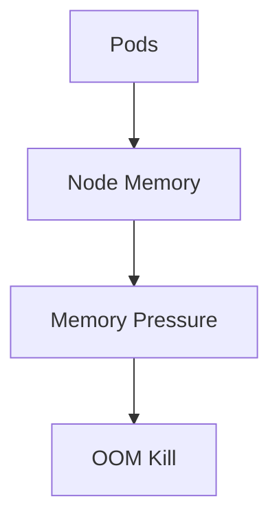

---

# Container OOM vs System OOM

Critical distinction.

---

## Container OOM

Only container dies.

```text
Host Survives
```

---

## Host OOM

Entire system affected.

Potentially multiple processes killed.

---

# Comparison

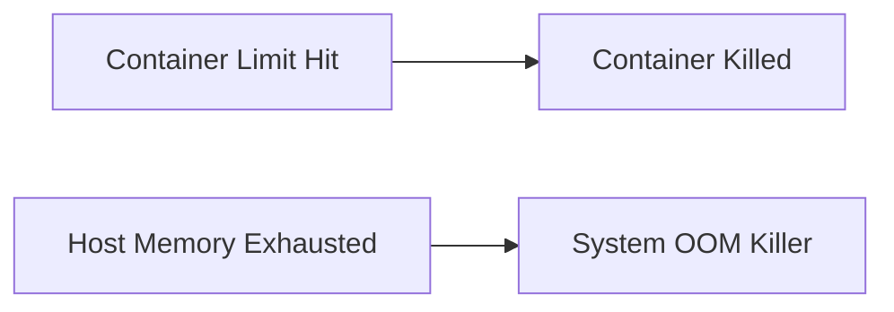

---

# Kubernetes OOMKilled

Most common symptom.

Check:

```bash
kubectl describe pod POD
```

Output:

```text
Reason: OOMKilled
```

Meaning:

```text
Container Exceeded Memory Limit
```

---

# Investigation Commands

```bash
kubectl top pod

kubectl describe pod

kubectl get events
```

---

# Linux Investigation Workflow

---

## Step 1

Check memory:

```bash
free -h
```

---

## Step 2

Check top consumers:

```bash
top

htop
```

---

## Step 3

Check OOM logs:

```bash
dmesg -T
```

---

## Step 4

Check swap:

```bash
swapon --show
```

---

## Step 5

Check pressure:

```bash
vmstat 1
```

---

# Understanding dmesg Output

Typical:

```text
Out of memory:
Killed process 4231 (java)
```

Interpretation:

```text
Kernel Chose Java Process
As Victim
```

---

# Relationship With Swap

OOM does not always mean:

```text
RAM = 100%
```

Sometimes:

```text
RAM Full

Swap Full
```

then:

```text
OOM Killer Activates
```

---

# Memory Pressure Timeline

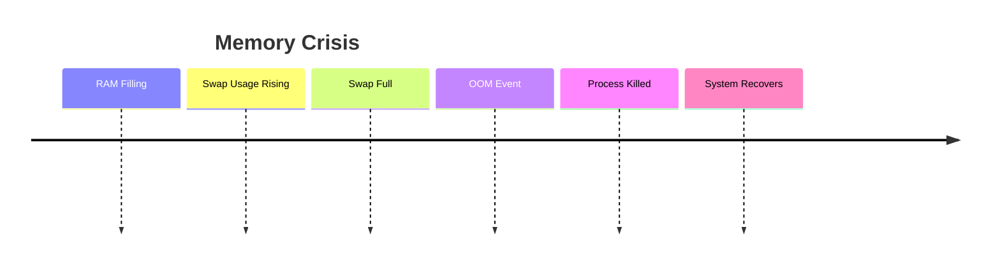

---

# Cloud Example

AWS EC2:

```text
8 GB RAM
```

Application:

```text
Consumes 11 GB
```

Result:

```text
OOM Kill
```

Symptoms:

```text
API Restarts

502 Errors

Dropped Connections
```

---

# Docker Example

Container repeatedly exits.

Check:

```bash
docker inspect CONTAINER
```

Result:

```text
OOMKilled=true
```

Root cause identified.

---

# Production Incident Example

## Incident

E-commerce API outage.

Symptoms:

```text
502 Errors

Random Restarts
```

Investigation:

```bash
docker inspect api-container
```

Output:

```text
OOMKilled=true
```

---

Further analysis:

```bash
top
```

showed:

```text
Node Process
Memory Leak
```

Fix:

```text
Patch Leak

Increase Memory Limit

Deploy Fix
```

---

# Linux Internals

OOM Killer lives inside:

```text
Linux Memory Management Subsystem
```

Kernel continuously evaluates:

```text
Memory Availability

Page Reclamation

Swap State

Allocation Requests
```

before deciding to kill.

---

# Why OOM Killer Exists

Without OOM Killer:

```text
Entire System Freezes
```

instead of:

```text
Single Process Dies
```

Kernel chooses:

```text
Controlled Failure
```

over:

```text
Total Failure
```

---

# Observability

Monitor:

```text
Memory Usage

Swap Usage

OOM Events

Container Restarts

Memory Pressure
```

Important metrics:

```text
node_memory_available

node_memory_active

container_memory_usage

oom_events_total
```

---

# Essential Commands

```bash
free -h

vmstat 1

top

htop

dmesg -T

journalctl -k

cat /proc/PID/oom_score

cat /proc/PID/oom_score_adj

swapon --show
```

Kubernetes:

```bash
kubectl top pod

kubectl describe pod

kubectl get events
```

Docker:

```bash
docker inspect CONTAINER
```

---

# Master Troubleshooting Workflow

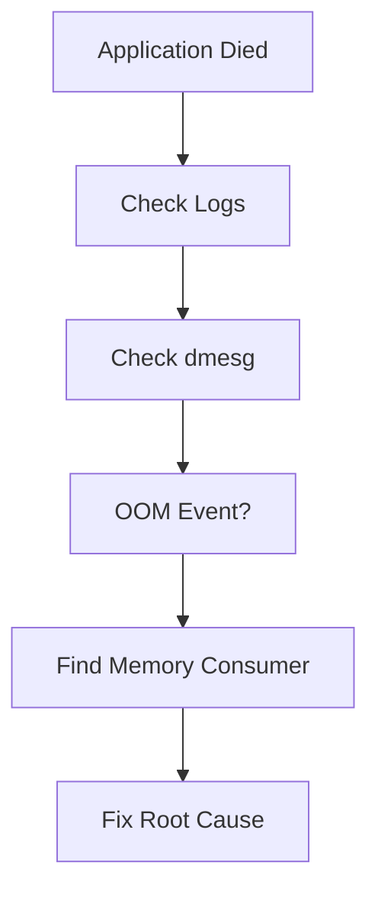

---

# Common Mistakes

## Mistake 1

Blaming application crash.

Sometimes Linux killed it.

---

## Mistake 2

Ignoring dmesg.

---

## Mistake 3

Only checking RAM.

Check swap too.

---

## Mistake 4

Giving containers unlimited memory.

---

## Mistake 5

Ignoring memory leaks.

---

## Mistake 6

Using JVM heap equal to system RAM.

---

# Engineering Mindset

Beginners think:

```text
Application Crashed
```

Engineers think:

```text
Memory Problem
```

Senior engineers think:

```text
Kernel Memory Decision
```

Elite Linux engineers think:

```text
Why Did The Kernel
Choose This Process
As The Victim?
```

Because OOM Killer incidents are not random.

They are:

```text
Kernel Survival Decisions
```

---

# Interview Questions

### What is OOM Killer?

Linux mechanism that kills processes when memory is exhausted.

---

### Why does Linux use OOM Killer?

To protect system stability.

---

### Where are OOM events logged?

```bash
dmesg

journalctl -k
```

---

### What is oom_score?

Probability of process being killed.

---

### What is oom_score_adj?

Adjustment value affecting victim selection.

---

### What causes OOMKilled in Kubernetes?

Container exceeded memory limit.

---

### Can swap prevent OOM?

Sometimes.

But swap exhaustion often precedes OOM.

---

# Cheat Sheet

```bash
# Memory
free -h

# Top Processes
top
htop

# OOM Logs
dmesg -T

journalctl -k

# OOM Score
cat /proc/PID/oom_score

# OOM Adjustment
cat /proc/PID/oom_score_adj

# Swap
swapon --show

# Pressure
vmstat 1
```

---

# Final Takeaway

OOM Killer is not:

```text
A Bug
```

It is:

```text
A Survival Mechanism
```

The most important lesson:

```text
Process Killed
≠
Application Failure
```

Sometimes:

```text
Process Killed
=
Kernel Saving The System
```

The best Linux, DevOps, SRE, Platform, and Cloud Engineers always ask:

```text
Did The Application Crash?

Or

Did Linux Execute It?
```

Because in many production incidents:

```text
The Kernel
Is The One
Pulling The Trigger.
```
