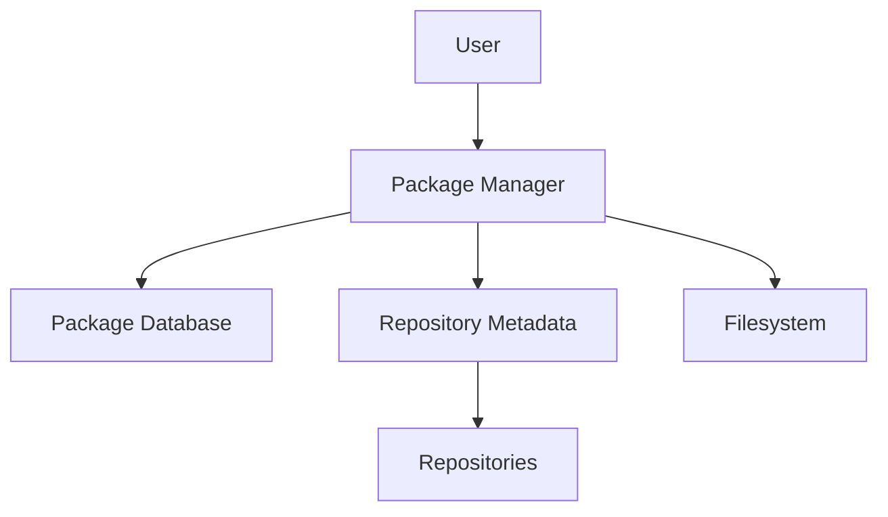
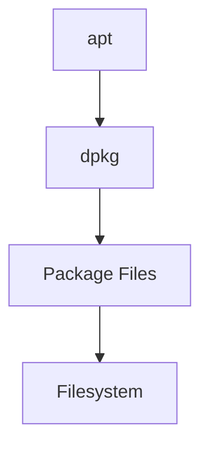
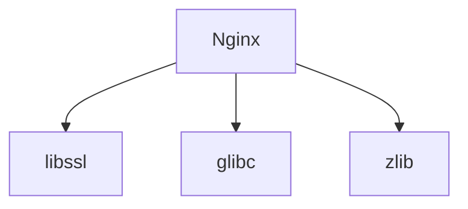
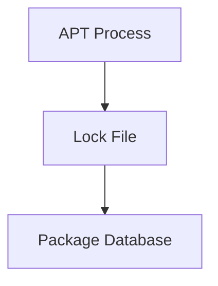
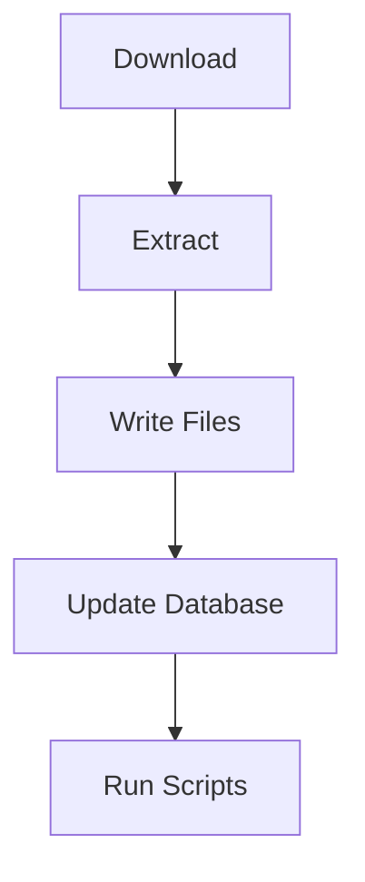
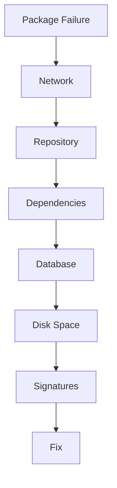

# Package Manager Failures Troubleshooting Guide

> One of the most common Linux administration incidents.
>
> The hidden dependency behind software installation, security patching, kernel upgrades, container image creation, and operating system maintenance.
>
> A topic that reveals how Linux distributions actually deliver software.

---

# Why This Exists

Modern Linux systems contain:

```text
Thousands Of Packages
```

A typical server may include:

```text
Kernel
OpenSSL
systemd
Python
Docker
Nginx
SSH
Monitoring Agents
```

Each package depends on:

```text
Other Packages
Libraries
Repositories
Cryptographic Signatures
Metadata
```

When package management fails:

```text
Cannot Install Software
Cannot Upgrade
Cannot Patch Security Vulnerabilities
Cannot Build Containers
Cannot Update Servers
```

The impact can be massive.

---

# Problem It Solves

Imagine a city.

```text
Buildings = Packages

Roads = Dependencies

City Registry = Package Database
```

When you want to build:

```text
New Building
```

the city must verify:

```text
Materials Available
Dependencies Available
Permits Valid
Registry Consistent
```

If any step fails:

```text
Construction Stops
```

Package managers solve this problem for Linux.

---

# Mental Model

Many beginners think:

```text
apt install nginx
```

simply downloads software.

Reality:

```text
Repositories
 ↓
Metadata
 ↓
Dependency Resolution
 ↓
Signature Verification
 ↓
Package Download
 ↓
Package Database Update
 ↓
Filesystem Changes
```

Package installation is actually a complex distributed system workflow.

---

# First Principles

Linux software is distributed as:

```text
Packages
```

Examples:

```text
.deb
.rpm
```

A package contains:

```text
Files
Metadata
Scripts
Dependencies
Version Information
```

The package manager ensures:

```text
Consistency
Repeatability
Integrity
```

---

# Package Management Architecture



---

# The Golden Rule

Never ask:

```text
Why Did apt Fail?
```

Ask:

```text
Which Layer Failed?
```

Possible layers:

```text
Network
DNS
Repository
Metadata
Dependencies
Disk
Database
Permissions
Cryptographic Verification
```

---

# Package Manager Ecosystem

Debian/Ubuntu:

```text
APT
DPKG
```

RedHat/CentOS/RHEL:

```text
YUM
DNF
RPM
```

SUSE:

```text
Zypper
```

Arch:

```text
Pacman
```

Understanding the architecture matters more than memorizing commands.

---

# Package Manager Stack



APT:

```text
Dependency Resolver
Repository Manager
```

DPKG:

```text
Package Installer
```

---

# Common Failure Categories

Most package failures fall into:

```text
Network
DNS
Repository
Dependency
Locking
Disk Space
Corruption
Signature
Version Conflict
```

---

# Failure 1: Repository Unreachable

Example:

```bash
apt update
```

Output:

```text
Failed to fetch
```

Meaning:

```text
Cannot Reach Repository
```

---

# Root Causes

```text
DNS Failure
Firewall
Proxy Issues
Repository Offline
Routing Problems
```

---

# Investigation

Check:

```bash
ping archive.ubuntu.com
```

Then:

```bash
dig archive.ubuntu.com
```

Then:

```bash
curl URL
```

---

# Failure 2: Dependency Hell

Example:

```text
Unmet dependencies
```

Meaning:

```text
Package Requires
Something Missing
```

---

# Dependency Visualization



Missing dependency:

```text
Installation Fails
```

---

# Common Causes

```text
Mixed Repositories
Manual Package Installation
Version Mismatch
Broken Upgrades
```

---

# Investigation

Debian:

```bash
apt --fix-broken install
```

Check:

```bash
apt-cache policy PACKAGE
```

---

# Failure 3: Package Database Locked

Example:

```text
Could not get lock
```

or

```text
dpkg frontend lock
```

Meaning:

```text
Another Package Operation Running
```

---

# Why Locks Exist

Package managers modify:

```text
Critical System State
```

Concurrent modifications could corrupt:

```text
Package Database
Filesystem
Dependencies
```

Locks prevent this.

---

# Investigation

Check:

```bash
ps aux | grep apt
```

or:

```bash
ps aux | grep dpkg
```

---

# Lock Architecture



Only one process may hold lock.

---

# Failure 4: Package Database Corruption

Example:

```text
dpkg database is corrupted
```

or

```text
rpmdb corrupted
```

---

# Why This Happens

Examples:

```text
Power Failure
Disk Failure
Interrupted Upgrade
Filesystem Corruption
```

---

# Linux Internals

Package databases are files.

Examples:

```text
/var/lib/dpkg
/var/lib/rpm
```

Corruption here affects:

```text
Entire Package System
```

---

# Recovery

Debian:

```bash
dpkg --configure -a
```

RPM:

```bash
rpm --rebuilddb
```

---

# Failure 5: Disk Full

Example:

```text
No space left on device
```

Very common.

---

# Investigation

```bash
df -h
```

Check:

```bash
df -i
```

for inode exhaustion.

---

# Package Installation Workflow



Disk exhaustion breaks workflow.

---

# Failure 6: Signature Verification Errors

Example:

```text
GPG error
```

or

```text
The following signatures couldn't be verified
```

---

# Why Signatures Matter

Without signatures:

```text
Attackers Could Replace Packages
```

Signatures provide:

```text
Authenticity
Integrity
Trust
```

---

# Trust Chain


---

# Root Causes

```text
Expired Keys
Missing Keys
Incorrect Repository
Corrupted Metadata
```

---

# Failure 7: Broken Upgrade

Example:

```text
Upgrade Interrupted
```

System left in:

```text
Half Installed State
```

---

# Symptoms

```text
Package Not Configured
Broken Dependencies
Boot Problems
Service Failures
```

---

# Investigation

```bash
dpkg --audit
```

or

```bash
rpm -Va
```

---

# Failure 8: Repository Metadata Problems

Example:

```text
Hash Sum Mismatch
```

Meaning:

```text
Repository Metadata
Does Not Match Packages
```

---

# Causes

```text
Mirror Synchronization Delay
Corruption
Proxy Cache Problems
```

---

# Fix

```bash
apt clean
apt update
```

---

# Failure 9: Version Conflicts

Example:

```text
Package A Requires Version 2

Version 3 Installed
```

Common when mixing:

```text
Stable
Testing
Experimental
Third-Party Repositories
```

---

# Production Example

Server:

```text
Ubuntu Production API
```

Security update fails.

Error:

```text
Unmet Dependencies
```

Investigation:

```bash
apt-cache policy
```

Found:

```text
Third-Party Repository
```

installed newer library version.

APT could not resolve dependencies.

Fix:

```text
Remove Repository
Downgrade Package
Reinstall Dependencies
```

---

# Docker Connection

Every Docker build relies on:

```Dockerfile
RUN apt update
RUN apt install
```

Package failures cause:

```text
Broken CI/CD
Failed Builds
Unreproducible Images
```

---

# Kubernetes Connection

Node upgrades depend on:

```text
Package Managers
```

Failures may cause:

```text
Node Drift
Security Patch Delays
Cluster Inconsistency
```

---

# Cloud Connection

Cloud images frequently experience:

```text
Repository Changes
Expired Keys
Mirror Issues
```

which can break:

```text
Automation Pipelines
```

---

# Security Considerations

Package managers are security-critical.

They manage:

```text
Kernel Updates
OpenSSL Updates
Security Patches
```

Failures can leave systems vulnerable.

---

# Performance Considerations

Large package operations may stress:

```text
Disk
CPU
Network
```

especially:

```text
Container Builds
Large Upgrades
```

---

# Observability

Monitor:

```text
Package Failures
Security Update Status
Repository Reachability
Disk Space
```

Useful logs:

```text
/var/log/apt/

/var/log/dpkg.log

/var/log/yum.log
```

---

# Essential Commands

Debian:

```bash
apt update

apt upgrade

apt --fix-broken install

dpkg --configure -a

dpkg -l

apt-cache policy PACKAGE

apt clean
```

RPM:

```bash
dnf update

rpm -qa

rpm -Va

rpm --rebuilddb
```

---

# Troubleshooting Workflow



---

# Common Mistakes

## Mistake 1

Deleting lock files immediately.

Always verify active package processes first.

---

## Mistake 2

Mixing repositories.

---

## Mistake 3

Ignoring GPG errors.

---

## Mistake 4

Interrupting upgrades.

---

## Mistake 5

Running out of disk space during upgrades.

---

## Mistake 6

Blindly copying internet fixes.

---

# Engineering Mindset

Beginners think:

```text
apt is broken
```

Engineers think:

```text
Which Package Layer Failed?
```

Elite engineers think:

```text
How Does Software
Move From Repository
To Running System
And Which Step Failed?
```

Because package management is fundamentally:

```text
Software Supply Chain Engineering
```

not merely:

```text
Software Installation
```

---

# Interview Questions

### Difference between apt and dpkg?

APT:

```text
Dependency Resolution
Repository Management
```

DPKG:

```text
Package Installation
```

---

### Why do package managers use locks?

Prevent database corruption.

---

### What causes dependency hell?

Conflicting package requirements.

---

### What causes GPG errors?

Missing or invalid repository signing keys.

---

### How do you fix broken packages?

```bash
apt --fix-broken install

dpkg --configure -a
```

---

### Where is Debian package metadata stored?

```text
/var/lib/dpkg
```

---

### What command rebuilds RPM database?

```bash
rpm --rebuilddb
```

---

# Cheat Sheet

```bash
# Update Metadata
apt update

# Upgrade Packages
apt upgrade

# Fix Broken Dependencies
apt --fix-broken install

# Configure Unfinished Packages
dpkg --configure -a

# Show Installed Packages
dpkg -l

# Package Policy
apt-cache policy PACKAGE

# RPM Verification
rpm -Va

# Rebuild RPM Database
rpm --rebuilddb

# Disk Space
df -h

# Inodes
df -i
```

---

# Final Takeaway

Package managers are not simply:

```text
Software Downloaders
```

They are:

```text
Dependency Resolvers
Trust Systems
Database Managers
Software Distribution Engines
```

The most important lesson:

```text
Package Manager Failure
≠
APT Problem
```

It is usually a failure in one of:

```text
Network
Repository
Metadata
Dependencies
Storage
Trust Chain
Package Database
```

The best Linux engineers troubleshoot package failures the same way they troubleshoot distributed systems:

```text
Understand The Entire Workflow
Find The Broken Layer
Fix The Root Cause
```

Because modern Linux infrastructure depends on reliable software supply chains, and package managers are the heart of that ecosystem.
