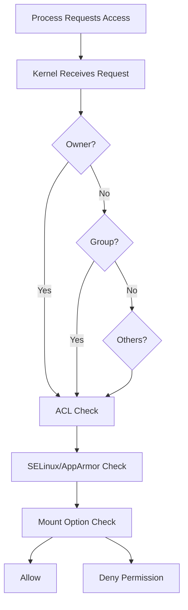
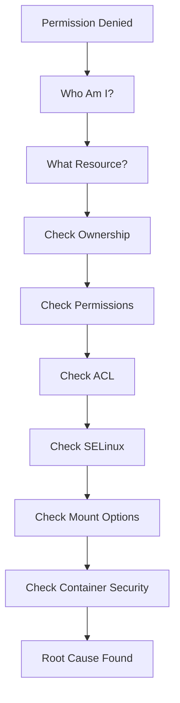

# Permission Denied Troubleshooting Guide

> One of the most common Linux errors.
>
> One of the most misunderstood Linux errors.
>
> One of the most dangerous errors when fixed incorrectly.

---

# Why This Exists

Linux is a multi-user operating system.

The entire security model depends on controlling:

* Who can access resources
* Who can modify resources
* Who can execute programs
* Who can administer systems

Whenever Linux cannot prove that a process has sufficient privileges to perform an operation, it returns:

```bash
Permission denied
```

This simple message can originate from:

* File permissions
* Directory permissions
* Ownership problems
* ACLs
* SELinux
* AppArmor
* Mount options
* Containers
* Capabilities
* Network permissions
* Systemd restrictions

Many engineers immediately run:

```bash
sudo
```

This often hides the real problem instead of solving it.

Understanding permission failures is a fundamental Linux engineering skill.

---

# Problem It Solves

Without permissions:

```text
Any user
    ↓
Can read anything
Can modify anything
Can delete anything
Can execute anything
```

Result:

```text
Security Disaster
```

Permissions provide isolation.

```text
User A
   │
   ├── Own Files
   │
User B
   │
   ├── Own Files
   │
System
   │
   ├── Critical Files
```

Permission denied is Linux protecting something.

The question is:

```text
What exactly is Linux protecting?
```

---

# Mental Model

Think of Linux like a secure office building.

```text
Building
   │
   ├── Front Door
   ├── Rooms
   ├── Cabinets
   ├── Safes
```

Every object has rules.

```text
Can Enter?
Can Read?
Can Modify?
Can Execute?
```

Permission denied means:

```text
You reached a locked door.
```

The challenge is finding:

```text
Which door?
```

---

# First Principles

Every action in Linux becomes a system call.

Example:

```bash
cat file.txt
```

Internally:

```text
cat
 ↓
open()
 ↓
kernel permission checks
 ↓
allowed?
 ↓
yes/no
```

Kernel is the final authority.

Applications do not decide.

The kernel decides.

---

# Permission Decision Flow



---

# Understanding Linux Permissions

Check permissions:

```bash
ls -l
```

Example:

```bash
-rwxr-x---
```

Breakdown:

```text
-
rwx
r-x
---
```

Meaning:

```text
Owner = rwx
Group = r-x
Others = ---
```

---

# Permission Bits

## Read

```text
r
```

Files:

```text
Read contents
```

Directories:

```text
List files
```

---

## Write

```text
w
```

Files:

```text
Modify file
```

Directories:

```text
Create/Delete files
```

---

## Execute

```text
x
```

Files:

```text
Run program
```

Directories:

```text
Enter directory
```

---

# Directory Permissions Explained

Most permission issues are directory issues.

Example:

```bash
chmod 644 script.sh
```

Still fails:

```bash
Permission denied
```

Why?

Parent directory lacks execute permission.

Example:

```text
/home/app
      ↓
      x missing
```

Kernel cannot traverse path.

---

# Visualizing Path Traversal

```text
/home/user/project/file.txt

Need:

x on /
x on /home
x on /home/user
x on /home/user/project

Then:

r on file.txt
```

Missing one execute bit:

```text
Access denied
```

---

# Common Root Causes

## Case 1: Script Not Executable

Error:

```bash
./script.sh
Permission denied
```

Check:

```bash
ls -l script.sh
```

Fix:

```bash
chmod +x script.sh
```

---

## Case 2: Wrong Ownership

Check:

```bash
ls -l
```

Example:

```text
root root
```

Current user:

```text
developer
```

Fix:

```bash
sudo chown developer:developer file.txt
```

---

## Case 3: Directory Traversal Blocked

Check:

```bash
namei -l file.txt
```

Example:

```text
drwx------
```

on parent directory.

Fix parent permissions.

---

## Case 4: Mount Option Noexec

Check:

```bash
mount
```

Example:

```text
noexec
```

Meaning:

```text
Files cannot execute
```

Even with:

```bash
chmod +x
```

Execution fails.

---

# Linux Internals

When process opens a file:

```text
open()
```

Kernel performs:

```text
Credential Lookup
      ↓
UID
GID
Supplementary Groups
      ↓
Permission Evaluation
      ↓
ACL Evaluation
      ↓
LSM Checks
      ↓
Result
```

---

# ACLs (Access Control Lists)

Traditional permissions:

```text
Owner
Group
Others
```

ACLs add:

```text
Specific users
Specific groups
```

View:

```bash
getfacl file.txt
```

Example:

```bash
user:john:rwx
```

Set:

```bash
setfacl -m u:john:rwx file.txt
```

---

# SELinux Permission Denied

Permissions may look correct:

```bash
777
```

Still denied.

Why?

SELinux.

Check:

```bash
getenforce
```

Logs:

```bash
ausearch -m avc
```

or

```bash
journalctl -xe
```

---

# AppArmor Permission Denied

Check:

```bash
aa-status
```

Application may be confined.

Common in:

```text
Ubuntu
Containers
Security Appliances
```

---

# Container Permission Problems

Docker introduces additional layers.

```text
Host Permissions
       +
Container User
       +
Volume Mount Permissions
```

Example:

```bash
docker run
```

Container user:

```text
uid 1000
```

Host directory:

```text
owned by root
```

Result:

```text
Permission denied
```

---

# Kubernetes Permission Issues

Common causes:

```text
runAsUser mismatch
fsGroup missing
readOnly filesystem
volume permissions
```

Check:

```bash
kubectl describe pod
```

---

# Production Incident Example

## Incident

Application suddenly cannot write logs.

Error:

```text
Permission denied
```

Engineer assumes:

```text
Disk Full
```

Wrong.

Investigation:

```bash
ls -ld /var/log/app
```

Output:

```text
root root
```

Deployment recreated directory.

Application user:

```text
appuser
```

Ownership mismatch.

Fix:

```bash
chown appuser:appuser
```

Service restored.

---

# Systematic Troubleshooting Workflow



---

# Investigation Commands

Identify user:

```bash
id
```

File ownership:

```bash
ls -l
```

Directory permissions:

```bash
ls -ld directory
```

ACLs:

```bash
getfacl file
```

SELinux:

```bash
ls -Z
```

Mount options:

```bash
mount | grep noexec
```

Path traversal:

```bash
namei -l file
```

Open files:

```bash
lsof
```

---

# Performance Considerations

Permission checks occur for every access.

Kernel optimizes through:

```text
VFS
Dentry Cache
Inode Cache
Credential Cache
```

Large ACL structures increase overhead.

Usually negligible.

At hyperscale:

```text
Millions of permission checks/sec
```

become measurable.

---

# Security Considerations

Never solve permissions with:

```bash
chmod 777
```

This is a red flag.

Bad:

```bash
chmod -R 777 /
```

Catastrophic.

Follow least privilege:

```text
Only required permissions
Only required users
Only required groups
```

---

# Observability

Useful logs:

```bash
journalctl -xe
```

Audit:

```bash
auditd
```

SELinux:

```bash
ausearch -m avc
```

Systemd:

```bash
journalctl -u service
```

---

# Common Mistakes

## Mistake 1

Using sudo everywhere.

---

## Mistake 2

Ignoring parent directories.

---

## Mistake 3

Ignoring SELinux.

---

## Mistake 4

Using chmod 777.

---

## Mistake 5

Ignoring container user IDs.

---

## Mistake 6

Changing permissions instead of ownership.

---

# Engineering Mindset

When you see:

```text
Permission denied
```

Never think:

```text
How do I bypass this?
```

Think:

```text
What security rule is being enforced?
```

Professional Linux engineers investigate.

Beginners bypass.

Production systems reward investigation.

---

# Interview Questions

### Why can a file with 777 still fail?

Possible reasons:

* SELinux
* AppArmor
* noexec mount
* Filesystem restrictions

---

### Why is execute permission required on directories?

To traverse the path.

---

### Difference between file execute and directory execute?

File:

```text
Run program
```

Directory:

```text
Enter directory
```

---

### What command helps identify path traversal permission issues?

```bash
namei -l
```

---

### How does Linux evaluate permissions?

```text
Owner
Group
Others
ACL
Security Modules
Mount Rules
```

---

# Cheat Sheet

```bash
# Current identity
id

# Permissions
ls -l

# Directory permissions
ls -ld dir

# Ownership
chown user:group file

# Permissions
chmod 755 file

# ACL
getfacl file
setfacl -m u:user:rwx file

# SELinux
getenforce
ls -Z

# Path traversal
namei -l file

# Mount options
mount

# Logs
journalctl -xe

# Service logs
journalctl -u service

# Audit logs
ausearch -m avc
```

---

# Final Takeaway

A "Permission Denied" error is not a problem.

It is evidence that Linux security is working.

The engineering challenge is discovering which layer denied access:

```text
Permissions
Ownership
ACLs
SELinux
AppArmor
Mounts
Containers
Systemd
```

Master this workflow, and you can troubleshoot permission issues from laptops to Kubernetes clusters to hyperscale production systems.
