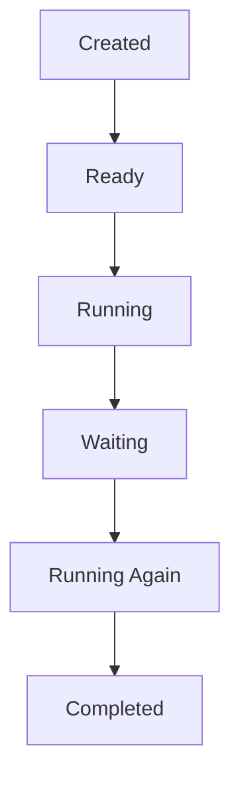
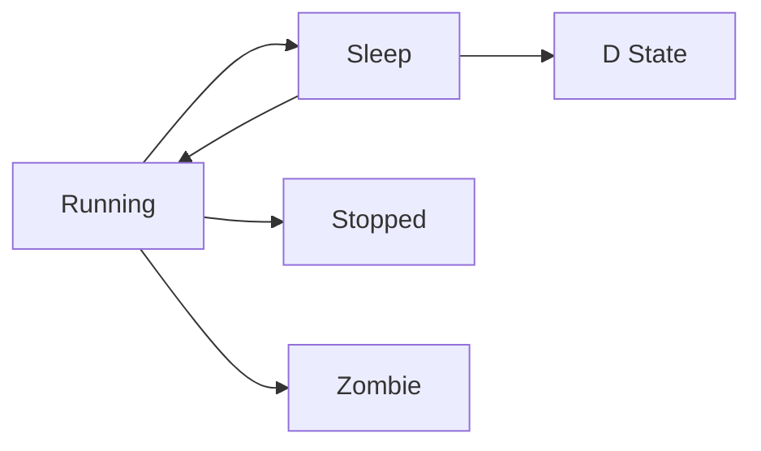
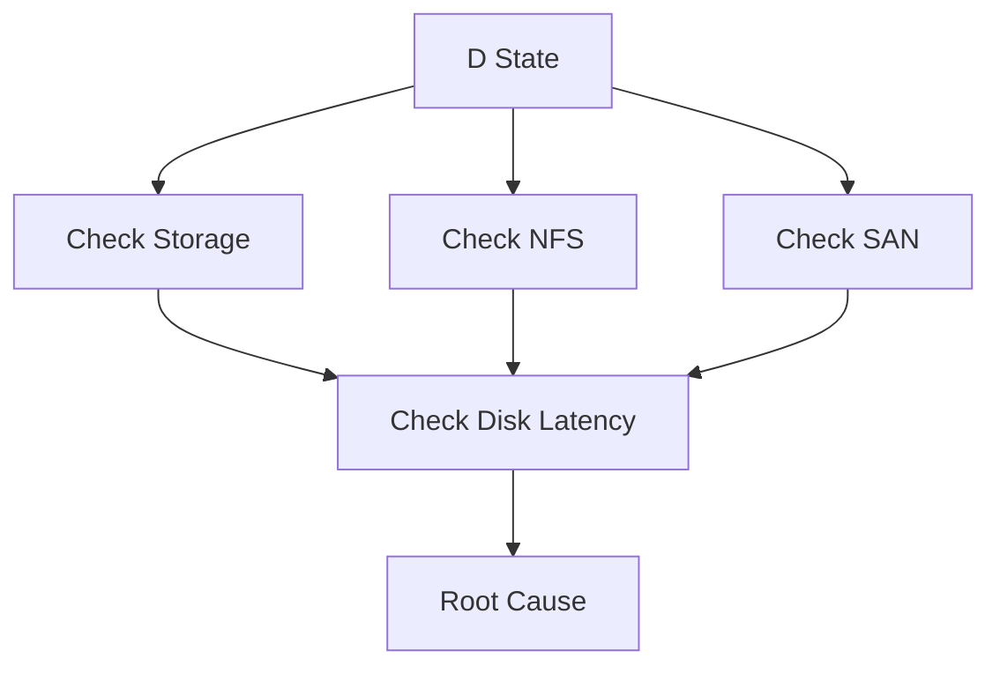
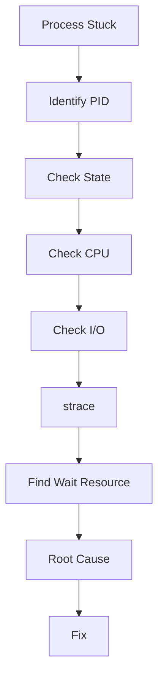

# Process Stuck Troubleshooting Guide

> One of the most frustrating Linux production incidents.
>
> The process exists.
>
> The process consumes resources.
>
> The process refuses to make progress.
>
> The application appears alive but behaves as if it is dead.

---

# Why This Exists

Not all failures are crashes.

Sometimes a process:

```text
Does Not Exit
Does Not Respond
Does Not Complete Work
Does Not Process Requests
```

Yet:

```text
PID Exists
Memory Exists
CPU Exists
```

Linux reports:

```text
Process Running
```

Users report:

```text
Application Down
```

This is one of the hardest classes of production incidents because:

```text
The Process Is Alive
But The Work Is Dead
```

Understanding stuck processes teaches engineers:

```text
Linux Scheduling
Process States
Kernel Waiting
Deadlocks
Locks
I/O Bottlenecks
Signals
System Calls
```

---

# Problem It Solves

Imagine a factory worker.

Normal worker:

```text
Receive Task
Do Task
Complete Task
Receive Next Task
```

Stuck worker:

```text
Receive Task
Wait Forever
```

The worker exists.

The worker occupies space.

The worker blocks others.

The factory slows down.

This is exactly what a stuck process does.

---

# Mental Model

A process can fail in three ways:

```text
Crash
Slow Down
Get Stuck
```

Crash:

```text
Process Gone
```

Slow:

```text
Process Making Progress
```

Stuck:

```text
Process Not Making Progress
```

A stuck process is usually:

```text
Waiting Forever
```

for something.

The entire troubleshooting process becomes:

```text
What Is It Waiting For?
```

---

# First Principles

Processes execute instructions.

Normally:

```text
CPU
 ↓
Work
 ↓
More Work
 ↓
Completion
```

A stuck process enters:

```text
Wait State
```

and never leaves.

This wait can be caused by:

```text
Disk
Network
Locks
Kernel Resources
Deadlocks
External Systems
```

---

# What Is A Stuck Process?

A stuck process is:

```text
Alive
But Not Progressing
```

Examples:

```text
Database Query Never Finishes

API Request Never Returns

Container Never Stops

Application Never Starts

Backup Never Completes
```

---

# Process Lifecycle



Healthy processes move.

Stuck processes remain:

```text
Waiting
```

for extremely long periods.

---

# Golden Rule

Do not ask:

```text
How Do I Kill It?
```

Ask:

```text
Why Is It Stuck?
```

Killing without understanding:

```text
Destroys Evidence
Hides Root Cause
Causes Recurrence
```

---

# First Investigation

Identify process:

```bash
ps aux
```

or:

```bash
top
```

Find:

```text
PID
CPU
Memory
State
```

---

# Process States Matter

Check:

```bash
ps aux
```

Example:

```text
R
S
D
T
Z
```

These letters tell the story.

---

# Understanding Process States

---

# R State

Running

```text
Actively Using CPU
```

Not stuck.

May simply be busy.

---

# S State

Interruptible Sleep

```text
Waiting
```

Can wake up normally.

Usually healthy.

---

# D State

Uninterruptible Sleep

Most important state.

```text
Waiting Inside Kernel
```

Often:

```text
Disk I/O
NFS
Storage
Block Device
```

Very common production issue.

---

# T State

Stopped

Usually:

```text
Debugger
SIGSTOP
Tracing
```

---

# Z State

Zombie

Process completed.

Parent never collected exit status.

---

# Process State Visualization



---

# The Most Important Question

What Is The Process Waiting For?

Not:

```text
What Is The Process Doing?
```

but:

```text
What Is Preventing Progress?
```

---

# Common Root Causes

---

# Cause 1: Disk I/O Wait

Most common.

Process waits:

```text
Read Disk
Write Disk
Flush Data
```

Storage slow.

Application freezes.

Check:

```bash
iostat -x 1
```

Look for:

```text
100% Utilization
High Await
```

---

# Cause 2: NFS Mount Hang

Example:

```text
Remote Storage Server Down
```

Application accesses:

```text
/mnt/shared
```

Kernel waits forever.

Process enters:

```text
D State
```

---

# Cause 3: Database Lock

Query waits:

```text
Lock
```

held by another transaction.

Example:

```sql
UPDATE users
```

waiting indefinitely.

Application appears frozen.

---

# Cause 4: Deadlock

Two processes:

```text
Process A
Needs Lock B

Process B
Needs Lock A
```

Neither can proceed.

---

# Deadlock Visualization


Infinite wait.

---

# Cause 5: Network Timeout

Application waiting:

```text
Remote API
Database
DNS
Service
```

Remote system never responds.

Process appears stuck.

---

# Cause 6: Full Pipe

Producer:

```text
Writes Data
```

Consumer:

```text
Stopped Reading
```

Buffer fills.

Producer blocks.

---

# Cause 7: Mutex Contention

Multithreaded applications:

```text
Java
Go
Python
PostgreSQL
MySQL
```

can block on locks.

Threads stop progressing.

---

# Cause 8: Container Runtime Issues

Docker:

```text
Container Stuck Stopping
```

Often caused by:

```text
Filesystem Wait
OverlayFS Problems
Storage Issues
```

---

# Linux Internals

Every process ultimately interacts with the kernel using:

```text
System Calls
```

Examples:

```text
read()
write()
open()
connect()
accept()
```

If system call blocks:

```text
Process Waits
```

---

# System Call Flow


Resource unavailable:

```text
Process Stuck
```

---

# The Most Powerful Tool: strace

Attach:

```bash
strace -p PID
```

Example:

```bash
strace -p 1234
```

Shows:

```text
Current System Call
```

Example:

```text
read(...)
```

Process waiting on read.

---

# Example strace Analysis

Output:

```text
futex(...)
```

Meaning:

```text
Thread Synchronization
```

Likely:

```text
Lock Contention
Deadlock
```

---

Output:

```text
connect(...)
```

Meaning:

```text
Waiting On Network
```

---

Output:

```text
read(...)
```

Meaning:

```text
Waiting On Data
```

---

# Process Tree Analysis

Check:

```bash
pstree -p
```

Useful for:

```text
Parent Processes
Child Processes
Orphaned Tasks
```

---

# File Descriptor Analysis

Check:

```bash
lsof -p PID
```

Find:

```text
Files
Sockets
Pipes
Network Connections
```

Often reveals blocking resources.

---

# Thread Analysis

Multithreaded process:

```bash
top -H -p PID
```

Shows:

```text
Individual Threads
```

One thread may be blocked.

Others waiting.

---

# Kernel Wait Analysis

Check:

```bash
cat /proc/PID/stack
```

Shows:

```text
Kernel Call Stack
```

Useful for D-state investigations.

---

# D-State Investigation Workflow



---

# Production Incident Example

## Incident

Java service:

```text
Healthy
```

according to:

```bash
systemctl status
```

But:

```text
No Requests Complete
```

CPU:

```text
0%
```

Memory:

```text
Normal
```

Investigation:

```bash
strace -p PID
```

Output:

```text
futex(...)
```

Thread dump:

```text
Deadlock
```

Two worker threads waiting forever.

Root cause:

```text
Incorrect Lock Ordering
```

Fix:

```text
Application Patch
```

---

# Database Example

Application:

```text
Frozen
```

Investigation:

```sql
SHOW PROCESSLIST;
```

Result:

```text
Waiting For Lock
```

Root cause:

```text
Long Transaction
```

holding table lock.

---

# Docker Example

Container:

```bash
docker stop
```

never finishes.

Investigation:

```bash
strace
```

Process:

```text
Waiting On Storage
```

Root cause:

```text
Dead NFS Mount
```

---

# Kubernetes Example

Pod:

```text
Running
```

but:

```text
Not Serving Requests
```

Check:

```bash
kubectl exec
```

then:

```bash
strace
```

Found:

```text
DNS Resolution Wait
```

Root cause:

```text
CoreDNS Failure
```

---

# Performance Implications

Stuck processes create:

```text
Queue Growth
Resource Contention
Thread Exhaustion
Connection Exhaustion
Latency
Timeouts
```

Entire systems can appear slow.

---

# Security Implications

Attackers can intentionally create:

```text
Lock Contention
Connection Exhaustion
Resource Starvation
```

causing applications to hang.

---

# Observability

Monitor:

```text
Process States
Blocked Tasks
Thread Counts
Response Time
Queue Length
```

Tools:

```text
Prometheus
Grafana
Datadog
Elastic
```

---

# Advanced Commands

```bash
top

htop

ps aux

pstree

strace -p PID

lsof -p PID

cat /proc/PID/stack

cat /proc/PID/status

vmstat 1

iostat -x 1
```

---

# Troubleshooting Workflow



---

# Common Mistakes

## Mistake 1

Immediately killing process.

---

## Mistake 2

Ignoring process state.

---

## Mistake 3

Ignoring D-state tasks.

---

## Mistake 4

Not using strace.

---

## Mistake 5

Assuming low CPU means healthy.

---

## Mistake 6

Treating symptoms instead of blocked resources.

---

# Engineering Mindset

Beginners ask:

```text
Why Is The Process Alive?
```

Engineers ask:

```text
Why Is The Process Not Progressing?
```

Elite Linux engineers ask:

```text
What Resource
Is This Process Waiting For
And Why Is That Resource Unavailable?
```

Because a stuck process is rarely the root cause.

It is usually:

```text
Evidence
```

of a deeper bottleneck.

---

# Interview Questions

### What is D-state?

Uninterruptible sleep.

Usually waiting on kernel resources.

---

### What tool shows current system calls?

```bash
strace -p PID
```

---

### Why is strace valuable?

Shows exactly what a process is waiting on.

---

### Difference between hung and crashed?

Hung:

```text
Alive
```

Crashed:

```text
Gone
```

---

### How do you identify lock contention?

```text
futex()
```

calls,
thread dumps,
database lock analysis.

---

### What command shows open files?

```bash
lsof -p PID
```

---

# Cheat Sheet

```bash
# Process State
ps aux

# Process Tree
pstree -p

# Thread Analysis
top -H -p PID

# System Calls
strace -p PID

# Open Files
lsof -p PID

# Kernel Stack
cat /proc/PID/stack

# Disk Analysis
iostat -x 1

# Scheduler Metrics
vmstat 1

# Memory
cat /proc/PID/status
```

---

# Final Takeaway

A stuck process is almost never "doing nothing."

It is usually:

```text
Waiting
```

for something.

The core troubleshooting question is:

```text
What Resource
Is Preventing Progress?
```

That resource may be:

```text
Disk
Network
Database Lock
Mutex
Filesystem
Kernel Resource
Remote Service
```

The engineers who master stuck-process analysis gain deep insight into:

```text
Linux Internals
Kernel Behavior
Performance Engineering
Distributed Systems
Production Troubleshooting
```

because every distributed system eventually becomes:

```text
A Process Waiting For Something
```

and Linux gives you the tools to discover exactly what that something is.
