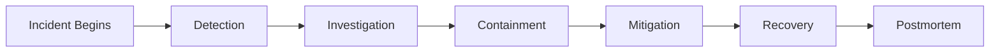
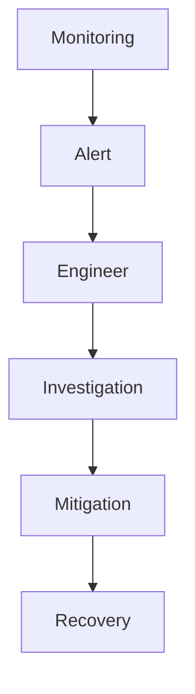
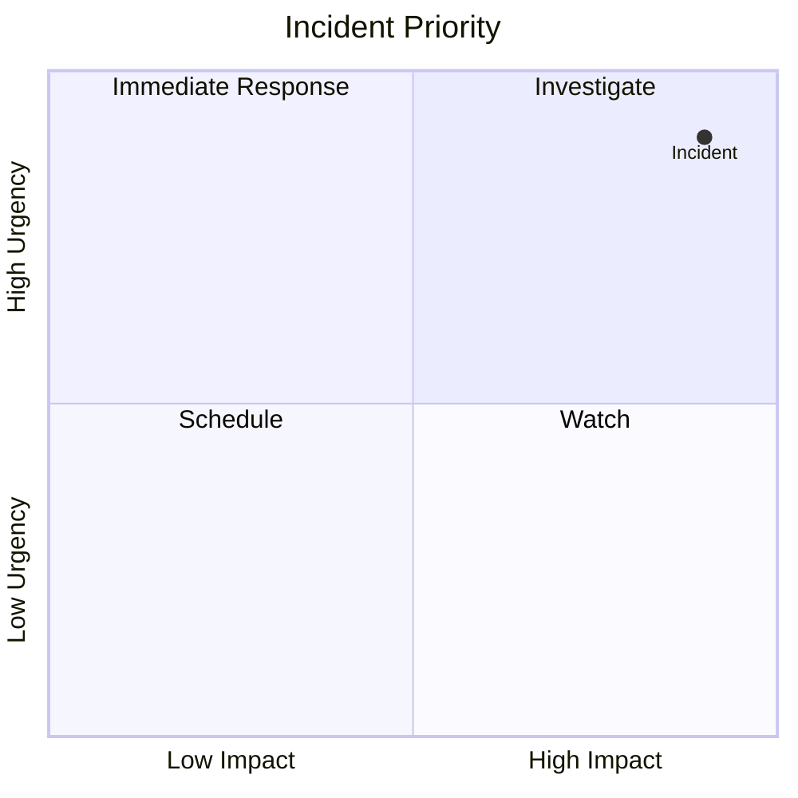
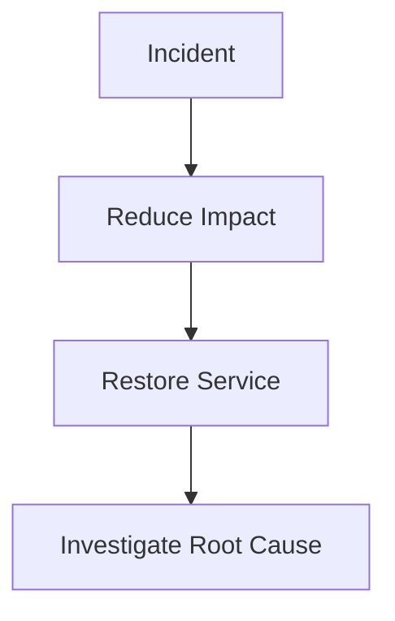
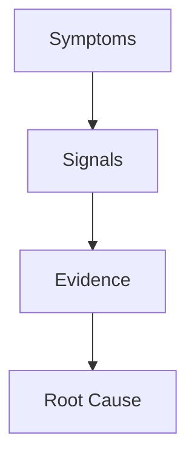
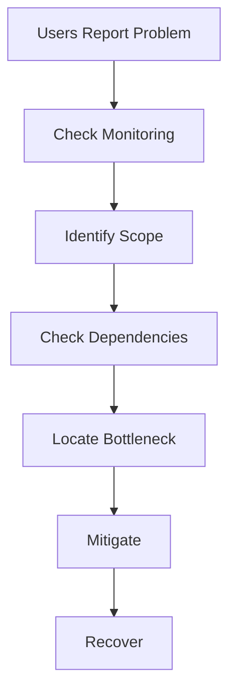
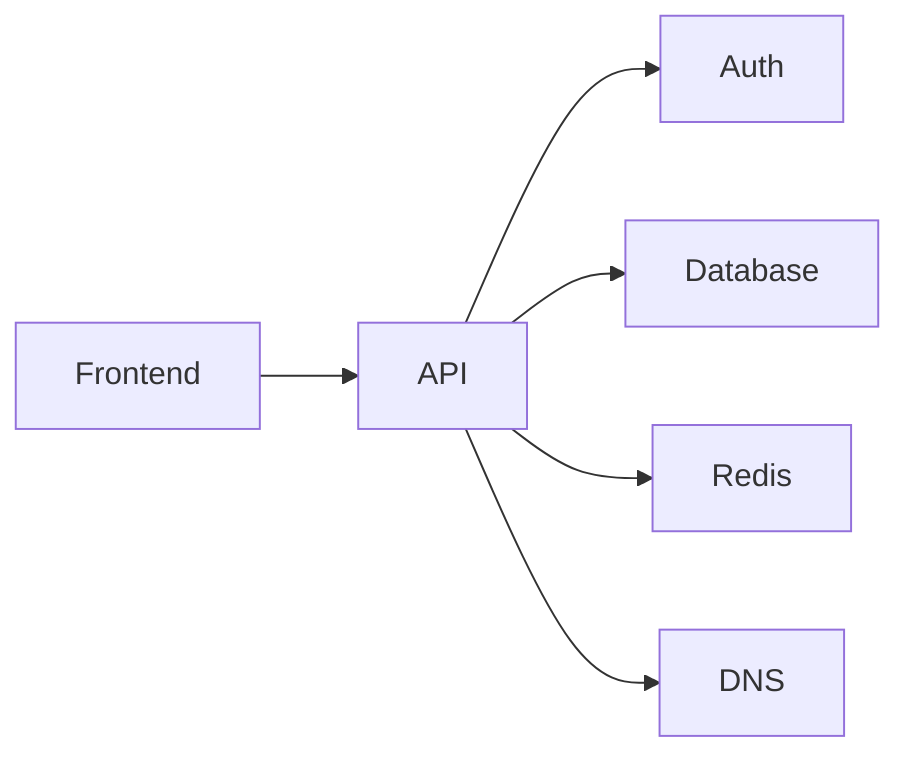
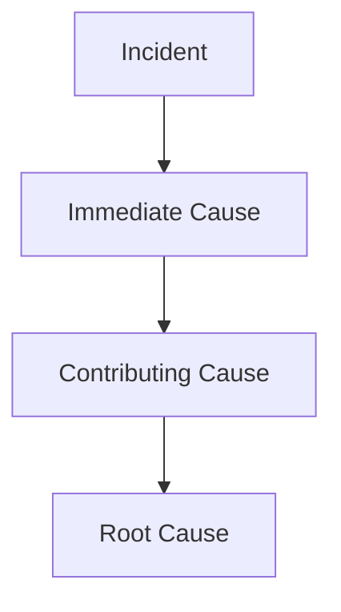
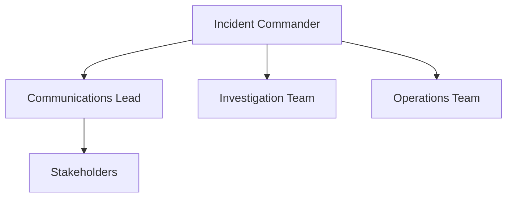

# Production Incident Playbook

> The ultimate troubleshooting guide.
>
> Not a guide about Linux.
>
> Not a guide about networking.
>
> Not a guide about databases.
>
> A guide about surviving production failures.
>
> The document every Linux Engineer, SRE, DevOps Engineer, Platform Engineer, Cloud Engineer, Backend Engineer, and Startup Founder should know by heart.

---

# Why This Exists

Technology is easy when everything works.

Engineering begins when everything breaks.

Most engineers learn:

```text
Linux Commands

Docker Commands

Kubernetes Commands

Database Commands
```

Very few learn:

```text
How To Respond
When Production Is On Fire
```

Real-world careers are often defined by:

```text
How You Handle Incidents
```

not by:

```text
How Much You Know
```

---

# The Reality Of Production

Production incidents do not arrive as:

```text
"Disk Full"
```

or

```text
"DNS Failure"
```

They arrive as:

```text
Customers Angry

Revenue Dropping

Alerts Firing

Executives Calling

Slack Exploding
```

while nobody knows what happened.

---

# The Most Important Lesson

Production incidents are:

```text
Information Problems
```

before they are:

```text
Technology Problems
```

Your first goal is:

```text
Understand Reality
```

not:

```text
Restart Things
```

---

# Mental Model

Most beginners think:

```text
Incident
=
Fix Problem
```

Wrong.

Production incident lifecycle:

```text
Detect

Understand

Contain

Mitigate

Recover

Learn
```

---

# Incident Lifecycle



---

# First Principles

Every production incident is fundamentally:

```text
Expected State

≠

Actual State
```

Example:

```text
Expected:
API latency < 100ms

Actual:
API latency 30s
```

Your job:

```text
Find Why Reality Changed
```

---

# The Golden Rules

---

## Rule 1

Do Not Panic

---

## Rule 2

Protect Production

---

## Rule 3

Preserve Evidence

---

## Rule 4

Change One Thing At A Time

---

## Rule 5

Measure Before Acting

---

## Rule 6

Communicate Continuously

---

# What Not To Do

Never:

```text
Randomly Restart Servers

Delete Logs

Apply Multiple Fixes

Guess Root Causes

Hide Information
```

---

# Incident Severity Levels

---

## SEV-1

Critical Outage

Examples:

```text
Revenue Impact

Entire Platform Down

Customer Data At Risk
```

---

## SEV-2

Major Degradation

Examples:

```text
Slow APIs

Partial Outages

Regional Failures
```

---

## SEV-3

Minor Service Impact

Examples:

```text
Single Feature Broken
```

---

## SEV-4

Low Priority

Examples:

```text
Non-Critical Issues
```

---

# Incident Response Architecture



---

# Phase 1: Detection

Question:

```text
How Did We Learn About The Incident?
```

Sources:

```text
Monitoring

Alerts

Customers

Logs

Support Tickets
```

---

# Example

Alert:

```text
API Error Rate > 30%
```

Incident begins.

---

# Phase 2: Triage

Goal:

```text
Understand Impact
```

Questions:

```text
Who Is Affected?

What Is Broken?

Since When?

How Severe?
```

---

# Triage Matrix



---

# Phase 3: Stabilization

Before root cause.

Focus:

```text
Stop The Bleeding
```

---

# Example

Database overloaded.

Instead of:

```text
Finding Perfect Fix
```

do:

```text
Scale Read Replicas

Reduce Traffic

Enable Cache
```

First restore service.

Then investigate.

---

# Emergency Mitigation Flow



---

# Phase 4: Investigation

Now gather evidence.

---

# Evidence Sources

```text
Metrics

Logs

Traces

Events

Kernel Logs

Cloud Events

Deployments
```

---

# Investigation Pyramid



---

# The Timeline Method

Create timeline:

```text
14:00 Deploy Started

14:02 Error Rate Increased

14:03 CPU Increased

14:05 Customers Reported Issues

14:07 Incident Declared
```

Timelines reveal causality.

---

# Production Troubleshooting Order

Always investigate:

```text
Network

Storage

Memory

CPU

Application

Dependencies
```

not:

```text
Application Only
```

---

# Universal Incident Flow



---

# The Dependency Graph Principle

Applications rarely fail alone.

Example:



A DNS failure can appear as:

```text
Frontend Outage
```

---

# Common Incident Categories

---

## Networking

Examples:

```text
Packet Loss

DNS Failure

Routing Problems

Firewall Issues
```

---

## Storage

Examples:

```text
Disk Full

Slow Disk

Filesystem Corruption
```

---

## Memory

Examples:

```text
OOM Killer

Swap Thrashing

Memory Leak
```

---

## CPU

Examples:

```text
Runaway Processes

Infinite Loops

Scheduler Pressure
```

---

## Application

Examples:

```text
Bad Deployment

Bug

Configuration Error
```

---

## Cloud

Examples:

```text
Security Groups

Load Balancers

IAM

Cloud Outages
```

---

# Production Investigation Checklist

---

## System Health

```bash
uptime

top

htop

free -h

vmstat 1
```

---

## Storage

```bash
df -h

iostat -x 1

iotop
```

---

## Networking

```bash
ss -tulpn

ping

mtr

tcpdump
```

---

## Processes

```bash
ps aux

pidstat
```

---

## Logs

```bash
journalctl -xe

dmesg -T
```

---

# Communication During Incidents

Engineering mistake:

```text
Fix First

Communicate Later
```

Wrong.

Communication must happen throughout.

---

# Incident Channel Structure

```text
Current Status

Impact

Mitigation

Next Update Time
```

---

# Example Update

```text
14:05 UTC

We are investigating elevated API errors.

Impact:
~40% requests failing.

Mitigation:
Traffic shifted to secondary region.

Next update:
15 minutes.
```

---

# Why Reboots Are Dangerous

A reboot:

```text
May Fix Problem

May Destroy Evidence
```

---

# Before Rebooting

Capture:

```bash
dmesg

journalctl

top

vmstat

iostat
```

---

# The Five Whys Method

Example:

```text
API Down

Why?
Database Connection Failed

Why?
Database Unavailable

Why?
Storage Full

Why?
Log Explosion

Why?
Infinite Retry Loop
```

Root cause found.

---

# Root Cause Analysis Tree



---

# Postmortem Philosophy

Goal:

```text
Learning
```

not:

```text
Blame
```

---

# Bad Postmortem

```text
Engineer Made Mistake
```

---

# Good Postmortem

```text
Why Did System Allow Mistake?
```

---

# Postmortem Structure

```text
Summary

Timeline

Impact

Root Cause

Contributing Factors

Resolution

Action Items
```

---

# Reliability Engineering Mindset

Beginners ask:

```text
What Broke?
```

Engineers ask:

```text
Why Did It Break?
```

Senior engineers ask:

```text
Why Was It Allowed To Break?
```

SREs ask:

```text
How Do We Prevent It Forever?
```

---

# Real Production Example

Incident:

```text
Website Down
```

Symptoms:

```text
502 Errors
```

Investigation:

```bash
systemctl status api
```

API healthy.

Check database:

```bash
systemctl status postgresql
```

Database healthy.

Check disk:

```bash
df -h
```

Result:

```text
100% Full
```

Root Cause:

```text
Log Explosion
```

Mitigation:

```text
Rotate Logs

Free Space
```

Recovery:

```text
Service Restored
```

Long-term Fix:

```text
Log Rotation Policy
```

---

# Production War Room Architecture



---

# Incident Command System

Large incidents require:

```text
Single Decision Maker
```

Avoid:

```text
10 Engineers
10 Different Plans
```

---

# Engineering Mindset

Production incidents are not:

```text
Technical Exams
```

They are:

```text
Information Gathering Exercises
```

The engineer who wins is usually not:

```text
The Smartest
```

but:

```text
The Most Systematic
```

---

# Master Incident Response Checklist

```text
[ ] Confirm Incident

[ ] Measure Impact

[ ] Create Timeline

[ ] Identify Scope

[ ] Protect Evidence

[ ] Mitigate Damage

[ ] Restore Service

[ ] Find Root Cause

[ ] Write Postmortem

[ ] Implement Prevention
```

---

# Interview Questions

### What is the first goal during an incident?

Restore service safely.

---

### What is triage?

Determining severity, impact, and scope.

---

### Why avoid immediate reboots?

They destroy evidence.

---

### What is mitigation?

Reducing impact before root cause is fixed.

---

### What is a postmortem?

Structured analysis after recovery.

---

### What is the purpose of an Incident Commander?

Coordinate response and decisions.

---

# Cheat Sheet

```bash
# System
uptime
top
free -h

# Storage
df -h
iostat -x

# Memory
vmstat 1

# Network
ss -tulpn
mtr HOST

# Logs
journalctl -xe
dmesg -T

# Processes
ps aux
pidstat
```

---

# Final Takeaway

Production engineering is not about:

```text
Knowing Commands
```

It is about:

```text
Making Correct Decisions
Under Pressure
```

The best engineers remember:

```text
Incidents Are Temporary

Evidence Is Permanent
```

and therefore:

```text
Observe First

Understand Second

Act Third
```

Because every production outage eventually becomes a story about:

```text
How Well Engineers
Understood Reality
Before They Changed It
```
