# Server Hangs Randomly Troubleshooting Guide

> One of the most frustrating and expensive production incidents.
>
> The symptom that causes engineers to say:
>
> ```text
> Everything looked fine...
> Then the server froze.
> ```
>
> A topic that teaches Linux internals, operating systems, performance engineering, storage systems, networking, memory management, kernel behavior, cloud infrastructure, and distributed systems troubleshooting.

---

# Why This Exists

Random server hangs are dangerous because:

```text
They Often Leave Very Few Clues
```

Unlike:

```text
Service Crashes

Kernel Panics

OOM Events
```

a hanging server may:

```text
Stay Online

Respond Slowly

Appear Alive

Stop Doing Useful Work
```

making diagnosis difficult.

---

# The Most Important Lesson

A server hang is NOT a root cause.

It is a symptom.

Think:

```text
Fever
```

A fever is not the disease.

It is evidence that:

```text
Something Else Is Wrong
```

Similarly:

```text
Server Hang
≠
Root Cause
```

---

# Problem It Solves

Imagine a factory.

Machines are still powered on.

Lights are still working.

Workers are still present.

But production stops.

The factory is technically:

```text
Alive
```

but practically:

```text
Dead
```

This is exactly what a hanging server looks like.

---

# Mental Model

Most engineers think:

```text
Server Hang
=
CPU Problem
```

Wrong.

A server can hang because:

```text
CPU
Memory
Disk
Network
Kernel
Hardware
Locks
Virtualization
Cloud Infrastructure
```

or combinations of them.

---

# First Principles

A healthy server continuously performs:

```text
Accept Work

Process Work

Complete Work
```

---

# Healthy Server Flow


---

# Hanging Server


Work stops flowing.

---

# The Golden Rule

Never ask:

```text
Why Did The Server Freeze?
```

Ask:

```text
What Resource
Stopped Progress?
```

---

# Common Categories

Most hangs belong to:

```text
CPU Starvation

Swap Thrashing

Disk IO Wait

Network Stalls

Kernel Deadlocks

Lock Contention

Hardware Failures

Virtualization Issues

Cloud Issues
```

---

# Server Hang Decision Tree

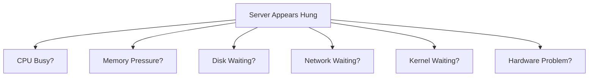

---

# Symptom Types

Not all hangs are equal.

---

## Type 1

### Complete Freeze

Nothing responds.

Examples:

```text
SSH Dead

Console Dead

Applications Dead
```

---

## Type 2

### Partial Freeze

Examples:

```text
SSH Works

Applications Frozen
```

---

## Type 3

### Intermittent Freeze

Examples:

```text
Server Freezes

Recovers

Freezes Again
```

---

## Type 4

### High Latency Freeze

Server technically works.

Response time:

```text
10 ms

→

30 seconds
```

Users perceive:

```text
Outage
```

---

# Cause 1: Swap Thrashing

Most common cause.

---

# What Happens

RAM exhausted.

Kernel starts moving pages:

```text
RAM → Swap

Swap → RAM

RAM → Swap

Swap → RAM
```

continuously.

---

# Thrashing Architecture

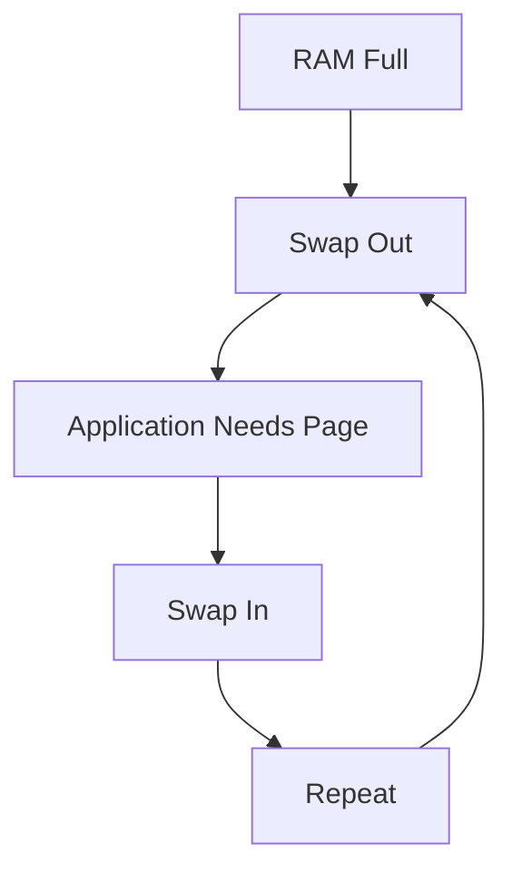

---

# Symptoms

```text
High Load Average

Low CPU Usage

Massive Disk Activity

Slow SSH
```

---

# Investigation

```bash
vmstat 1
```

Look for:

```text
si

so
```

high values.

---

# Cause 2: Disk I/O Stall

CPU waits.

Applications wait.

Entire system appears frozen.

---

# Storage Dependency

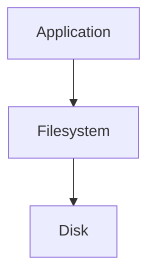

If storage stops:

```text
Everything Waits
```

---

# Investigation

```bash
iostat -x 1
```

Look for:

```text
await

util
```

---

# Warning Sign

```text
await = thousands ms
```

often indicates storage bottleneck.

---

# Cause 3: CPU Starvation

System overloaded.

Runnable tasks:

```text
1000+
```

CPU cores:

```text
8
```

---

# Scheduler Overload

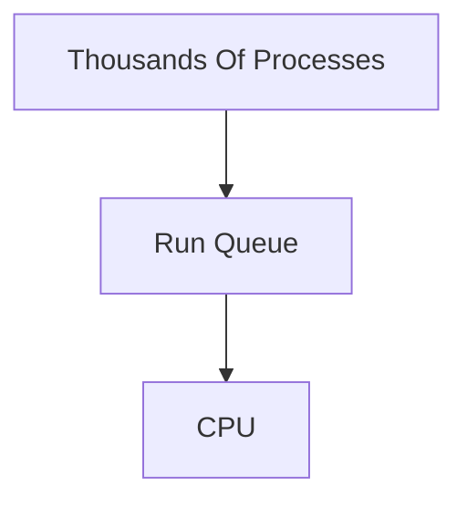

Everything waits.

---

# Investigation

```bash
top
```

Check:

```text
Load Average

CPU Usage
```

---

# Cause 4: Lock Contention

Common in databases.

---

# Example

Thread A:

```text
Holding Lock
```

Thread B:

```text
Waiting
```

Thread C:

```text
Waiting
```

Eventually:

```text
Entire Application Stalls
```

---

# Lock Chain

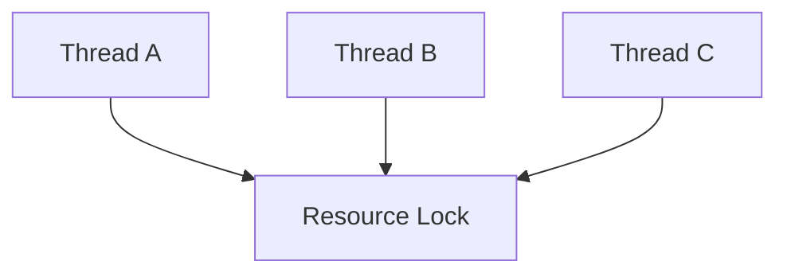

---

# Symptoms

```text
CPU Low

Processes Exist

Application Frozen
```

---

# Cause 5: NFS Storage Hang

Classic Linux problem.

---

# Example

Filesystem:

```text
Mounted NFS
```

NFS server unavailable.

Applications accessing filesystem:

```text
Block Forever
```

---

# NFS Dependency


---

# Symptoms

```text
ls hangs

df hangs

Applications hang
```

---

# Cause 6: Kernel Deadlock

Rare but severe.

Kernel resources become:

```text
Mutually Waiting
```

---

# Deadlock Model

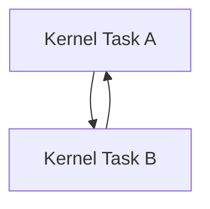

Neither proceeds.

---

# Investigation

Check:

```bash
dmesg
```

Look for:

```text
hung task

soft lockup

hard lockup
```

---

# Cause 7: Hardware Problems

Storage failures frequently appear as hangs.

Examples:

```text
Failing SSD

Failing RAID

Bad Controller

Memory Errors
```

---

# Hardware Failure Path

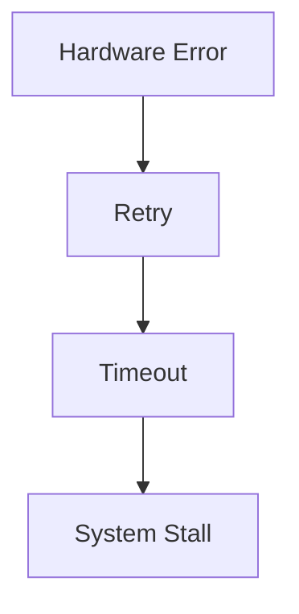

---

# Investigation

```bash
dmesg
```

Look for:

```text
I/O Error

Reset Device

Medium Error
```

---

# Cause 8: Network Filesystem Stall

Examples:

```text
NFS

CephFS

GlusterFS
```

Storage network interruption:

```text
Applications Freeze
```

---

# Cause 9: Virtual Machine Pause

Cloud and virtualization issue.

---

# VM Architecture

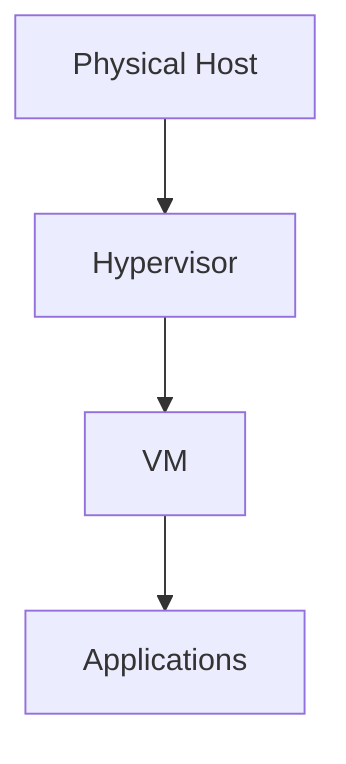

Hypervisor problems can pause VM execution.

---

# Symptoms

```text
Clock Jumps

Application Timeouts

Cluster Instability
```

---

# Cause 10: Memory Pressure

Not enough RAM.

Not enough swap.

OOM not triggered yet.

System enters:

```text
Heavy Reclaim State
```

---

# Memory Reclaim Flow

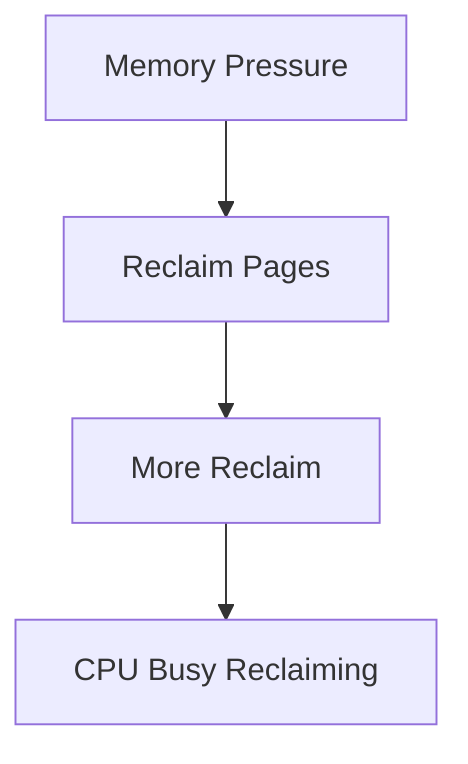

---

# Cause 11: Log Explosion

Huge log generation.

Disk saturated.

Applications stall.

---

# Log Path

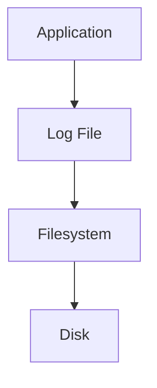

---

# Cause 12: Database Stall

Database lock contention.

Slow queries.

Storage bottlenecks.

Applications appear frozen.

---

# Database Dependency Graph


Database issue:

```text
Entire Stack Appears Hung
```

---

# Linux Internals

A server can only do work when:

```text
CPU Available

Memory Available

Storage Available

Kernel Progressing
```

Loss of any one resource can create:

```text
Hang Symptoms
```

---

# Investigation Workflow

## Step 1

Can you SSH?

---

## Step 2

Check load:

```bash
uptime
```

---

## Step 3

Check CPU:

```bash
top
```

---

## Step 4

Check memory:

```bash
free -h
```

---

## Step 5

Check swap:

```bash
vmstat 1
```

---

## Step 6

Check storage:

```bash
iostat -x 1
```

---

## Step 7

Check kernel:

```bash
dmesg -T
```

---

## Step 8

Check blocked tasks:

```bash
ps aux
```

and

```bash
top
```

---

# Hung Task Detection

Linux detects tasks stuck for long periods.

Example:

```text
INFO: task java blocked for more than 120 seconds
```

---

# Hung Task Architecture

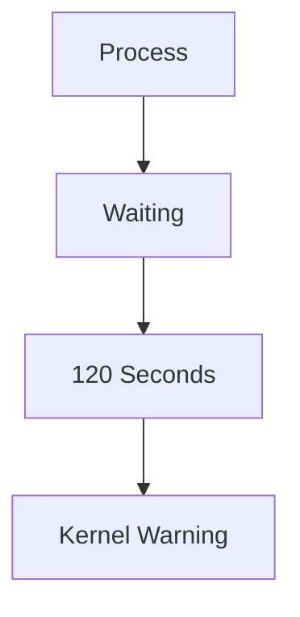

---

# Production Incident Example

## Incident

E-commerce platform freezes every afternoon.

Symptoms:

```text
Load Average = 80

CPU = 15%
```

Confusing.

---

Investigation:

```bash
vmstat 1
```

Output:

```text
si=4000

so=5000
```

Root cause:

```text
Swap Thrashing
```

Fix:

```text
Increase RAM

Fix Memory Leak
```

---

# Production Incident Example #2

Users report:

```text
Website Freezes
```

Investigation:

```bash
iostat -x
```

Result:

```text
Disk Utilization = 100%
```

Root cause:

```text
Log Explosion
```

filled storage subsystem.

---

# Observability

Monitor:

```text
Load Average

CPU Usage

Memory Pressure

Swap Activity

Disk Latency

IO Wait

Blocked Tasks
```

Important metrics:

```text
node_load1

node_memory

node_disk

node_cpu_iowait

node_pressure
```

---

# Essential Commands

```bash
uptime

top

htop

free -h

vmstat 1

iostat -x 1

dmesg -T

journalctl -xe

sar

iotop

pidstat
```

---

# Master Troubleshooting Workflow

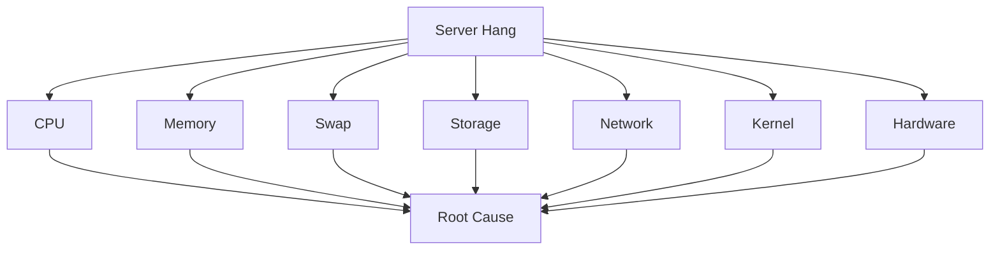

---

# Common Mistakes

## Mistake 1

Restarting immediately.

You destroy evidence.

---

## Mistake 2

Assuming CPU is the issue.

---

## Mistake 3

Ignoring storage latency.

---

## Mistake 4

Ignoring swap activity.

---

## Mistake 5

Ignoring kernel logs.

---

## Mistake 6

Treating hangs as application problems only.

---

# Engineering Mindset

Beginners think:

```text
Server Frozen
```

Engineers think:

```text
Resource Problem
```

Senior engineers think:

```text
Progress Stopped Somewhere
```

Elite Linux engineers think:

```text
Which Resource
Prevented Forward Progress?
```

Because a server hang is fundamentally:

```text
The Inability
To Make Progress
```

not necessarily:

```text
The Inability
To Execute Code
```

---

# Interview Questions

### What is the first command for investigating a hang?

```bash
uptime
```

---

### Why can load average be high while CPU is low?

Processes waiting on I/O or memory.

---

### What is the most common cause of random hangs?

```text
Memory Pressure

Swap Thrashing

Storage Latency
```

---

### What command detects swap activity?

```bash
vmstat 1
```

---

### What command checks disk latency?

```bash
iostat -x 1
```

---

### What is a hung task?

Process blocked for a long time.

---

### Why should you avoid immediate reboot?

It destroys evidence.

---

# Cheat Sheet

```bash
# Load
uptime

# CPU
top
htop

# Memory
free -h

# Swap
vmstat 1

# Disk
iostat -x 1

# IO
iotop

# Kernel
dmesg -T

# Logs
journalctl -xe

# Process Stats
pidstat
```

---

# Final Takeaway

The most important lesson:

```text
Server Hangs Randomly
≠
Root Cause
```

It is merely:

```text
A Symptom
```

The real cause is usually hidden in:

```text
CPU

Memory

Swap

Storage

Network

Kernel

Hardware
```

The best Linux, SRE, Platform, Cloud, and Infrastructure Engineers never ask:

```text
Why Did The Server Hang?
```

They ask:

```text
What Prevented
The System
From Making Forward Progress?
```

Because every server hang is ultimately a story about:

```text
Work Waiting
For A Resource
That Never Arrived.
```
