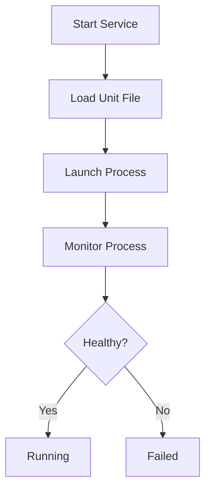
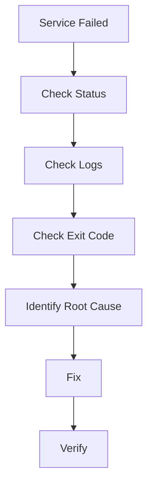
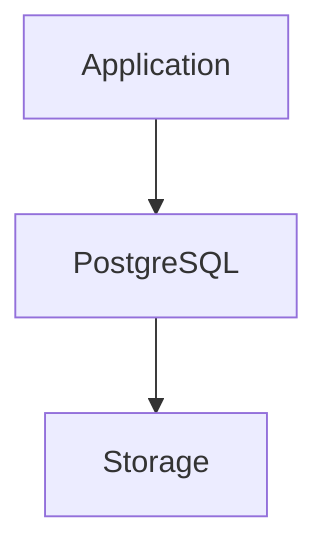
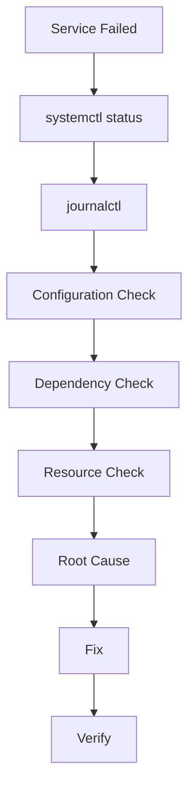

# Service Failed Troubleshooting Guide

> One of the most common Linux production incidents.
>
> One of the most important troubleshooting skills for Linux engineers.
>
> The foundation of diagnosing failures in applications, databases, containers, web servers, and modern cloud infrastructure.

---

# Why This Exists

Modern Linux systems are built from services.

Almost everything important running on a server is a service:

```text
Web Server
Database
Cache
Message Queue
DNS
SSH
Monitoring Agent
Container Runtime
Kubernetes Components
```

When a service fails:

```text
Application Stops
Users Cannot Connect
Revenue Stops
Systems Become Unavailable
```

The problem is that Linux often reports only:

```bash
Failed
```

or

```bash
Unit entered failed state
```

This tells us **what happened** but not **why it happened**.

The purpose of this guide is to teach engineers how to systematically discover the root cause.

---

# Problem It Solves

Most outages begin with a service failure.

Example:

```text
Customer Reports Website Down
          ↓
Nginx Failed
          ↓
Database Unavailable
          ↓
Authentication Broken
          ↓
Revenue Loss
```

The challenge is identifying:

```text
What Failed?
Why Did It Fail?
What Depends On It?
How Do We Recover Safely?
```

---

# Mental Model

Think of Linux services as machines in a factory.

```text
Factory

Web Server
     ↓

Application
     ↓

Database
     ↓

Storage
```

If one machine fails:

```text
Entire Production Line Stops
```

The failed service may not be the root cause.

Often it is only the symptom.

---

# First Principles

Every Linux service is just:

```text
A Process
```

managed by:

```text
systemd
```

Modern Linux:

```text
User Request
      ↓
systemd
      ↓
Service Process
      ↓
Application
```

When systemd cannot keep a service running:

```text
Service Failure
```

occurs.

---

# Understanding Service States

Check service:

```bash
systemctl status nginx
```

Possible states:

```text
active
inactive
failed
activating
deactivating
```

Most troubleshooting begins with:

```text
failed
```

---

# Service Lifecycle



---

# The Golden Rule

Never restart first.

Many engineers do:

```bash
systemctl restart service
```

before investigating.

This can:

```text
Destroy Evidence
Rotate Logs
Hide Root Cause
```

Always investigate first.

---

# First Investigation Commands

## Step 1

Check status.

```bash
systemctl status SERVICE
```

Example:

```bash
systemctl status nginx
```

Output may show:

```text
Exit Code
Signal
Reason
```

---

## Step 2

Read logs.

```bash
journalctl -u SERVICE
```

Example:

```bash
journalctl -u nginx
```

Most root causes are visible here.

---

## Step 3

View recent failures.

```bash
journalctl -xe
```

Very useful during incidents.

---

# Anatomy Of A Service Failure



---

# Common Root Causes

---

# Cause 1: Configuration Errors

Most common.

Example:

```bash
nginx.conf
```

contains:

```text
Missing Semicolon
Invalid Directive
Syntax Error
```

Service startup fails.

Example:

```text
nginx: configuration file test failed
```

Check:

```bash
nginx -t
```

before restarting.

---

# Cause 2: Port Already In Use

Application wants:

```text
Port 80
```

Another process already owns it.

Example:

```text
bind(): Address already in use
```

Check:

```bash
ss -tulpn
```

or

```bash
lsof -i :80
```

---

# Cause 3: Missing Permissions

Service account cannot access:

```text
Files
Directories
Certificates
Sockets
```

Example:

```text
Permission denied
```

Check:

```bash
ls -l
```

and

```bash
namei -l
```

---

# Cause 4: Missing Files

Example:

```text
Certificate Missing
Config Missing
Database File Missing
```

Service exits immediately.

Check logs.

---

# Cause 5: Dependency Failure

Service depends on another service.

Example:

```text
Application
     ↓
PostgreSQL
```

Database fails.

Application also fails.

---

# Dependency Visualization



Failure propagates upward.

---

# Cause 6: Memory Exhaustion

Kernel kills process.

Example:

```text
OOM Killer
```

Check:

```bash
dmesg | grep -i kill
```

or

```bash
journalctl -k
```

Look for:

```text
Out of memory
Killed process
```

---

# Cause 7: Disk Full

Service attempts:

```text
Write Logs
Create Temp Files
Store Data
```

Filesystem:

```text
100% Full
```

Result:

```text
Startup Failure
```

Check:

```bash
df -h
```

---

# Cause 8: Inode Exhaustion

Disk appears healthy.

```bash
df -h
```

shows free space.

But:

```bash
df -i
```

shows:

```text
100% Inodes Used
```

Service cannot create files.

---

# Cause 9: SELinux

Permissions appear correct.

Service still fails.

Check:

```bash
getenforce
```

Logs:

```bash
ausearch -m avc
```

---

# Cause 10: Application Crash

Example:

```text
Segmentation Fault
Unhandled Exception
Fatal Error
```

Service starts.

Immediately exits.

Check:

```bash
journalctl -u SERVICE
```

---

# Understanding Exit Codes

Example:

```text
Main PID: 1234
Code=exited
Status=1
```

Meaning:

```text
Application Returned Error
```

Example:

```text
Status=127
```

Usually:

```text
Binary Not Found
```

Example:

```text
Status=139
```

Often:

```text
Segmentation Fault
```

---

# Linux Internals

Systemd launches:

```text
ExecStart
```

defined in unit file.

Example:

```ini
[Service]
ExecStart=/usr/bin/app
```

Internally:

```text
systemd
    ↓
fork()
    ↓
execve()
    ↓
application
```

If process exits unexpectedly:

```text
systemd marks service failed
```

---

# Understanding Unit Files

View:

```bash
systemctl cat SERVICE
```

Example:

```bash
systemctl cat nginx
```

Important sections:

```ini
[Unit]
[Service]
[Install]
```

---

# Production Example

## Incident

E-commerce site unavailable.

Alert:

```text
Website Down
```

Investigation:

```bash
systemctl status nginx
```

Result:

```text
Failed
```

Logs:

```bash
journalctl -u nginx
```

Output:

```text
bind(): Address already in use
```

Root Cause:

```text
Second Nginx Instance
```

Fix:

```bash
kill PID
systemctl start nginx
```

Recovery time:

```text
3 Minutes
```

---

# Database Service Failure Example

PostgreSQL fails.

Status:

```text
Failed
```

Logs:

```text
No space left on device
```

Actual issue:

```text
Disk Full
```

Database was symptom.

Storage was root cause.

---

# Kubernetes Connection

Every Kubernetes component is a service.

Examples:

```text
kubelet
containerd
etcd
kube-apiserver
```

Troubleshooting:

```bash
systemctl status kubelet
```

is often the first step.

---

# Docker Connection

Docker daemon:

```text
dockerd
```

is a systemd service.

Check:

```bash
systemctl status docker
```

Logs:

```bash
journalctl -u docker
```

Many container incidents begin here.

---

# Cloud Environment Connection

Cloud servers depend on:

```text
Cloud Agent
Monitoring Agent
Security Agent
Container Runtime
```

All are services.

Understanding service failures directly impacts:

```text
AWS
Azure
GCP
DigitalOcean
OpenStack
```

operations.

---

# Observability

Useful commands:

```bash
systemctl status SERVICE
journalctl -u SERVICE
journalctl -xe
```

Metrics:

```text
Restart Count
Failure Count
Availability
Memory Usage
CPU Usage
```

Tools:

```text
Prometheus
Grafana
Datadog
New Relic
Elastic Stack
```

---

# Troubleshooting Workflow



---

# Common Mistakes

## Mistake 1

Immediately restarting service.

---

## Mistake 2

Ignoring logs.

---

## Mistake 3

Fixing symptoms.

---

## Mistake 4

Ignoring dependencies.

---

## Mistake 5

Not checking disk.

---

## Mistake 6

Not checking memory.

---

## Mistake 7

Assuming systemd is broken.

Usually:

```text
Application is broken
```

not systemd.

---

# Engineering Mindset

When a service fails, ask:

```text
What process died?
Why did it die?
What dependency failed?
What resource was missing?
```

Do not ask:

```text
How do I restart it?
```

Professional engineers investigate.

Beginners restart.

Production systems reward investigation.

---

# Interview Questions

### What command checks service status?

```bash
systemctl status SERVICE
```

---

### Where are systemd logs stored?

```bash
journalctl
```

---

### How do you view logs for one service?

```bash
journalctl -u SERVICE
```

---

### What causes services to fail?

```text
Config Errors
Permission Problems
Missing Files
Dependencies
Memory Issues
Disk Full
Application Bugs
```

---

### How do you identify OOM kills?

```bash
dmesg
journalctl -k
```

---

### Why can a service fail even if the binary exists?

Because:

```text
Dependencies
Configuration
Permissions
Resources
```

may be broken.

---

# Service Failure Incident Response Playbook

```text
1. Check Status
2. Read Logs
3. Identify Exit Code
4. Verify Config
5. Verify Dependencies
6. Verify Storage
7. Verify Memory
8. Verify Permissions
9. Fix Root Cause
10. Restart
11. Validate
12. Monitor
```

---

# Cheat Sheet

```bash
# Status
systemctl status SERVICE

# Logs
journalctl -u SERVICE

# Recent Failures
journalctl -xe

# Service Definition
systemctl cat SERVICE

# Dependencies
systemctl list-dependencies SERVICE

# Restart
systemctl restart SERVICE

# Reload
systemctl reload SERVICE

# Failed Services
systemctl --failed

# Kernel Logs
journalctl -k

# Port Usage
ss -tulpn

# Disk Usage
df -h

# Inodes
df -i

# Memory
free -h
```

---

# Final Takeaway

A service failure is rarely the actual problem.

It is usually the visible symptom of a deeper issue:

```text
Bad Configuration
Missing Dependency
Storage Exhaustion
Memory Pressure
Permission Problems
Application Bugs
```

Elite Linux engineers do not stop at:

```text
Service Failed
```

They continue until they discover:

```text
Why It Failed
```

That is the difference between operating Linux and truly understanding it.
