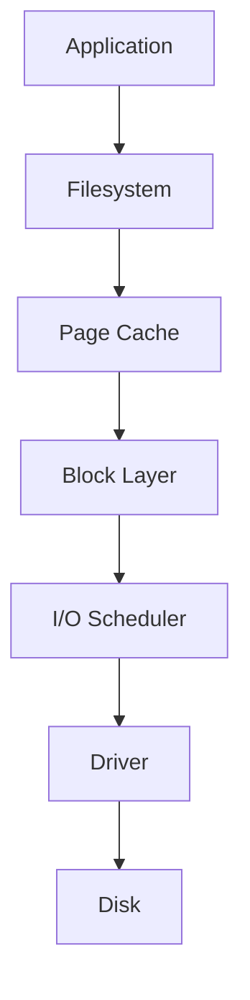
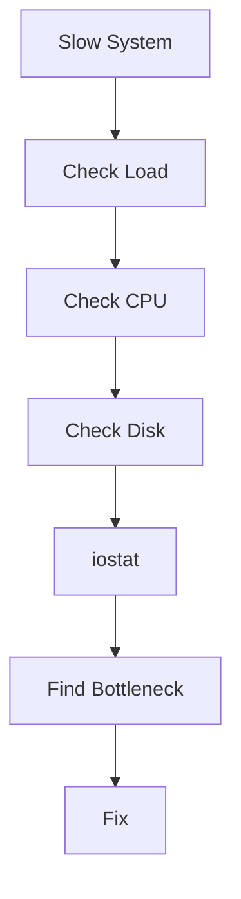
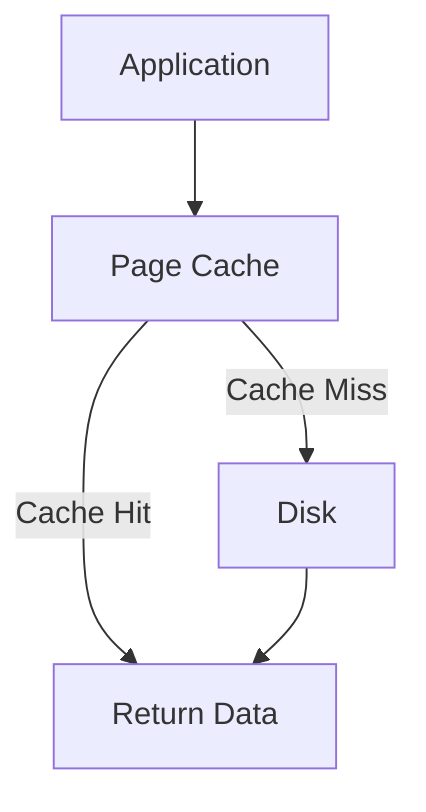
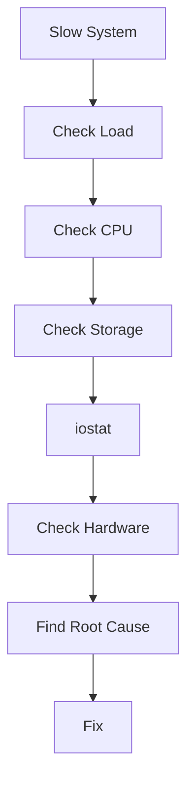

# Slow Disk Performance Troubleshooting Guide

> One of the most expensive and difficult production bottlenecks.
>
> The root cause behind countless "CPU issues", "database issues", and "application issues" that are actually storage problems.
>
> A topic that teaches engineers how Linux interacts with physical storage.

---

# Why This Exists

Modern systems are built on a simple truth:

```text
CPU Processes Data

Memory Holds Data

Storage Preserves Data
```

Almost every application eventually performs:

```text
Read
Write
Sync
Flush
Commit
```

operations.

When storage becomes slow:

```text
Applications Slow Down
Databases Stall
Containers Hang
Load Average Increases
Users Complain
```

The challenge:

```text
Storage Problems
Often Look Like
Application Problems
```

This is why disk performance troubleshooting is a critical Linux skill.

---

# Problem It Solves

Imagine a factory.

```text
Workers = CPUs

Storage Room = Disk
```

Workers process items.

But every few minutes:

```text
Need More Materials
```

from storage.

If storage room responds instantly:

```text
High Productivity
```

If storage room takes:

```text
30 Seconds
```

workers sit idle.

The workers are not the problem.

The storage system is.

---

# Mental Model

Think of storage as:

```text
The Slowest Layer
```

in modern computing.

Approximate latency:

```text
CPU Cache       Nanoseconds

RAM             Nanoseconds

NVMe SSD        Microseconds

SATA SSD        Hundreds Of Microseconds

HDD             Milliseconds

Network Storage Tens Of Milliseconds
```

Difference:

```text
Millions Of Times Slower
```

than CPU.

---

# First Principles

Applications never directly access disks.

Flow:

```text
Application
    ↓
Filesystem
    ↓
Kernel
    ↓
Block Layer
    ↓
Driver
    ↓
Storage Device
```

Slow storage can occur at:

```text
Any Layer
```

---

# Linux Storage Architecture



Understanding this stack is essential.

---

# The Golden Rule

Never assume:

```text
High Load
=
CPU Problem
```

Very often:

```text
High Load
=
Disk Problem
```

---

# Common Symptoms

---

## Symptom 1

Applications become slow.

---

## Symptom 2

Database queries take longer.

---

## Symptom 3

High load average.

Example:

```text
Load = 40

CPU = 10%
```

This often indicates:

```text
Storage Wait
```

---

## Symptom 4

Processes stuck in:

```text
D State
```

Uninterruptible sleep.

---

## Symptom 5

Slow boot.

---

## Symptom 6

Container startup delays.

---

## Symptom 7

Kubernetes node instability.

---

# Understanding Storage Metrics

Most engineers focus on:

```text
Disk Usage
```

Wrong metric.

We care about:

```text
Latency
IOPS
Throughput
Queue Depth
Utilization
```

---

# Metric 1: Latency

Most important metric.

Question:

```text
How Long Does One I/O Take?
```

Example:

```text
1 ms
```

Good.

Example:

```text
200 ms
```

Bad.

---

# Metric 2: IOPS

Input/Output Operations Per Second.

Example:

```text
100 Reads/sec
```

versus

```text
100,000 Reads/sec
```

---

# Metric 3: Throughput

Amount of data transferred.

Example:

```text
100 MB/s
```

---

# Metric 4: Queue Depth

Number of requests waiting.

Large queue:

```text
Storage Congestion
```

---

# Metric 5: Utilization

Percentage of time disk is busy.

Example:

```text
100% Utilization
```

means:

```text
Disk Saturated
```

---

# First Investigation

Check:

```bash
iostat -x 1
```

Most important command.

---

# Understanding iostat

Example:

```text
Device  r/s  w/s await util

nvme0n1 500 300 5.0 80%
```

---

# await

Most important field.

Represents:

```text
Average I/O Latency
```

High:

```text
Slow Storage
```

---

# %util

Represents:

```text
Device Busy Time
```

Near:

```text
100%
```

means:

```text
Storage Saturated
```

---

# Investigation Workflow



---

# Common Root Causes

---

# Cause 1: Disk Saturation

Too many requests.

Example:

```text
Database
Backup
Log Rotation
Analytics Job
```

running simultaneously.

Disk reaches:

```text
100% Utilization
```

---

# Cause 2: HDD Limitations

Mechanical disks require:

```text
Seek
Rotate
Read
```

Each operation takes time.

Random I/O becomes expensive.

---

# HDD Internals


Every movement adds latency.

---

# Cause 3: SSD Wear

Aging SSDs may show:

```text
Higher Latency
Write Amplification
Reduced Throughput
```

Check:

```bash
smartctl -a /dev/sda
```

---

# Cause 4: Failing Disk

Example:

```text
Bad Sectors
Media Errors
Timeouts
```

Symptoms:

```text
Increasing Latency
```

before total failure.

---

# Cause 5: Filesystem Fragmentation

Particularly on older systems.

Causes:

```text
Extra Seeks
Additional Reads
```

---

# Cause 6: Full Filesystem

Near:

```text
100% Full
```

performance often degrades.

Particularly:

```text
EXT4
XFS Metadata Operations
```

---

# Cause 7: Excessive Logging

Applications writing:

```text
Thousands Of Logs Per Second
```

can overwhelm storage.

---

# Cause 8: Database Workload

Examples:

```text
PostgreSQL
MySQL
MongoDB
```

perform:

```text
Random Reads
Random Writes
fsync
```

Storage bottlenecks become visible quickly.

---

# Cause 9: RAID Problems

Examples:

```text
Degraded RAID
Rebuild Operations
Controller Issues
```

Performance collapses.

---

# Cause 10: Cloud Storage Latency

Examples:

```text
AWS EBS
Azure Managed Disks
GCP Persistent Disk
```

Network-attached storage may experience:

```text
Latency Spikes
```

---

# Linux Internals

Applications call:

```c
read()
write()
fsync()
```

Kernel processes requests:

```text
Page Cache
 ↓
Block Layer
 ↓
I/O Scheduler
 ↓
Device Driver
 ↓
Storage Device
```

Every layer contributes latency.

---

# Page Cache

One of Linux's greatest optimizations.

Without cache:

```text
Every Read
Hits Disk
```

With cache:

```text
RAM Serves Request
```

Much faster.

---

# Page Cache Flow



---

# Identifying Storage Wait

Check:

```bash
vmstat 1
```

Important fields:

```text
wa
```

I/O Wait.

Example:

```text
wa = 40%
```

Often indicates:

```text
Storage Bottleneck
```

---

# Identifying Blocked Processes

Check:

```bash
ps aux
```

or:

```bash
top
```

Look for:

```text
D
```

state.

Meaning:

```text
Waiting For Disk
```

---

# Process Investigation

```bash
iotop
```

Shows:

```text
Who Is Reading
Who Is Writing
```

Very useful.

---

# Storage Health Check

```bash
smartctl -a /dev/sda
```

Look for:

```text
Media Errors
Bad Sectors
Wear Levels
Temperature
```

---

# Production Incident Example

## Incident

E-commerce platform latency:

```text
20 ms
```

became:

```text
4 seconds
```

Monitoring:

```text
CPU 15%
Load Average 50
```

Engineers suspected:

```text
Application Bug
```

Investigation:

```bash
iostat -x 1
```

Output:

```text
await = 500 ms
util = 100%
```

Root cause:

```text
Failed SSD
```

Storage bottleneck created:

```text
High Load
High Latency
Timeouts
```

---

# Database Example

PostgreSQL:

```text
Slow Queries
```

Investigation:

```bash
iostat -x
```

Result:

```text
Storage Saturation
```

Database healthy.

Storage unhealthy.

---

# Docker Example

Containers slow.

Check:

```bash
docker stats
```

Looks healthy.

Investigate:

```bash
iotop
```

Found:

```text
Log Volume Writing Excessively
```

Storage bottleneck.

---

# Kubernetes Example

Node:

```text
Not Ready
```

Investigation:

```bash
kubectl describe node
```

Found:

```text
Disk Pressure
```

Underlying issue:

```text
Slow Persistent Storage
```

---

# Cloud Connection

Cloud disks are often:

```text
Network Attached
```

Performance depends on:

```text
IOPS Limits
Throughput Limits
Volume Type
```

Common mistake:

```text
Using Low-Tier Storage
For High-Traffic Databases
```

---

# Performance Considerations

Storage latency affects:

```text
Application Latency
Database Performance
Boot Speed
Container Startup
Kubernetes Scheduling
```

Often becomes:

```text
System Bottleneck
```

before CPU.

---

# Security Considerations

Storage attacks include:

```text
Log Flooding
Disk Exhaustion
I/O Saturation
```

creating:

```text
Denial Of Service
```

conditions.

---

# Observability

Monitor:

```text
Latency
IOPS
Utilization
Queue Depth
I/O Wait
```

Tools:

```text
Prometheus
Grafana
Datadog
Elastic
```

---

# Essential Commands

```bash
iostat -x 1

iotop

vmstat 1

top

htop

smartctl -a DEVICE

lsblk

df -h

dmesg

journalctl -k
```

---

# Troubleshooting Workflow



---

# Common Mistakes

## Mistake 1

Assuming high load means CPU problem.

---

## Mistake 2

Looking only at disk usage.

---

## Mistake 3

Ignoring latency.

---

## Mistake 4

Ignoring SMART warnings.

---

## Mistake 5

Using HDDs for random I/O workloads.

---

## Mistake 6

Blaming databases first.

---

# Engineering Mindset

Beginners ask:

```text
Why Is My Application Slow?
```

Engineers ask:

```text
Which Resource Is Slow?
```

Elite engineers ask:

```text
How Long Does Every I/O Take
And Why?
```

because storage performance is ultimately:

```text
A Latency Problem
```

not simply:

```text
A Disk Problem
```

---

# Interview Questions

### What command shows detailed disk metrics?

```bash
iostat -x 1
```

---

### Most important storage metric?

```text
Latency (await)
```

---

### Why can high load occur with low CPU?

Processes waiting on disk.

---

### What does iotop show?

Per-process disk usage.

---

### What indicates disk saturation?

```text
util ≈ 100%
```

---

### What is I/O wait?

CPU idle while waiting for storage operations.

---

### Why is SSD faster than HDD?

No mechanical movement.

---

# Cheat Sheet

```bash
# Disk Performance
iostat -x 1

# Per Process I/O
iotop

# I/O Wait
vmstat 1

# Process States
top

# Storage Health
smartctl -a DEVICE

# Block Devices
lsblk

# Disk Usage
df -h

# Kernel Storage Errors
dmesg

# System Logs
journalctl -k
```

---

# Final Takeaway

Slow disk performance is one of the most deceptive Linux problems.

It often appears as:

```text
Application Slowness
Database Slowness
High Load Average
Container Problems
Kubernetes Problems
```

but the real issue is:

```text
Storage Latency
```

The most important lesson:

```text
Fast CPU
+
Fast Memory
+
Slow Disk
=
Slow System
```

The best Linux engineers always ask:

```text
How Long Is The System Waiting
For Storage?
```

because modern infrastructure performance is often determined not by computation speed, but by how quickly data can move through the storage stack.
