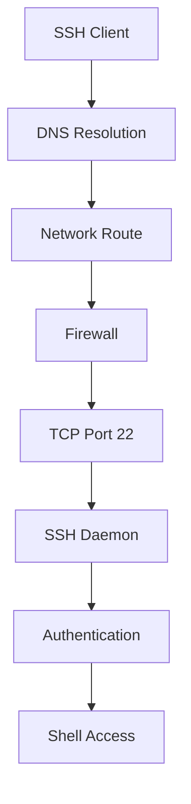
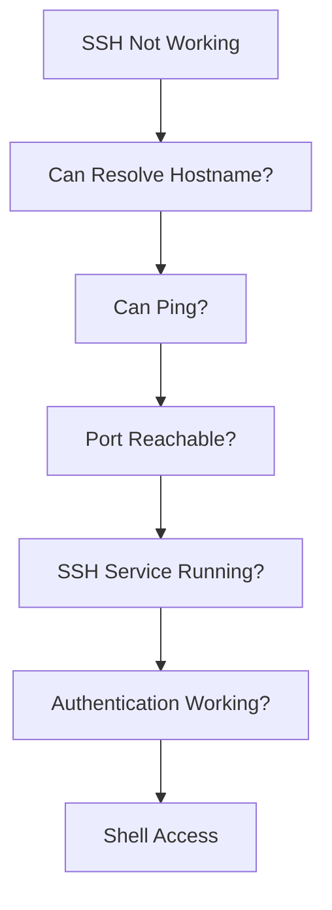

# SSH Not Working Troubleshooting Guide

> The most important remote administration troubleshooting skill.
>
> The gateway to Linux infrastructure.
>
> The difference between quickly fixing a production issue and being completely locked out of a server.

---

# Why This Exists

Most Linux systems are managed remotely.

Engineers rarely sit in front of production servers.

Instead they connect using:

```text
SSH
```

SSH is the foundation of:

* Linux Administration
* DevOps
* Cloud Engineering
* SRE
* Platform Engineering
* Kubernetes Operations
* Infrastructure Automation

When SSH stops working:

```text
You Lose Access
```

Without access:

```text
Cannot Investigate
Cannot Deploy
Cannot Recover
Cannot Troubleshoot
```

Understanding SSH failures is one of the highest-value Linux troubleshooting skills.

---

# Problem It Solves

Imagine a datacenter.

```text
Engineer
    │
Internet
    │
Firewall
    │
Load Balancer
    │
Server
```

SSH is the management tunnel.

When SSH breaks:

```text
Engineer
    │
    X
    │
Server
```

You are blind.

The challenge becomes:

```text
Where did the connection fail?
```

---

# Mental Model

Think of SSH as a journey through multiple checkpoints.

```text
Client
  ↓
DNS
  ↓
Routing
  ↓
Firewall
  ↓
TCP Connection
  ↓
SSH Service
  ↓
Authentication
  ↓
Shell
```

A failure at any stage produces a different error.

The key to troubleshooting SSH is identifying:

```text
Which checkpoint failed?
```

---

# First Principles

SSH is an application protocol.

It runs over:

```text
TCP
```

Usually:

```text
Port 22
```

Connection flow:

```text
SSH Client
      ↓
TCP Connection
      ↓
SSH Handshake
      ↓
Authentication
      ↓
Shell Session
```

Failure can occur at any stage.

---

# SSH Connection Lifecycle



---

# Golden Rule

Do not assume:

```text
SSH Problem
```

Many SSH failures are actually:

```text
DNS Problems
Network Problems
Firewall Problems
Authentication Problems
Service Problems
```

SSH is often only the symptom.

---

# Common SSH Error Messages

---

## Connection Refused

```bash
ssh user@server
```

Output:

```text
Connection refused
```

Meaning:

```text
Server Reachable
Port Closed
```

Usually:

```text
SSH Service Down
SSH Listening On Wrong Port
Firewall Rejecting
```

Check:

```bash
systemctl status sshd
```

---

## Connection Timed Out

Output:

```text
Connection timed out
```

Meaning:

```text
Packet Never Reached Destination
```

Possible causes:

```text
Firewall
Security Group
Routing Issue
Server Offline
Network Failure
```

---

## Permission Denied

Output:

```text
Permission denied (publickey)
```

Meaning:

```text
Connection Works
Authentication Failed
```

Network is healthy.

Focus on:

```text
Keys
Users
Permissions
```

---

## Host Key Verification Failed

Output:

```text
Host key verification failed
```

Meaning:

```text
Known Host Mismatch
```

Possible causes:

```text
Server Rebuilt
IP Reused
DNS Changed
Potential MITM
```

---

# Systematic SSH Troubleshooting Workflow



---

# Step 1: Verify DNS

Check:

```bash
nslookup server.example.com
```

or

```bash
dig server.example.com
```

Expected:

```text
IP Address Returned
```

If DNS fails:

```text
SSH Cannot Begin
```

---

# Step 2: Verify Reachability

Check:

```bash
ping SERVER_IP
```

Example:

```bash
ping 10.0.0.15
```

If unreachable:

```text
Network Problem
Routing Problem
Firewall Problem
```

---

# Step 3: Check Port 22

Use:

```bash
nc -zv SERVER_IP 22
```

or

```bash
telnet SERVER_IP 22
```

Expected:

```text
Connected
```

Failure means:

```text
Port Closed
Firewall
SSH Service Down
```

---

# Step 4: Verify SSH Service

On server:

```bash
systemctl status sshd
```

or

```bash
systemctl status ssh
```

Expected:

```text
active (running)
```

Failure:

```text
Service Failed
```

Investigate:

```bash
journalctl -u sshd
```

---

# SSH Architecture


---

# Step 5: Check Listening Port

Verify:

```bash
ss -tulpn | grep ssh
```

Expected:

```text
LISTEN 0.0.0.0:22
```

or

```text
LISTEN :::22
```

If absent:

```text
SSH Daemon Not Running
```

---

# Step 6: Check Firewall

Linux Firewall:

```bash
sudo ufw status
```

or

```bash
sudo iptables -L
```

or

```bash
sudo nft list ruleset
```

Verify:

```text
Port 22 Allowed
```

---

# Cloud Firewall Checks

Many cloud SSH failures occur outside Linux.

Examples:

```text
AWS Security Groups
Azure NSGs
GCP Firewall Rules
```

Linux may be healthy.

Cloud firewall may block access.

---

# Authentication Failures

Example:

```text
Permission denied (publickey)
```

Connection succeeded.

Authentication failed.

Focus on:

```text
authorized_keys
Permissions
SSH Config
```

---

# SSH Key Verification

Check:

```bash
ls ~/.ssh
```

Expected:

```text
id_rsa
id_ed25519
authorized_keys
```

---

# Permissions Matter

SSH rejects insecure permissions.

Correct:

```bash
chmod 700 ~/.ssh
chmod 600 ~/.ssh/authorized_keys
```

Wrong:

```bash
chmod 777 ~/.ssh
```

Result:

```text
Authentication Failure
```

---

# Verify User Exists

Check:

```bash
id username
```

If user missing:

```text
Login Impossible
```

---

# Check SSH Configuration

File:

```text
/etc/ssh/sshd_config
```

Validate:

```bash
sshd -t
```

Common mistakes:

```text
Invalid Syntax
Wrong Port
Disabled Authentication
Disabled User
```

---

# Common Production Causes

---

# Cause 1: SSH Service Crashed

Check:

```bash
systemctl status sshd
```

Logs:

```bash
journalctl -u sshd
```

---

# Cause 2: Disk Full

SSH may fail because:

```text
Cannot Write PID File
Cannot Create Session
Cannot Write Logs
```

Check:

```bash
df -h
```

---

# Cause 3: Memory Exhaustion

Kernel kills services.

Check:

```bash
dmesg | grep -i kill
```

Look for:

```text
OOM Killer
```

---

# Cause 4: Firewall Changes

Example:

```text
New Security Rule
Blocks Port 22
```

Very common after deployments.

---

# Cause 5: Wrong SSH Port

Config:

```text
Port 2222
```

User tries:

```bash
ssh user@server
```

SSH uses:

```text
22
```

Connection fails.

Correct:

```bash
ssh -p 2222 user@server
```

---

# Cause 6: SELinux

Port configured:

```text
2222
```

SELinux only permits:

```text
22
```

Connection fails.

Check:

```bash
getenforce
```

and

```bash
semanage port -l | grep ssh
```

---

# Linux Internals

When SSH connection arrives:

```text
TCP SYN
      ↓
Kernel Network Stack
      ↓
Port 22
      ↓
sshd
      ↓
PAM
      ↓
Authentication
      ↓
Shell
```

Failure may occur at any stage.

---

# SSH Debugging

Client-side debugging:

```bash
ssh -v user@server
```

More details:

```bash
ssh -vvv user@server
```

Shows:

```text
DNS
TCP
Key Exchange
Authentication
```

Very powerful.

---

# Example Debug Output

```text
debug1: Connecting...
debug1: Connection established
debug1: Authentications that can continue
```

Allows pinpointing failure stage.

---

# Production Incident Example

## Incident

Engineers cannot access production.

Error:

```text
Connection timed out
```

Initial assumption:

```text
SSH Broken
```

Investigation:

```bash
nc -zv server 22
```

Failed.

Cloud Console Access:

```bash
systemctl status sshd
```

Service healthy.

Root Cause:

```text
AWS Security Group Change
```

Port 22 removed.

Fix:

```text
Restore Security Group Rule
```

Recovery:

```text
Immediate
```

---

# Kubernetes Connection

SSH is less common inside Kubernetes.

However:

```text
Worker Nodes
Control Plane Nodes
Container Hosts
```

still rely on SSH.

Node debugging often starts with:

```bash
ssh node
```

---

# Docker Connection

Docker hosts depend heavily on SSH.

Examples:

```text
Container Maintenance
Node Recovery
Daemon Troubleshooting
```

SSH failure may prevent container recovery.

---

# Security Considerations

Avoid:

```text
Password Authentication
Root Login
Weak Keys
```

Recommended:

```text
SSH Keys
MFA
Bastion Hosts
Least Privilege
```

---

# Observability

Monitor:

```text
SSH Availability
Authentication Failures
Connection Attempts
Brute Force Attacks
```

Useful logs:

```bash
journalctl -u sshd
```

or

```bash
tail -f /var/log/auth.log
```

---

# Troubleshooting Playbook

```text
1. Verify DNS
2. Verify Ping
3. Verify Port 22
4. Verify Firewall
5. Verify SSH Service
6. Verify Listening Port
7. Verify Authentication
8. Verify Permissions
9. Verify Logs
10. Verify Cloud Firewall
11. Verify SELinux
12. Verify User Account
```

---

# Common Mistakes

## Mistake 1

Restarting SSH without investigation.

---

## Mistake 2

Ignoring cloud firewalls.

---

## Mistake 3

Ignoring DNS failures.

---

## Mistake 4

Using incorrect SSH port.

---

## Mistake 5

Wrong authorized_keys permissions.

---

## Mistake 6

Assuming SSH is the root cause.

Often:

```text
Network
Firewall
Storage
```

is the actual issue.

---

# Engineering Mindset

SSH troubleshooting is not:

```text
Fix SSH
```

SSH troubleshooting is:

```text
Find The Broken Layer
```

Ask:

```text
Did DNS fail?
Did Routing fail?
Did Firewall fail?
Did TCP fail?
Did SSH fail?
Did Authentication fail?
```

This layer-by-layer thinking is how elite Linux engineers diagnose incidents.

---

# Interview Questions

### How do you verify SSH service status?

```bash
systemctl status sshd
```

---

### How do you debug SSH connection issues?

```bash
ssh -vvv user@host
```

---

### Difference between timeout and connection refused?

Timeout:

```text
Cannot Reach Service
```

Refused:

```text
Host Reachable
Port Closed
```

---

### Where are SSH logs?

```bash
journalctl -u sshd
```

or

```bash
/var/log/auth.log
```

---

### Why does SSH reject 777 permissions?

Because SSH requires secure ownership and permissions.

---

### What cloud components commonly block SSH?

```text
Security Groups
Network ACLs
Firewall Rules
```

---

# Cheat Sheet

```bash
# SSH Debug
ssh -vvv user@host

# Service Status
systemctl status sshd

# Logs
journalctl -u sshd

# Listening Ports
ss -tulpn | grep ssh

# Connectivity
ping host

# Port Test
nc -zv host 22

# DNS
dig host

# User Check
id username

# SSH Config Validation
sshd -t

# Firewall
ufw status

# Auth Logs
tail -f /var/log/auth.log
```

---

# Final Takeaway

SSH is not a single component.

It is a chain of systems:

```text
DNS
Network
Routing
Firewall
TCP
SSH Service
Authentication
Shell
```

The fastest engineers do not guess.

They systematically identify:

```text
Which Layer Failed?
```

Master this approach and you can troubleshoot SSH failures across laptops, servers, containers, cloud platforms, Kubernetes clusters, and large-scale production infrastructure.
