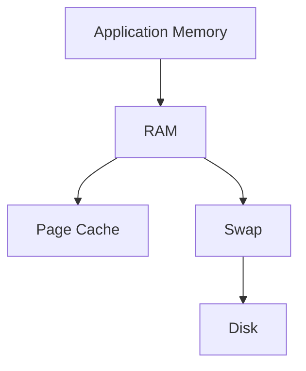
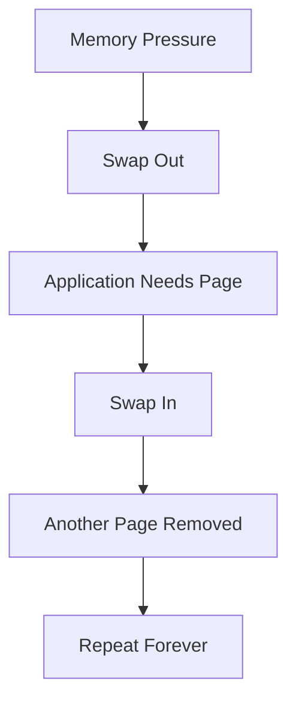
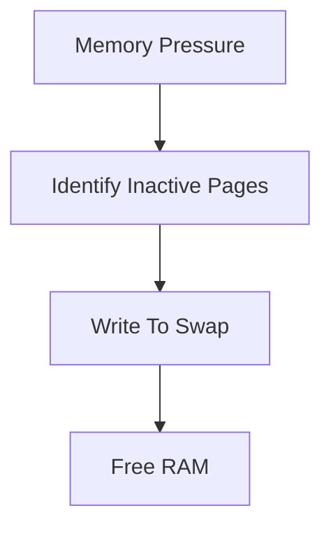
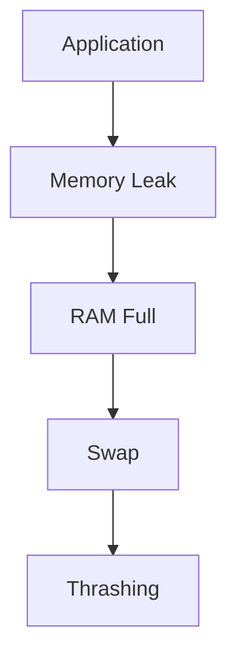
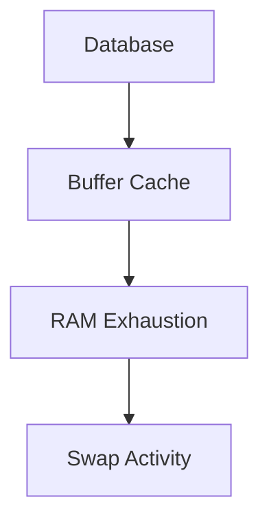
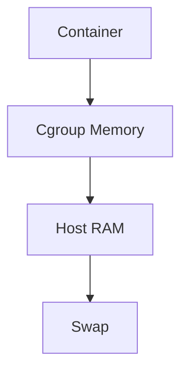
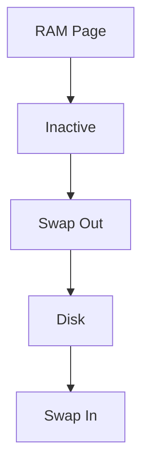
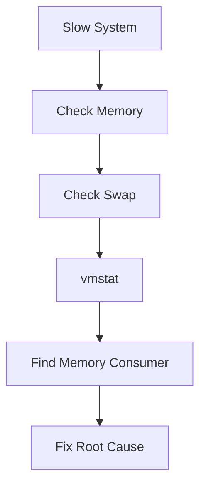

# Swap Thrashing Troubleshooting Guide

> One of the most destructive Linux performance failures.
>
> The hidden cause behind slow servers, hanging applications, Kubernetes node instability, database latency spikes, and system-wide performance collapse.
>
> A topic that teaches Linux memory management, virtual memory, paging, storage bottlenecks, and operating system internals.

---

# Why This Exists

Modern computers operate under a simple assumption:

```text
Active Data Must Stay In RAM
```

RAM is fast.

Storage is slow.

When memory pressure increases:

```text
Linux Moves Less-Used Pages
From RAM
To Swap
```

This is normal.

The problem begins when Linux spends more time:

```text
Moving Pages
```

than:

```text
Running Applications
```

This condition is called:

```text
Swap Thrashing
```

At that point:

```text
Server Appears Frozen

Applications Timeout

Load Average Explodes

Users Complain
```

---

# Problem It Solves

Imagine a library.

```text
Desk = RAM

Storage Room = Swap
```

A worker needs books constantly.

Normal operation:

```text
Books Stay On Desk
```

Occasionally:

```text
Old Books
→ Storage Room
```

No problem.

Thrashing:

```text
Book Needed
→ Storage Room

Return Book

Need Another Book

Return Book

Need Previous Book Again

Return Book
```

Worker spends entire day:

```text
Walking
```

instead of:

```text
Working
```

That is swap thrashing.

---

# Mental Model

Most engineers think:

```text
High Memory Usage
=
Problem
```

Wrong.

Linux intentionally uses memory.

Healthy Linux often shows:

```text
90%+ Memory Usage
```

without issues.

The real question:

```text
How Much Memory Activity
Is Hitting Swap?
```

---

# First Principles

Memory hierarchy:

```text
CPU Cache
    ↓
RAM
    ↓
Swap
    ↓
Disk
```

Latency comparison:

```text
CPU Cache     Nanoseconds

RAM           Nanoseconds

NVMe SSD      Microseconds

SATA SSD      Hundreds Microseconds

HDD           Milliseconds
```

Difference:

```text
Thousands To Millions
Of Times Slower
```

---

# Linux Memory Architecture



---

# What Is Swap?

Swap is:

```text
Disk Space
Used As Emergency Memory
```

Types:

```text
Swap Partition

Swap File
```

Check:

```bash
swapon --show
```

---

# Why Swap Exists

Swap provides:

```text
Memory Overcommit Protection

OOM Reduction

Temporary Memory Relief
```

Without swap:

```text
OOM Killer Activates Earlier
```

---

# Normal Swap Usage

Healthy systems may show:

```text
Swap Used = 1 GB

RAM Used = 32 GB
```

No issue.

Swap usage alone is NOT a problem.

---

# What Is Swap Thrashing?

Linux continuously performs:

```text
Swap Out
Swap In
Swap Out
Swap In
Swap Out
Swap In
```

instead of:

```text
Running Applications
```

---

# Thrashing Cycle



---

# The Golden Rule

Never ask:

```text
Is Swap Being Used?
```

Ask:

```text
Is Swap Being Used Constantly?
```

Usage:

```text
Normal
```

Activity:

```text
Dangerous
```

---

# Symptoms

---

## Symptom 1

System becomes:

```text
Extremely Slow
```

---

## Symptom 2

SSH becomes unresponsive.

---

## Symptom 3

Applications freeze.

---

## Symptom 4

High load average.

Example:

```text
Load = 40

CPU = 15%
```

Common sign of thrashing.

---

## Symptom 5

Disk activity permanently high.

---

## Symptom 6

Database latency spikes.

---

## Symptom 7

Kubernetes nodes become unstable.

---

# How Linux Decides To Swap

Linux kernel uses:

```text
LRU
(Least Recently Used)
```

style algorithms.

Goal:

```text
Keep Active Pages In RAM
```

Move inactive pages:

```text
To Swap
```

---

# Memory Reclamation



---

# Key Metric: vmstat

Most important command:

```bash
vmstat 1
```

Example:

```text
si so

1000 1200
```

---

# Understanding vmstat

Field:

```text
si
```

means:

```text
Swap In
```

Field:

```text
so
```

means:

```text
Swap Out
```

---

# Interpretation

Healthy:

```text
si = 0

so = 0
```

---

Minor Activity:

```text
si = 5

so = 10
```

Usually acceptable.

---

Danger:

```text
si = 2000

so = 3000
```

Severe thrashing.

---

# Memory Investigation

Check:

```bash
free -h
```

Example:

```text
RAM Almost Full

Swap Growing
```

Potential issue.

---

# Detailed Memory View

```bash
cat /proc/meminfo
```

Important fields:

```text
MemAvailable

SwapTotal

SwapFree

Active

Inactive
```

---

# Top Investigation

Check:

```bash
top
```

or:

```bash
htop
```

Look for:

```text
Memory Hogs
```

---

# Cause 1: Memory Leak

Most common production cause.

Application continuously allocates:

```text
Memory
Memory
Memory
Memory
```

Never releases it.

---

# Leak Flow



---

# Cause 2: Undersized RAM

Workload:

```text
Requires 32 GB
```

Server:

```text
Has 8 GB
```

Kernel compensates using swap.

Eventually:

```text
Performance Collapse
```

---

# Cause 3: Database Pressure

Databases aggressively use memory.

Examples:

```text
PostgreSQL

MySQL

MongoDB

Redis
```

Incorrect tuning causes swap storms.

---

# Database Memory Path



---

# Cause 4: Container Memory Limits

Container:

```text
Consumes Excessive Memory
```

Host:

```text
Starts Swapping
```

---

# Container Architecture



---

# Cause 5: Too Many Processes

Thousands of processes.

Each consumes:

```text
Stack

Heap

Buffers
```

Memory exhaustion follows.

---

# Linux Internals

Memory organized into:

```text
Pages
```

Usually:

```text
4 KB
```

per page.

---

# Page Lifecycle



---

# Why Thrashing Is Catastrophic

Application requests page.

Page absent.

Kernel must:

```text
Pause Application
```

Read from swap.

Resume application.

Repeat thousands of times.

---

# Thrashing Timeline

```mermaid
sequenceDiagram

Application->>RAM: Request Page

RAM-->>Application: Missing

RAM->>Swap: Read Page

Swap-->>RAM: Return Page

RAM-->>Application: Continue

Application->>RAM: Request Another Page

Repeat Forever
```

---

# Detecting Thrashing

Check:

```bash
vmstat 1
```

Look for:

```text
High si

High so
```

---

Check:

```bash
iostat -x 1
```

Look for:

```text
100% Disk Utilization
```

---

Check:

```bash
sar -W 1
```

Shows:

```text
Swap Statistics
```

---

# Swappiness

Linux parameter:

```text
vm.swappiness
```

Check:

```bash
sysctl vm.swappiness
```

Typical:

```text
60
```

---

# Meaning

Higher:

```text
More Aggressive Swapping
```

Lower:

```text
Prefer RAM
```

---

# Adjusting Swappiness

Temporary:

```bash
sysctl vm.swappiness=10
```

Persistent:

```bash
/etc/sysctl.conf
```

---

# Production Example

## Incident

E-commerce platform:

```text
API Latency

50 ms
→
12 seconds
```

Monitoring:

```text
CPU 10%

Load 60
```

Confusing.

---

Investigation:

```bash
vmstat 1
```

Output:

```text
si=5000

so=4500
```

Severe thrashing.

---

Root Cause:

```text
Memory Leak
In Java Service
```

---

Fix:

```text
Restart Service

Patch Leak

Increase RAM
```

Latency returned to normal.

---

# Kubernetes Example

Node:

```text
NotReady
```

Investigation:

```bash
kubectl describe node
```

Shows:

```text
MemoryPressure=True
```

Host:

```bash
vmstat
```

reveals:

```text
Massive Swap Activity
```

Root cause:

```text
Pod Consuming Excessive Memory
```

---

# Cloud Example

AWS EC2:

```text
CPU 20%

Load 80
```

Root cause:

```text
Swap Thrashing
```

not CPU saturation.

---

# Performance Implications

Thrashing causes:

```text
High Latency

Low Throughput

Database Slowdowns

Application Freezes

System Instability
```

---

# Security Implications

Memory exhaustion attacks can intentionally trigger:

```text
Swap Thrashing
```

creating:

```text
Denial Of Service
```

conditions.

---

# Observability

Monitor:

```text
Swap Usage

Swap In

Swap Out

Memory Pressure

Disk Latency
```

Critical metrics:

```text
node_memory

node_swap

vmstat_si

vmstat_so
```

---

# Essential Commands

```bash
free -h

vmstat 1

sar -W 1

top

htop

cat /proc/meminfo

swapon --show

iostat -x 1

sysctl vm.swappiness
```

---

# Master Troubleshooting Workflow



---

# Common Mistakes

## Mistake 1

Assuming high memory usage is bad.

Linux uses memory intentionally.

---

## Mistake 2

Looking only at swap usage.

Look at:

```text
Swap Activity
```

instead.

---

## Mistake 3

Blaming CPU.

Thrashing often causes:

```text
High Load
Low CPU
```

---

## Mistake 4

Disabling swap without understanding consequences.

---

## Mistake 5

Ignoring memory leaks.

---

## Mistake 6

Ignoring database memory settings.

---

# Engineering Mindset

Beginners think:

```text
Server Slow
```

Engineers think:

```text
Memory Problem
```

Senior engineers think:

```text
Virtual Memory Problem
```

Elite Linux engineers think:

```text
How Much Time
Is The Kernel Spending
Moving Pages
Instead Of Running Workloads?
```

Because swap thrashing is fundamentally:

```text
A Latency Explosion
```

inside the memory subsystem.

---

# Interview Questions

### What is swap thrashing?

Continuous swap in/out activity causing severe performance degradation.

---

### Most important command?

```bash
vmstat 1
```

---

### What do si and so mean?

```text
si = Swap In

so = Swap Out
```

---

### Does high swap usage always indicate a problem?

No.

High swap activity does.

---

### What is vm.swappiness?

Kernel preference for using swap.

---

### Why can load average be high during thrashing?

Processes wait on memory and disk.

---

### Why is swap slower than RAM?

Swap resides on storage devices.

---

# Cheat Sheet

```bash
# Memory Usage
free -h

# Swap Activity
vmstat 1

# Swap Statistics
sar -W 1

# Memory Details
cat /proc/meminfo

# Active Swap
swapon --show

# Disk Activity
iostat -x 1

# Swappiness
sysctl vm.swappiness

# Process Memory
top
htop
```

---

# Final Takeaway

Swap is not the enemy.

Swap exists to:

```text
Protect The System
```

The real danger is:

```text
Swap Thrashing
```

where Linux spends more time:

```text
Moving Memory
```

than:

```text
Executing Work
```

The most important lesson:

```text
High Memory Usage
≠
Problem

High Swap Activity
=
Potential Disaster
```

The best Linux engineers always ask:

```text
Is The System Running Applications?

Or

Is The System Busy
Moving Memory Around?
```

Because once a system enters swap thrashing, performance is no longer determined by RAM or CPU—

it is determined by the speed of the storage device acting as emergency memory.
