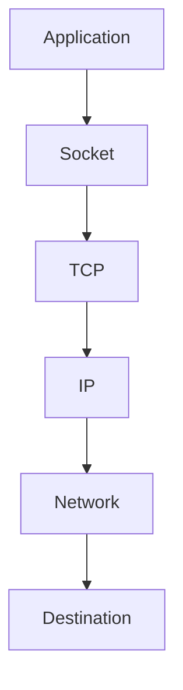
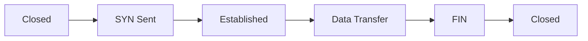
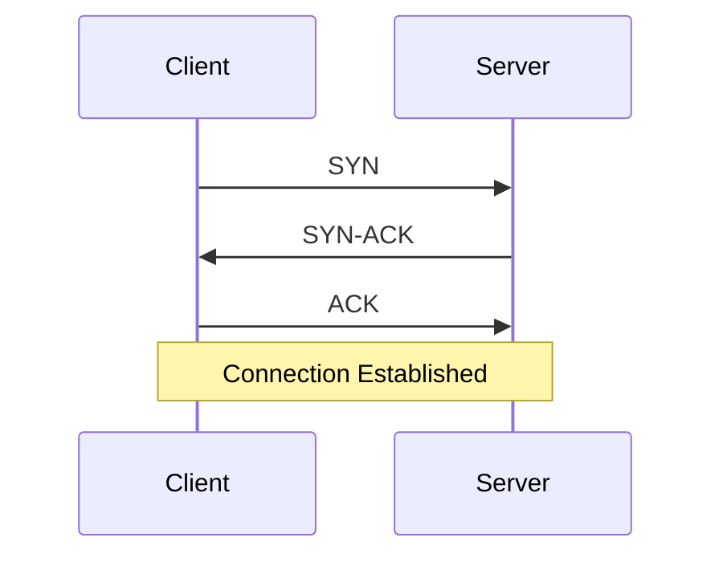
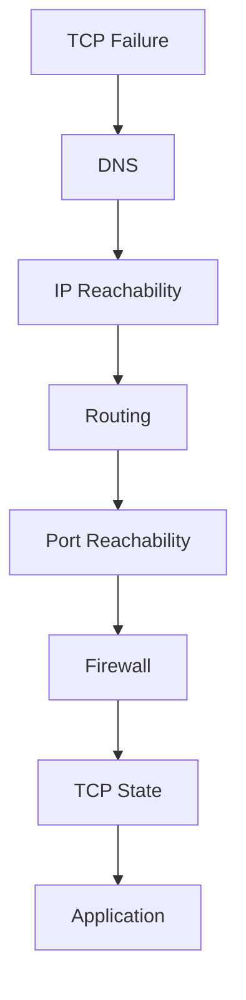
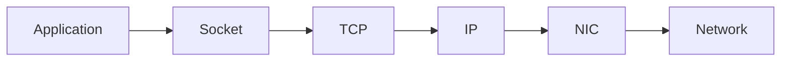
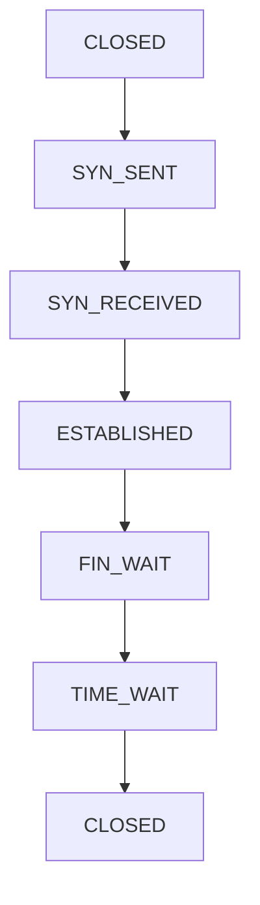
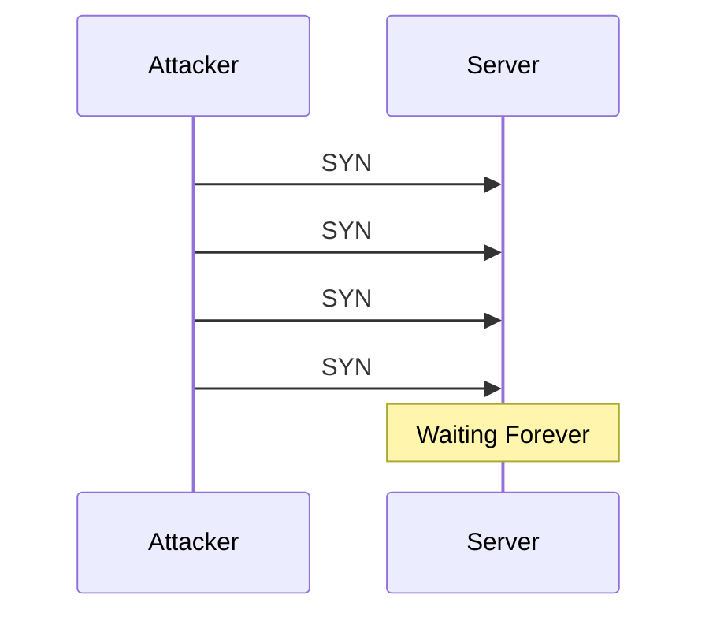
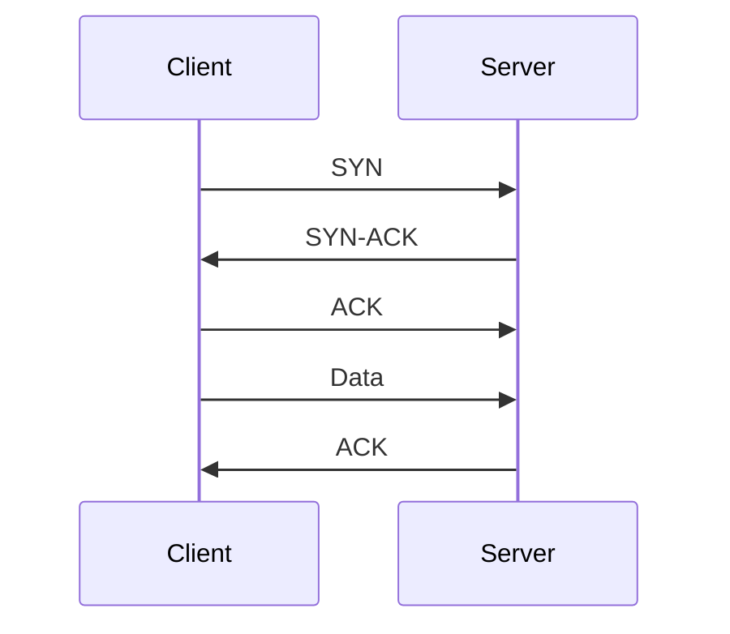
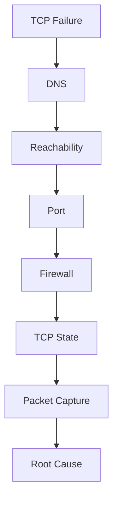

# TCP Connection Issues Troubleshooting Guide

> The foundation of modern distributed systems troubleshooting.
>
> The root cause behind API failures, database outages, service-to-service communication problems, Kubernetes networking incidents, and cloud connectivity issues.
>
> A topic every Linux engineer must master.

---

# Why This Exists

Modern applications are distributed.

A simple user request may travel through:

```text
Browser
  ↓
Load Balancer
  ↓
API Gateway
  ↓
Microservice
  ↓
Database
  ↓
Cache
```

Every arrow usually represents:

```text
TCP Connection
```

When TCP fails:

```text
Websites Break
APIs Timeout
Databases Become Unreachable
Containers Cannot Communicate
Clusters Become Unstable
```

Many engineers blame:

```text
Applications
```

The real problem is often:

```text
TCP Connectivity
```

---

# Problem It Solves

Imagine a city.

```text
Buildings = Services

Roads = TCP Connections
```

Even if every building works perfectly:

```text
No Roads
     ↓
No Communication
```

TCP is the road system of distributed computing.

---

# Mental Model

TCP is not:

```text
Sending Data
```

TCP is:

```text
Creating
Maintaining
Protecting
Reliable Conversations
```

between systems.

Think:

```text
Phone Call
```

Before talking:

```text
Dial
Connect
Verify
Talk
Hang Up
```

TCP works similarly.

---

# First Principles

IP provides:

```text
Best-Effort Delivery
```

Meaning:

```text
Maybe Delivered
Maybe Lost
```

TCP adds:

```text
Reliability
Ordering
Error Detection
Retransmission
Flow Control
Congestion Control
```

Result:

```text
Reliable Communication
```

---

# TCP Architecture



---

# The Golden Rule

Whenever TCP fails ask:

```text
Did Connection Fail?

Or

Did Data Transfer Fail?
```

These are completely different problems.

---

# TCP Connection Lifecycle



Understanding this lifecycle explains most TCP issues.

---

# The Three-Way Handshake

TCP starts with:

```text
Connection Establishment
```

---

# Handshake Flow



---

# Why Three Steps?

TCP must verify:

```text
Client Reachable

Server Reachable

Both Agree
```

Only then:

```text
Data Transfer Begins
```

---

# Most Common Symptoms

---

## Connection Refused

```text
Connection refused
```

Meaning:

```text
Host Reachable

Port Closed
```

Very important distinction.

---

## Connection Timed Out

```text
Connection timed out
```

Meaning:

```text
No Response
```

Possible causes:

```text
Firewall
Routing
Network Failure
Server Down
```

---

## Reset By Peer

```text
Connection reset by peer
```

Meaning:

```text
Remote Side Closed Connection
```

---

## Broken Pipe

```text
Broken pipe
```

Meaning:

```text
Writing To Closed Connection
```

---

# TCP Troubleshooting Framework



---

# Step 1: Verify DNS

Check:

```bash
dig example.com
```

or

```bash
nslookup example.com
```

Without DNS:

```text
TCP Cannot Start
```

---

# Step 2: Verify Reachability

Test:

```bash
ping HOST
```

Example:

```bash
ping 8.8.8.8
```

Success means:

```text
IP Connectivity Exists
```

---

# Step 3: Verify Port Access

Check:

```bash
nc -zv HOST PORT
```

Example:

```bash
nc -zv 10.0.0.5 5432
```

Output:

```text
Connected
```

means:

```text
TCP Handshake Success
```

---

# Step 4: Verify Listening Service

Check:

```bash
ss -tulpn
```

Example:

```text
LISTEN 0.0.0.0:443
```

Without listener:

```text
Connection Refused
```

---

# Linux TCP Internals

Applications do not talk directly to networks.

They use:

```text
Sockets
```

Flow:

```text
Application
   ↓
Socket
   ↓
TCP Stack
   ↓
IP Layer
   ↓
NIC
```

---

# Socket Architecture



---

# Understanding TCP States

Check:

```bash
ss -ant
```

Common states:

```text
LISTEN
SYN_SENT
SYN_RECV
ESTABLISHED
FIN_WAIT
TIME_WAIT
CLOSE_WAIT
```

Every state tells a story.

---

# LISTEN

Example:

```text
LISTEN
```

Meaning:

```text
Waiting For New Connections
```

Healthy server state.

---

# SYN_SENT

Meaning:

```text
Client Sent SYN
Waiting For Response
```

Stuck here often means:

```text
Firewall
Routing
Network Issues
```

---

# SYN_RECV

Meaning:

```text
Server Received SYN
Waiting For ACK
```

Large numbers indicate:

```text
SYN Flood
Network Problems
```

---

# ESTABLISHED

Healthy connection.

Data transfer occurring.

---

# CLOSE_WAIT

Most important troubleshooting state.

Meaning:

```text
Remote Closed

Local Application
Did Not Close
```

Common application bug.

---

# TIME_WAIT

Normal state.

Purpose:

```text
Prevent Old Packets
From Affecting New Connections
```

---

# TCP State Machine



---

# Common Root Causes

---

# Cause 1: Service Not Listening

Check:

```bash
ss -tulpn
```

No listener:

```text
Connection Refused
```

---

# Cause 2: Firewall Rules

Examples:

```text
iptables
nftables
ufw
firewalld
Security Groups
```

Blocking traffic.

---

# Cause 3: Routing Problems

Example:

```text
No Route To Host
```

Check:

```bash
ip route
```

---

# Cause 4: DNS Failure

Example:

```text
IP Works

Hostname Fails
```

Root cause:

```text
DNS
```

not TCP.

---

# Cause 5: SYN Flood Attack

Attackers send:

```text
SYN
SYN
SYN
SYN
```

Never complete handshake.

Server queue fills.

---

# SYN Flood Visualization



---

# Cause 6: Ephemeral Port Exhaustion

Clients need source ports.

Linux default range:

```bash
cat /proc/sys/net/ipv4/ip_local_port_range
```

Exhaustion causes:

```text
Cannot Create Connections
```

---

# Cause 7: Connection Leaks

Application never closes sockets.

Result:

```text
Thousands Of Open Connections
```

Eventually:

```text
Resource Exhaustion
```

---

# Cause 8: Load Balancer Problems

Traffic reaches:

```text
Load Balancer
```

but not backend.

Symptoms:

```text
Intermittent Failures
```

---

# Cause 9: MTU Issues

Packets too large.

Symptoms:

```text
TLS Failures
API Timeouts
Intermittent Connectivity
```

---

# Cause 10: Kubernetes Networking

Issues involving:

```text
CNI
Service
Ingress
CoreDNS
```

often manifest as TCP failures.

---

# Packet-Level Troubleshooting

Most powerful tool:

```bash
tcpdump
```

Example:

```bash
tcpdump port 443
```

Observe:

```text
SYN
ACK
RST
FIN
```

directly.

---

# Reading TCP Packets

Normal:

```text
SYN
SYN-ACK
ACK
```

Failure:

```text
SYN
SYN
SYN
SYN
```

Meaning:

```text
No Response
```

---

Failure:

```text
SYN
RST
```

Meaning:

```text
Port Closed
```

---

# Packet Flow Visualization



---

# Production Incident Example

## Incident

API latency:

```text
20 ms
```

became:

```text
30 seconds
```

Investigation:

```bash
ss -ant
```

Found:

```text
50,000 CLOSE_WAIT
```

connections.

Root Cause:

```text
Application Bug
```

Connections never closed.

Result:

```text
File Descriptor Exhaustion
```

Recovery:

```text
Patch Application
```

---

# Database Connection Example

Application:

```text
Cannot Reach PostgreSQL
```

Check:

```bash
nc -zv DB_HOST 5432
```

Fails.

Check:

```bash
ss -tulpn
```

PostgreSQL not listening.

Root Cause:

```text
Database Service Down
```

---

# Docker Connection

Containers communicate using:

```text
Bridge Networks
Overlay Networks
Host Networking
```

Useful commands:

```bash
docker network ls

docker inspect CONTAINER
```

---

# Kubernetes Connection

Check:

```bash
kubectl get svc

kubectl get endpoints

kubectl describe pod
```

Common issue:

```text
Service Exists

Endpoints Missing
```

TCP fails.

---

# Performance Considerations

TCP issues cause:

```text
Latency
Retries
Timeouts
Connection Backlogs
```

Applications appear slow.

Root cause:

```text
Network Layer
```

---

# Security Considerations

Monitor:

```text
SYN Floods
Port Scans
Connection Exhaustion
```

Important tools:

```text
iptables
nftables
IDS
WAF
```

---

# Observability

Monitor:

```text
Connection Count
TCP Retransmits
Handshake Failures
Reset Rates
```

Tools:

```text
Prometheus
Grafana
Datadog
New Relic
```

---

# Essential Commands

```bash
ss -ant

ss -tulpn

netstat -an

nc -zv HOST PORT

tcpdump

ip route

ping

dig

traceroute
```

---

# Troubleshooting Workflow



---

# Common Mistakes

## Mistake 1

Blaming applications first.

---

## Mistake 2

Ignoring TCP states.

---

## Mistake 3

Ignoring packet captures.

---

## Mistake 4

Confusing timeout with refused.

---

## Mistake 5

Ignoring firewalls.

---

## Mistake 6

Skipping DNS verification.

---

# Engineering Mindset

Beginners ask:

```text
Why Is My Application Down?
```

Engineers ask:

```text
Can Source Reach Destination?
```

Elite engineers ask:

```text
Exactly Which Packet
Failed To Move
And Why?
```

Because every distributed system eventually becomes:

```text
A Collection
Of TCP Conversations
```

and understanding those conversations is the foundation of production troubleshooting.

---

# Interview Questions

### What is the TCP three-way handshake?

```text
SYN
SYN-ACK
ACK
```

---

### Difference between timeout and refused?

Timeout:

```text
No Response
```

Refused:

```text
Host Reachable
Port Closed
```

---

### What does CLOSE_WAIT indicate?

Remote side closed.

Local side did not close.

---

### What command shows TCP states?

```bash
ss -ant
```

---

### What command captures packets?

```bash
tcpdump
```

---

### What is SYN flood?

Attack exploiting incomplete TCP handshakes.

---

# Cheat Sheet

```bash
# Connections
ss -ant

# Listening Ports
ss -tulpn

# Port Check
nc -zv HOST PORT

# DNS
dig HOST

# Routing
ip route

# Reachability
ping HOST

# Packet Capture
tcpdump port PORT

# Trace Route
traceroute HOST

# Interface Info
ip addr
```

---

# Final Takeaway

TCP is the foundation of modern computing.

Databases:

```text
TCP
```

Microservices:

```text
TCP
```

Containers:

```text
TCP
```

Kubernetes:

```text
TCP
```

Cloud Platforms:

```text
TCP
```

The most important lesson:

```text
TCP Problems
Rarely Begin
At The Application Layer
```

The best Linux engineers troubleshoot systematically:

```text
DNS
 ↓
IP
 ↓
Route
 ↓
Firewall
 ↓
TCP State
 ↓
Packet Flow
 ↓
Application
```

because every distributed system outage eventually becomes a question of:

```text
Why Did This TCP Conversation Fail?
```

Answer that, and you can diagnose nearly any networking incident in modern infrastructure.
